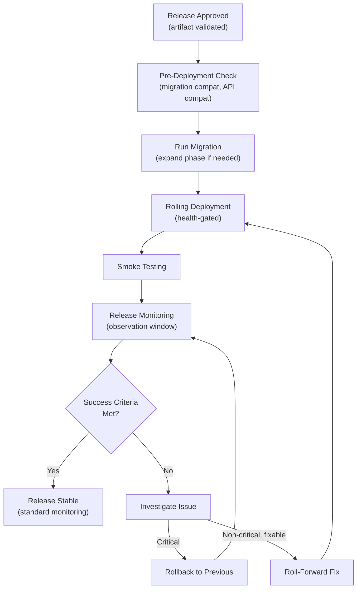
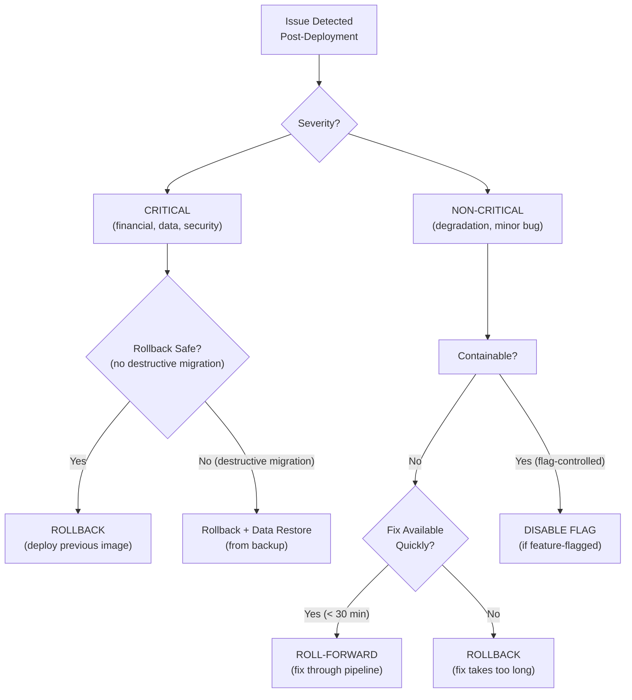

# Release and Rollback Architecture

## Metadata

| Field | Value |
|-------|-------|
| Title | Kairo Release Safety, Rollout, Validation, and Rollback Architecture |
| Document ID | KAI-INFRA-008 |
| Status | Draft |
| Version | 0.1 |
| Target Release | V1 |
| Owner | Release Safety and Deployment Recovery Architect |
| Created | 2026-07-23 |
| Last Updated | 2026-07-23 |
| Reviewers | TODO |
| Related Documents | [CI/CD and Deployment Architecture](./CI-CD-and-Deployment-Architecture.md), [API Versioning and Compatibility](../API/API-Versioning-and-Compatibility.md), [Event Versioning and Compatibility](../Events/Event-Versioning-and-Compatibility.md), [Schema Evolution and Migrations](../Data/Schema-Evolution-and-Migrations.md), [Infrastructure Architecture](./Infrastructure-Architecture.md) |
| Dependencies | [CI/CD and Deployment Architecture](./CI-CD-and-Deployment-Architecture.md), [Schema Evolution and Migrations](../Data/Schema-Evolution-and-Migrations.md) |

---

## Applicable Version

This document defines V1 release and rollback architecture. V1 uses rolling deployment with health-gated rollout as the primary strategy. Feature flags provide deployment/release separation for select capabilities. The architecture establishes clear compatibility, validation, and rollback rules that protect production stability.

---

## Purpose

This document defines how Kairo releases software safely — the distinction between deployment and release, rollout strategies, validation requirements, rollback capabilities, and the rules that prevent deployments from creating irrecoverable production incidents.

A deployment puts new code on servers. A release exposes new functionality to users. These are not the same thing. Understanding the difference — and designing for safe rollback between them — prevents the scenario where "rolling back" actually means "we cannot undo the damage." This document ensures every release has a defined path forward and backward.

---

## Scope

This document covers:

- Release and deployment definitions and their distinction.
- Deployment strategies and their applicability.
- Compatibility requirements during rollout (database, API, event).
- Health validation, smoke testing, and business verification.
- Rollback capabilities and limitations.
- Feature flags for deployment/release separation.
- Emergency release procedures.
- Release evidence and post-release review.

This document does not cover:

- Deployment scripts or manifests (deployment repositories).
- CI/CD pipeline configuration (see [CI/CD and Deployment Architecture](./CI-CD-and-Deployment-Architecture.md)).
- Feature-flag product selection (infrastructure decision).
- Specific health-check endpoint implementation (development standards).
- Release scheduling or cadence (team/roadmap planning).
- Marketing or customer communication for releases (product operations).

---

## Mandatory Principles

| # | Principle |
|---|-----------|
| 1 | Deployment and feature release may be separate activities |
| 2 | Rollback must not be assumed safe after destructive data changes |
| 3 | Expand-and-contract changes support safer deployment |
| 4 | API and event compatibility must be preserved during rollout |
| 5 | Feature flags do not replace testing or authorization |
| 6 | Rollouts must define success and failure criteria |
| 7 | Critical business metrics should participate in release validation |
| 8 | Financial and inventory regressions require immediate containment |
| 9 | Tenant-specific rollout must not create unsupported permanent divergence |
| 10 | Roll-forward may be safer than rollback for some failures |
| 11 | External provider changes require reconciliation planning |
| 12 | Emergency releases require retrospective review |

---

## Definitions

### 1. Release Definition

| Aspect | Detail |
|--------|--------|
| Definition | A release is the act of making new functionality available to users |
| Scope | May include new features, behavior changes, or capability additions |
| Timing | May happen at deployment time (immediate) or after deployment (flag-controlled) |
| Audience | May be all users, specific tenants, or a percentage (progressive) |
| **Separation** | **Deployment and feature release may be separate activities.** Code can be deployed without the feature being released (dark deployment). |

### 2. Deployment Definition

| Aspect | Detail |
|--------|--------|
| Definition | A deployment is the act of updating running software to a new version |
| Scope | Replaces old container instances with new ones |
| Timing | Happens as part of the CI/CD pipeline (after approval) |
| Technical | Container image swap. Infrastructure operation. |
| **Distinction** | A deployment makes code available. A release makes features visible to users. |

### 3. Release Artifact

| Rule | Detail |
|------|--------|
| Immutable image | The release artifact is the approved, scanned, immutable container image |
| Same artifact | Same image validated in staging is deployed to production (per [CI/CD Architecture](./CI-CD-and-Deployment-Architecture.md)) |
| Traceable | Artifact traces to source commit, build pipeline, and test results |
| Versioned | Tagged with commit SHA and build number |
| Retained | Previous artifacts retained for rollback window |

### 4. Release Approval

| Rule | Detail |
|------|--------|
| Required | Production deployment requires explicit approval |
| Evidence-based | Approver reviews: all pipeline gates passed, staging validated, no critical findings |
| Separation | Approver is not the sole author of the changes |
| Recorded | Approval is audit-logged (who approved, when, what evidence) |
| Emergency | Emergency releases have expedited approval (still requires authorization) |

---

## Deployment Strategies

### 5. Deployment Strategies Overview

| Strategy | How It Works | Rollback Speed | Infrastructure Cost | V1 Suitability |
|----------|-------------|:-:|:-:|:-:|
| In-place | Stop old, start new | Slow (redeploy old) | Low | Not recommended |
| **Rolling** | Gradually replace instances | Fast (stop rollout, scale old) | Same as normal | **V1 recommended** |
| Blue-green | Full parallel environment, switch traffic | Instant (switch back) | 2x infrastructure | V2+ |
| Canary | Small traffic subset gets new version | Fast (route away) | Minimal extra | V2+ |
| Feature flag | Deploy code dark, enable for users separately | Instant (disable flag) | Same as normal | V1 (selective) |

---

### 6. In-Place Deployment

| Aspect | Detail |
|--------|--------|
| Mechanism | Stop running instances, deploy new version, start |
| Downtime | Yes (service unavailable during replacement) |
| Rollback | Requires redeploying old version (slow) |
| V1 recommendation | **Not recommended.** Causes downtime. Use rolling instead. |
| Acceptable for | Non-production environments only (development, CI) |

---

### 7. Rolling Deployment

| Aspect | Detail |
|--------|--------|
| Mechanism | New instances are started alongside old. Traffic gradually shifts. Old instances drain and terminate. |
| Downtime | None (zero-downtime) |
| Rollback | Stop rollout. Scale back old instances. Fast. |
| **V1 recommended** | Default deployment strategy for production. |
| Requirements | New version must be compatible with old version during rollout (both run simultaneously). |
| Health-gated | New instances must pass health checks before old instances are removed. |
| Gradual | Traffic shifts incrementally (not all-at-once) |

---

### 8. Blue-Green Deployment

| Aspect | Detail |
|--------|--------|
| Mechanism | Full parallel environment running new version. Traffic switched via load balancer. |
| Downtime | None (instant switch) |
| Rollback | Instant (switch traffic back to old environment) |
| V1 status | **V2+ (future).** Requires double infrastructure. |
| Advantage | Instant rollback. Full pre-validation in production-like environment. |
| Disadvantage | Double infrastructure cost. Database compatibility still required. |

---

### 9. Canary Deployment

| Aspect | Detail |
|--------|--------|
| Mechanism | Small percentage of traffic routed to new version. Monitor. Expand or rollback. |
| Downtime | None |
| Rollback | Route all traffic back to old version |
| V1 status | **V2+ (future).** Requires traffic-splitting infrastructure. |
| Advantage | Real production traffic validates new version with limited blast radius. |
| Disadvantage | Requires traffic routing infrastructure. Complex for stateful operations. |

---

### 10. Feature Flags

**Feature flags do not replace testing or authorization.**

| Aspect | Detail |
|--------|--------|
| Mechanism | Code is deployed but new behavior is gated behind a flag. Flag enabled separately from deployment. |
| Deployment/release separation | Code deploys (dark). Feature releases later (flag on). Rollback = disable flag (instant). |
| V1 usage | Selected features. Simple environment-variable flags. Not all features. |
| Not authorization | A feature flag hides UI. It does NOT replace server-side authorization checks. |
| Not testing bypass | Flagged code must be tested. Flag does not skip quality gates. |
| Temporary | Feature flags are temporary (remove after feature is fully released). Not permanent configuration. |
| Cleanup | Flags that are permanently "on" must be removed (code cleanup). |

---

### 11. Dark Launch

| Aspect | Detail |
|--------|--------|
| Definition | Deploy new code that runs in production but does not produce user-visible results |
| Purpose | Validate performance, resource usage, and behavior in production without user impact |
| Mechanism | New code path executes in parallel (or shadow). Results compared but not served. |
| V1 status | Limited (selective use for validation of new modules or integrations) |
| Use case | Validate a new payment provider integration in production without processing real payments through it |

---

## Compatibility During Rollout

### 12. Database Compatibility

**Expand-and-contract changes support safer deployment.**
**Rollback must not be assumed safe after destructive data changes.**

| Rule | Detail |
|------|--------|
| Backward compatible | During rolling deployment, both old and new code versions run simultaneously. Both must work with the current schema. |
| Expand-migrate-contract | Phase 1: Add new schema elements (expand). Phase 2: Migrate data. Phase 3: Remove old elements (contract). Each phase is a separate deployment. |
| No destructive on deploy | Column drops, type changes, and data deletion happen in a separate "contract" deployment AFTER all instances run the new code. |
| Rollback limitation | **If data has been destructively migrated (column dropped, data transformed irreversibly), rollback to the previous code version may not be possible without data restoration from backup.** |
| Reference | Per [Schema Evolution and Migrations](../Data/Schema-Evolution-and-Migrations.md) |

### 13. Event Compatibility

**API and event compatibility must be preserved during rollout.**

| Rule | Detail |
|------|--------|
| Version coexistence | During rollout, both old and new code may produce events. Consumers must handle both. |
| Additive safe | New optional fields in events are non-breaking (consumers ignore unknown fields). |
| No removal during rollout | Field removal happens only after all instances are on the new version. |
| Consumer-side | Consumers must handle events from both old and new producer versions during rollout. |
| Reference | Per [Event Versioning and Compatibility](../Events/Event-Versioning-and-Compatibility.md) |

### 14. API Compatibility

| Rule | Detail |
|------|--------|
| During rollout | Both old and new instances serve API requests. Responses must be consistent (same contract). |
| Additive safe | New optional response fields are non-breaking. |
| No removal during rollout | Field removal requires version bump (different URL path). Not within a single deployment. |
| Client experience | A client hitting old instance then new instance must not see inconsistent behavior. |
| Reference | Per [API Versioning and Compatibility](../API/API-Versioning-and-Compatibility.md) |

---

## Release Validation

### 15. Health Validation

| Check | Purpose | Timing |
|-------|---------|--------|
| Liveness | Process is alive and responsive | Continuous (every few seconds) |
| Readiness | Process is ready to accept traffic | Before receiving traffic |
| Startup | Process has completed initialization | During startup (before liveness checks) |

| Rule | Detail |
|------|--------|
| Gate for rollout | New instances must pass all health checks before old instances are removed |
| Failure = rollback | If new instances consistently fail health checks, rollout is halted and rolled back |
| Not sufficient alone | Health checks prove the process is alive. Not that business logic is correct. |

---

### 16. Smoke Testing

| Rule | Detail |
|------|--------|
| Purpose | Verify critical paths work after deployment (can the API respond? can it reach the database?) |
| Scope | Minimal set of critical operations (not full test suite) |
| Timing | Immediately after deployment (first few minutes) |
| Automated | Smoke tests are automated (not manual verification) |
| Failure | Smoke test failure triggers investigation and potential rollback |
| Examples | Create a test resource. Query a known resource. Verify event processing. |

---

### 17. Business Verification

**Critical business metrics should participate in release validation.**
**Financial and inventory regressions require immediate containment.**

| Metric | What It Indicates | Failure Response |
|--------|-------------------|-----------------|
| Error rate | Increased errors post-deployment | Investigate. Rollback if critical. |
| Response latency (p95, p99) | Performance regression | Investigate. Rollback if severe. |
| Order creation success rate | Business flow broken | **Immediate rollback.** |
| Payment success rate | Financial flow broken | **Immediate rollback.** |
| Inventory availability checks | Inventory service degraded | **Immediate rollback.** |
| Webhook delivery rate | Integration broken | Investigate. May require rollback. |
| Consumer lag (events) | Event processing degraded | Investigate. May indicate poison events. |

**Rollouts must define success and failure criteria.**

| Rule | Detail |
|------|--------|
| Success criteria | Defined before deployment. What metrics must hold for the release to be considered successful. |
| Failure criteria | Defined before deployment. What metric thresholds trigger rollback. |
| Observation window | Period after deployment during which metrics are actively monitored (e.g., 30-60 minutes). |
| Auto-rollback direction | V2+: automated rollback when failure criteria are met. V1: manual rollback decision with alert. |

---

### 18. Release Monitoring

| Aspect | Detail |
|--------|--------|
| Enhanced period | First 1-2 hours post-deployment have enhanced monitoring (lower alert thresholds) |
| Deployer notified | Alerts during monitoring window route to the deployer (not just general on-call) |
| Comparison | Metrics compared against pre-deployment baseline |
| Duration | Enhanced monitoring period is defined per release risk level |
| Transition | After monitoring period without issues, standard monitoring resumes |

---

## Rollback and Recovery

### 19. Rollback

| Aspect | Detail |
|--------|--------|
| Mechanism | Deploy previous known-good container image |
| Speed | Fast (image already in registry, already validated) |
| When | New version has critical issues that cannot be quickly fixed |
| Limitation | **Rollback must not be assumed safe after destructive data changes.** |
| Decision | Made by on-call/deployer based on failure severity and fix complexity |
| Audited | Rollback decision and execution are logged |

| Rollback Safety Assessment |
|---------------------------|
| Can the old code work with the current database schema? |
| Were any irreversible data transformations applied? |
| Are old event contracts still valid with the current consumers? |
| Do external integrations depend on the new behavior? |
| Is the old API response contract still valid for current clients? |

---

### 20. Roll-Forward

**Roll-forward may be safer than rollback for some failures.**

| Aspect | Detail |
|--------|--------|
| When appropriate | Fix is simple. Rollback is risky (data migration applied). Issue is non-critical but annoying. |
| Mechanism | Fix the issue. Commit through the pipeline. Deploy the fix. |
| Speed | Depends on fix complexity and pipeline duration (minutes to hours) |
| Risk | If the fix introduces new issues, situation worsens |
| Decision criteria | "Is fixing forward faster and safer than rolling back?" |
| Not for critical | Critical production incidents (financial, data integrity) should rollback first, then fix forward |

---

### 21. Data Migration Rollback

| Scenario | Rollback Possible? | Recovery Path |
|----------|:---:|----------------|
| New column added (nullable) | Yes | Old code ignores new column. Rollback safe. |
| Column renamed | No (old code references old name) | Restore from backup or rename back (expand-contract prevents this). |
| Column dropped | No (old code needs it) | Restore from backup. **This is why destructive changes are separate deployments.** |
| Data transformed (one-way) | No | Restore from backup or write reverse migration. |
| New table added | Yes | Old code does not reference it. Rollback safe. |
| Data backfill (additive) | Yes | Old code ignores backfilled data. Rollback safe. |

| Rule | Detail |
|------|--------|
| Expand-phase is rollback-safe | Adding new schema elements is always rollback-safe (old code ignores them) |
| Contract-phase is not rollback-safe | Removing old schema elements prevents rollback to code that needs them |
| Separate deployments | Expand and contract are NEVER in the same deployment. This preserves rollback safety between them. |
| Backup before contract | Take a backup before any destructive schema change (contract phase) |

---

### 22. External Provider Changes

**External provider changes require reconciliation planning.**

| Scenario | Risk | Mitigation |
|----------|------|-----------|
| New payment provider version | Old API may stop working | Feature-flag the new integration. Test alongside old. Switch when validated. |
| Provider credential rotation | Old credentials may be revoked | Dual-credential support during rotation. |
| Provider webhook format change | Old format may stop being sent | Support both formats during transition. |
| Provider deprecating endpoint | Old endpoint will eventually 404 | Migrate before deprecation date. Feature-flag new path. |

| Rule | Detail |
|------|--------|
| Not instant | External provider changes are not deployed and switched instantly. They are feature-flagged and validated. |
| Reconciliation | After switching providers or provider versions, reconcile state (verify all data is consistent). |
| Rollback path | Feature flag enables instant rollback to old provider integration if new one fails. |
| Communication | External changes are coordinated with the provider's timeline. |

---

### 23. Partial Rollout

| Aspect | Detail |
|--------|--------|
| V1 approach | All-or-nothing rolling deployment (all instances updated). Partial rollout via feature flags for specific features. |
| V2+ approach | Canary (percentage-based traffic routing to new version). |
| Feature-flag rollout | Deploy code to all instances. Enable flag for specific tenants or percentage. |
| Limitation | Cannot partially roll out infrastructure changes (database schema, event contracts). These are all-or-nothing. |

---

### 24. Tenant-Specific Rollout

**Tenant-specific rollout must not create unsupported permanent divergence.**

| Rule | Detail |
|------|--------|
| Feature flags | Feature flags may target specific tenants (early adopters, beta testers) |
| Temporary | Tenant-specific rollout is a transition state, not a permanent divergence |
| Convergence | All tenants must reach the same version within a defined window |
| Not permanent forks | Feature flags are not used to permanently maintain different behavior per tenant (that is tenant configuration, not release) |
| Cleanup | After all tenants have the feature, the flag is removed and the code path is simplified |
| V1 status | Simple flag-based tenant targeting (environment variable lists). Enhanced targeting V2+. |

---

### 25. Emergency Release

**Emergency releases require retrospective review.**

| Rule | Detail |
|------|--------|
| When | Critical production issue requires immediate fix (security vulnerability, financial error, data corruption) |
| Process | Expedited pipeline (same stages, faster execution, reduced waiting). Not pipeline bypass. |
| Approval | Single authorized approver sufficient (not full review board) |
| Testing | Minimum: unit tests + relevant integration tests + tenant-isolation. May skip full suite with justification. |
| Deployment | Same rolling deployment mechanism (not manual). |
| Monitoring | Enhanced post-deployment monitoring (heightened alert sensitivity) |
| Retrospective | **Mandatory within days.** Why was the emergency needed? What gates were relaxed? How to prevent recurrence? |
| Evidence | Full audit trail preserved (what changed, who approved, what tests ran, what was skipped) |

---

### 26. Release Evidence

| Evidence | Purpose |
|----------|---------|
| Artifact provenance | What was deployed (commit, build, image tag) |
| Pipeline results | All gate results (passed, failures resolved) |
| Staging validation | Confirmation that staging validated the artifact |
| Approval record | Who approved production deployment and when |
| Deployment record | When deployed, duration, instances updated |
| Health verification | Post-deployment health check results |
| Smoke test results | Critical path verification results |
| Metric comparison | Before/after metric comparison for observation window |
| Rollback record | If rollback occurred: when, why, by whom |

---

### 27. Post-Release Review

| Aspect | Detail |
|--------|--------|
| Purpose | Confirm release is stable and no issues emerged during monitoring period |
| Timing | After observation window (1-2 hours post-deployment) |
| Actions | Review metrics. Close deployment record. Note any issues for follow-up. |
| Issues found | Issues discovered trigger investigation (may be follow-up fix or retrospective) |
| Cleanup | Remove temporary release artifacts (old images past retention, temporary flags) |

---

## Release Lifecycle Diagram

---

## Deployment-Strategy Matrix

| Factor | Rolling | Blue-Green | Canary | Feature Flag |
|--------|:---:|:---:|:---:|:---:|
| Zero-downtime | **Yes** | Yes | Yes | Yes |
| Rollback speed | Fast (seconds-minutes) | Instant | Fast | Instant |
| Infrastructure cost | Normal | 2x | Minimal extra | Normal |
| Blast radius | All traffic (during rollout) | All traffic (after switch) | Small subset | Controlled |
| Database compatibility required | **Yes** | Yes | Yes | N/A (same code) |
| Complexity | Low | Medium | Medium-High | Low-Medium |
| V1 suitability | **Recommended** | V2+ | V2+ | **Selective V1** |
| Best for | Standard releases | Critical releases needing instant rollback | Validating with real traffic | Separating deploy from release |

---

## Rollback Decision Tree

---

## Compatibility Checklist

Before every production deployment, verify:

| Check | Question | If No |
|-------|----------|-------|
| Database backward-compatible | Can the OLD code work with the NEW schema? | Use expand-contract (separate deployments) |
| Database forward-compatible | Can the NEW code work with the OLD schema? (during rollout) | Ensure new code handles both |
| API response compatible | Are response changes additive only? | Requires API version bump |
| API request compatible | Will existing clients' requests still work? | Requires migration period |
| Event schema compatible | Are event changes additive only? | Requires event version bump |
| Event consumers compatible | Can consumers handle events from both old and new code? | Update consumers first |
| Feature-flag gated | Is new behavior behind a flag (if risky)? | Consider adding flag |
| Rollback safe | If we rollback, will the old code work with current state? | Document rollback limitations |
| External providers | Are external integrations affected? | Plan reconciliation |
| Migration tested | Has the migration been tested against production-like data? | Test before deployment |

---

## V1 versus Future

| Capability | V1 | V2+ |
|-----------|:---:|:---:|
| Rolling deployment (zero-downtime) | **Yes** | Yes |
| Health-gated rollout | **Yes** | Yes |
| Post-deployment smoke tests | **Yes** | Yes |
| Post-deployment metric monitoring | **Yes** | Yes (+ automated rollback) |
| Manual rollback decision | **Yes** | Automated + manual override |
| Feature flags (env var, simple) | **Yes** | Feature-flag service (real-time) |
| Database expand-contract | **Yes** | Yes |
| Compatibility checklist | **Yes** (manual) | Automated verification |
| Release evidence | **Yes** | Enhanced (formal release records) |
| Emergency release procedure | **Yes** | Yes (tooling-supported) |
| Blue-green deployment | — | **Yes** |
| Canary deployment | — | **Yes** |
| Automated rollback on metrics | — | **Yes** |
| Traffic-percentage rollout | — | **Yes** |
| Tenant-specific flag targeting | Basic (V1) | **Enhanced** |
| Dark launch (shadow traffic) | Limited | **Yes** |
| Progressive multi-region rollout | — | V3+ |

---

## Version Gate

| Version | Release and Rollback Gate |
|---------|--------------------------|
| V1 | Rolling deployment (zero-downtime, health-gated). Database expand-contract (no destructive changes in same deployment). API and event additive compatibility during rollout. Post-deployment smoke tests. Metric-based monitoring with manual rollback decision. Feature flags for select features (env-var based). Rollback via previous image deployment. Emergency release procedure with retrospective. Compatibility checklist before each production deployment. Release evidence recorded. |
| V2 | Blue-green and canary deployment options. Automated rollback on metric degradation. Feature-flag service (real-time targeting). Tenant-specific progressive rollout. Enhanced release evidence. Automated compatibility verification in pipeline. |
| V3 | Multi-region progressive rollout. Advanced traffic-splitting (weighted routing). Fully automated release pipelines with human oversight. Dark launch with shadow traffic comparison. Release compliance reporting. |

---

## Decision Summary

| Decision | Rationale |
|----------|-----------|
| Rolling deployment for V1 | Zero-downtime. Simple. Manageable for a small team. Blue-green requires double infrastructure. Canary requires traffic-splitting. Rolling is sufficient. |
| Feature flags for deploy/release separation | Enables instant "rollback" of features (disable flag) without full deployment rollback. Simple env-var flags sufficient for V1. |
| Expand-contract for schema changes | Preserves rollback safety between deployment phases. No deployment is irrecoverable (except the explicit contract phase which is separate and deliberate). |
| Manual rollback decision (V1) | Human judgement on rollback vs roll-forward. Automated rollback requires confidence in metric thresholds (V2). |
| Success/failure criteria before deployment | Prevents ambiguity post-deployment. Team knows in advance what "bad" looks like. |
| Financial/inventory regressions = immediate rollback | These failures have real-money and real-stock consequences. Speed of containment matters most. |
| Emergency releases through pipeline (not manual) | Pipeline provides consistency and evidence even under pressure. Manual creates drift and audit gaps. |
| Temporary feature flags (not permanent forks) | Permanent per-tenant code paths create maintenance burden. Flags are for transition, not divergence. |

---

## Alternatives Considered

| Alternative | Rejected Because |
|------------|-----------------|
| Blue-green for V1 | Double infrastructure cost. Operational complexity. Rolling deployment is simpler and sufficient. |
| Canary for V1 | Requires traffic-splitting infrastructure. Complex for a small team. V2 capability. |
| No feature flags | All features release at deployment time. No way to separate risky feature release from code deployment. Flags add safety. |
| Automated rollback in V1 | Requires confidence in metric thresholds and automated decision-making. Build confidence in V1 monitoring first. Automate in V2. |
| Schema changes in same deployment as code | Creates irrecoverable deployments. If code has a bug AND schema was destructively changed, rollback is impossible. Separate phases prevent this. |
| No compatibility checklist | Relies on developer memory to check compatibility. Systematic checklist catches things individuals forget. |
| Permanent tenant-specific feature flags | Creates N code paths to maintain. Technical debt compounds. Temporary flags with convergence are manageable. |
| Manual deployment for emergency | Loses pipeline guarantees (testing, scanning, evidence). Emergency should be faster, not ungoverned. |
| No post-release monitoring | "Deploy and forget" misses regressions that surface under real traffic. Active monitoring catches issues. |
| Rollback assumed always safe | Destructive schema changes make rollback unsafe. Acknowledging this forces safer design (expand-contract). |

---

## Architecture Impact

| Concern | Impact |
|---------|--------|
| Application design | Code must be compatible with both old and new schema during rolling deployment. Feature flags must be temporary and cleanable. Health checks must accurately reflect readiness. |
| Database | Schema changes must follow expand-contract. No destructive changes in the same deployment as code that depends on them. |
| Events | Event schema changes must be additive during rollout. Consumers must handle both old and new producer versions. |
| API | API changes within a version must be additive during rollout. Breaking changes require new version (new URL path). |
| Operations | Deployment requires monitoring. Rollback must be a practiced operation (not theoretical). Success/failure criteria defined pre-deployment. |
| Testing | Smoke tests must exist and be automated. Business metrics must be measurable. Compatibility must be verifiable. |

---

## Implementation Impact

| Area | Impact |
|------|--------|
| Application | Must support rolling deployment (backward and forward schema compatibility). Must implement feature flags cleanly. Must provide accurate health checks. Must handle graceful shutdown. |
| Platform/DevOps | Must configure rolling deployment strategy. Must maintain rollback capability. Must provide monitoring dashboard. Must support feature-flag configuration. Must execute emergency releases. |
| QA | Must verify compatibility during rollout scenarios. Must define smoke tests. Must verify rollback procedures periodically. |
| Operations | Must monitor post-deployment. Must make rollback/roll-forward decisions. Must participate in post-release review. Must execute emergency procedures. |
| Product | Must define feature-flag strategy for risky features. Must participate in success/failure criteria definition. |

---

## Security Responsibilities

| Role | Release Security Responsibilities |
|------|----------------------------------|
| Platform/DevOps | Manages deployment infrastructure. Executes rollback. Controls production access. Maintains release evidence. |
| Security Team | Reviews emergency release relaxations. Validates that rollback does not create security regression. Authorizes security-driven emergency releases. |
| Developers | Ensure compatibility during rollout. Implement feature flags correctly. Write smoke tests. |
| Operations | Monitors post-deployment. Makes containment decisions for financial/inventory regressions. Participates in retrospectives. |

---

## Multi-Tenancy Responsibilities

| Responsibility | Detail |
|---------------|--------|
| All tenants get same deployment | Deployments are platform-wide (not per-tenant in V1) |
| Feature-flag targeting | Flags may target specific tenants (temporary, converging) |
| No permanent divergence | Tenant-specific flags are transitional, not permanent forks |
| Rollback affects all tenants | A rollback rolls back for all tenants (not tenant-selective) |
| Tenant data unaffected by rollback | Code rollback does not modify tenant data (data stays as-is) |

---

## Out of Scope

This document does not define:

- Deployment scripts or orchestration configuration (deployment repositories).
- Feature-flag product selection (infrastructure decision).
- Specific metric thresholds for rollback (operations configuration).
- Release scheduling or cadence (team planning).
- Customer communication for releases (product operations).
- Specific smoke test implementations (development standards).
- Canary traffic-splitting configuration (V2+ infrastructure).

---

## Future Considerations

- **Canary deployment** — Validate with real traffic subset before full rollout.
- **Blue-green deployment** — Instant rollback via traffic switching.
- **Automated rollback** — Metric-driven automatic rollback without human decision.
- **Progressive multi-region rollout** — Roll out to one region, validate, expand.
- **Dark launch with comparison** — Run new code path alongside old, compare results without user impact.
- **Release trains** — Scheduled release cadence with batch changes.
- **Feature-flag service** — Real-time targeting, percentage rollouts, A/B testing.
- **Release compliance** — Formal release compliance evidence for regulated environments.

---

## Future Refactoring Triggers

This document should be revisited when:

- Deployment frequency increases (trigger for canary/automated-rollback evaluation).
- Multiple regions are deployed (trigger for progressive multi-region rollout).
- Feature-flag needs exceed environment variables (trigger for flag service adoption).
- Automated rollback confidence is established (trigger for removing manual decision gate).
- Team size requires formal release management (trigger for release train evaluation).
- Compliance requirements mandate formal release evidence (trigger for compliance-as-code).
- Service extraction creates multiple independently deployable units (trigger for per-service release strategy).

---

## Change History

| Version | Date | Author | Description |
|---------|------|--------|-------------|
| 0.1 | 2026-07-23 | Release Safety and Deployment Recovery Architect | Initial draft — release and rollback architecture |
