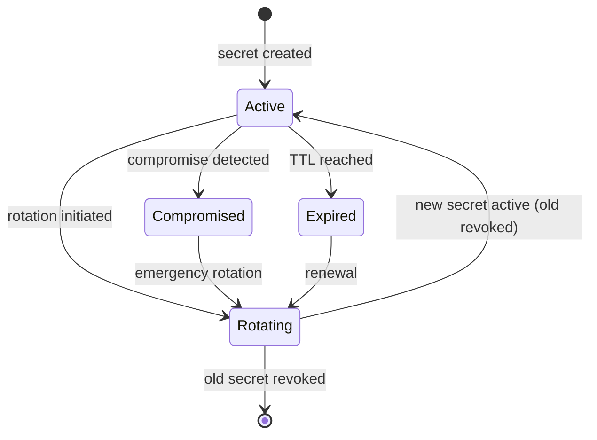

# Runtime Configuration and Secrets

## Metadata

| Field | Value |
|-------|-------|
| Title | Kairo Runtime Configuration, Secrets Handling, and Configuration Governance |
| Document ID | KAI-INFRA-006 |
| Status | Draft |
| Version | 0.1 |
| Target Release | V1 |
| Owner | Runtime Configuration and Infrastructure Secrets Architect |
| Created | 2026-07-23 |
| Last Updated | 2026-07-23 |
| Reviewers | TODO |
| Related Documents | [Infrastructure Architecture](./Infrastructure-Architecture.md), [Configuration Architecture](../Configuration-Architecture.md), [Tenant Configuration](../Multi-Tenancy/Tenant-Configuration.md), [Secrets and Key Management](../Security/Secrets-and-Key-Management.md), [Environment Architecture](./Environment-Architecture.md), [Container and Workload Architecture](./Container-and-Workload-Architecture.md) |
| Dependencies | [Infrastructure Architecture](./Infrastructure-Architecture.md), [Secrets and Key Management](../Security/Secrets-and-Key-Management.md), [Environment Architecture](./Environment-Architecture.md) |

---

## Applicable Version

This document defines V1 runtime configuration and secrets architecture. V1 uses environment-variable injection for configuration and a managed secrets service for sensitive values. The architecture establishes the separation between configuration categories, their lifecycle, and their governance.

---

## Purpose

This document defines how runtime configuration and secrets are delivered to Kairo application workloads — what configuration exists, who owns it, where it comes from, how it is validated, and how secrets are managed through their lifecycle.

Configuration is the bridge between immutable application images and environment-specific behavior. A misconfigured database connection string prevents the application from starting. A leaked API key enables unauthorized access. An unvalidated configuration value causes silent misbehavior. This document ensures every configuration value has an owner, a source, a validation rule, and appropriate protection.

---

## Scope

This document covers:

- Configuration categories and their distinct handling requirements.
- Configuration ownership, sources, injection, and validation.
- Secrets lifecycle (retrieval, rotation, revocation).
- Configuration governance (audit, rollback, drift detection).
- Feature flags and their relationship to authorization.
- Local development configuration rules.
- V1 capabilities and future maturity direction.

This document does not cover:

- Specific configuration values or connection strings (deployment configuration).
- Secrets management product selection (infrastructure decisions).
- Vault configuration or policies (infrastructure operations).
- Feature-flag product selection (infrastructure decisions).
- Tenant-level business configuration rules (see [Tenant Configuration](../Multi-Tenancy/Tenant-Configuration.md)).
- Application-level configuration patterns (development standards).

---

## Mandatory Principles

| # | Principle |
|---|-----------|
| 1 | Secrets and ordinary configuration are separate categories |
| 2 | Secrets must not exist in source control, images, logs, or frontend bundles |
| 3 | Required configuration must be validated before accepting traffic |
| 4 | Platform security constraints cannot be weakened by tenant configuration |
| 5 | Environment configuration must remain reproducible |
| 6 | Manual production configuration changes require authorization and audit |
| 7 | Secret rotation must not require application redesign |
| 8 | Runtime configuration must not bypass the approved tenant-configuration hierarchy |
| 9 | Feature flags do not replace authorization |
| 10 | Local development convenience must not weaken production rules |
| 11 | Configuration drift must be detectable |
| 12 | Break-glass changes require retrospective review |

---

## Configuration Categories

### Application Configuration

| Aspect | Detail |
|--------|--------|
| Purpose | Controls application behavior (log levels, pagination defaults, timeout values, feature toggles) |
| Owner | Application team (module teams for module-specific, platform team for platform-wide) |
| Sensitivity | Non-sensitive. May be visible in diagnostics. |
| Source | Environment variables, configuration files, config maps |
| Change frequency | Per-release or operational tuning |
| Example | `LOG_LEVEL=Information`, `DEFAULT_PAGE_SIZE=20`, `REQUEST_TIMEOUT_SECONDS=30` |

### Environment Configuration

| Aspect | Detail |
|--------|--------|
| Purpose | Distinguishes one environment from another (URLs, endpoints, environment name) |
| Owner | Platform/DevOps team |
| Sensitivity | Non-sensitive (but environment-specific) |
| Source | Environment variables set by deployment tooling |
| Change frequency | Rarely (only when infrastructure changes) |
| Example | `ENVIRONMENT=production`, `API_BASE_URL=https://api.kairo.com` |

### Platform Configuration

| Aspect | Detail |
|--------|--------|
| Purpose | Platform-wide settings that affect all modules (rate limits, cors policy, maintenance mode) |
| Owner | Platform team |
| Sensitivity | Non-sensitive |
| Source | Environment variables or platform configuration service |
| Change frequency | Operational tuning |
| Example | `CORS_ALLOWED_ORIGINS=https://shop.example.com`, `MAINTENANCE_MODE=false` |

### Tenant Configuration

| Aspect | Detail |
|--------|--------|
| Purpose | Per-organization settings that control tenant-specific behavior |
| Owner | Tenant administrators (within platform-defined boundaries) |
| Sensitivity | Non-sensitive (tenant-specific business settings) |
| Source | Database (managed through admin API). NOT environment variables. |
| Change frequency | Tenant-controlled (frequent) |
| Relationship | Governed by [Tenant Configuration](../Multi-Tenancy/Tenant-Configuration.md). **Runtime configuration must not bypass the approved tenant-configuration hierarchy.** |
| Example | Store name, timezone, currency, notification preferences |

### Store Configuration

| Aspect | Detail |
|--------|--------|
| Purpose | Per-store settings within an organization |
| Owner | Tenant administrators |
| Sensitivity | Non-sensitive |
| Source | Database (managed through admin API) |
| Change frequency | Tenant-controlled |
| Relationship | Subset of tenant configuration. Store inherits from organization with overrides. |

### Infrastructure Configuration

| Aspect | Detail |
|--------|--------|
| Purpose | Infrastructure-level settings (connection parameters, pool sizes, health check intervals) |
| Owner | Platform/DevOps team |
| Sensitivity | Connection strings may be semi-sensitive (contain host info but not credentials) |
| Source | Environment variables or config maps |
| Change frequency | Infrastructure changes |
| Example | `DATABASE_HOST=db.internal`, `CONNECTION_POOL_SIZE=20`, `HEALTH_CHECK_INTERVAL=10` |

### Provider Configuration

| Aspect | Detail |
|--------|--------|
| Purpose | External provider integration settings (endpoints, modes, non-secret parameters) |
| Owner | Platform/DevOps team (infrastructure) + Module teams (integration logic) |
| Sensitivity | Non-secret parameters are non-sensitive. API keys and secrets are SECRETS (separate category). |
| Source | Environment variables (non-secret). Secrets management (credentials). |
| Change frequency | Provider changes or integration updates |
| Example | `PAYMENT_PROVIDER_URL=https://api.provider.com/v1`, `PAYMENT_MODE=live` |

### Feature Flags

| Aspect | Detail |
|--------|--------|
| Purpose | Enable/disable features at runtime without deployment |
| Owner | Product team (feature decisions) + Platform team (infrastructure) |
| Sensitivity | Non-sensitive |
| Source | Environment variables (simple V1) or feature-flag service (future) |
| Change frequency | Per-feature rollout |
| **Not authorization** | **Feature flags do not replace authorization.** A feature flag may hide a UI element but must not be the sole access control for a capability. |
| Example | `FEATURE_BULK_IMPORT_ENABLED=true`, `FEATURE_WEBHOOK_MANAGEMENT=false` |

### Secrets

| Aspect | Detail |
|--------|--------|
| Purpose | Credentials, API keys, signing secrets, encryption keys |
| Owner | Platform/DevOps team (infrastructure secrets) + Security team (policy) |
| Sensitivity | **Highly sensitive.** Exposure is a security incident. |
| Source | Secrets management service (vault, cloud secrets manager) |
| Change frequency | Rotation schedule or on compromise |
| **Never in** | **Source control, images, logs, or frontend bundles** |
| Example | Database password, payment provider API key, webhook signing secret |

### Certificates

| Aspect | Detail |
|--------|--------|
| Purpose | TLS certificates for HTTPS, mutual TLS (future) |
| Owner | Platform/DevOps team |
| Sensitivity | Private keys are secrets. Public certificates are non-sensitive. |
| Source | Certificate management service (auto-renewal preferred) |
| Change frequency | Rotation schedule (auto-managed preferred) |
| Lifecycle | Issued → active → nearing-expiry → renewed → old revoked |

### Cryptographic Keys

| Aspect | Detail |
|--------|--------|
| Purpose | Encryption keys, signing keys, token signing keys |
| Owner | Security team + Platform team |
| Sensitivity | **Highly sensitive.** Treated same as secrets. |
| Source | Key management service (cloud KMS or vault) |
| Change frequency | Rotation schedule |
| Reference | Per [Secrets and Key Management](../Security/Secrets-and-Key-Management.md) |

---

## Configuration Governance

### 1. Configuration Ownership

| Category | Owner | Change Authority |
|----------|-------|-----------------|
| Application | Module/platform team | Developer (code change) or operator (runtime tuning) |
| Environment | Platform/DevOps team | Infrastructure change process |
| Platform | Platform team | Authorized platform operator |
| Tenant/Store | Tenant administrator | Self-service (within platform bounds) |
| Infrastructure | Platform/DevOps team | Infrastructure change process |
| Provider | Platform/DevOps + module team | Integration change process |
| Feature flags | Product + Platform team | Product decision + platform execution |
| Secrets | Platform/DevOps + Security | Restricted. Rotation procedures. |
| Certificates | Platform/DevOps | Automated rotation where possible |
| Cryptographic keys | Security + Platform | Security-governed rotation |

---

### 2. Configuration Source

| Source | Used For | Mutable at Runtime |
|--------|----------|:---:|
| Environment variables | Application, environment, infrastructure, provider (non-secret) | No (requires restart) |
| Secrets management service | Secrets, credentials, API keys | Yes (application re-reads) |
| Database | Tenant configuration, store configuration | Yes (per-request lookup) |
| Feature-flag service (future) | Feature flags | Yes (real-time toggle) |
| Config maps (orchestrator) | Structured configuration | No (requires restart or reload) |
| Code defaults | Fallback values for optional configuration | No (compiled in) |

---

### 3. Environment Injection

| Rule | Detail |
|------|--------|
| Injection point | Configuration injected at container startup (environment variables) or runtime (secrets service) |
| Not baked into image | Configuration is NOT part of the container image |
| Per-environment | Each environment provides its own configuration values |
| Same image | Same application image + different configuration = different environment behavior |
| Validated | Application validates configuration before accepting traffic |

---

### 4. Startup Validation

**Required configuration must be validated before accepting traffic.**

| Rule | Detail |
|------|--------|
| Fail fast | If required configuration is missing or invalid, the application fails to start (does not serve traffic) |
| All-or-nothing | All required configuration is validated during startup (not discovered one-by-one during runtime) |
| Clear errors | Startup failure messages clearly identify which configuration is missing or invalid |
| Not logged as secrets | Validation errors do not log secret values (only identify which secret is missing) |
| Readiness gate | Application does not pass readiness check until configuration is validated |
| V1 behavior | Application startup validates: database connectivity, required secrets present, required environment variables set |

---

### 5. Runtime Refresh

| Category | Refresh Behavior |
|----------|-----------------|
| Environment variables | Requires restart (set at process start) |
| Secrets | Application periodically refreshes from secrets service (no restart needed for rotation) |
| Tenant configuration | Per-request lookup from database (always current) |
| Feature flags | V1: environment variable (restart). Future: real-time from flag service. |
| Certificates | Auto-renewed by management service. Application picks up on next TLS handshake. |

---

### 6. Restart Requirements

| Change | Restart Required |
|--------|:---:|
| Environment variable change | Yes |
| Secret rotation (if app caches) | Depends (graceful reload preferred) |
| Tenant configuration change | No (database lookup) |
| Feature flag change (env var) | Yes (V1) |
| Certificate renewal | No (managed externally) |
| Database connection string change | Yes |

| Rule | Detail |
|------|--------|
| Minimize restart requirements | Design application to refresh where feasible (secrets, feature flags) |
| Zero-downtime restart | When restart is required, rolling deployment ensures no downtime |
| Graceful | Configuration-triggered restarts use the same graceful shutdown as deployments |

---

### 7. Defaults

| Rule | Detail |
|------|--------|
| Sensible defaults | Optional configuration has documented default values |
| No default for required | Required configuration (connection strings, credentials) has no default — must be explicitly provided |
| No default for secrets | Secrets never have defaults (no "development password" compiled in) |
| Documented | All configuration with defaults documents what the default is and when to override |
| Security-safe defaults | Defaults are always the more secure option (e.g., default log level = Information, not Debug) |

---

### 8. Required Values

| Rule | Detail |
|------|--------|
| Enumerated | All required configuration values are documented |
| Validated at startup | Missing required values prevent application startup |
| Per-environment | Required values may differ by environment (production requires more than development) |
| Clear error | Missing required value produces a clear startup error (not a runtime null-reference) |

---

### 9. Sensitive Values

**Secrets and ordinary configuration are separate categories.**
**Secrets must not exist in source control, images, logs, or frontend bundles.**

| Rule | Detail |
|------|--------|
| Classified | Values containing credentials, keys, or tokens are classified as secrets |
| Separate delivery | Secrets delivered through secrets management (not environment variables where avoidable) |
| Never logged | Application never logs secret values (even at debug level) |
| Never in response | Secrets never appear in API responses or error messages |
| Never in frontend | Frontend code never contains secrets (client-side is public) |
| Masked in diagnostics | Diagnostic endpoints mask secret values (show "***" or "configured") |

---

### 10. Configuration Versioning

| Rule | Detail |
|------|--------|
| Infrastructure-as-code | Non-secret configuration is version-controlled (config files, environment definitions) |
| Audit trail | Configuration changes are tracked (who changed what, when) |
| Reproducible | Given a version, the configuration for any environment can be reproduced |
| Not secrets | Secret values are NOT version-controlled (only secret references/names are) |
| Aligned with deployment | Configuration versions align with deployment versions (configuration + image = release) |

---

### 11. Configuration Audit

**Manual production configuration changes require authorization and audit.**

| Rule | Detail |
|------|--------|
| All production changes audited | Every change to production configuration is logged |
| Who and when | Audit records identify the operator and timestamp |
| What changed | Audit records identify what configuration was changed (not secret values) |
| Authorization | Production configuration changes require appropriate authorization |
| Automated preferred | Automated changes (deployment pipeline) are preferred over manual |
| Manual is exceptional | Manual changes are tracked with justification |

---

### 12. Configuration Rollback

| Rule | Detail |
|------|--------|
| Deployment rollback | Configuration rollback accompanies image rollback (previous version deployed with its configuration) |
| Independent rollback | Some configuration can be rolled back independently (feature flag disable, timeout adjustment) |
| Secret rollback | Previous secret values may not be available (rotation replaces). Rollback may require re-issuance. |
| Tested | Rollback procedures are tested (not only theoretical) |
| Fast | Configuration rollback should be fast (minutes, not hours) |

---

### 13. Drift Detection

**Configuration drift must be detectable.**

| Rule | Detail |
|------|--------|
| Definition | Drift is when running configuration differs from the declared/expected configuration |
| Detection | Periodic comparison between expected configuration and actual running values |
| Sources of drift | Manual changes, failed deployments, partial updates, human error |
| Response | Detected drift triggers investigation (was it intentional? was it an error?) |
| Correction | Unintentional drift is corrected to match the declared state |
| Tooling direction | V2+: automated drift detection and alerting |
| V1 | Configuration managed through deployment pipeline. Manual changes are exceptional and audited. |

---

## Secrets Lifecycle

### 14. Secret Retrieval

| Rule | Detail |
|------|--------|
| Source | Application retrieves secrets from secrets management service at startup and periodically |
| Not hardcoded | Application code does not contain secret values |
| Scoped | Each workload retrieves only the secrets it needs (principle of least privilege) |
| Authenticated | Access to secrets service requires workload identity authentication |
| Cached locally | Application may cache retrieved secrets in memory (not to disk) |
| Refresh | Application refreshes secrets periodically (detect rotation without restart) |

---

### 15. Secret Rotation

**Secret rotation must not require application redesign.**

| Rule | Detail |
|------|--------|
| Designed for rotation | Application is designed to handle secret changes without code changes |
| Graceful | During rotation, both old and new secrets may be temporarily valid (dual-key period) |
| No downtime | Secret rotation does not require application downtime |
| Refresh mechanism | Application detects rotated secrets through periodic refresh from secrets service |
| Connection re-establishment | If a connection secret rotates (database password), application establishes new connections with new credentials |
| Automated (direction) | V2+: automated rotation for supported secret types. V1: manual rotation with documented procedure. |

---

### 16. Secret Revocation

| Rule | Detail |
|------|--------|
| Immediate | On compromise detection, the compromised secret is revoked immediately |
| Replacement | New secret is issued simultaneously with revocation |
| Application impact | Application may experience brief authentication failures during emergency rotation (acceptable trade-off vs compromise) |
| Audit | Revocation is audited (who initiated, why, when) |
| Investigation | Revocation triggers investigation into how the compromise occurred |
| Reference | Per [Secrets and Key Management](../Security/Secrets-and-Key-Management.md) |

---

### 17. Certificate Rotation

| Rule | Detail |
|------|--------|
| Automated | TLS certificates should be auto-renewed before expiration |
| No manual intervention | Certificate rotation should not require human action (automated by management service) |
| Monitoring | Certificate expiry is monitored. Alerts fire before expiration. |
| No downtime | Certificate rotation does not cause application downtime |
| Edge-terminated | V1 TLS is terminated at load balancer — certificate rotation is infrastructure-managed |

---

### 18. Emergency Changes

**Break-glass changes require retrospective review.**

| Rule | Detail |
|------|--------|
| When | Normal change process is too slow for an urgent operational need |
| Authorization | Still requires identity verification (not anonymous) |
| Scope | Narrowly scoped to the emergency |
| Audited | Emergency changes are logged with enhanced detail |
| Retrospective | Mandatory review within days (why emergency was needed, how to prevent recurrence) |
| Normalized | After emergency, configuration is brought back into the standard managed state |
| Examples | Emergency rate-limit change, emergency feature disable, emergency secret rotation |

---

### 19. Local Development Configuration

**Local development convenience must not weaken production rules.**

| Rule | Detail |
|------|--------|
| Separate config files | Development configuration is in separate files (not mixed with production) |
| Mock secrets | Development uses fake/mock secrets (not production credentials, not even staging credentials) |
| Same structure | Configuration structure in development matches production (same variable names, same format) |
| No committed secrets | Even development secrets are not committed to source control (use `.env.local` in `.gitignore`) |
| Convenience ≠ bypass | Development shortcuts (relaxed CORS, verbose logging) do not exist in production configuration |
| Parity | Configuration structure validates that development would work with production-like values |

---

### 20. V1 and Future Configuration Maturity

| Capability | V1 | V2+ |
|-----------|:---:|:---:|
| Environment variables for non-secret config | **Yes** | Yes |
| Managed secrets service | **Yes** | Yes (enhanced) |
| Startup validation (fail-fast) | **Yes** | Yes |
| Configuration via deployment pipeline | **Yes** | Yes |
| Feature flags (environment variable) | **Yes** | Feature-flag service |
| Secret rotation (manual, documented) | **Yes** | Automated rotation |
| Configuration audit (deployment logs) | **Yes** | Enhanced audit trail |
| Tenant configuration in database | **Yes** | Yes |
| Configuration drift detection | Manual (pipeline-managed) | Automated detection + alerting |
| Real-time feature toggles | No (requires restart) | Yes (flag service) |
| Dynamic configuration reload | Secrets only | Broader (config service) |
| Configuration versioning (IaC) | **Yes** (in deployment repo) | Enhanced |
| Break-glass procedure | **Yes** (documented) | Tooling-supported |
| Multi-environment promotion | **Yes** (same image, different config) | Enhanced |

---

## Configuration-Source Matrix

| Category | Source | Secret? | Restart Required | Owner | V1 |
|----------|--------|:---:|:---:|-------|:---:|
| Application | Environment variables | No | Yes | App/Platform team | Yes |
| Environment | Environment variables | No | Yes | Platform/DevOps | Yes |
| Platform | Environment variables | No | Yes | Platform team | Yes |
| Tenant | Database | No | No | Tenant admin | Yes |
| Store | Database | No | No | Tenant admin | Yes |
| Infrastructure | Environment variables | Partially | Yes | Platform/DevOps | Yes |
| Provider (non-secret) | Environment variables | No | Yes | Platform/DevOps | Yes |
| Provider (credentials) | Secrets service | **Yes** | No (refresh) | Platform/DevOps | Yes |
| Feature flags | Environment variables (V1) | No | Yes (V1) | Product + Platform | Yes |
| Secrets | Secrets service | **Yes** | No (refresh) | Platform + Security | Yes |
| Certificates | Certificate service | Keys: **Yes** | No | Platform/DevOps | Yes |
| Cryptographic keys | KMS / Vault | **Yes** | No | Security + Platform | Yes |

---

## Precedence and Responsibility Table

| Precedence (highest to lowest) | Source | Override Allowed By |
|-------------------------------|--------|---------------------|
| 1. Secrets service | Runtime retrieval | Security policy |
| 2. Environment variables (deployment) | Container startup | Deployment pipeline |
| 3. Config maps / config files | Mounted at startup | Platform team |
| 4. Database (tenant config) | Runtime query | Tenant admin (within platform bounds) |
| 5. Code defaults | Compiled into application | Developer (code change) |

| Rule | Detail |
|------|--------|
| Higher precedence wins | If a value exists in both environment variable and code default, environment variable wins |
| Secrets always from secrets service | Never overridden by environment variables or config files |
| **Platform bounds** | **Platform security constraints cannot be weakened by tenant configuration.** Tenant configuration operates within platform-defined boundaries. |
| Documented | Precedence rules are documented for operators and developers |

---

## Version Gate

| Version | Runtime Configuration and Secrets Gate |
|---------|---------------------------------------|
| V1 | Configuration via environment variables (non-secret). Secrets from managed secrets service. Startup validation (fail-fast on missing required config). Configuration managed through deployment pipeline. Feature flags via environment variables. Secret rotation supported (application refreshes). Production changes authorized and audited. Local development uses mock secrets. Tenant configuration in database (admin API). No secrets in source control, images, or logs. |
| V2 | Feature-flag service (real-time toggles). Automated secret rotation. Configuration drift detection and alerting. Dynamic configuration reload. Enhanced configuration audit. Configuration service for structured settings. |
| V3 | Full configuration management platform. Self-service configuration for operations. Configuration compliance reporting. Automated policy enforcement. Multi-region configuration synchronization. |

---

## Decision Summary

| Decision | Rationale |
|----------|-----------|
| Environment variables for non-secret config (V1) | Simplest mechanism. Universally supported. Sufficient for V1 configuration complexity. |
| Managed secrets service for secrets | Secrets require access control, audit, rotation. Environment variables alone are insufficient (visible in process listing, logged accidentally). |
| Startup validation | Fail fast on missing config prevents silent misbehavior and runtime null-reference errors. |
| Tenant configuration in database (not env vars) | Tenant configuration is per-organization, dynamic, and self-service. Environment variables are per-deployment and static. Different needs. |
| Feature flags as env vars in V1 | Simplest approach. Real-time toggle service is V2 investment. V1 feature flags change with deployment. |
| Application refreshes secrets | Enables rotation without restart. Application periodically checks for new secret values. |
| No secrets in source control (absolute) | Even development secrets. No exceptions. Leaked credentials are the #1 cause of breaches. |
| Same config structure across environments | Ensures parity. Prevents "works in dev but config is different in prod" bugs. |

---

## Alternatives Considered

| Alternative | Rejected Because |
|------------|-----------------|
| All configuration in database | Over-complex for infrastructure config. Database unavailability would prevent startup. Environment variables are simpler for static infrastructure config. |
| Secrets in environment variables | Visible in process listing. Leaked in crash dumps. Harder to audit access. Secrets service provides better protection. |
| No startup validation | Silent failures discovered at runtime cause customer-facing incidents. Fail-fast is safer. |
| Feature-flag service in V1 | Additional infrastructure dependency. Environment-variable flags are sufficient for V1's limited flag needs. |
| Manual secret management (no secrets service) | No audit trail. No rotation support. No access control granularity. Secrets service is essential. |
| Configuration baked into images | Breaks immutability. Same image must work across environments. Configuration must be external. |
| Tenant config in environment variables | Cannot scale (thousands of tenants). Cannot be self-service. Database is appropriate. |
| No drift detection | Undetected drift causes "configuration says X but running with Y" confusion. Detection is necessary. |

---

## Architecture Impact

| Concern | Impact |
|---------|--------|
| Application design | Must accept configuration from environment. Must retrieve secrets from service. Must validate at startup. Must refresh secrets periodically. |
| Deployment | Pipeline delivers configuration alongside image deployment. Configuration changes may require restart. |
| Security | Secrets isolated in managed service. Application code never contains credentials. Secrets never logged. |
| Operations | Configuration changes are audited. Drift is managed. Secret rotation is a supported operation. |
| Multi-tenancy | Tenant configuration lives in database, not infrastructure config. Platform bounds are enforced. |
| Testing | Tests validate startup behavior with missing/invalid configuration. Tests do not use real secrets. |

---

## Implementation Impact

| Area | Impact |
|------|--------|
| Application | Must implement configuration validation at startup. Must implement secrets refresh. Must use structured configuration patterns. Must support graceful handling of rotated secrets. |
| Platform/DevOps | Must manage secrets service. Must configure per-environment values. Must manage deployment pipeline configuration delivery. Must document required configuration per workload. |
| Security | Must review secret access policies. Must manage rotation schedules. Must respond to compromise with revocation. Must audit secret access. |
| Operations | Must monitor configuration health. Must execute secret rotation. Must detect drift. Must manage emergency changes with audit. |
| Development | Must use mock secrets locally. Must not commit secrets. Must follow configuration structure. Must test with invalid configuration. |

---

## Security Responsibilities

| Role | Configuration Security Responsibilities |
|------|----------------------------------------|
| Platform/DevOps | Manages secrets service. Configures workload identity. Controls configuration delivery. Manages rotation procedures. |
| Security Team | Defines secret policies. Reviews access controls. Audits secret usage. Responds to compromise. |
| Module Teams | Use configuration correctly (no hardcoding, no logging secrets). Implement secret refresh. Test startup validation. |
| Operations | Executes rotation. Monitors expiry. Detects drift. Manages emergency changes. |

---

## Multi-Tenancy Responsibilities

| Responsibility | Detail |
|---------------|--------|
| Tenant config in database | Tenant-specific configuration is per-organization data, not infrastructure config |
| Platform bounds enforced | Tenant configuration cannot weaken platform security constraints (rate limits, classification rules) |
| No tenant secrets in infrastructure config | Tenant-specific secrets (if any) are managed through the application, not infrastructure secrets service |
| Shared infrastructure secrets | Database passwords, provider keys are infrastructure secrets shared across all tenants (application enforces isolation) |

---

## Out of Scope

This document does not define:

- Specific configuration values or connection strings (deployment configuration).
- Secrets management product (HashiCorp Vault, AWS Secrets Manager, etc.) selection.
- Vault policies or access configuration (infrastructure operations).
- Feature-flag product selection (infrastructure decisions).
- Tenant configuration business rules (see [Tenant Configuration](../Multi-Tenancy/Tenant-Configuration.md)).
- Application-level configuration binding patterns (development standards).
- CI/CD pipeline configuration delivery implementation (pipeline repositories).

---

## Future Considerations

- **Feature-flag service** — Real-time feature toggles without deployment.
- **Dynamic configuration service** — Central configuration service with real-time push.
- **Automated secret rotation** — Scheduled, automated rotation for all supported secret types.
- **Configuration compliance** — Automated verification that configuration meets policy requirements.
- **Multi-region configuration** — Configuration synchronization across geographic regions.
- **Configuration versioning UI** — Visibility into configuration history and diff.
- **Self-service operations config** — Operations team changes specific values through tooling (not deployment).
- **Encrypted configuration** — Sensitive-but-not-secret configuration encrypted at rest.

---

## Future Refactoring Triggers

This document should be revisited when:

- Feature flag volume requires a dedicated service (trigger for flag service adoption).
- Secret rotation frequency requires automation (trigger for automated rotation).
- Configuration complexity exceeds environment-variable management (trigger for configuration service).
- Drift incidents increase (trigger for automated drift detection tooling).
- Multi-region deployment requires configuration synchronization (trigger for distributed config).
- Compliance requires formal configuration audit trail (trigger for enhanced auditing).
- Team size requires self-service configuration changes (trigger for operations tooling).

---

## Change History

| Version | Date | Author | Description |
|---------|------|--------|-------------|
| 0.1 | 2026-07-23 | Runtime Configuration and Infrastructure Secrets Architect | Initial draft — runtime configuration and secrets |
