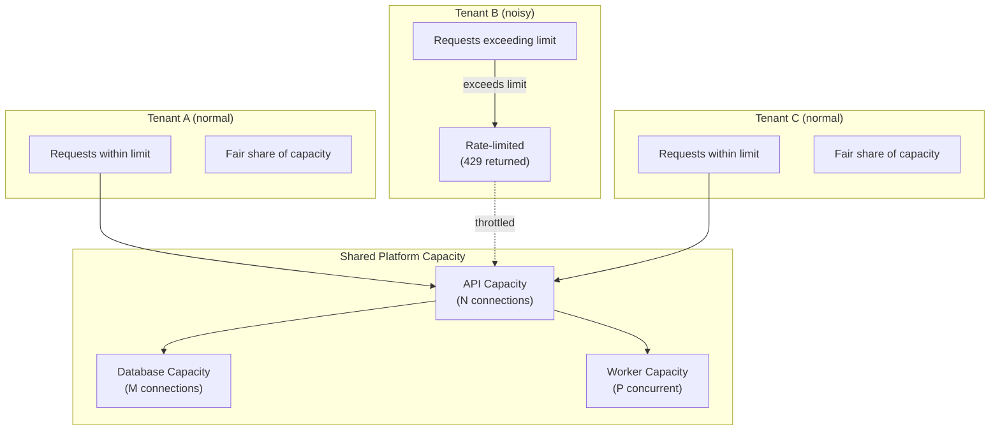
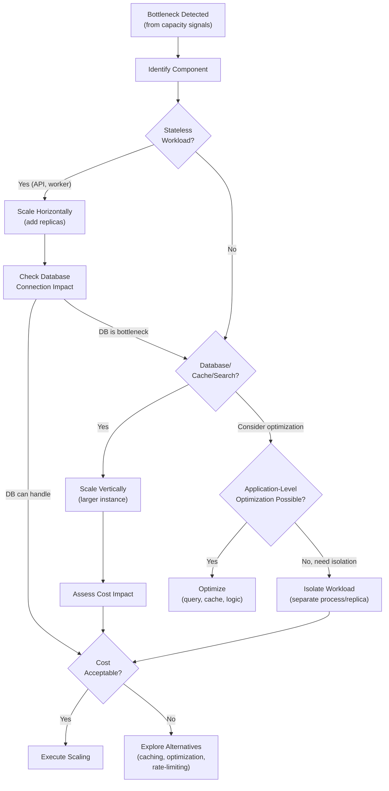

# Scaling and Capacity Architecture

## Metadata

| Field | Value |
|-------|-------|
| Title | Kairo Performance, Capacity, and Scalability Architecture |
| Document ID | KAI-INFRA-010 |
| Status | Draft |
| Version | 0.1 |
| Target Release | V1 |
| Owner | Performance, Capacity, and Scalability Architect |
| Created | 2026-07-23 |
| Last Updated | 2026-07-23 |
| Reviewers | TODO |
| Related Documents | [Infrastructure Architecture](./Infrastructure-Architecture.md), [Hosting and Runtime Architecture](./Hosting-and-Runtime-Architecture.md), [Tenant Scaling and Placement](../Multi-Tenancy/Tenant-Scaling-and-Placement.md), [Pagination, Filtering, Sorting, and Search](../API/Pagination-Filtering-Sorting-and-Search.md), [Bulk and Asynchronous Operations](../API/Bulk-and-Asynchronous-Operations.md), [Event Observability and Auditing](../Events/Event-Observability-and-Auditing.md), [Availability and Resilience Architecture](./Availability-and-Resilience-Architecture.md) |
| Dependencies | [Infrastructure Architecture](./Infrastructure-Architecture.md), [Hosting and Runtime Architecture](./Hosting-and-Runtime-Architecture.md) |

---

## Applicable Version

This document defines V1 scaling and capacity architecture. V1 uses manual scaling based on observed metrics — horizontal scaling for stateless compute, vertical scaling for stateful systems, and conservative resource allocation. Auto-scaling, sharding, and multi-region distribution are future investments justified by measured demand.

---

## Purpose

This document defines how the Kairo platform scales to meet demand — what workloads scale and how, what signals trigger scaling decisions, how noisy-neighbor problems are controlled, and how capacity is planned and managed.

Scaling is not just "add more servers." Different workloads scale differently. Databases do not scale the same way as API servers. Background workers do not scale the same way as search indexes. And all scaling decisions have cost implications. This document ensures scaling decisions are informed, proportionate, and cost-conscious.

---

## Scope

This document covers:

- Workload characteristics and their scaling behaviors.
- Infrastructure component capacity (database, cache, search, events, storage, network).
- Horizontal and vertical scaling patterns.
- Auto-scaling direction and scaling limits.
- Tenant-level controls (rate limits, quotas, noisy-neighbor).
- Capacity signals, forecasting, and load testing.
- Cost management as a scaling constraint.
- V1 approach and future scaling maturity.

This document does not cover:

- Specific instance sizes or SKUs (capacity planning documents).
- Auto-scaling formulas or metric thresholds (operations configuration).
- Shard keys or partition strategies (implementation details deferred until justified).
- Load-testing tool selection (development/operations standards).
- Pricing or plan-based tenant limits (business decisions).
- CDN configuration (infrastructure operations).

---

## Mandatory Principles

| # | Principle |
|---|-----------|
| 1 | Scaling must be driven by measured bottlenecks |
| 2 | Stateless application workloads should support horizontal scaling where practical |
| 3 | Database scaling requires different strategies from application scaling |
| 4 | Background workers must use backpressure and bounded concurrency |
| 5 | Autoscaling cannot replace capacity planning |
| 6 | Tenant-level limits may coexist with platform-wide limits |
| 7 | Noisy-neighbor protection must preserve fairness |
| 8 | Rate limiting is both a security and capacity control |
| 9 | Queue depth and consumer lag are scaling signals |
| 10 | Heavy reports and exports must not destabilize transactional workloads |
| 11 | V1 must not introduce complex sharding without demonstrated need |
| 12 | Cost is an architectural constraint |
| 13 | Scaling changes must not bypass tenant isolation |

---

## Workload Characteristics

### 1. Capacity-Management Purpose

| Purpose | Detail |
|---------|--------|
| Meet demand | Ensure sufficient capacity for current and near-future traffic |
| Prevent outage | Scale before capacity exhaustion causes failures |
| Control cost | Do not over-provision (waste money) or under-provision (risk failure) |
| Isolate workloads | Prevent one workload's demand from degrading another |
| Plan growth | Anticipate capacity needs from business growth trends |
| Inform decisions | Data-driven scaling decisions (not guesses) |

---

### 2. Workload Characteristics Overview

| Workload | Pattern | Scaling Dimension | V1 Scaling |
|----------|---------|-------------------|------------|
| API requests | Synchronous, latency-sensitive | Concurrency (requests/second) | Horizontal (replicas) |
| Background workers | Asynchronous, throughput-oriented | Queue depth, processing rate | Horizontal (replicas) |
| Event processing | Asynchronous, ordered per-aggregate | Consumer lag, throughput | V1: single processor. V2: competing consumers. |
| Reporting queries | Synchronous, resource-heavy | Query complexity, concurrent reports | Workload isolation (worker process) |
| Search queries | Synchronous, latency-sensitive | Query rate, index size | Vertical (V1). Cluster (future). |
| File processing | Asynchronous, memory-heavy | File size, concurrent operations | Workload isolation. Memory allocation. |

---

### 3. Request Workloads

| Aspect | Detail |
|--------|--------|
| Pattern | Short-lived, synchronous. Response expected in milliseconds-to-seconds. |
| Scaling signal | Request rate, response latency (p95, p99), CPU utilization |
| Scaling method | Horizontal: add API replicas behind load balancer |
| Limit | Connection pool to database, rate limits per consumer |
| Bottleneck | Database connections (shared across replicas), external provider latency |
| V1 | 2+ replicas. Manual scaling based on metrics. |

---

### 4. Background Workloads

**Background workers must use backpressure and bounded concurrency.**

| Aspect | Detail |
|--------|--------|
| Pattern | Long-running, asynchronous. Throughput matters more than latency. |
| Scaling signal | Queue depth, processing rate, consumer lag |
| Scaling method | Horizontal: add worker replicas (with coordination for ordered processing) |
| Limit | Bounded concurrency per worker. Backpressure from queue depth. |
| Bottleneck | Database write capacity, external provider rate limits |
| V1 | 1+ replicas. Scale based on lag/queue depth. |

---

### 5. Event Workloads

| Aspect | Detail |
|--------|--------|
| Pattern | Event publication (outbox → delivery) and consumption (handler processing) |
| Scaling signal | Publication lag (outbox age), consumer lag (processing delay) |
| Scaling method | V1: single outbox processor per module. V2+: competing consumers with partitioning. |
| Limit | Per-aggregate ordering constraint limits parallelism within an aggregate |
| Bottleneck | Consumer processing speed, database write capacity |
| V1 | Single processor. Scale by optimizing handler performance. |

---

### 6. Reporting Workloads

**Heavy reports and exports must not destabilize transactional workloads.**

| Aspect | Detail |
|--------|--------|
| Pattern | Complex queries. May scan large datasets. Infrequent but resource-heavy. |
| Scaling signal | Report execution duration, database CPU/IO during reports |
| Scaling method | Workload isolation (reports in worker process, not API). Future: read replica. |
| Limit | Query timeout. Complexity limits. Off-peak scheduling for heavy reports. |
| Bottleneck | Database I/O, memory for large result sets |
| V1 | Worker-isolated. Bounded queries. Future: read replica for reporting. |

---

### 7. Search Workloads

| Aspect | Detail |
|--------|--------|
| Pattern | Full-text queries. Latency-sensitive for user experience. |
| Scaling signal | Query latency, index size, query rate |
| Scaling method | Vertical (larger instance V1). Cluster (multi-node future). |
| Limit | Query complexity limits. Pagination limits index traversal. |
| Bottleneck | Index size vs available memory. Query complexity. |
| V1 | Single-node managed service. Vertical scaling as index grows. |

---

### 8. File-Processing Workloads

| Aspect | Detail |
|--------|--------|
| Pattern | Large file parsing (imports), report generation (exports). Memory-intensive. |
| Scaling signal | Concurrent file operations, memory utilization, processing duration |
| Scaling method | Worker-isolated. Bounded concurrent operations. Memory allocation. |
| Limit | Maximum file size. Maximum concurrent import/export operations per tenant. |
| Bottleneck | Memory for large file parsing. Object storage I/O. |
| V1 | Worker process with memory limits. Sequential processing of large files. |

---

## Infrastructure Capacity

### 9. Database Capacity

**Database scaling requires different strategies from application scaling.**

| Aspect | Detail |
|--------|--------|
| V1 strategy | Single managed instance. Vertical scaling (larger instance as data grows). |
| Scaling signals | CPU utilization, I/O throughput, connection count, query duration |
| Connection management | Connection pooling. Fixed pool size per application replica. |
| Growth vectors | Data volume (rows), query complexity, connection concurrency |
| V2 direction | Read replicas (offload reporting, search indexing). Connection pooler (PgBouncer or equivalent). |
| V3+ direction | Database-per-service (if modules extracted). Sharding evaluated (not assumed). |
| **No premature sharding** | **V1 must not introduce complex sharding without demonstrated need.** Single database is sufficient for V1 data volumes. |

---

### 10. Cache Capacity

| Aspect | Detail |
|--------|--------|
| V1 strategy | Single managed Redis instance. Vertical scaling (more memory). |
| Scaling signals | Memory utilization, eviction rate, hit rate, connection count |
| Growth vectors | Working-set size (cached items), connection count from replicas |
| Eviction | LRU eviction when memory full. Application handles cache miss. |
| V2 direction | Redis cluster (horizontal sharding for larger working sets) |
| Rule | Cache stores working set, not entire dataset. Size for active data. |

---

### 11. Search Capacity

| Aspect | Detail |
|--------|--------|
| V1 strategy | Single-node managed search. Vertical scaling. |
| Scaling signals | Index size vs memory, query latency, indexing lag |
| Growth vectors | Document count, index size, query complexity |
| V2 direction | Multi-node cluster (sharded index, replicated for availability) |
| Rule | Search index is derived. Can be rebuilt. Scaling is independent of source database. |

---

### 12. Event Transport Capacity

| Aspect | Detail |
|--------|--------|
| V1 strategy | In-process delivery. Capacity = worker processing speed + database I/O for outbox. |
| Scaling signals | Outbox pending count/age, consumer lag |
| Growth vectors | Event publication rate, consumer count, handler processing duration |
| V2 direction | External broker. Broker manages throughput, partitioning, consumer groups. |
| Rule | V1 event capacity is bounded by worker throughput and database capacity. |

---

### 13. Object-Storage Capacity

| Aspect | Detail |
|--------|--------|
| V1 strategy | Managed object storage. Inherently scalable. |
| Scaling signals | Storage volume, request rate |
| Growth vectors | Product images, import/export files, media uploads |
| Limit | Per-tenant storage quotas (future). Platform-wide monitoring. |
| Rule | Object storage scales inherently (managed service). Cost is the primary constraint, not capacity. |

---

### 14. Network Capacity

| Aspect | Detail |
|--------|--------|
| V1 strategy | Managed networking with sufficient bandwidth for application tier. |
| Scaling signals | Bandwidth utilization, packet loss, latency between zones |
| Growth vectors | API traffic, file transfers, search queries, external provider calls |
| Bottleneck | Rarely a bottleneck at V1 scale. Monitor for future. |
| Future | CDN for media delivery. Multi-region networking. |

---

## Scaling Patterns

### 15. Horizontal Scaling

**Stateless application workloads should support horizontal scaling where practical.**

| Workload | Horizontally Scalable | How |
|----------|:---:|------|
| API servers | **Yes** | Add replicas behind load balancer |
| Background workers | **Yes** | Add worker replicas (with job coordination) |
| Event consumers | Limited (V1) | V2: competing consumers with partitioning |
| Database | No (V1) | Future: read replicas |
| Cache | No (V1) | Future: Redis cluster |
| Search | No (V1) | Future: multi-node cluster |

| Rule | Detail |
|------|--------|
| Stateless required | Only stateless workloads scale horizontally (no local state between requests) |
| Session state external | Sessions in cache (not on local instance) |
| Database is shared | All API replicas share the same database (connection pool sizing critical) |
| Load-balanced | Traffic distributed across replicas (round-robin or least-connections) |

---

### 16. Vertical Scaling

| Workload | Vertically Scalable | How |
|----------|:---:|------|
| Database | **Yes** | Larger instance (more CPU, RAM, I/O) |
| Cache | **Yes** | More memory |
| Search | **Yes** | More memory and CPU |
| API servers | Yes (but horizontal preferred) | Larger instance (diminishing returns) |
| Workers | Yes (but horizontal preferred) | More memory for file processing |

| Rule | Detail |
|------|--------|
| Has ceiling | Vertical scaling has a maximum (largest available instance) |
| Downtime risk | Vertical scaling may require brief downtime (instance resize) or failover |
| Cost curve | Vertical scaling cost is not linear (2x CPU ≠ 2x price, often more) |
| When | Use vertical when horizontal is not possible (database) or when the bottleneck is per-instance (single-threaded processing) |

---

### 17. Autoscaling Direction

**Autoscaling cannot replace capacity planning.**

| Aspect | V1 | V2+ |
|--------|-----|------|
| API replicas | Manual scaling (based on monitoring) | Auto-scale on CPU/request rate |
| Workers | Manual scaling (based on lag) | Auto-scale on queue depth |
| Database | Manual (managed service tiers) | Automated tier adjustment (if supported) |
| Cache | Manual | Auto-scale cluster (if clustered) |

| Rule | Detail |
|------|--------|
| Capacity planning still needed | Auto-scaling reacts to current demand. Capacity planning anticipates future demand. |
| Limits required | Auto-scaling must have maximum limits (cost protection) |
| Not instantaneous | Scaling takes time (seconds to minutes). Must have headroom. |
| V1 manual is acceptable | V1 traffic is predictable enough for manual scaling. Auto-scaling is V2 investment. |

---

### 18. Scaling Limits

| Limit | Purpose |
|-------|---------|
| Maximum API replicas | Cost control. Prevent runaway scaling. |
| Maximum worker replicas | Cost control. Database connection limit. |
| Maximum database connections | Prevent database exhaustion. |
| Maximum concurrent operations per tenant | Fair usage. Noisy-neighbor prevention. |
| Maximum file size | Memory protection. Storage cost control. |
| Maximum batch size | Processing time and memory bounds. |
| Maximum query complexity | Database protection. Response time bounds. |

---

## Tenant Controls

### 19. Resource Quotas

**Tenant-level limits may coexist with platform-wide limits.**

| Quota Type | Purpose | Level |
|-----------|---------|-------|
| API rate limit | Prevent individual consumer from monopolizing capacity | Per-consumer / per-tenant |
| Concurrent async operations | Prevent queue monopolization | Per-tenant |
| Storage quota (future) | Cost control per tenant | Per-tenant |
| Import/export size | Memory and processing protection | Per-operation |
| Batch size | Processing bounds | Per-request |
| Platform maximum | Absolute ceiling regardless of tenant | Platform-wide |

| Rule | Detail |
|------|--------|
| Layered | Tenant limits operate within platform limits. Tenant cannot exceed platform maximum. |
| Configurable direction | V2+: tenant limits configurable per plan. V1: uniform limits. |
| Visible | Consumers see their limits (rate-limit headers, quota responses). |
| Overridable for enterprise (future) | V3+: enterprise tenants may have higher limits. V1: uniform. |

---

### 20. Tenant-Level Rate Limits

**Rate limiting is both a security and capacity control.**

| Aspect | Detail |
|--------|--------|
| Purpose | Prevent one tenant from consuming disproportionate API capacity |
| Scope | Per-tenant, per-consumer (API key), per-endpoint (sensitive operations) |
| Response | 429 Too Many Requests with Retry-After |
| V1 | Uniform limits across all tenants |
| Future | Per-plan limits (higher plans, higher limits) |
| Not authorization | Rate limiting protects capacity. It does not replace authorization checks. |

---

### 21. Noisy-Neighbor Controls

**Noisy-neighbor protection must preserve fairness.**

| Control | Mechanism |
|---------|-----------|
| API rate limiting | Per-tenant/per-consumer limits prevent monopolization |
| Connection pool per tenant (direction) | V2+: connection-level isolation prevents one tenant's queries from exhausting all connections |
| Query timeout | Heavy queries time out (do not hold connections indefinitely) |
| Concurrent operation limits | Per-tenant limits on async operations, imports, exports |
| Worker fair scheduling | Background work processed fairly across tenants (not FIFO which favors high-volume tenants) |
| Queue isolation direction | V2+: per-tenant queues or priority-weighted scheduling |

---

### 22. Hot Tenant Detection

| Aspect | Detail |
|--------|--------|
| Definition | A tenant consuming disproportionate resources (API calls, database queries, storage) |
| Detection | Per-tenant metrics: request rate, error rate, query volume, storage growth |
| Alert | Hot-tenant detection triggers operational alert |
| Response | Verify rate limits are effective. If limits are not controlling, investigate (attack? bug? legitimate growth?). |
| Action | Rate-limit enforcement (if not already), contact tenant (if legitimate growth), investigate (if unexpected) |
| V1 | Per-tenant metrics in monitoring. Manual investigation. |
| Future | Automated hot-tenant detection and response |

---

## Capacity Signals

### 23. Queue Depth

**Queue depth and consumer lag are scaling signals.**

| Signal | Indicates | Response |
|--------|-----------|----------|
| Outbox pending growing | Publication not keeping up | Check publication worker health. Scale worker if healthy but slow. |
| Async operation queue growing | Processing not keeping up | Scale workers. Investigate slow operations. |
| Import queue growing | Import processing bottleneck | Memory or CPU constraint on file processing. |
| Dead-letter growing | Failures accumulating | Investigation needed (not scaling — indicates bugs). |

---

### 24. Consumer Lag

| Signal | Indicates | Response |
|--------|-----------|----------|
| Consumer lag increasing | Consumers falling behind publication rate | Optimize handlers. V2: competing consumers. |
| Consumer lag stable (seconds) | Normal operation | No action. |
| Consumer lag growing after deployment | New code may be slower | Investigate handler performance. Consider rollback if critical. |
| Consumer lag growing without deployment | Traffic growth or infrastructure degradation | Scale infrastructure. Investigate bottleneck. |

---

### 25. Burst Traffic

| Aspect | Detail |
|--------|--------|
| Definition | Sudden traffic increase above normal levels (marketing campaign, product launch, flash sale) |
| Challenge | Burst exceeds current capacity before scaling can respond |
| Mitigation | Headroom (provision slightly above normal). Rate limiting absorbs excess. Cache serves repeat requests. |
| V1 approach | Pre-provision for anticipated bursts (e.g., known product launch). Rate limiting protects against unexpected bursts. |
| Future | Auto-scaling responds to burst. CDN absorbs cacheable burst traffic. |

---

### 26. Seasonal Traffic

| Aspect | Detail |
|--------|--------|
| Definition | Predictable traffic patterns (day/night, weekday/weekend, holiday seasons) |
| Challenge | Over-provisioning for peak wastes money during trough. Under-provisioning for peak causes failures. |
| V1 approach | Provision for expected peak with monitoring. Adjust manually for seasonal peaks (e.g., holiday). |
| Future | Auto-scaling follows traffic patterns. Scheduled scaling for known events. |

---

### 27. Capacity Forecasting

| Aspect | Detail |
|--------|--------|
| Purpose | Anticipate when current capacity will be insufficient |
| Signals | Growth trends in: request rate, data volume, tenant count, event volume |
| Method | Linear projection from historical growth + planned features |
| Timeline | Forecast 3-6 months ahead (V1). Quarterly review. |
| Action | If forecast shows capacity exhaustion within timeline, plan scaling proactively |
| V1 | Manual forecasting from metrics dashboards. Quarterly capacity review. |
| Future | Automated forecasting with alerting |

---

### 28. Load Testing

| Aspect | Detail |
|--------|--------|
| Purpose | Validate capacity under controlled load. Identify bottlenecks before production. |
| Environment | Staging or dedicated load-test environment (never production without controls) |
| Scenarios | Normal load, peak load, burst, sustained high load |
| Metrics | Response time, error rate, resource utilization, bottleneck identification |
| Frequency | Before major releases. After significant architecture changes. Quarterly baseline. |
| V1 | Manual load testing in staging. Baseline established. |
| Future | Automated load testing in CI/CD. Continuous performance regression detection. |

---

## Cost and Operations

### 29. Cost Management

**Cost is an architectural constraint.**

| Rule | Detail |
|------|--------|
| Cost-aware | Every scaling decision considers cost impact |
| Proportionate | Infrastructure cost must be proportionate to business value delivered |
| Measured | Actual cost tracked per component (compute, storage, network, managed services) |
| Optimized | Regularly review for waste (over-provisioned resources, unused capacity) |
| Visible | Cost is visible to decision-makers (not hidden in aggregate bills) |
| Not unlimited | Scaling has cost limits. Auto-scaling (future) has maximum bounds. |
| V1 frugal | V1 is a startup. Infrastructure should be cost-effective, not gold-plated. |

| Cost Optimization Direction | V1 | Future |
|----------------------------|-----|--------|
| Right-sizing instances | Manual review | Automated recommendations |
| Reserved/committed capacity | Evaluated after traffic stabilizes | Yes (cost savings) |
| Spot/preemptible workers | Not V1 | Evaluated for fault-tolerant workloads |
| Storage tiering | Single tier | Hot/cold tiering for old data |
| CDN for media | Not V1 | Yes (reduces compute load) |

---

### 30. Future Sharding and Regional Scaling

**V1 must not introduce complex sharding without demonstrated need.**

| Aspect | Detail |
|--------|--------|
| Database sharding | Not V1. Single database handles V1 volumes. Sharding evaluated when single-instance vertical limit is reached. |
| Per-module databases | Not V1. Single shared database. Per-module databases evaluated on service extraction. |
| Multi-region | Not V1. Single-region deployment. Multi-region evaluated when business requires geographic presence. |
| CDN | Not V1. CDN for static assets and media evaluated for V2. |
| Edge computing | Not V1. Edge evaluated for specific latency-sensitive use cases. |
| Trigger | Scaling changes justified by measured bottlenecks, not speculative growth. |

---

## Workload-Scaling Matrix

| Workload | Scaling Method | Scaling Signal | V1 Approach | Future |
|----------|---------------|----------------|-------------|--------|
| API servers | Horizontal (replicas) | Request rate, latency, CPU | Manual 2+ replicas | Auto-scale |
| Background workers | Horizontal (replicas) | Queue depth, lag | Manual 1+ replicas | Auto-scale on depth |
| Event publisher | Optimization | Outbox pending age | Single processor, optimize | Competing publishers |
| Event consumers | Optimization | Consumer lag | Single consumer, optimize | Competing consumers |
| Database | Vertical | CPU, I/O, connections | Managed, larger instance | Read replicas, pooler |
| Cache | Vertical | Memory util, eviction | Managed, larger instance | Cluster |
| Search | Vertical | Latency, memory | Managed, larger node | Multi-node cluster |
| File processing | Bounded concurrency | Memory, duration | Worker-isolated, sequential | Parallel chunks |
| Reporting | Isolation | Query duration, DB load | Worker process | Read replica |
| Object storage | Inherent | Storage volume | Managed service | CDN for delivery |

---

## Capacity-Signal Matrix

| Signal | Component | Indicates | Response Threshold Direction |
|--------|-----------|-----------|------------------------------|
| API response latency (p99) | API servers | Compute or dependency bottleneck | When p99 exceeds acceptable limit |
| API CPU utilization | API servers | Compute capacity approaching limit | When sustained > 70% |
| Database CPU utilization | Database | Query load approaching capacity | When sustained > 60% |
| Database connection count | Database | Connection pool pressure | When approaching pool maximum |
| Cache memory utilization | Cache | Working set exceeding memory | When > 80% (eviction increasing) |
| Cache eviction rate | Cache | Working set too large | When eviction causes cache-miss spike |
| Search query latency | Search | Index or query capacity | When p95 exceeds acceptable limit |
| Outbox pending age | Event publishing | Publication not keeping up | When oldest pending > threshold (seconds) |
| Consumer lag | Event consumption | Processing not keeping up | When lag exceeds threshold |
| Queue depth (async ops) | Workers | Processing capacity | When depth consistently growing |
| Object storage request rate | Storage | Access pattern change | Rarely a concern (managed) |
| Error rate increase | Any component | Capacity or reliability issue | When error rate exceeds baseline |

---

## Scaling Decision Tree

---

## V1 versus Future Scaling

| Capability | V1 | V2 | V3+ |
|-----------|:---:|:---:|:---:|
| Manual horizontal scaling (API) | **Yes** | Auto-scale | Auto-scale + multi-region |
| Manual horizontal scaling (workers) | **Yes** | Auto-scale on queue depth | Per-workload auto-scale |
| Vertical scaling (database) | **Yes** | + Read replicas | + Sharding evaluated |
| Vertical scaling (cache) | **Yes** | Redis cluster | Multi-region cache |
| Vertical scaling (search) | **Yes** | Multi-node cluster | Sharded cluster |
| Rate limiting (uniform) | **Yes** | Per-plan limits | Adaptive limits |
| Noisy-neighbor detection | Basic (metrics) | Automated detection | Automated response |
| Load testing (manual) | **Yes** | Automated in CI | Continuous performance |
| Capacity forecasting (manual) | **Yes** | Automated forecasting | Predictive scaling |
| Cost monitoring | Basic | Per-component tracking | Automated optimization |
| Auto-scaling | No | **Yes** (compute) | All layers |
| Database sharding | No | No | Evaluated if needed |
| Multi-region | No | No | **Yes** (if needed) |
| CDN | No | **Yes** (media) | Full edge caching |
| Spot/preemptible instances | No | Evaluated | Yes (workers) |
| Per-tenant resource isolation | Rate limits only | Queue isolation | Dedicated infrastructure |

---

## Version Gate

| Version | Scaling and Capacity Gate |
|---------|--------------------------|
| V1 | Manual horizontal scaling for API (2+ replicas) and workers (1+). Vertical scaling for database, cache, search (managed service tiers). Rate limiting on all public APIs (uniform across tenants). Query timeouts and complexity limits. Worker process isolation for heavy operations. Bounded concurrency for background work. Per-tenant metrics for noisy-neighbor visibility. Queue depth and consumer lag monitoring. Load testing baseline in staging. Cost tracking per component. Capacity review quarterly. No auto-scaling (manual decisions from metrics). No sharding. No multi-region. |
| V2 | Auto-scaling for compute (metric-driven). Read replicas for database (reporting offload). Redis cluster. Multi-node search. Per-plan tenant rate limits. Automated noisy-neighbor detection. CDN for media. Automated load testing. Capacity forecasting tooling. Cost optimization recommendations. |
| V3 | Multi-region deployment. Database sharding evaluated. Adaptive rate limiting. Predictive scaling. Spot/preemptible workers. Per-tenant dedicated infrastructure (enterprise). Global CDN. Edge computing for latency-sensitive. Full cost optimization automation. |

---

## Decision Summary

| Decision | Rationale |
|----------|-----------|
| Manual scaling for V1 | V1 traffic is predictable and manageable. Auto-scaling adds infrastructure complexity without demonstrated need. |
| Horizontal for stateless, vertical for stateful | API servers scale by adding replicas (simple). Databases scale by getting larger (necessary — cannot shard trivially). |
| Single database (no sharding V1) | V1 data volumes do not justify sharding complexity. Vertical scaling handles V1 growth. |
| Worker process isolation for heavy work | Heavy reports and file processing in the worker process prevents API degradation. |
| Uniform rate limits (V1) | Simplest. All tenants get the same limits. Per-plan limits add complexity appropriate for V2. |
| Cost as constraint | Startup does not have unlimited budget. Every scaling decision weighs cost against benefit. |
| Quarterly capacity review | Monthly is too frequent for stable V1. Annually risks surprise. Quarterly balances. |
| Load testing in staging | Production load testing is risky without sophisticated traffic management. Staging is safe and sufficient for V1. |
| Queue depth/lag as signals | These directly indicate whether background processing is keeping up. More informative than CPU for async workloads. |

---

## Alternatives Considered

| Alternative | Rejected Because |
|------------|-----------------|
| Auto-scaling from V1 | Infrastructure complexity without demonstrated need. V1 traffic is predictable. |
| Database sharding in V1 | Enormous complexity. Single-instance PostgreSQL handles V1 data volumes easily. |
| Multi-region from V1 | Massive complexity (replication, conflict resolution, routing). V1 does not need it. |
| No rate limiting | One consumer could monopolize capacity. Rate limiting is essential from V1. |
| Per-tenant database | Over-provisioning at V1 scale. Application-level isolation is effective. |
| Serverless for all workloads | Cold-start latency. Cost at sustained load. Harder to predict capacity. Not appropriate for persistent processes. |
| No load testing | Unknown capacity ceiling. First overload is in production. Unacceptable risk. |
| Unlimited auto-scaling | Cost explosion risk. Must have bounds. |
| Scale before measuring | Wastes money on unconfirmed bottlenecks. Measure first, scale based on evidence. |

---

## Architecture Impact

| Concern | Impact |
|---------|--------|
| Application design | Must be stateless (for horizontal scaling). Must respect rate limits. Must handle backpressure. Must support connection pooling. |
| Database | Connection pool sizing is critical (shared across replicas). Query optimization reduces scaling pressure. |
| Events | Consumer performance directly affects lag. Efficient handlers reduce scaling need. |
| Operations | Must monitor capacity signals. Must make scaling decisions. Must manage cost. Must run load tests. |
| Cost | Every component has a cost. Scaling increases cost. Cost must be tracked and justified. |
| Testing | Load tests establish baseline. Performance regressions detected before production impact. |

---

## Implementation Impact

| Area | Impact |
|------|--------|
| Application | Must be horizontally scalable (stateless). Must implement rate-limit responses. Must handle connection-pool exhaustion gracefully. Must support bounded concurrency in background operations. |
| Platform/DevOps | Must configure scaling (manual V1). Must manage database sizing. Must configure rate limits. Must monitor capacity signals. Must manage cost. |
| Operations | Must respond to capacity alerts. Must execute scaling decisions. Must run quarterly capacity reviews. Must manage load testing. |
| Product | Must understand capacity limits (rate limits affect API consumers). Must plan for burst traffic (product launches, promotions). |

---

## Security Responsibilities

| Role | Scaling Security Responsibilities |
|------|----------------------------------|
| Platform/DevOps | Configures rate limits. Manages scaling. Ensures scaling does not bypass security controls. |
| Security Team | Validates that rate limiting serves security (not just capacity). Reviews that scaling does not weaken tenant isolation. |
| Operations | Monitors for abuse (DDoS-like patterns vs legitimate growth). Responds to capacity-related security events. |
| Module Teams | Implement bounded concurrency. Handle rate-limit responses. Optimize queries to reduce scaling pressure. |

---

## Multi-Tenancy Responsibilities

| Responsibility | Detail |
|---------------|--------|
| **Scaling changes must not bypass tenant isolation** | Adding replicas or scaling database does not change tenant isolation rules |
| Per-tenant rate limiting | Prevents one tenant from monopolizing shared capacity |
| Fair worker scheduling | Background processing treats all tenants fairly |
| Hot-tenant visible | Per-tenant metrics enable detection of disproportionate usage |
| No per-tenant infrastructure (V1) | All tenants share infrastructure. Isolation is application-level. |
| Future per-tenant scaling | V3+: enterprise tenants may get dedicated infrastructure with independent scaling. |

---

## Out of Scope

This document does not define:

- Specific instance sizes or SKUs (capacity planning documents).
- Auto-scaling metric thresholds or formulas (operations configuration).
- Shard keys or partition strategies (implementation detail, deferred).
- Load-testing tool selection (development standards).
- Rate-limit numeric values (deployment configuration).
- CDN configuration (infrastructure operations).
- Pricing or plan-based tenant limits (business decisions).
- Cost optimization tool selection (infrastructure decisions).

---

## Future Considerations

- **Auto-scaling** — Metric-driven automatic scaling for compute and workers.
- **Database read replicas** — Offload reporting and search indexing from primary.
- **Redis cluster** — Horizontal cache scaling for larger working sets.
- **CDN** — Edge caching for media delivery and static assets.
- **Multi-region** — Geographic distribution for latency and compliance.
- **Spot/preemptible** — Cost optimization for fault-tolerant background workloads.
- **Adaptive rate limiting** — Dynamic limits based on current system capacity.
- **Predictive scaling** — ML-based capacity forecasting and proactive scaling.
- **Per-tenant dedicated** — Enterprise tier with dedicated infrastructure and independent scaling.

---

## Future Refactoring Triggers

This document should be revisited when:

- API latency degrades under normal load (trigger for horizontal scaling or optimization).
- Database vertical limit is approached (trigger for read replicas or pooling).
- Consumer lag grows consistently (trigger for competing consumers or optimization).
- Tenant count or volume creates noisy-neighbor issues (trigger for enhanced isolation).
- Auto-scaling is implemented (trigger for threshold and policy documentation).
- Multi-region deployment begins (trigger for regional capacity planning).
- Cost growth exceeds revenue growth (trigger for cost optimization initiative).
- Load testing reveals unexpected bottlenecks (trigger for architecture review).

---

## Change History

| Version | Date | Author | Description |
|---------|------|--------|-------------|
| 0.1 | 2026-07-23 | Performance, Capacity, and Scalability Architect | Initial draft — scaling and capacity architecture |
