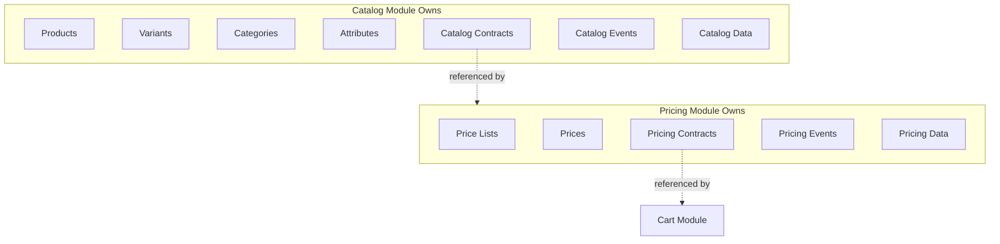
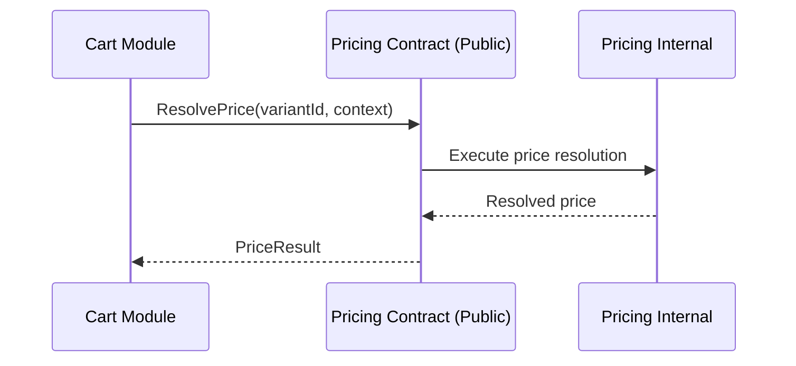
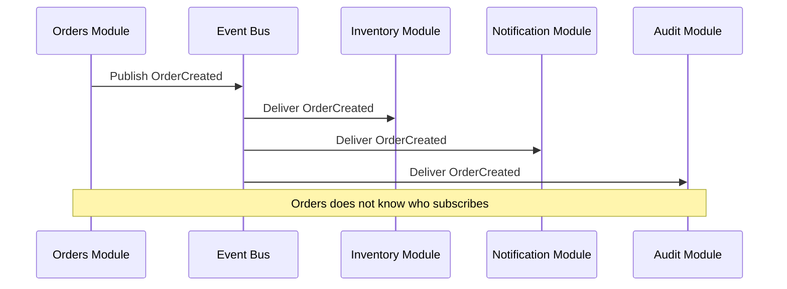
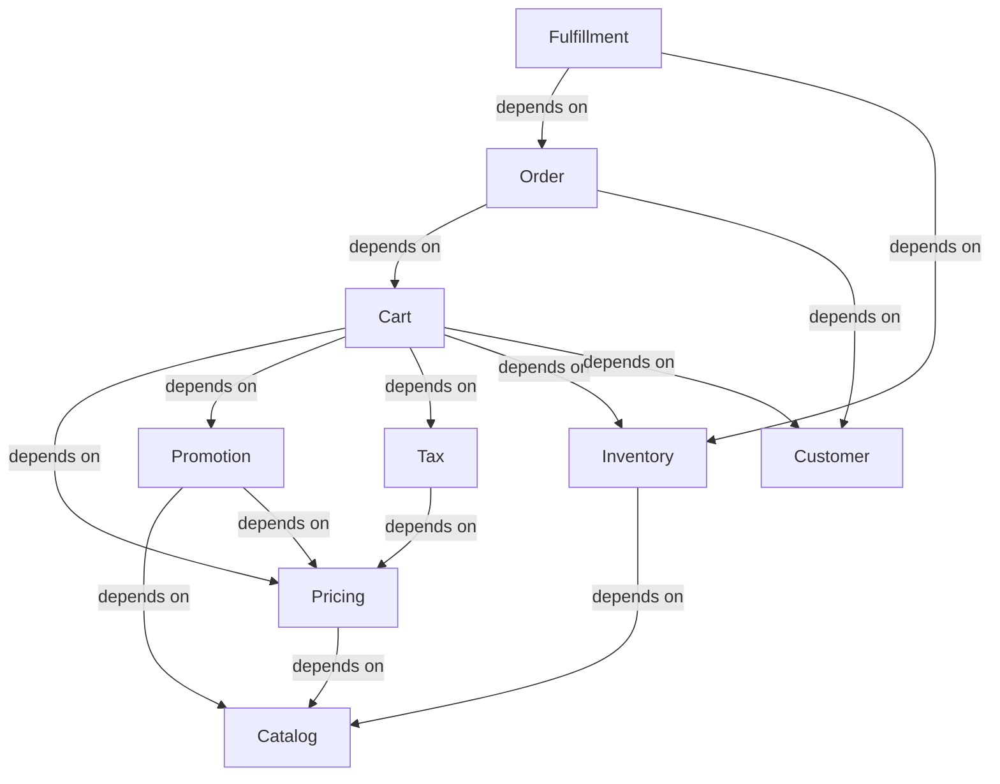
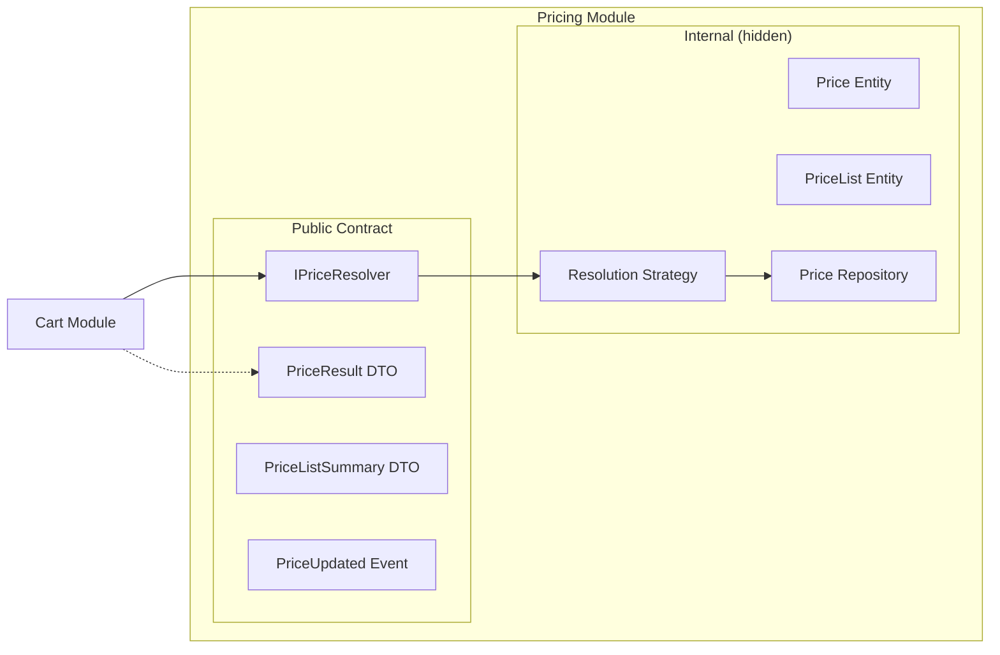
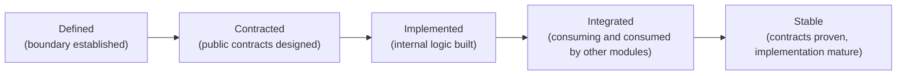

# Module Architecture

## Metadata

| Field | Value |
|-------|-------|
| Title | Kairo Module Architecture |
| Document ID | KAI-ARCH-006 |
| Status | Draft |
| Version | 0.1 |
| Target Release | N/A |
| Owner | Chief Software Architect |
| Created | 2026-07-15 |
| Last Updated | 2026-07-15 |
| Reviewers | TODO |
| Related Documents | [Architecture Overview](./Architecture-Overview.md), [Monolith Strategy](./Monolith-Strategy.md), [Architecture Principles](./Architecture-Principles.md), [Bounded Contexts](../03-Business-Capabilities/Bounded-Contexts.md), [Context Relationships](../03-Business-Capabilities/Context-Relationships.md) |
| Dependencies | None |

---

## Purpose

This document defines how modules are organized within the Kairo platform. It establishes the rules that govern module boundaries, ownership, communication, and internal structure. Every module in the platform — current and future — must conform to these architectural rules.

This is a structural document. It describes how modules are shaped, not what they contain. Individual module specifications are documented in `06-Modules/`.

---

## What Is a Module

A module is the architectural unit that owns a bounded context. It encapsulates all logic, data, and contracts for a single business domain. A module is:

- **A boundary** — It defines what is inside and what is outside.
- **An owner** — It owns its data exclusively. No other module accesses that data directly.
- **A contract provider** — It exposes public interfaces that other modules consume.
- **An implementation hider** — Its internal structure is invisible to the rest of the system.

Modules are not libraries, utilities, or shared code packages. They are self-contained business domains.

---

## Module Structure

Every module follows the same internal organization:

```mermaid
graph TD
    subgraph Module["Module Boundary"]
        subgraph Public["Public Layer"]
            Contracts["Contracts<br/>(interfaces, DTOs, events)"]
        end

        subgraph Application["Application Layer"]
            Commands["Commands"]
            Queries["Queries"]
            Handlers["Handlers"]
            Validators["Validators"]
        end

        subgraph Domain["Domain Layer"]
            Entities["Entities"]
            ValueObjects["Value Objects"]
            DomainServices["Domain Services"]
            DomainEvents["Domain Events"]
            Rules["Business Rules"]
        end

        subgraph Infrastructure["Infrastructure Layer"]
            Repositories["Repositories"]
            ExternalAdapters["External Adapters"]
            Persistence["Persistence Configuration"]
        end

        Contracts --> Application
        Application --> Domain
        Application --> Infrastructure
        Infrastructure --> Domain
    end
```

### Layer Responsibilities

| Layer | Responsibility | Visibility |
|-------|---------------|-----------|
| Public | Contracts, interfaces, DTOs, and event definitions that other modules may consume | Visible to other modules |
| Application | Command and query handling, orchestration, validation, and use case coordination | Internal to the module |
| Domain | Entities, value objects, business rules, and domain logic | Internal to the module |
| Infrastructure | Data access, external service adapters, and persistence configuration | Internal to the module |

### Layer Rules

- The Public layer is the only part of a module visible to the rest of the system.
- The Application layer orchestrates use cases by coordinating Domain and Infrastructure.
- The Domain layer contains business logic with no dependencies on infrastructure or framework concerns.
- The Infrastructure layer implements interfaces defined in the Domain layer. Dependencies point inward.
- No layer may bypass the layer above it. External requests enter through the Public layer and flow downward.

---

## Module Ownership

Each module has a single, clearly defined owner:

| Attribute | Rule |
|-----------|------|
| Data ownership | A module owns all data within its bounded context. No other module reads from or writes to this data. |
| Logic ownership | All business rules for the bounded context are implemented within the owning module. No business logic leaks into other modules. |
| Contract ownership | The module defines and maintains its public contracts. Contract changes are the module owner's responsibility. |
| Event ownership | The module defines and publishes its own domain events. Event schemas are part of the module's public contract. |
| Documentation ownership | The module's specification, API documentation, and operational documentation are maintained by the module owner. |

### Ownership Boundaries

A module references another module's public contracts. It never reaches into another module's domain, application, or infrastructure layers.

---

## Communication

Modules communicate through two mechanisms: synchronous queries/commands through public contracts, and asynchronous events through the platform event bus.

### Synchronous Communication

Used when a module needs data or a response from another module immediately.

Rules:

- The calling module depends on the contract interface, never the implementation.
- The contract defines the input, output, and error conditions.
- The calling module has no knowledge of how the result is produced.
- Synchronous calls are used for queries and commands that require an immediate response.

### Asynchronous Communication

Used when a module needs to notify the system of a state change without waiting for a response.

Rules:

- The publishing module has no knowledge of subscribers.
- Adding a subscriber does not require changes to the publisher.
- Events describe what happened (past tense). They are facts, not commands.
- Subscribers handle their own error recovery. A failed subscriber does not affect the publisher or other subscribers.

### Choosing Communication Type

| Situation | Use |
|-----------|-----|
| Module needs data from another module to complete a request | Synchronous query through contract |
| Module needs another module to perform an action and return a result | Synchronous command through contract |
| Module needs to notify the system of a state change | Asynchronous event |
| Module needs to trigger side effects in other modules without coupling | Asynchronous event |
| The outcome of communication can be eventually consistent | Asynchronous event |
| The outcome must be immediately consistent | Synchronous call |

---

## Dependencies

### Dependency Direction

Dependencies between modules flow in a defined direction. The dependency graph must be acyclic.

### Dependency Rules

- **No circular dependencies.** If Module A depends on Module B, Module B must not depend on Module A. If a circular dependency appears necessary, the design is wrong and must be restructured.
- **Depend on contracts, not modules.** A module depends on another module's public contract interface, not on the module itself. This enables substitution in testing and extraction to services.
- **Minimize dependency count.** Each dependency is a coupling point. Modules should depend on the fewest other modules possible to fulfill their responsibility.
- **Platform dependencies are universal.** All modules depend on platform services (Identity, Tenancy, Events, Configuration). These dependencies are structural and do not count as inter-module coupling.
- **Dependency direction follows domain logic.** Cart depends on Pricing because Cart needs prices. Pricing does not depend on Cart because Pricing does not need cart state. Dependencies point toward the data source.

---

## Encapsulation

Encapsulation is the most important structural rule. A module's internal structure is invisible to the rest of the system.

### What Is Encapsulated

| Component | Visibility |
|-----------|-----------|
| Domain entities | Internal — never exposed directly |
| Domain services | Internal — never called from outside |
| Business rules | Internal — other modules do not evaluate another module's rules |
| Data access | Internal — repositories and queries are invisible |
| Infrastructure adapters | Internal — how a module connects to external systems is hidden |
| Internal events | Internal — events used for intra-module communication are not published externally |

### What Is Exposed

| Component | Visibility |
|-----------|-----------|
| Contract interfaces | Public — how other modules interact with this module |
| Data transfer objects | Public — the shapes of data exchanged through contracts |
| Domain events | Public — significant state changes published to the event bus |
| Error types | Public — the errors that callers may receive |

### Encapsulation Principles

- **Domain entities are never returned from public contracts.** Contracts return DTOs that represent a view of the data appropriate for the consumer. This decouples the module's internal model from its public interface.
- **Internal changes do not affect consumers.** A module may restructure its domain model, change its data access strategy, or refactor its business logic without any impact on consuming modules, as long as the public contracts remain unchanged.
- **The public contract is a designed artifact.** It is not a reflection of the internal model. It is shaped by what consumers need, not by what the module stores.

---

## Shared Kernel

A minimal shared kernel exists at the platform level. It contains types and conventions that all modules use identically.

### What Belongs in the Shared Kernel

| Element | Purpose |
|---------|---------|
| Entity identifier types | Consistent ID representation across all modules |
| Money type | Amount and currency representation |
| Date and time conventions | UTC timestamps, date-only values |
| Pagination types | Cursor-based pagination request and response shapes |
| Error base types | Standard error categories and response structure |
| Event envelope | Standard event metadata wrapper |
| Audit context | Actor and action information for audit entries |

### What Does NOT Belong in the Shared Kernel

- Domain entities from any module
- Business rules or validation logic
- Module-specific DTOs
- Configuration types specific to one module
- Any type that would change if only one module's requirements changed

### Shared Kernel Rules

- The shared kernel is as small as possible. Every addition must justify its universal necessity.
- Changes to the shared kernel require review from all module owners.
- The shared kernel is versioned. Breaking changes follow the same deprecation process as API contracts.
- No module-specific logic enters the shared kernel. If only one module needs it, it belongs in that module.

---

## Public Contracts

### Contract Design

A module's public contract is the interface through which other modules interact with it. Contracts are designed artifacts — they are shaped by consumer needs, not by internal implementation.

### Contract Rules

- Contracts are defined by the owning module.
- Contracts are stable. Once published, they are changed only through backward-compatible additions or through a formal deprecation process.
- Contracts use DTOs, never domain entities. The internal model is not exposed.
- Contracts define error conditions explicitly. Callers know what errors to expect.
- Contracts are the unit of testing between modules. Consumer tests validate against the contract, not against the implementation.

### Contract Versioning

- Minor contract changes (new optional fields, new optional methods) are backward-compatible and do not require consumer updates.
- Major contract changes (removed fields, changed semantics, new required parameters) require a deprecation period and consumer migration.
- Contract versions are tracked in module documentation.

---

## Internal Implementation

A module's internal implementation is unconstrained by other modules. Within its boundary, a module may:

- Choose its own internal patterns (CQRS, event sourcing, simple CRUD, or any combination).
- Structure its domain model as its business rules require.
- Optimize its data access patterns independently.
- Refactor its code freely without coordinating with other teams.
- Use different internal patterns than other modules if its domain warrants it.

The only constraint is that the public contract must be honored. How the module fulfills that contract is its own concern.

### Implementation Independence

| Module | May Use Internally |
|--------|--------------------|
| Catalog | Simple CRUD if the domain is straightforward |
| Pricing | Complex resolution strategies with caching |
| Orders | Event sourcing if order lifecycle tracking benefits from it |
| Inventory | Optimistic concurrency for stock management |
| Cart | In-memory calculation with persistence checkpoints |

These are examples, not prescriptions. Each module chooses what its domain requires.

---

## Module Lifecycle

| Stage | Requirement |
|-------|-------------|
| Defined | Bounded context is identified. Ownership is assigned. Boundary is documented. |
| Contracted | Public contracts are designed and reviewed. DTOs and events are specified. |
| Implemented | Internal logic is built. The module fulfills its contracts. Tests validate behavior. |
| Integrated | Other modules consume the contracts. Integration tests validate cross-module behavior. |
| Stable | Contracts are proven through production use. The module is reliable and well-understood. |

---

## Architecture Impact

| Concern | Impact |
|---------|--------|
| Maintainability | Encapsulated modules can be understood, modified, and tested independently. |
| Testability | Contract-based dependencies enable isolated testing with contract substitution. |
| Evolvability | Internal implementation can change without affecting consumers. New modules are added by consuming existing contracts. |
| Team Scalability | Modules with clear contracts can be owned by different teams with minimal coordination. |
| Service Extraction | Modules that follow these rules can be extracted to independent services because their communication already uses defined contracts. |
| Debugging | Clear boundaries make it evident which module is responsible for a given behavior. |

---

## Version Gate

| Version | Module Architecture Expectation |
|---------|-------------------------------|
| V1 | All Commerce modules follow this architecture. Public contracts are defined for every module. Encapsulation is enforced. Dependency graph is acyclic. |
| V2 | Contracts are stable and versioned. Cross-module integration tests validate contract compliance. Shared kernel is minimal and proven. |
| V3 | Module architecture supports multi-product organization. Contract-based communication is proven across product boundaries. Module extraction is architecturally feasible for any module. |

---

## Change History

| Version | Date | Author | Description |
|---------|------|--------|-------------|
| 0.1 | 2026-07-15 | Chief Software Architect | Initial draft |
