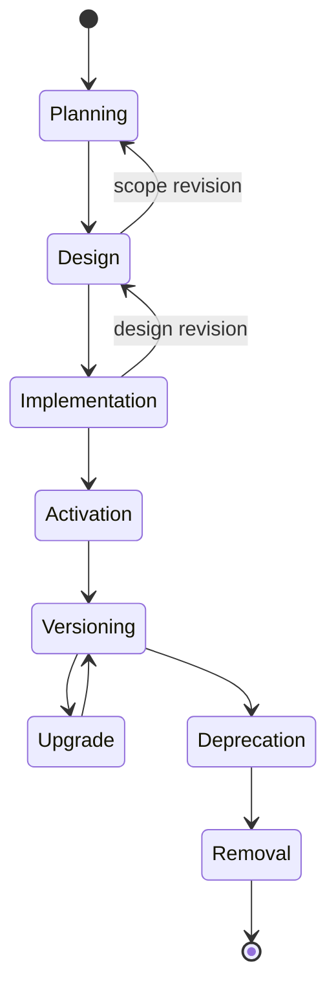
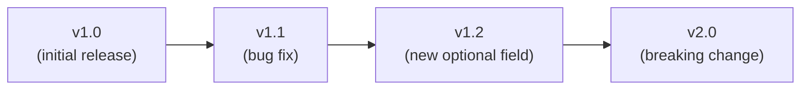

# Module Lifecycle

## Metadata

| Field | Value |
|-------|-------|
| Title | Kairo Module Lifecycle |
| Document ID | KAI-CORE-008 |
| Status | Draft |
| Version | 0.1 |
| Target Release | N/A |
| Owner | Chief Platform Architect |
| Created | 2026-07-18 |
| Last Updated | 2026-07-18 |
| Reviewers | TODO |
| Related Documents | [Module Architecture](./Module-Architecture.md), [Architecture Overview](./Architecture-Overview.md), [Capability Lifecycle](../03-Business-Capabilities/Capability-Lifecycle.md), [Document Lifecycle](../00-Governance/Document-Lifecycle.md) |
| Dependencies | [Module Architecture](./Module-Architecture.md) |

---

## Purpose

This document defines the lifecycle of a module within the Kairo platform — from initial planning through design, implementation, production operation, versioning, and eventual retirement. Every module follows this lifecycle without exception.

The lifecycle ensures that modules are deliberate (planned before built), documented (designed before coded), governed (reviewed before activated), and sustainable (versioned and deprecatable without disrupting the ecosystem).

---

## Lifecycle Overview

---

## Planning

The module is identified as necessary. Its bounded context, ownership, and dependencies are established.

### Entry Criteria

- A business capability requires a dedicated module.
- The module's bounded context is defined in the capability map.
- Dependencies on other modules are identified.

### Activities

- Define the module's purpose and scope.
- Register the module in the capability map.
- Identify upstream and downstream module dependencies.
- Assign ownership (product, team, architect).
- Validate that the module does not overlap with an existing module's responsibility.
- Determine target platform version for delivery.

### Artifacts

- Entry in the capability map.
- Dependency analysis.
- Module scope statement.

### Exit Criteria

- Module purpose and boundaries are agreed upon.
- Dependencies are confirmed as satisfiable.
- Module is approved to enter design.

### Rules

- A module cannot enter design without a documented scope and confirmed dependencies.
- A module that overlaps with an existing module must resolve the overlap before proceeding. This may result in merging, splitting, or redefining boundaries.

---

## Design

The module's architecture is defined. Public contracts, internal structure, events, and quality requirements are documented and reviewed.

### Entry Criteria

- Planning is complete. Module scope and dependencies are confirmed.

### Activities

- Define public contracts (interfaces, DTOs, events).
- Design internal architecture (domain model, application layer, infrastructure).
- Negotiate contracts with dependent modules (upstream and downstream).
- Define permission requirements.
- Define configuration settings.
- Specify custom field support and extension points.
- Document performance requirements for critical operations.
- Record significant decisions in ADRs.
- Submit design for architecture review.

### Artifacts

- Module specification document.
- Public contract definitions.
- Event schema definitions.
- ADRs for significant decisions.

### Exit Criteria

- Module specification is reviewed and approved.
- Public contracts are reviewed by consuming modules.
- Architecture review is passed.

### Rules

- Design must be approved before implementation begins.
- Public contracts are designed from the consumer's perspective, not from the internal model.
- Design may return to planning if scope, complexity, or dependencies are significantly different from what was assumed.

---

## Implementation

The module is built, tested, and prepared for activation.

### Entry Criteria

- Design is approved.
- All upstream dependencies are at least at implementation stage.

### Activities

- Implement domain logic, application handlers, and infrastructure adapters.
- Implement public contracts as defined in the design.
- Write unit tests for business logic.
- Write integration tests for contract compliance.
- Write performance tests for critical operations.
- Validate against module architecture standards (encapsulation, data ownership, dependency rules).
- Conduct code review.

### Artifacts

- Working code with tests.
- Test results and coverage reports.
- Updated module specification if design adjustments were required.

### Exit Criteria

- All public contracts are implemented as designed.
- Unit and integration tests pass.
- Performance tests meet defined targets.
- Code review is complete.
- Module architecture standards compliance is verified.

### Rules

- Implementation must conform to the approved design. Deviations require design review.
- Implementation may return to design if fundamental issues are discovered that cannot be resolved within the existing design.
- No shortcuts on encapsulation. Cross-module data access discovered during implementation is an architecture violation, not a pragmatic compromise.

---

## Activation

The module is deployed to production and made available for use.

### Entry Criteria

- Implementation is complete. All tests pass.
- Deployment infrastructure is ready.
- Monitoring and alerting are configured.
- Documentation is published.

### Activities

- Deploy the module to the production environment.
- Enable the module (may be behind a feature flag for gradual rollout).
- Monitor initial production behavior.
- Validate contract compliance with real traffic.
- Verify performance under production load.
- Confirm that downstream modules function correctly with the new module active.

### Artifacts

- Deployment records.
- Production monitoring baselines.
- Activation confirmation.

### Exit Criteria

- Module is serving production traffic without errors.
- Monitoring confirms expected behavior.
- Downstream modules are functioning correctly.

### Rules

- Activation may use feature flags for controlled rollout. The flag controls availability, not correctness — the module must be fully functional before the flag is enabled.
- Rollback procedure must be documented and tested before activation.
- The module enters a stabilization period after activation. No major changes during this period unless addressing production issues.

---

## Versioning

The module is in production and evolves through versioned releases.

### Entry Criteria

- Module is activated and stable in production.

### Activities

- Receive change requests (bug fixes, enhancements, new capabilities within scope).
- Evaluate changes against public contract compatibility.
- Implement changes following the standard development process.
- Version public contracts when changes affect the external interface.
- Update documentation to reflect changes.

### Versioning Rules

| Change Type | Version Impact | Contract Impact |
|-------------|---------------|----------------|
| Bug fix (no contract change) | Patch increment | None |
| New optional field, new optional method | Minor increment | Backward-compatible addition |
| New required parameter, removed field, changed semantics | Major increment | Breaking change — requires deprecation process |
| Internal refactoring | No version change | None (contract unchanged) |

### Rules

- Internal changes that do not affect public contracts do not require a version increment.
- Backward-compatible additions increment the minor version.
- Breaking changes increment the major version and require the deprecation process for the old version.
- Multiple contract versions may be supported concurrently during migration periods.

---

## Upgrade

Consumers migrate from one module version to a newer version.

### Entry Criteria

- A new module version is activated.
- Migration path from the previous version is documented.

### Activities

- Publish migration guide detailing changes and required consumer updates.
- Support concurrent versions during the migration period.
- Assist consumers with migration (documentation, tooling, support).
- Monitor adoption of the new version.
- Track remaining consumers on the old version.

### Artifacts

- Migration guide.
- Version adoption metrics.
- Consumer compatibility test results.

### Exit Criteria

- All consumers have migrated to the new version, or the old version's end-of-life date has been reached.

### Rules

- The platform supports at least two concurrent major versions during migration.
- The migration period has a defined duration communicated at the time the new version is released.
- Consumers are never forced to upgrade without notice. Migration timelines are published in advance.
- Tooling or automation to assist migration is provided when feasible.

---

## Deprecation

The module or a specific module version is marked for retirement.

### Entry Criteria

- A replacement module or version exists, or the business capability is no longer needed.
- A deprecation decision is recorded in an ADR.

### Activities

- Mark the module or version as deprecated in documentation and API responses.
- Notify all consumers of the deprecation and the end-of-life timeline.
- Provide migration guidance to the replacement.
- Continue to support the deprecated module for the defined deprecation period.
- Monitor remaining consumers.
- Fix critical security issues during the deprecation period. No new features.

### Artifacts

- Deprecation notice.
- Migration guide.
- ADR documenting the deprecation decision.

### Exit Criteria

- Deprecation period has elapsed.
- All consumers have migrated or acknowledged the end-of-life.

### Rules

- Deprecated modules are supported for the defined deprecation period. They are not abandoned immediately.
- No new consumers are accepted for deprecated modules. New integrations must use the replacement.
- Deprecated modules receive only critical security fixes. No enhancements.
- Deprecation notices are included in API responses (deprecation headers) where applicable.

---

## Removal

The module is fully retired and removed from the platform.

### Entry Criteria

- Deprecation period has elapsed.
- All consumers have migrated.

### Activities

- Remove the module's endpoints from the API gateway.
- Remove the module's event subscriptions and publications.
- Archive the module's data according to retention policies.
- Remove the module's code from the active codebase (retain in version history).
- Update the capability map to reflect removal.
- Update documentation to mark the module as removed and link to the replacement.

### Artifacts

- Removal confirmation.
- Updated capability map.
- Updated documentation.
- Archived data records.

### Exit Criteria

- Module is no longer accessible through any interface.
- Documentation reflects the removal.
- Historical records (ADRs, audit trail, version history) are preserved.

### Rules

- Module code is never deleted from version control. It remains in the repository history.
- Module documentation is marked as removed but retained for historical reference.
- Data archival follows the platform's retention policies and compliance requirements.
- Removal does not proceed if any consumer still depends on the module. Force removal requires explicit sign-off from the platform architect.

---

## Lifecycle Summary

| Stage | Key Deliverable | Gate |
|-------|----------------|------|
| Planning | Scope, boundaries, dependencies | Approval to enter design |
| Design | Module specification, public contracts | Architecture review passed |
| Implementation | Working code with tests | All tests pass, code review complete |
| Activation | Production deployment | Stable under production load |
| Versioning | Versioned releases | Contract compatibility maintained |
| Upgrade | Consumer migration | All consumers on new version |
| Deprecation | Deprecation notice, migration guide | Deprecation period elapsed |
| Removal | Module retired | No remaining consumers |

---

## Architecture Impact

| Concern | Impact |
|---------|--------|
| Module boundaries | Defined during planning and design. Enforced during implementation. Stable during versioning. |
| Public contracts | Designed during design. Versioned during versioning. Deprecated during deprecation. |
| Dependencies | Identified during planning. Validated during implementation. Managed during versioning and deprecation. |
| Data ownership | Established during design. Maintained throughout the lifecycle. Archived during removal. |
| Testing | Unit and integration tests created during implementation. Contract compatibility tests maintained during versioning. |
| Documentation | Created during design. Updated during versioning. Archived during removal. |
| Monitoring | Configured during activation. Maintained throughout. Removed during removal. |

---

## Decision Summary

| Decision | Rationale |
|----------|-----------|
| Design before implementation | Discovering architecture during coding leads to structural debt and contract instability. |
| Architecture review gates design | A module that does not comply with architecture standards creates long-term problems for the entire platform. |
| Concurrent version support during migration | Forcing immediate consumer migration creates unnecessary risk and erodes trust. |
| Deprecation before removal | Abrupt removal breaks consumers. A defined deprecation period provides time for orderly migration. |
| Code is never deleted from history | Historical context has long-term value for understanding past decisions and enabling forensic analysis. |
| Feature flags control activation, not correctness | A module behind a feature flag must be fully functional. The flag controls availability, not completeness. |
| No new consumers for deprecated modules | Allowing new consumers to adopt deprecated modules extends the deprecation burden indefinitely. |

---

## Version Gate

| Version | Module Lifecycle Expectation |
|---------|------------------------------|
| V1 | All Commerce modules follow the full lifecycle from planning through activation. Design review is mandatory. Versioning rules are established. |
| V2 | Versioning is proven through at least one minor version release. Deprecation process is documented and ready. Concurrent version support is validated. |
| V3 | Full lifecycle is proven including deprecation and removal for at least one module or module version. Multi-product module lifecycle coordination is defined. |

---

## Change History

| Version | Date | Author | Description |
|---------|------|--------|-------------|
| 0.1 | 2026-07-18 | Chief Platform Architect | Initial draft |
