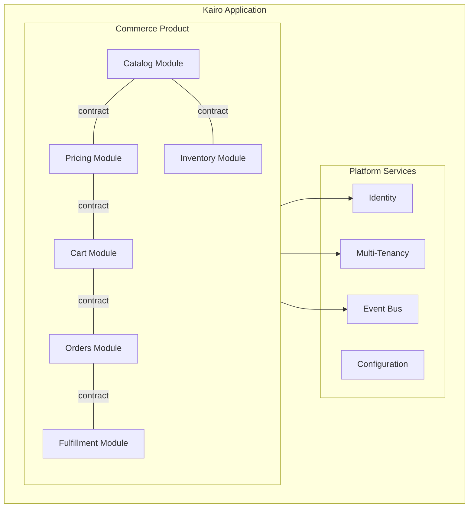
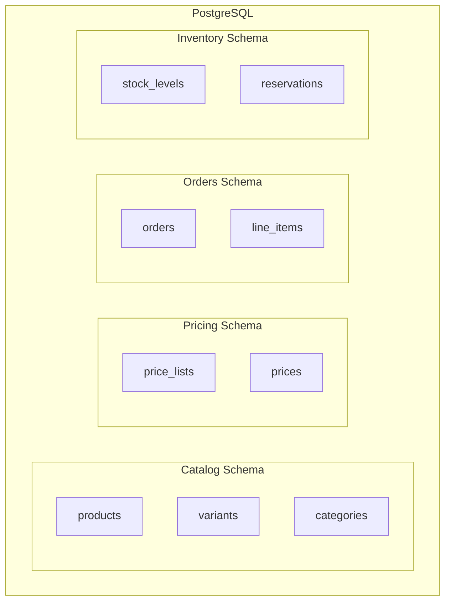
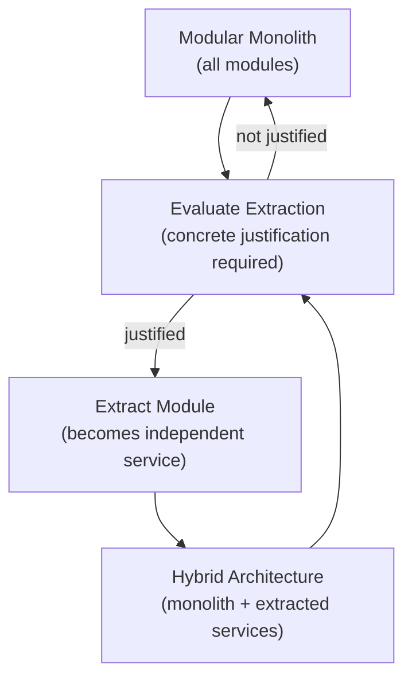
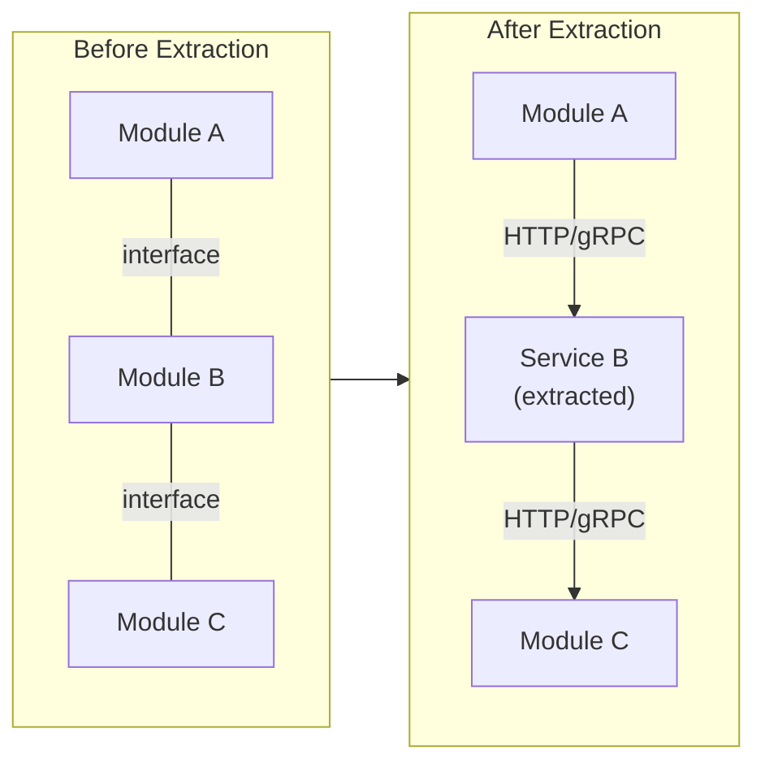

# Modular Monolith Strategy

## Metadata

| Field | Value |
|-------|-------|
| Title | Kairo Modular Monolith Strategy |
| Document ID | KAI-ARCH-005 |
| Status | Draft |
| Version | 0.1 |
| Target Release | N/A |
| Owner | Chief Software Architect |
| Created | 2026-07-15 |
| Last Updated | 2026-07-15 |
| Reviewers | TODO |
| Related Documents | [Architecture Overview](./Architecture-Overview.md), [Architecture Principles](./Architecture-Principles.md), [Technical Philosophy](../01-Foundation/Technical-Philosophy.md), [System Architecture](./System-Architecture.md) |
| Dependencies | None |

---

## Purpose

This document explains why Kairo begins as a modular monolith, what benefits this provides, what trade-offs it introduces, and how the platform will evolve toward service extraction when justified. It establishes the rules for when a module should become an independent service — and when it should not.

---

## Why Modular Monolith

Kairo is a new platform with an evolving domain. The boundaries between modules will shift as real customer usage reveals which abstractions are correct. Starting with microservices would lock in those boundaries before they are proven, creating distributed coupling — the most expensive form of technical debt.

A modular monolith provides the structural discipline of service-oriented architecture without the operational complexity of distributed systems. Module boundaries are enforced through code architecture, not infrastructure.

The modules within the monolith communicate through the same contracts they would use as independent services. The difference is deployment: they run in the same process and share the same deployment boundary.

---

## Benefits

### Faster Development

A single deployable unit eliminates the overhead of managing service-to-service communication, distributed debugging, and multi-service deployment coordination during the critical early phase of platform development.

### Simpler Operations

One application to deploy, monitor, and troubleshoot. No service mesh, no inter-service latency, no distributed transaction complexity. The operational burden scales with customer load, not with the number of services.

### Domain Discovery

Module boundaries can be adjusted with a refactor rather than a service migration. When real usage reveals that a boundary is wrong — and it will — the cost of correction is hours, not weeks.

### Reliable Cross-Module Communication

In-process communication between modules is fast, reliable, and transactionally consistent when needed. There is no network latency, no serialization overhead, and no partial failure between modules.

### Consistent Developer Experience

Developers work in a single codebase with a single build, a single test suite, and a single debug session. Understanding the system does not require running multiple services locally.

### Lower Infrastructure Cost

A single application requires less infrastructure than a distributed system. No service discovery, no API gateway between services, no per-service monitoring configuration.

---

## Trade-offs

### Scaling Granularity

The entire application scales as a unit. If one module needs more capacity, all modules scale with it. This is acceptable while the system is small but becomes inefficient as specific modules handle disproportionate load.

### Deployment Coupling

All modules deploy together. A change to one module requires redeploying the entire application. This is acceptable with a small team but creates coordination overhead as the team grows.

### Technology Uniformity

All modules share the same runtime, language, and framework. A module that would benefit from a different technology stack cannot adopt one without extraction.

### Blast Radius

A critical bug in one module can affect the entire application. Process-level isolation between modules does not exist in a monolith.

### Team Independence

As the team grows, multiple developers working on different modules may create merge conflicts, build contention, and release coordination overhead within a single codebase.

---

## Monolith Architecture Rules

To ensure the monolith remains modular and extraction-ready:

### Module Isolation

```mermaid
graph LR
    subgraph Correct["Correct: Contract-Based Communication"]
        A1["Module A"] -->|"interface call"| B1["Module B"]
    end

    subgraph Wrong["Wrong: Direct Data Access"]
        A2["Module A"] -->|"database query"| DB2["Module B's Tables"]
    end

    style Wrong fill:#3b1010,stroke:#ef4444
    style Correct fill:#0a2f1e,stroke:#22c55e
```

- **Each module owns its data.** No module reads or writes another module's database tables. Data access across modules uses the owning module's public interface.
- **Modules communicate through defined contracts.** Interfaces, not concrete implementations. A module depends on another module's contract, never its internals.
- **No shared mutable state.** Modules do not share in-memory state, static variables, or singleton instances that hold domain data.
- **Events for notifications, interfaces for queries.** When Module A needs to inform Module B of a state change, it publishes an event. When Module A needs data from Module B, it calls Module B's query interface.
- **Independent test suites.** Each module can be tested in isolation by substituting its dependencies with test implementations of the contracts.

### Data Separation

Each module has its own logical data boundary within the shared database:

- Each module's tables are logically grouped (separate schemas or naming conventions).
- Cross-schema joins are prohibited. If a module needs data from another module, it uses the public interface.
- Foreign keys across module boundaries reference IDs only. No cross-module referential integrity constraints in the database.

---

## Service Extraction Strategy

Service extraction is not a goal. It is a tool used when specific conditions justify the operational cost. The modular monolith is the default. Extraction is the exception.

### Extraction Path

### When Modules SHOULD Become Services

A module should be extracted into an independent service only when one or more of these conditions are met and documented in an ADR:

| Condition | Example |
|-----------|---------|
| **Independent scaling requirement** | The Catalog module handles 100x the read traffic of all other modules combined. Scaling the entire application for Catalog's load wastes resources on other modules. |
| **Independent deployment requirement** | The Payments module must be updated multiple times per week for provider integrations while Commerce releases monthly. Coupling their deployments creates unnecessary risk. |
| **Fault isolation requirement** | A failure in the AI Intelligence module must not affect Commerce order processing. Process-level isolation is required. |
| **Organizational autonomy** | A dedicated Payments team operates on a different cadence and release process. They need their own deployment pipeline and ownership boundary. |
| **Technology divergence** | The Intelligence module requires a Python-based ML runtime that cannot run in the .NET process. |
| **Compliance boundary** | The Payments module handles PCI-scoped data that must be isolated in a separate compliance boundary from the rest of the application. |

### When Modules Should NOT Become Services

A module should remain in the monolith when:

| Condition | Reasoning |
|-----------|-----------|
| **"It feels like a microservice"** | Intuition is not justification. Extraction requires concrete, measurable need. |
| **Anticipating future scale** | Extract when scale demands it, not when it might. Premature extraction creates premature operational complexity. |
| **Team preference** | Developer preference for separate repositories or independent builds does not justify the operational cost of distribution. |
| **Following industry trends** | Microservices are a solution to specific problems, not a default architecture. |
| **The module is small** | Small modules benefit most from the monolith's simplicity. Extracting a small module creates disproportionate operational overhead. |
| **Tight transactional coupling** | If two modules frequently need transactional consistency, they should not be separated by a network boundary. |
| **Domain boundaries are unstable** | If the module's boundary is still being refined, extraction locks in a potentially wrong boundary at high cost. |

---

## Extraction Process

When extraction is justified:

1. **Record the decision.** Create an ADR documenting the justification, alternatives considered, and expected outcome.
2. **Verify contract completeness.** The module's public contract (interfaces, events, queries) must be complete and stable. If the contract is insufficient, improve it within the monolith first.
3. **Extract the module.** Move the module's code, data, and tests into an independent deployable unit.
4. **Replace in-process communication with network communication.** Interface calls become API calls. In-process events become message broker events. This should require minimal code changes if the monolith rules were followed.
5. **Establish independent operations.** The extracted service gets its own deployment pipeline, monitoring, alerting, and scaling configuration.
6. **Validate.** Run the full test suite. Validate that all consumers of the extracted module's contracts function correctly.
7. **Monitor.** Track the operational impact of the extraction. Measure whether the expected benefit is realized.

---

## Architecture Impact

| Concern | Monolith Impact | Post-Extraction Impact |
|---------|----------------|----------------------|
| Deployment | Single deployment. Simple. | Multiple deployments. Requires coordination for breaking changes. |
| Communication | In-process. Fast and reliable. | Network. Latency, serialization, partial failure. |
| Transactions | Local transactions across modules are possible. | Distributed transactions are avoided. Eventual consistency between services. |
| Debugging | Single process. Stack traces cross module boundaries. | Distributed tracing required. Correlation IDs are essential. |
| Testing | Single test suite. Integration tests are straightforward. | Cross-service integration tests. Contract testing between services. |
| Scaling | Entire application scales together. | Each service scales independently. |
| Failure | One process. A crash affects all modules. | Isolated processes. A crash in one service does not affect others. |

---

## Version Gate

| Version | Architecture State |
|---------|-------------------|
| V1 | Pure modular monolith. All Commerce modules and platform services deploy as a single application. Module boundaries are enforced through code structure. |
| V2 | Monolith with async boundary separation. Event processing and webhook delivery operate independently. Module contracts are stable and extraction-ready. |
| V3 | Selective extraction evaluated. Payments or Identity may be extracted if scaling, compliance, or organizational conditions justify it. The decision is driven by data, not assumption. |
| Future | Hybrid architecture. Core Commerce may remain a monolith. Extracted services operate independently. The platform supports both patterns. |

---

## Future Considerations

- **Strangler fig pattern** — Future products (Payments, POS, ERP) may start as independent services from day one if their domain boundaries are clear and their operational requirements differ significantly from Commerce.
- **Shared libraries vs. shared services** — Cross-cutting code shared between a monolith and extracted services will need to be packaged as libraries rather than accessed through in-process references.
- **API gateway evolution** — As services are extracted, the API gateway's role expands from routing to a single application to routing across multiple services.
- **Event broker upgrade** — High-throughput event scenarios may justify migrating from RabbitMQ to Kafka for specific event streams.
- **Data migration** — Extracting a module includes migrating its data to an independent database. This requires careful planning to avoid downtime and data inconsistency.

The modular monolith is not a compromise. It is the correct architecture for Kairo's current stage. It will evolve when the platform's growth creates concrete reasons to evolve it — and not before.

---

## Change History

| Version | Date | Author | Description |
|---------|------|--------|-------------|
| 0.1 | 2026-07-15 | Chief Software Architect | Initial draft |
