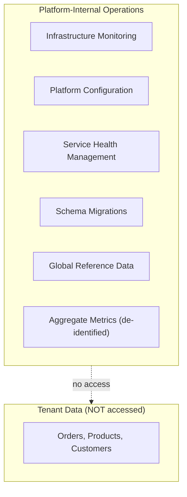
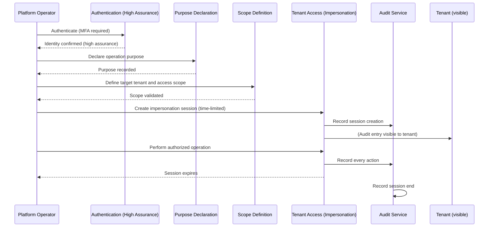

# Cross-Tenant Operations

## Metadata

| Field | Value |
|-------|-------|
| Title | Kairo Cross-Tenant Operation Controls |
| Document ID | KAI-TEN-009 |
| Status | Draft |
| Version | 0.1 |
| Target Release | V1 |
| Owner | Privileged Operations and Cross-Tenant Security Architect |
| Created | 2026-07-20 |
| Last Updated | 2026-07-20 |
| Reviewers | TODO |
| Related Documents | [Tenant-Aware Authorization](./Tenant-Aware-Authorization.md), [Tenant Isolation](./Tenant-Isolation.md), [Audit and Security Monitoring](../Security/Audit-and-Security-Monitoring.md), [Incident Response](../Security/Incident-Response.md), [Data Protection](../Security/Data-Protection.md), [Authorization Architecture](../Security/Authorization-Architecture.md), [Tenant Lifecycle](./Tenant-Lifecycle.md) |
| Dependencies | [Tenant-Aware Authorization](./Tenant-Aware-Authorization.md), [Tenant Isolation](./Tenant-Isolation.md) |

---

## Purpose

This document defines when operations that cross tenant boundaries are allowed, when they are restricted, and when they are prohibited. It establishes the safeguards required for any operation that operates outside a single tenant's boundary.

Cross-tenant operations are inherently dangerous. The platform's fundamental security promise is tenant isolation. Any operation that crosses that boundary — even with legitimate purpose — must be tightly controlled, minimally scoped, and fully audited.

This document ensures that legitimate platform operations (support, security investigation, analytics) are possible without creating backdoors that undermine isolation.

---

## Scope

This document covers:

- Classification of cross-tenant operation types.
- Authorization and safeguard requirements for each classification.
- Aggregate analytics governance.
- Future scenarios (marketplace, migration, merge/split).
- Explicit prohibitions.

This document does not cover:

- Operational scripts or database queries for executing cross-tenant operations.
- Specific tooling for platform administration.
- Incident response procedures (defined in [Incident Response](../Security/Incident-Response.md)).
- Multi-tenant authorization model (defined in [Tenant-Aware Authorization](./Tenant-Aware-Authorization.md)).

---

## Operation Classifications

| Classification | Definition | Authorization Level |
|---------------|-----------|-------------------|
| **Prohibited** | Never permitted under any circumstance. No exception mechanism exists. | N/A — architecturally prevented |
| **Platform-internal** | Operates on platform-owned (non-tenant) data. Does not access tenant business data. | Platform team authorization |
| **Explicitly authorized** | Accesses tenant data for a defined, legitimate purpose with full safeguards. | Defined authorization + audit |
| **Approval-required** | Requires explicit approval from a second authorized person before execution. | Dual authorization + audit |
| **Break-glass** | Emergency access that bypasses normal approval processes under extraordinary circumstances. | Emergency authorization + immediate alert + mandatory review |
| **Future-only** | Not supported in V1. Architecturally identified for future capability. | Not available |

---

## Cross-Tenant Scenarios

### Scenario Classification Table

| Scenario | Classification | V1 Status | Justification |
|----------|:-------------:|:---------:|--------------|
| Ordinary tenant API operations | Prohibited (cross-tenant) | Enforced | Normal operations are single-tenant by architecture |
| Platform infrastructure monitoring | Platform-internal | Available | Operates on platform metrics, not tenant data |
| Platform configuration management | Platform-internal | Available | Manages platform defaults, not tenant overrides |
| Customer support (view tenant data) | Explicitly authorized | Available | Impersonation with safeguards |
| Customer support (modify tenant data) | Approval-required | Available | Write access requires additional authorization |
| Security investigation | Explicitly authorized | Available | Scoped investigation with audit trail |
| Compliance investigation | Explicitly authorized | Available | Scoped to specific compliance need |
| Aggregate platform analytics | Platform-internal (de-identified) | Available | Anonymized aggregates only |
| Global reference data management | Platform-internal | Available | Non-tenant data (platform defaults, templates) |
| Shared service operations | Platform-internal | Available | Operating platform services, not tenant data |
| Bulk platform maintenance (schema migration) | Platform-internal | Available | Operates on infrastructure, not tenant business logic |
| Incident response (view affected tenant data) | Explicitly authorized | Available | Scoped investigation per [Incident Response](../Security/Incident-Response.md) |
| Incident response (contain active breach) | Break-glass | Available | Emergency action with immediate review |
| Data correction (fix corrupt tenant data) | Approval-required | Available | Requires dual authorization and verification |
| Abuse prevention (investigate suspicious tenant) | Explicitly authorized | Available | Scoped investigation with purpose documentation |
| Tenant migration (between regions/infrastructure) | Future-only | Not available | Requires migration architecture |
| Tenant merge (combine two organizations) | Future-only | Not available | Requires merge architecture |
| Tenant split (divide one organization) | Future-only | Not available | Requires split architecture |
| Marketplace cross-org operations | Future-only | Not available | Requires marketplace architecture |
| Cross-tenant benchmarking/comparison | Future-only | Not available | Requires governance framework |

---

## Prohibited Operations

The following operations are architecturally prevented. No authorization, approval, or emergency can enable them through the platform's standard interfaces.

| Operation | Why Prohibited |
|-----------|---------------|
| **Casual cross-tenant browsing** | No legitimate purpose justifies exploring another tenant's data without a defined operation. |
| **Unlogged support access** | Every access to tenant data must be audited. Access without audit is invisible and unaccountable. |
| **Broad production queries without purpose** | Querying across tenants "to see what's there" has no defined scope or justification. |
| **Cross-tenant writes through ordinary tenant APIs** | Normal APIs operate within a single tenant. Cross-tenant writes require dedicated, controlled mechanisms. |
| **Using analytics requirements to justify unrestricted operational access** | Analytics uses aggregated/de-identified data. It does not require accessing individual tenant data directly. |
| **Permanent support impersonation** | Support access is session-based and time-limited. Standing access creates unacceptable insider risk. |
| **Silent resource movement between tenants** | Moving data between tenants without explicit authorization and audit from both parties is a data integrity and ownership violation. |

### Enforcement

Prohibited operations are enforced architecturally:

- Tenant isolation at the data layer prevents cross-tenant queries through normal APIs.
- Audit logging makes unlogged access impossible through defined access paths.
- Support impersonation sessions expire automatically. No mechanism extends them indefinitely.
- Resource movement requires explicit lifecycle operations, not standard CRUD APIs.

---

## Platform-Internal Operations

Operations on platform-owned resources that do not access tenant business data.

| Safeguard | Requirement |
|-----------|-------------|
| Authentication | Platform team credentials (separate from tenant credentials) |
| Authorization | Platform administration role |
| Scope | Platform-owned resources only |
| Audit | Logged as platform operations |
| Tenant impact | None — does not access or modify tenant data |

---

## Explicitly Authorized Operations

Operations that access a specific tenant's data for a defined purpose with full safeguards.

### Authorization Flow

### Explicitly Authorized Scenarios

| Scenario | Scope | Duration | Default Access | Audit |
|----------|-------|----------|:-------------:|:-----:|
| Customer support investigation | One tenant. Defined issue. | Session (minutes to hours) | Read-only | Full |
| Security investigation | One or more tenants (as needed). Defined threat. | Case duration. | Read-only | Full |
| Compliance investigation | One tenant. Defined requirement. | Case duration. | Read-only | Full |
| Abuse prevention | One tenant. Suspicious activity. | Investigation duration. | Read-only | Full |
| Incident response (investigation) | Affected tenants. Defined incident. | Incident duration. | Read-only | Full |

---

## Approval-Required Operations

Operations that require explicit approval from a second authorized person before execution.

| Scenario | Approver | Purpose | Audit |
|----------|----------|---------|:-----:|
| Support write access to tenant data | Security lead or engineering leadership | Fix an issue that cannot be resolved through normal tenant APIs | Full (including approval record) |
| Data correction (tenant data repair) | Engineering leadership | Correct data corrupted by a platform bug | Full (including before/after state) |
| Credential rotation on behalf of tenant | Security lead | Emergency rotation during incident response | Full |
| Tenant suspension (for cause) | Engineering leadership or founder | Suspend for policy violation or abuse | Full |

### Approval Rules

- Approval is recorded in the audit trail with the approver's identity.
- The requesting operator and the approver must be different people.
- Approval is scoped to the specific operation. It does not grant broad access.
- Approval expires if not acted upon within a defined window.
- Post-operation review validates that the operation matched its approval scope.

---

## Break-Glass Operations

Emergency access that bypasses normal approval processes under extraordinary circumstances.

| Scenario | When Justified | Safeguards |
|----------|---------------|-----------|
| Incident containment (active breach) | Cross-tenant data exposure is actively occurring and must be stopped immediately | Immediate alert to all stakeholders. Mandatory post-incident review. Full audit. |
| Emergency credential revocation | Compromised credential with active exploitation | Immediate action. Alert. Review within hours. |
| Platform-wide emergency (infrastructure compromise) | The platform itself is under attack and immediate action prevents further damage | Maximum alerting. Full audit. Immediate post-incident review. |

### Break-Glass Rules

- Break-glass is never the first option. Standard and approval-required paths are attempted first.
- Break-glass access triggers immediate alerts to security leadership and engineering leadership.
- Every action during break-glass is logged with maximum detail.
- Break-glass sessions are reviewed within 24 hours of the triggering event.
- Break-glass access is revoked immediately when the emergency is resolved.
- Break-glass cannot be used to avoid normal approval processes for non-emergency operations.
- Post-incident review evaluates whether break-glass was justified and whether normal processes should be improved.

---

## Future-Only Operations

Operations that are identified as potentially necessary but not supported in V1.

| Operation | Architectural Requirement | V1 Status |
|-----------|--------------------------|:---------:|
| Tenant migration (region to region) | Data migration with zero-downtime cutover. Both regions involved. | Not available |
| Tenant merge (combine organizations) | Complex data reconciliation. Ownership transfer. Requires governance. | Not available |
| Tenant split (divide organization) | Data partitioning. New boundary creation. Requires governance. | Not available |
| Marketplace cross-org visibility | Controlled data sharing between organizations (seller catalog visible to marketplace). | Not available |
| Cross-tenant benchmarking | Anonymized comparison of tenant metrics. Requires explicit opt-in governance. | Not available |

### Future Operation Rules

- Each future operation requires its own ADR before implementation.
- Future operations do not justify present-day cross-tenant access.
- The V1 architecture must not preclude these operations but does not implement them.
- When implemented, each operation must satisfy the safeguards defined in this document.

---

## Safeguards

Every cross-tenant operation (excluding prohibited) must satisfy applicable safeguards:

| # | Safeguard | Applies To | Description |
|---|-----------|-----------|-------------|
| 1 | **Explicit operation purpose** | All | The reason for the cross-tenant operation is documented before it begins. |
| 2 | **Privileged identity** | All | The operator is authenticated as a defined privileged identity (platform admin, support, security). |
| 3 | **Strong authentication** | All | High-assurance authentication (MFA verified recently). |
| 4 | **Least privilege** | All | Access granted is the minimum necessary for the stated purpose. |
| 5 | **Time-bound access** | Explicitly authorized, Approval-required, Break-glass | Access expires automatically. No indefinite cross-tenant access. |
| 6 | **Tenant targeting** | Explicitly authorized, Approval-required | The specific tenant(s) affected are identified before access begins. |
| 7 | **Approval where required** | Approval-required | A second authorized person approves before the operation executes. |
| 8 | **Read versus write separation** | Explicitly authorized, Approval-required | Read access is the default. Write access requires additional justification and authorization. |
| 9 | **Audit records** | All | Every action is logged with full context (operator, tenant, action, resource, timestamp). |
| 10 | **Customer visibility where appropriate** | Explicitly authorized, Approval-required | The affected tenant can see (through their audit trail) that access occurred. |
| 11 | **Data minimization** | All accessing tenant data | Access only the data needed for the stated purpose. Do not browse or explore. |
| 12 | **Export restrictions** | All | Data accessed during cross-tenant operations is not exported to uncontrolled destinations. |
| 13 | **Monitoring and alerts** | All | Cross-tenant access patterns are monitored. Unusual patterns trigger alerts. |
| 14 | **Revocation** | All | Access can be revoked immediately at any time. |
| 15 | **Post-operation review** | Approval-required, Break-glass | After the operation, a review validates that actions matched the stated purpose and scope. |

### Safeguard Applicability Matrix

| Safeguard | Platform-Internal | Explicitly Authorized | Approval-Required | Break-Glass |
|-----------|:-:|:-:|:-:|:-:|
| Explicit purpose | — | Yes | Yes | Yes (documented post-hoc if immediate) |
| Privileged identity | Yes | Yes | Yes | Yes |
| Strong authentication | Yes | Yes | Yes | Yes |
| Least privilege | Yes | Yes | Yes | Yes (maximum during emergency, reviewed after) |
| Time-bound | — | Yes | Yes | Yes |
| Tenant targeting | — | Yes | Yes | Yes (as specific as possible during emergency) |
| Approval | — | — | Yes | Post-hoc (emergency justification) |
| Read/write separation | — | Yes (read default) | Yes (write explicit) | Write permitted during emergency |
| Audit | Yes | Yes | Yes | Yes (maximum detail) |
| Customer visibility | — | Yes | Yes | Yes (after incident resolution) |
| Data minimization | — | Yes | Yes | Best effort during emergency |
| Export restrictions | — | Yes | Yes | Yes |
| Monitoring/alerts | Yes | Yes | Yes | Immediate alert on trigger |
| Revocation | — | Yes | Yes | Yes |
| Post-operation review | — | — | Yes | Yes (mandatory within 24h) |

---

## Aggregate Analytics Governance

Platform-level analytics presents a special challenge: the platform needs to understand usage patterns, but analytics must not become an authorization bypass for accessing individual tenant data.

### Principles

- **Prefer aggregated or de-identified data where possible.** Platform analytics should work with counts, averages, distributions — not individual tenant records.
- **Platform analytics must not become an authorization bypass.** The need for "analytics" does not justify direct access to individual tenant business data.
- **Tenant-level reporting must remain isolated.** An organization's reports show only their data. Platform analytics do not feed into tenant-visible reports.
- **Any future benchmarking must require clear governance.** Comparing one tenant's metrics to another (even anonymized) requires explicit governance, opt-in, and defined rules.

### Analytics Access Model

| Analytics Type | Data Source | Tenant Data Access | Authorization |
|---------------|------------|-------------------|---------------|
| Platform health metrics | Infrastructure monitoring | None (platform-owned data) | Platform team |
| Aggregate usage statistics | Event counts, request counts | De-identified aggregates only | Platform team |
| Per-tenant operational metrics | Per-org request rates, error rates | Metrics only (not business data) | Platform team |
| Tenant business reporting | Tenant-owned business data | Single-tenant scoped | Tenant administrators |
| Cross-tenant comparison (future) | Anonymized tenant metrics | Anonymized, opt-in | Governance-defined |

### Analytics Rules

- Platform analytics infrastructure does not have direct access to tenant databases.
- Analytics pipelines consume events and metrics, not raw business data.
- Any analytics that requires individual tenant data operates through the impersonation flow with full safeguards.
- Per-tenant operational metrics (request count, error rate) are available to platform operators for operational purposes without impersonation (this is platform-owned operational data, not tenant business data).

---

## Explicit Prohibitions Summary

| Prohibition | Enforcement Mechanism |
|------------|----------------------|
| Casual cross-tenant browsing | No mechanism exists to browse across tenants. Impersonation is per-tenant, per-session. |
| Unlogged support access | Impersonation is architecturally audited. No access path bypasses audit. |
| Broad production queries without purpose | All cross-tenant access requires declared purpose before access is granted. |
| Cross-tenant writes through ordinary APIs | Normal APIs enforce single-tenant context. No API accepts cross-tenant write operations. |
| Analytics as access justification | Analytics uses aggregated/de-identified data. Individual data access requires separate authorization. |
| Permanent support impersonation | Sessions expire automatically. No extension mechanism for indefinite access. |
| Silent resource movement | No API moves resources between organizations silently. Any movement (future) requires explicit lifecycle operations. |

---

## V1 Baseline

| Capability | V1 Status |
|-----------|-----------|
| Prohibited operations architecturally enforced | Required |
| Support impersonation (time-limited, audited, read-only default) | Required |
| Support write access (approval-required) | Required |
| Break-glass for incident response | Required |
| Purpose declaration for cross-tenant access | Required |
| Full audit of all cross-tenant operations | Required |
| Customer-visible audit entries for support access | Required |
| Automatic session expiration | Required |
| Platform-internal operations separated from tenant data | Required |
| Aggregate analytics without tenant data access | Required |
| Monitoring for cross-tenant access patterns | Required |
| Post-operation review for approval-required and break-glass | Required |

## Future Capabilities

| Capability | Target Version | Description |
|-----------|---------------|-------------|
| Tenant migration (region-to-region) | V2+ | Controlled movement of tenant data between infrastructure |
| Tenant merge | V3+ | Combining two organizations into one with data reconciliation |
| Tenant split | V3+ | Dividing one organization into multiple |
| Marketplace cross-org operations | V3+ | Controlled visibility between organizations for marketplace scenarios |
| Cross-tenant benchmarking (opt-in) | Future | Anonymized comparison with explicit governance |
| Automated approval workflows | V2+ | Systematic dual-authorization with workflow tracking |
| Cross-tenant investigation tooling | V2+ | Purpose-built tools for security investigations spanning tenants |

---

## Version Gate

| Version | Cross-Tenant Operations Gate |
|---------|----------------------------|
| V1 | All prohibited operations are enforced architecturally. Support access uses impersonation with full safeguards. Break-glass is available with immediate alerting. All access is audited. Customer visibility is operational. Aggregate analytics does not access tenant business data. |
| V2 | Automated approval workflows for approval-required operations. Purpose-built investigation tooling. Tenant migration is architecturally defined (if triggered). |
| V3 | Marketplace cross-org operations are available (if triggered). Tenant merge/split operations are architecturally defined (if triggered). Cross-tenant benchmarking governance is established (if triggered). |

---

## Decision Summary

| Decision | Rationale |
|----------|-----------|
| Cross-tenant operations are classified, not blanket-permitted or blanket-denied | Some cross-tenant operations are legitimate (support, incident response). Classification ensures each has appropriate controls without blocking necessary work. |
| Prohibited operations are enforced architecturally | Architecture provides stronger enforcement than policy. If it's architecturally impossible, no policy violation can circumvent it. |
| Analytics uses aggregated data, not direct tenant access | Direct access creates a broad authorization bypass. Aggregation serves analytics needs without violating isolation. |
| Break-glass exists but is heavily safeguarded | Emergencies happen. Denying all access during a breach makes the platform unable to protect tenants. But break-glass must be the exception, not a convenience. |
| Approval-required for writes | Reading tenant data for support is one risk level. Writing to tenant data is a higher risk that requires dual authorization. |
| Customer visibility for access to their data | Transparency builds trust. Tenants should know when their data was accessed by platform staff. |
| Future operations require their own ADR | Each future cross-tenant capability introduces unique risks. Generic approval is insufficient. |

---

## Alternatives Considered

| Alternative | Rejected Because |
|------------|-----------------|
| No cross-tenant access ever (pure isolation) | Support and incident response become impossible. The platform cannot help tenants or protect them from breaches. |
| Broad platform admin access to all tenants | Violates least privilege. Creates maximum insider risk. Provides no accountability for specific operations. |
| Self-service cross-tenant access with audit | Audit detects but does not prevent. Access control must be proactive (prevent unauthorized access) not just detective (log it after the fact). |
| Analytics pipeline with direct tenant DB access | Creates a parallel access path that bypasses all tenant authorization. One misconfiguration exposes all tenant data. |
| Permanent support accounts per tenant | Creates standing access that accumulates over time. Session-based access limits exposure. |

---

## Trade-offs

| Trade-off | Accepted Because |
|-----------|-----------------|
| Support resolution may be slower (impersonation overhead) | Security of tenant data is more important than support speed. The overhead is seconds, not hours. |
| Break-glass review adds post-incident work | Accountability after emergency access is non-negotiable. The review cost is justified by the trust it maintains. |
| Analytics cannot answer some individual-tenant questions | Individual-tenant analysis requires impersonation (authorized, scoped, audited). This is by design, not a limitation. |
| Approval-required operations add coordination cost | Write access to tenant data is high-risk. The coordination cost of dual authorization is justified by the damage prevention it provides. |
| Future operations are not available in V1 | Migration, merge, and split are complex. Building them without mature architecture creates more risk than deferring them. |

---

## Architecture Impact

| Concern | Impact |
|---------|--------|
| API gateway | Must prevent cross-tenant requests through normal APIs. Must support impersonation sessions with enforcement. |
| Authorization pipeline | Must evaluate cross-tenant access through a separate authorization path (not normal tenant authorization). |
| Audit service | Must capture full context for all cross-tenant operations. Must make tenant-visible entries where required. |
| Monitoring | Must detect and alert on cross-tenant access patterns. Must distinguish legitimate from anomalous. |
| Impersonation service | Must enforce time limits, default read-only, and session expiration. Must support approval workflows (V2+). |
| Analytics infrastructure | Must operate on aggregated/de-identified data. Must not have direct tenant database access. |
| Module design | Must not provide APIs that enable cross-tenant operations through normal request paths. |

---

## Implementation Impact

| Area | Impact |
|------|--------|
| Platform services | Must implement impersonation with safeguards. Must implement break-glass with alerting. Must implement approval workflows (V2+). |
| APIs | Must reject any request that would result in cross-tenant data access through normal paths. |
| Analytics | Must consume events/metrics, not query tenant databases directly. Must aggregate before exposing. |
| Audit | Must support dual-entry (operator audit + tenant-visible audit) for cross-tenant access. |
| Monitoring | Must alert on impersonation sessions, break-glass triggers, and unusual cross-tenant patterns. |
| Testing | Must verify that normal APIs cannot be used for cross-tenant access. Must verify impersonation safeguards. |

---

## Security Responsibilities

| Role | Cross-Tenant Responsibilities |
|------|------------------------------|
| Cross-Tenant Security Architect | Defines cross-tenant operation controls. Reviews changes to cross-tenant access mechanisms. |
| Platform Team | Implements impersonation, approval workflows, break-glass mechanisms, and architectural enforcement. |
| Security Lead | Approves approval-required operations. Reviews break-glass usage. Monitors patterns. |
| Engineering Leadership | Approves data corrections and suspensions. Provides break-glass authorization during emergencies. |
| Operations | Executes platform-internal operations. Participates in incident response. |
| Support Personnel | Uses impersonation with purpose declaration. Requests approval for write access. |

---

## Out of Scope

This document does not define:

- Operational scripts for cross-tenant data operations — defined in operational documentation.
- Specific tooling for impersonation or break-glass — evaluated during implementation.
- Incident response procedures — defined in [Incident Response](../Security/Incident-Response.md).
- Marketplace architecture — defined when marketplace model enters planning.
- Tenant migration procedures — defined when migration capability enters planning.
- Billing or financial operations between tenants — business concern.

---

## Future Considerations

- **Cross-tenant operation tooling** — Purpose-built tools with safeguards built in (rather than direct database access).
- **Approval workflow automation** — Systematic tracking of approval requests, grants, and expirations.
- **Cross-tenant access analytics** — Pattern analysis of cross-tenant operations for risk and efficiency insights.
- **Tenant consent for data use** — Formal consent mechanism for operations that use tenant data beyond core service delivery.
- **Marketplace access framework** — Controlled, mutual-consent data visibility between organizations in a marketplace model.
- **Audit report for tenants** — Self-service report showing all platform access to their data over a defined period.

---

## Future Refactoring Triggers

This document should be revisited when:

- Marketplace model is introduced (requires cross-org data visibility architecture).
- Tenant migration is implemented (requires cross-infrastructure operation controls).
- Tenant merge/split is implemented (requires complex cross-tenant data operations).
- A cross-tenant access incident occurs (validate controls, strengthen safeguards).
- Analytics requirements grow beyond current aggregation (evaluate governance model).
- Support volume requires more efficient access patterns (evaluate tooling without weakening controls).
- Regulatory requirements impose specific cross-tenant access limitations.

---

## Change History

| Version | Date | Author | Description |
|---------|------|--------|-------------|
| 0.1 | 2026-07-20 | Privileged Operations and Cross-Tenant Security Architect | Initial draft |
