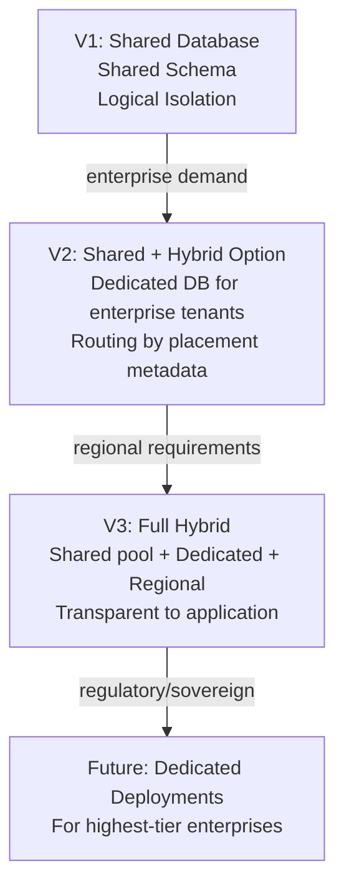

# Data Isolation Strategy

## Metadata

| Field | Value |
|-------|-------|
| Title | Kairo Tenant Data Isolation Strategy |
| Document ID | KAI-TEN-005 |
| Status | Draft |
| Version | 0.1 |
| Target Release | V1 |
| Owner | Multi-Tenant Data Architecture Strategist |
| Created | 2026-07-20 |
| Last Updated | 2026-07-20 |
| Reviewers | TODO |
| Related Documents | [Multi-Tenancy Architecture](./Multi-Tenancy-Architecture.md), [Tenant Isolation](./Tenant-Isolation.md), [Tenant Hierarchy](./Tenant-Hierarchy.md), [Monolith Strategy](../Monolith-Strategy.md), [Data Protection](../Security/Data-Protection.md), [Technology Stack](../Technology-Stack.md) |
| Dependencies | [Multi-Tenancy Architecture](./Multi-Tenancy-Architecture.md), [Tenant Isolation](./Tenant-Isolation.md), [Monolith Strategy](../Monolith-Strategy.md) |

---

## Purpose

This document evaluates data isolation strategies for multi-tenant platforms, selects the V1 approach, and defines the architectural requirements that apply regardless of physical storage model. It ensures that the logical isolation model is decisive while the physical model remains evolvable.

**Logical isolation** defines the rules: who owns data, how it is scoped, and what prevents cross-tenant access. **Physical isolation** defines the mechanism: how storage is organized to enforce those rules. This document addresses both but keeps them clearly separate.

---

## Scope

This document covers:

- Evaluation of common multi-tenant data storage models.
- V1 recommendation aligned with platform strategy.
- Architectural requirements that apply regardless of physical model.
- Future evolution path from shared to dedicated models.

This document does not cover:

- Database table schemas or column definitions.
- ORM configuration or query code.
- Specific database product features (RLS policies, schema grants).
- Cloud-provider-specific storage configuration.

---

## Storage Model Evaluation

### Model 1: Shared Database, Shared Schema

All tenants share one database and one set of tables. Tenant ownership is identified by a tenant identifier column on every row.

| Attribute | Assessment |
|-----------|-----------|
| Isolation strength | Logical (enforced by query filtering and authorization). No physical boundary between tenants. |
| Operational complexity | Low. Single database to manage, monitor, and back up. |
| Cost profile | Lowest. One database serves all tenants. Cost scales with total data volume, not tenant count. |
| Scalability | Scales with total platform data. Single database has capacity limits. Vertical scaling first, sharding later. |
| Migration complexity | Lowest. One schema to migrate. All tenants migrate simultaneously. |
| Backup and restore | Single backup covers all tenants. Per-tenant restore is complex (must extract tenant's data from shared backup). |
| Reporting | Cross-tenant reporting is trivial (all data is co-located). Per-tenant reporting requires filtering. |
| Data residency | Difficult. All tenants in one database are in one region. Regional placement requires separate databases. |
| Developer experience | Simplest. One connection, one schema, standard queries with tenant filter. |
| V1 suitability | **High.** Aligns with modular monolith, early-stage simplicity, and cost efficiency. |
| Enterprise suitability | Limited for regulated enterprises requiring physical isolation. Sufficient for most mid-market customers. |

---

### Model 2: Shared Database, Separate Schemas

All tenants share one database, but each tenant has its own schema (namespace). Tables are duplicated per schema.

| Attribute | Assessment |
|-----------|-----------|
| Isolation strength | Moderate physical isolation within one database. Schema-level access control provides an additional boundary. |
| Operational complexity | Moderate. Schema management per tenant. Migrations must run per schema. Monitoring per schema. |
| Cost profile | Moderate. One database, but schema proliferation adds management overhead. Connection pooling is shared. |
| Scalability | Limited by database capacity. Schema count has practical limits in most databases. |
| Migration complexity | High. Every schema must be migrated independently (or tooling must automate per-schema migration). |
| Backup and restore | Per-schema backup/restore is possible. More granular than shared schema. |
| Reporting | Cross-tenant reporting requires joining across schemas (complex). Per-tenant reporting is clean. |
| Data residency | Same limitation as shared database — all schemas in one region. |
| Developer experience | More complex. Queries must target the correct schema. Connection routing adds complexity. |
| V1 suitability | **Low.** Adds operational complexity without proportional benefit for V1 scale. |
| Enterprise suitability | Moderate. Provides some isolation guarantee but not full physical separation. |

---

### Model 3: Separate Database Per Tenant

Each tenant has its own database instance. Complete physical isolation.

| Attribute | Assessment |
|-----------|-----------|
| Isolation strength | Maximum. Physical separation. No data co-location. No query-level isolation failure possible. |
| Operational complexity | High. Each tenant is an independent database to provision, monitor, back up, and maintain. |
| Cost profile | Highest. Per-tenant infrastructure cost. Does not amortize across tenants. |
| Scalability | Excellent per-tenant (each database scales independently). Challenging at platform level (managing thousands of databases). |
| Migration complexity | High. Each database must be migrated independently. Coordination across many databases is complex. |
| Backup and restore | Excellent per-tenant. Clean backup/restore without affecting other tenants. |
| Reporting | Cross-tenant reporting requires federation across databases (expensive). Per-tenant reporting is clean. |
| Data residency | Excellent. Each database can be placed in the tenant's required region. |
| Developer experience | More complex. Connection management per tenant. Testing requires per-tenant database provisioning. |
| V1 suitability | **Very Low.** Disproportionate operational burden for early-stage platform with few tenants. |
| Enterprise suitability | **High.** Ideal for regulated enterprises requiring absolute physical isolation and regional placement. |

---

### Model 4: Hybrid Placement Model

Most tenants share a database (Model 1). High-value or regulated tenants are placed on dedicated databases (Model 3). The platform routes to the correct storage based on tenant placement metadata.

| Attribute | Assessment |
|-----------|-----------|
| Isolation strength | Configurable per tenant. Shared tenants get logical isolation. Dedicated tenants get physical isolation. |
| Operational complexity | High (once implemented). Must support both models simultaneously. Routing, migration, and monitoring span both. |
| Cost profile | Optimized. Small tenants share cost. Enterprise tenants pay for dedicated infrastructure. |
| Scalability | Excellent. Shared pool handles volume. Dedicated databases handle enterprise-specific scaling needs. |
| Migration complexity | High. Must support migration for both models. Tooling must handle routing. |
| Backup and restore | Optimal. Shared tenants get shared backup. Dedicated tenants get clean per-tenant backup. |
| Reporting | Complex for cross-model queries. Per-tenant reporting works within either model. |
| Data residency | Excellent for dedicated tenants. Shared tenants remain in the shared database's region. |
| Developer experience | Complex. Modules must be storage-model-agnostic. Data access layer hides placement. |
| V1 suitability | **Not for V1.** Hybrid routing adds premature complexity. V1 has one model. |
| Enterprise suitability | **Excellent.** The target end-state that serves both small and enterprise customers. |

---

### Model 5: Dedicated Enterprise Tenant Deployment

The entire platform (application + database + infrastructure) is deployed independently for a single tenant. Complete deployment isolation.

| Attribute | Assessment |
|-----------|-----------|
| Isolation strength | Maximum. Nothing is shared. Independent deployment boundary. |
| Operational complexity | Very high. Fully independent platform instance per tenant. Every operational concern is multiplied. |
| Cost profile | Very high. Full infrastructure per tenant. Only viable for highest-value enterprise contracts. |
| Scalability | Excellent per-tenant. Scaling is independent. |
| Migration complexity | High but independent. Each deployment is migrated on its own schedule. |
| Backup and restore | Excellent. Clean per-deployment backup and restore. |
| Reporting | Per-tenant only. No cross-tenant reporting possible (separate deployments). |
| Data residency | Excellent. Deployment is placed in any region. |
| Developer experience | Same as single-tenant development. No multi-tenancy complexity in application code. |
| V1 suitability | **Not for V1.** Massive operational overhead for a single platform. |
| Enterprise suitability | **Highest.** For the most demanding enterprise customers with unique regulatory or security requirements. |

---

## Decision Matrix

| Criterion | Model 1 (Shared) | Model 2 (Schema) | Model 3 (DB/Tenant) | Model 4 (Hybrid) | Model 5 (Dedicated) |
|-----------|:-:|:-:|:-:|:-:|:-:|
| V1 operational simplicity | ★★★ | ★★ | ★ | ★ | ★ |
| V1 cost efficiency | ★★★ | ★★ | ★ | ★★ | ★ |
| Logical isolation | ★★★ | ★★★ | ★★★ | ★★★ | ★★★ |
| Physical isolation | ★ | ★★ | ★★★ | ★★★ | ★★★ |
| Developer experience | ★★★ | ★★ | ★★ | ★★ | ★★★ |
| Migration simplicity | ★★★ | ★ | ★ | ★ | ★★ |
| Per-tenant backup/restore | ★ | ★★ | ★★★ | ★★★ | ★★★ |
| Data residency | ★ | ★ | ★★★ | ★★★ | ★★★ |
| Future enterprise readiness | ★ | ★★ | ★★★ | ★★★ | ★★★ |
| Modular monolith alignment | ★★★ | ★★ | ★ | ★★ | ★ |

★ = Low, ★★ = Moderate, ★★★ = High

---

## V1 Recommendation

### Recommended: Model 1 — Shared Database, Shared Schema

V1 uses a shared database with shared schema and mandatory tenant identifier on all tenant-owned data.

### Rationale

| Factor | Alignment |
|--------|-----------|
| **Modular monolith strategy** | Single database aligns with single deployment. No distributed database coordination needed. |
| **Early-stage operational simplicity** | One database to provision, monitor, back up, and migrate. Minimal operational burden for a small team. |
| **Strong tenant filtering** | The platform data access layer enforces mandatory tenant filters. Combined with authorization, this provides robust logical isolation. |
| **Explicit authorization** | Authorization layer validates tenant ownership independently of query filtering. Defence-in-depth. |
| **Cost efficiency** | One database serves all tenants. Infrastructure cost is proportional to total data, not tenant count. |
| **Future extraction capability** | The architecture does not preclude moving specific tenants to dedicated databases later. Tenant placement is a routing decision, not an application logic decision. |

### What V1 Does NOT Claim

- Shared database does not mean shared access. Isolation is enforced at the application layer through defence-in-depth.
- Shared schema does not mean weaker isolation than separate databases. Logical isolation with multiple enforcement layers is robust for V1 scale and risk profile.
- **Database row-level security alone does not solve tenant isolation.** RLS may be an implementation tool, but it is one layer among many. Authorization, context resolution, caching isolation, and event scoping are all independent enforcement layers.

---

## Rejected Options for V1

| Model | Rejection Reason |
|-------|-----------------|
| Shared database, separate schemas | Adds per-tenant schema management without proportional security benefit. Conflicts with single-migration simplicity. |
| Separate database per tenant | Disproportionate operational and cost burden for early stage. Zero tenants require physical isolation in V1. |
| Hybrid placement | Adds routing complexity before there is a validated need for dedicated placement. |
| Dedicated deployment | Multiplies all operational concerns. Not justified for V1 tenant profile. |

### Rejection Does Not Mean Exclusion

All rejected models remain architecturally feasible for future versions. The V1 architecture is designed so that transitioning to hybrid or dedicated models does not require rewriting application logic.

---

## Architectural Requirements (Model-Independent)

These requirements apply regardless of which physical storage model is used. They ensure that the logical isolation model is complete and that future model transitions do not require application logic changes.

### 1. Explicit Tenant Ownership

Every row of tenant-owned data has an explicit, non-nullable tenant identifier (organization ID). No tenant data exists without an owner.

### 2. Tenant-Aware Queries

Every query to tenant-owned data includes the tenant filter. The platform data access layer enforces this. Modules cannot issue unscoped queries.

### 3. Tenant-Safe Uniqueness

Uniqueness constraints that should be per-tenant (e.g., SKU uniqueness) are scoped to the tenant. A SKU "ABC-123" in Organization A does not conflict with "ABC-123" in Organization B.

### 4. Tenant-Safe Indexing

Indexes on tenant-owned data include the tenant identifier. Queries are efficient within a tenant without scanning other tenants' data.

### 5. Tenant-Aware Transactions

Transactions operate within a single tenant context. A transaction never spans tenant boundaries. Cross-tenant transactional operations do not exist.

### 6. Tenant-Aware Migrations

Schema migrations apply to all tenants simultaneously (shared schema model). Migrations must not corrupt or expose one tenant's data to another during execution.

### 7. Tenant-Safe Reporting

Aggregate queries and reports operate within a single tenant boundary. Platform-level aggregate reporting uses anonymized or aggregate data that does not expose individual tenant data.

### 8. Tenant-Safe Backup and Restore

Backup and restoration operations must not cross-contaminate tenants. Restoring data for one tenant must not overwrite, expose, or delete another tenant's data.

### 9. Tenant-Aware Deletion

Deleting a tenant's data (organization decommissioning) removes only that tenant's data. Other tenants are unaffected. Deletion is complete — no orphaned references remain.

### 10. Tenant-Aware Data Export

Export operations produce data for one tenant only. Export files contain only the requesting tenant's data.

### 11. Tenant Placement Metadata

The platform maintains metadata about where each tenant's data is stored. In V1, all tenants are in the shared database. In future versions, this metadata enables routing to different storage locations.

### 12. Future Tenant Movement

The architecture supports moving a tenant's data from shared to dedicated storage. This is a data migration operation, not an application code change. Modules are unaware of where a tenant's data physically resides.

### 13. Future Tenant Sharding

The architecture supports horizontal sharding of the shared database by tenant groups. Tenant placement metadata determines which shard serves each tenant. Application logic is shard-unaware.

### 14. Future Regional Placement

The architecture supports placing a tenant's data in a specific geographic region. This is a deployment and routing decision, not an application logic change.

### 15. Future Dedicated Deployment

The architecture supports deploying the platform independently for a specific tenant. The application code is unchanged — only infrastructure and routing differ.

---

## Logical vs. Physical Isolation

| Concern | Logical Isolation (V1) | Physical Isolation (Future) |
|---------|----------------------|---------------------------|
| Enforcement | Platform data access layer, authorization, caching, events | Same + dedicated storage boundary |
| Strength | Robust with defence-in-depth. Sufficient for V1 risk profile. | Maximum. No co-location of data. |
| Failure mode | Application bug could theoretically bypass filtering | Physical separation prevents access regardless of application bugs |
| Cost | Low. Shared infrastructure. | High. Dedicated infrastructure per tenant. |
| Operational complexity | Low. One system to manage. | High. Per-tenant systems to manage. |
| Regulatory suitability | Sufficient for most regulations when combined with encryption | Required for some high-security or sovereign-data regulations |
| Performance isolation | Shared capacity. Noisy-neighbor possible. | Dedicated capacity. Full performance isolation. |

### Key Distinction

Logical isolation defines the rules. Physical isolation provides an additional mechanism. V1 relies on logical isolation enforced through defence-in-depth. Future versions add physical isolation options for tenants whose requirements justify the cost and complexity.

---

## Conceptual Evolution

### Evolution Rules

- Each evolution step is triggered by validated business need, not by architectural ambition.
- Application logic does not change between evolution steps. Only infrastructure, routing, and placement metadata change.
- The platform data access layer abstracts storage location. Modules interact with a tenant-scoped interface regardless of physical model.
- Existing tenants on shared infrastructure are never disrupted by providing dedicated options to other tenants.

---

## Migration and Refactoring Triggers

| Trigger | Transition | Effort |
|---------|-----------|--------|
| Enterprise customer requires physical data isolation | V1 → V2 (add dedicated DB for that tenant) | Moderate: add connection routing, migrate tenant's data |
| Data residency regulation for a specific region | V1 → V2 (add regional database) | Moderate: add regional deployment, migrate affected tenants |
| Noisy-neighbor performance issues under scale | V1 → V2 (move high-volume tenant to dedicated DB) | Moderate: migrate tenant, add routing |
| Multiple enterprise tenants with isolation requirements | V2 → V3 (formalize hybrid model) | High: routing generalization, operational tooling |
| Sovereign data requirements with full deployment isolation | V3 → Future (dedicated deployment) | High: full deployment automation, independent lifecycle |
| Shared database reaches capacity limits | V1 → V2 (shard or add overflow database) | High: sharding strategy, data distribution |

---

## Version Gate

| Version | Data Isolation Gate |
|---------|-------------------|
| V1 | Shared database with shared schema operational. Tenant filter on all tenant data (mandatory, platform-enforced). Defence-in-depth isolation layers active. Tenant-safe uniqueness and indexing. Backup and deletion are tenant-scoped. Placement metadata exists (all tenants in default location). |
| V2 | Hybrid routing operational for at least one dedicated tenant (if triggered). Per-tenant backup/restore without shared-database dependency. Tenant movement procedure documented and tested. Regional placement architecturally ready. |
| V3 | Full hybrid model operational. Regional placement active. Multiple storage locations served transparently. Tenant sharding evaluated or implemented. |

---

## Decision Summary

| Decision | Rationale |
|----------|-----------|
| Shared database, shared schema for V1 | Lowest operational complexity. Lowest cost. Aligns with modular monolith. Sufficient isolation with defence-in-depth. |
| Logical isolation is robust for V1 | Multiple enforcement layers (auth, context, authorization, data filter, cache, events) provide defence-in-depth that is sufficient for V1 scale and risk. |
| Physical isolation is a future option, not a V1 requirement | No V1 tenant requires physical isolation. The architecture supports it when needed without application changes. |
| Placement metadata from day one | Even though V1 has one database, tracking placement enables future routing without retrofitting. |
| Application logic is storage-model-agnostic | Modules use platform data access interfaces. They do not know or care about the physical model. Future transitions are infrastructure changes, not code changes. |
| RLS alone is not sufficient | Row-level security is a useful database-level tool but it is one layer. Authorization, context resolution, caching, and events need independent isolation. |

---

## Alternatives Considered

| Alternative | Rejected Because |
|------------|-----------------|
| Per-schema model for moderate isolation | Adds migration complexity (per-schema migration) and connection management without being needed for V1 risk. |
| Per-database for V1 safety | Dramatically increases operational and cost burden. Logical isolation with defence-in-depth is sufficient. |
| Hybrid from day one | Adds routing complexity before any tenant needs dedicated placement. Premature investment. |
| No placement metadata until needed | Retrofitting placement metadata is harder than including it from the start. Minimal V1 cost for future benefit. |

---

## Trade-offs

| Trade-off | Accepted Because |
|-----------|-----------------|
| Shared database means a bug could theoretically expose cross-tenant data | Defence-in-depth (multiple independent layers) makes this require simultaneous failure in 3+ layers. Testing validates isolation. The risk is acceptable for V1. |
| Per-tenant backup/restore is harder with shared database | V1 tenant count is small enough for manual or tooling-assisted per-tenant extraction. Dedicated databases for enterprise tenants (V2) solve this cleanly. |
| Noisy-neighbor is possible with shared database | V1 tenant volume is low enough that resource contention is unlikely. Per-tenant rate limiting mitigates. Dedicated placement (V2) solves for high-volume tenants. |
| Shared schema migrations affect all tenants simultaneously | Simpler than per-tenant migration. Backward-compatible migrations (required by monolith strategy) ensure safety. |

---

## Architecture Impact

| Concern | Impact |
|---------|--------|
| Data access layer | Must enforce mandatory tenant filter. Must abstract physical storage location. Must reject unscoped queries. |
| Module design | Modules use platform data interfaces. They do not manage connections or know about physical models. |
| Migrations | Must be backward-compatible. Must run atomically across all tenants in the shared schema. |
| Backup | Must support per-tenant extraction from shared backup (V1). Must support per-tenant backup for dedicated databases (V2+). |
| Performance | Indexing must include tenant identifier. Queries must be efficient within a tenant. |
| Testing | Must validate that tenant filter is present on every query. Must test isolation under concurrent multi-tenant load. |
| Future transitions | Application code is unchanged when physical model changes. Only data access layer configuration and routing change. |

---

## Implementation Impact

| Area | Impact |
|------|--------|
| Modules | Must include tenant identifier on all entities. Must use platform data access layer. Must not build direct database connections. Must not issue unscoped queries. |
| Data access layer | Must enforce tenant scoping. Must support placement routing (V1: single database, future: routed). Must reject queries without tenant context. |
| Migrations | Must be compatible with shared schema. Must not corrupt tenant data during migration. Must support rollback. |
| Operations | Must manage single database (V1). Must support per-tenant data extraction for export and deletion. Must evolve to multi-database operations when hybrid model is adopted. |
| Testing | Must validate tenant filter presence. Must test isolation between tenants in shared database. Must verify that uniqueness constraints are tenant-scoped. |

---

## Security Responsibilities

| Role | Data Isolation Responsibilities |
|------|-------------------------------|
| Data Architecture Strategist | Defines data isolation strategy. Reviews storage model decisions. Plans evolution path. |
| Platform Team | Implements data access layer with tenant enforcement. Manages database infrastructure. Implements placement routing (future). |
| Product Teams | Use platform data access layer. Include tenant identifier on all entities. Write tenant isolation tests. |
| Operations | Manages database operations. Executes per-tenant backup/export/deletion. Monitors capacity and performance. |
| Security Team | Validates isolation through adversarial testing. Reviews migration safety. Validates backup scoping. |

---

## Out of Scope

This document does not define:

- Database table schemas, column types, or index definitions — defined in module specifications.
- ORM configuration, query builders, or filter middleware — defined in development standards.
- Specific database product features (PostgreSQL RLS, schema permissions) — evaluated during implementation.
- Cloud-provider storage services or managed database configuration — defined in infrastructure architecture.
- Future Data Architecture phase details — dependency identified for formal data architecture.

---

## Future Considerations

- **Tenant data volume tiering** — Automatic or configurable placement based on data volume (large tenants move to dedicated storage).
- **Cross-region replication** — Read replicas in multiple regions for latency optimization while maintaining primary region for writes.
- **Tenant data archival** — Automated archival of inactive tenant data to cost-optimized storage.
- **Tenant-specific backup schedules** — Enterprise tenants with more frequent backup requirements.
- **Zero-downtime tenant migration** — Moving a tenant between storage locations without service interruption.
- **Data isolation verification** — Automated continuous verification that tenant data is correctly scoped in storage.

---

## Future Refactoring Triggers

This document should be revisited when:

- An enterprise customer requires physical data isolation (trigger for hybrid model).
- Data residency regulations require regional placement (trigger for regional database).
- The shared database approaches capacity limits (trigger for sharding or hybrid).
- Noisy-neighbor performance issues are observed (trigger for tenant movement to dedicated).
- The Data Architecture phase is formally defined (this strategy integrates with broader data architecture).
- PCI requirements demand dedicated storage for payment data (may affect storage model for Payments product).

---

## Change History

| Version | Date | Author | Description |
|---------|------|--------|-------------|
| 0.1 | 2026-07-20 | Multi-Tenant Data Architecture Strategist | Initial draft |
