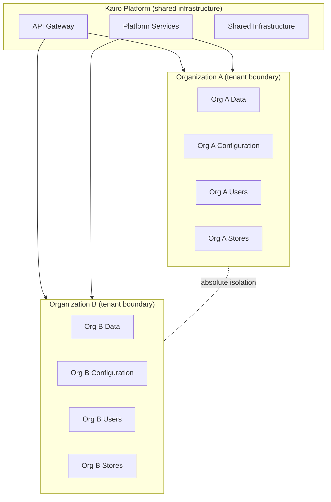
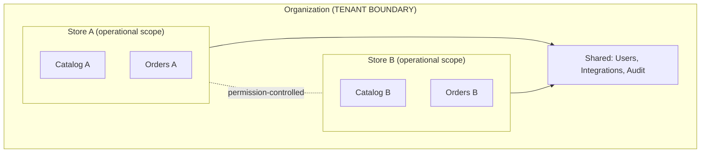
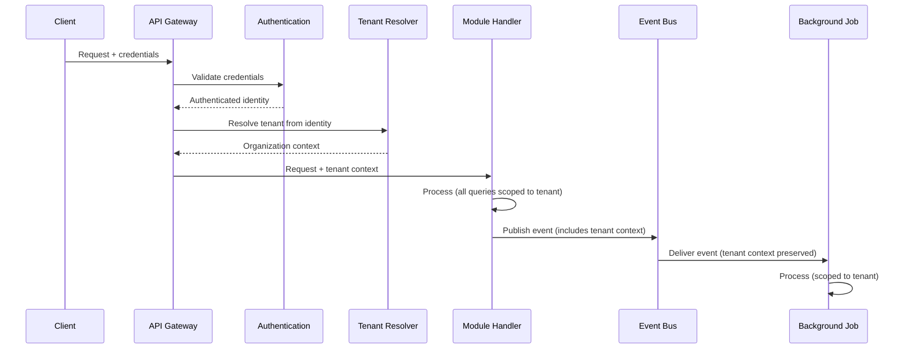

# Multi-Tenancy Architecture

## Metadata

| Field | Value |
|-------|-------|
| Title | Kairo Multi-Tenancy Architecture |
| Document ID | KAI-TEN-001 |
| Status | Draft |
| Version | 0.1 |
| Target Release | V1 |
| Owner | Chief Multi-Tenancy Architect |
| Created | 2026-07-20 |
| Last Updated | 2026-07-20 |
| Reviewers | TODO |
| Related Documents | [Platform Hierarchy](../../05-Platform-Core/Platform-Hierarchy.md), [Organization Model](../../05-Platform-Core/Organization-Model.md), [Store Model](../../05-Platform-Core/Store-Model.md), [Security Architecture](../Security/Security-Architecture.md), [Authorization Architecture](../Security/Authorization-Architecture.md), [Platform Core](../../05-Platform-Core/Platform-Core.md), [Configuration Architecture](../../05-Platform-Core/Configuration-Architecture.md), [Cross-Cutting Concerns](../Cross-Cutting-Concerns.md) |
| Dependencies | [Platform Hierarchy](../../05-Platform-Core/Platform-Hierarchy.md), [Organization Model](../../05-Platform-Core/Organization-Model.md), [Security Architecture](../Security/Security-Architecture.md) |

---

## Applicable Version

This document defines the V1 multi-tenancy architecture. Future enterprise tenancy models (multi-region, dedicated deployments, cross-organization sharing) are identified as future direction and explicitly excluded from V1 scope.

---

## Purpose

This document defines how the Kairo platform achieves multi-tenancy — serving many independent business organizations from shared infrastructure while maintaining absolute data isolation, operational independence, and security between tenants.

Multi-tenancy is not a feature. It is a structural property of the platform. Every data access, every event delivery, every cache lookup, every background job, and every API response operates within a tenant context that cannot be escaped or overridden by application logic.

---

## Scope

This document covers:

- Tenant definition and boundary.
- Organization and store scope.
- Tenant-owned, platform-owned, and shared resources.
- Isolation principles and enforcement.
- Tenant context propagation across all platform layers.
- Tenant-awareness requirements for data, events, cache, background processing, integrations, and observability.
- V1 architecture and future enterprise tenancy models.

This document does not cover:

- Database schema or query filter implementation.
- Middleware implementation code.
- API endpoint contracts.
- Cloud deployment configuration.
- Security principles (defined in [Security Architecture](../Security/Security-Architecture.md) — consumed here).
- Authorization model (defined in [Authorization Architecture](../Security/Authorization-Architecture.md) — consumed here).

---

## What Is a Tenant

A tenant in Kairo is the unit of business isolation. It represents a single independent business entity whose data, configuration, users, and operations are completely separated from all other tenants.

**In Kairo, the primary tenant is the Organization.**

An organization is a business that subscribes to the platform. All its data — products, orders, customers, inventory, configuration, integrations, API keys, and audit records — exists within its tenant boundary and is invisible to every other organization.

---

## The Primary Tenant Boundary

### Boundary Definition

**Organization is the primary business tenant boundary unless an approved document explicitly defines otherwise.**

This means:

- All data is scoped to an organization. No data exists outside an organization context (platform operational data excepted).
- All API requests operate within one organization context at a time.
- All authorization is evaluated within an organization boundary.
- All events are published and consumed within an organization boundary.
- All cache entries are scoped to an organization.
- All background jobs execute within an organization context.
- Cross-organization data access is architecturally impossible in V1.

---

## Organization Tenancy

The organization is defined in [Organization Model](../../05-Platform-Core/Organization-Model.md). From a multi-tenancy perspective:

| Aspect | Multi-Tenancy Implication |
|--------|--------------------------|
| Data ownership | All business data belongs to exactly one organization |
| User membership | Users are members of organizations. Their access is bounded by organization membership. |
| API access | API keys and tokens are scoped to an organization |
| Configuration | Organization configuration overrides platform defaults. It does not affect other organizations. |
| Isolation | No operation in one organization can read, write, or influence another organization's data |
| Lifecycle | Organization creation establishes the tenant boundary. Archival removes it. |

---

## Store Scope Within an Organization

**A store is scoped within an organization and is not automatically an independent tenant.**

Stores provide operational separation within a tenant, not tenant-level isolation. The distinction is critical:

| Concern | Organization (tenant boundary) | Store (operational scope) |
|---------|-------------------------------|--------------------------|
| Data isolation | Absolute. Architecturally enforced. | Operational. Logically separated. |
| Cross-boundary access | Impossible | Controlled by permissions (org admin can see all stores) |
| Security enforcement | Platform layer | Authorization layer |
| Cache isolation | Mandatory (different cache namespace) | Recommended (improves performance) |
| Event isolation | Mandatory (different event scope) | Optional (events may span stores within an org) |
| Configuration | Fully independent per organization | Inherits from organization, overridable per store |

### Rules

- Store-level access control is managed through permissions, not through tenant isolation.
- An organization administrator sees all stores. A store-scoped user sees only their assigned stores.
- Data that is shared across stores (users, integration credentials) exists at the organization level.
- Store isolation prevents accidental cross-store data exposure but is not a security isolation boundary of the same strength as organization isolation.

---

## Platform-Level Scope

Some resources and operations exist at the platform level, above all tenants.

| Platform Scope | Examples |
|---------------|----------|
| Platform configuration | Global defaults, platform-wide security policies, rate limit ceilings |
| Platform operations | Infrastructure monitoring, platform health, aggregate metrics |
| Platform administration | Platform admin users, platform-level configuration changes |
| Shared services | Identity infrastructure, event bus, API gateway, secret store |

### Rules

- Platform-level resources are never visible to tenants.
- Platform administrators are distinct from organization administrators. Platform access does not grant organization data access.
- **Platform administrators and support personnel do not receive unrestricted access by implication.** Access to tenant data requires explicit, audited authorization even for platform staff.

---

## Tenant-Owned Resources

Resources that belong exclusively to a single organization:

| Resource | Tenant Ownership |
|----------|-----------------|
| Business data (products, orders, customers, inventory) | Organization-owned |
| Users and role assignments | Organization-owned |
| API keys | Organization-owned |
| Integration credentials | Organization-owned |
| Webhook registrations | Organization-owned |
| Configuration overrides | Organization-owned |
| Audit trail | Organization-owned (visible to org admins) |
| Custom fields | Organization-owned |
| Stores and channels | Organization-owned |

### Ownership Rule

**Every tenant-owned resource must have explicit ownership.** No resource exists without a defined organization context. Resources cannot be "orphaned" or exist in an ambiguous ownership state.

---

## Platform-Owned Resources

Resources that belong to the platform, not to any tenant:

| Resource | Platform Ownership |
|----------|-------------------|
| Platform infrastructure (databases, cache, message broker) | Platform operations |
| Platform configuration (defaults, policies) | Platform administration |
| Platform user accounts (platform admins, support staff) | Platform identity |
| Shared service configuration | Platform operations |
| Encryption keys (platform-level) | Platform security |
| Platform health data | Platform operations |

### Rule

- Platform-owned resources are invisible to tenants.
- Platform resources serve all tenants equally.
- **Shared infrastructure does not mean shared authorization.** Running on the same database does not grant cross-tenant access. Sharing an event bus does not mean receiving other tenants' events.

---

## Shared Resources

Resources that are shared across tenants but accessed within strict boundaries:

| Resource | Sharing Model | Isolation Mechanism |
|----------|--------------|-------------------|
| Database infrastructure | Shared | Tenant-scoped queries (organization ID on every row) |
| Cache infrastructure | Shared | Tenant-prefixed cache keys |
| Event bus | Shared | Tenant-scoped routing and subscription |
| Object storage | Shared | Tenant-scoped access paths |
| Search infrastructure | Shared | Tenant-scoped indexes or filters |
| API gateway | Shared | Tenant context resolved per request |

### Rule

Sharing infrastructure is an operational decision that reduces cost. It does not weaken isolation. The isolation mechanism must ensure that sharing is invisible to tenants — each tenant experiences the shared resource as if it were dedicated.

---

## Tenant Isolation Principles

| Principle | Description |
|-----------|-------------|
| **Organization is the boundary** | All isolation is enforced at the organization level. |
| **Isolation is structural** | Isolation is enforced by architecture, not by application logic. A bug in module code cannot breach isolation. |
| **Deny cross-tenant by default** | **Cross-tenant access must be denied by default.** No mechanism exists in V1 to share data between organizations. |
| **Trusted context only** | **Tenant context must come from a trusted source.** It is derived from authenticated credentials, never from client-supplied identifiers. |
| **No client-supplied tenant trust** | **Client-supplied tenant identifiers must not be trusted without authorization validation.** A header or query parameter claiming a tenant identity is never used as the authorization boundary. |
| **Background preservation** | **Background jobs, events, caches, logs and exports must preserve tenant context.** Tenant context does not disappear when processing moves from the request path to async processing. |
| **Backend enforcement** | **Tenant isolation is enforced in backend architecture, not only in the frontend.** Frontend controls are UX convenience. Backend enforcement is the security boundary. |
| **No implicit admin access** | **Platform administrators and support personnel do not receive unrestricted access by implication.** Support access is explicitly granted, time-limited, audited, and scoped. |
| **Shared infra, separate auth** | **Shared infrastructure does not mean shared authorization.** Co-location on shared infrastructure provides no access across tenant boundaries. |
| **Every resource has an owner** | No resource exists without an explicit organization context. Unowned resources are a system defect. |

---

## Tenant Context Propagation

Tenant context flows through every layer of the platform, from the initial request through all processing.

### Propagation Rules

| Layer | Tenant Context Source | Enforcement |
|-------|----------------------|-------------|
| API Gateway | Resolved from authenticated credentials | Gateway sets context. Modules cannot override. |
| Module processing | Received from gateway. Immutable for the request. | Modules cannot change tenant context mid-request. |
| Database queries | Applied as mandatory filter on every query | Platform data access layer enforces. Modules cannot bypass. |
| Cache operations | Included in cache key prefix | Platform cache interface enforces. |
| Event publication | Included in event envelope metadata | Platform event interface enforces. |
| Event consumption | Verified on delivery. Subscribers only receive their tenant's events. | Platform event routing enforces. |
| Background jobs | Carried from the triggering event or explicit context | Platform job framework enforces. |
| Webhook delivery | Determined from webhook registration (org-scoped) | Platform webhook service enforces. |
| Logging | Included in structured log context | Platform logging interface includes automatically. |
| Exports | Scoped to the requesting organization | Platform export service enforces. |

---

## Tenant-Aware Security

Multi-tenancy integrates with the security architecture defined in [Security Architecture](../Security/Security-Architecture.md):

| Security Concern | Multi-Tenancy Implication |
|-----------------|--------------------------|
| Authentication | Tokens and API keys are scoped to an organization. Authentication resolves tenant context. |
| Authorization | Permissions are evaluated within the organization boundary. Cross-org permissions do not exist. |
| Trust boundary | The organization boundary is the primary trust boundary for data access. |
| Audit | Audit events include organization context. Tenants see only their own audit trail. |
| Secrets | Integration credentials are scoped per organization. One org's credentials are inaccessible to another. |
| Incident containment | Tenant-specific incidents are contained to the affected organization. |

---

## Tenant-Aware Configuration

Configuration follows the hierarchy defined in [Configuration Architecture](../../05-Platform-Core/Configuration-Architecture.md):

| Layer | Tenant Relationship |
|-------|-------------------|
| Platform defaults | Apply to all tenants equally |
| Organization overrides | Apply within one organization only |
| Store overrides | Apply within one store within one organization |

### Rules

- Configuration is resolved per tenant. One tenant's configuration does not affect another.
- Configuration queries include tenant context. A request for configuration returns the resolved value for the authenticated tenant.
- Feature flags are tenant-scoped. Enabling a feature for one organization does not enable it for others.

---

## Tenant-Aware Data Access

Every data access operation in the platform is tenant-scoped.

| Requirement | Description |
|-------------|-------------|
| Mandatory scoping | Every query includes the organization filter. There is no "unscoped" query for business data. |
| Platform enforcement | The data access layer applies tenant scoping. Modules cannot issue unscoped queries. |
| No cross-tenant joins | Queries never join data across organization boundaries. |
| ID is not access | Knowing a resource ID from another tenant does not grant access. Authorization verifies ownership. |
| Bulk operations | Bulk queries (batch imports, exports) are scoped to the authenticated tenant. |
| Aggregation | Aggregate queries (counts, sums) operate within the tenant boundary only. |

---

## Tenant-Aware Background Processing

Background jobs and async processing preserve tenant context.

| Requirement | Description |
|-------------|-------------|
| Context preservation | Every background job carries the tenant context of the operation that triggered it. |
| Scoped execution | Jobs execute within a single tenant context. No job processes data from multiple tenants. |
| Isolation | A failing job for one tenant does not affect jobs for other tenants. |
| Fair scheduling | Tenant workload is fairly distributed. One tenant's high-volume background work does not starve others. |
| Audit | Background job actions are audited with the tenant context. |

---

## Tenant-Aware Integrations

External integrations are tenant-scoped.

| Requirement | Description |
|-------------|-------------|
| Credential isolation | Integration credentials are per-organization. One tenant's credentials are never used for another. |
| Webhook scoping | Webhook registrations are per-organization. Events are delivered only to the registering organization's endpoints. |
| Outbound calls | When the platform calls an external service on behalf of a tenant, it uses that tenant's credentials. |
| Inbound callbacks | Inbound webhooks are routed to the correct tenant based on the webhook registration. |

---

## Tenant-Aware Events

The event bus preserves tenant isolation.

| Requirement | Description |
|-------------|-------------|
| Publication | Every published event includes the organization context in its envelope. |
| Routing | Events are routed within the organization boundary. Tenant B never receives Tenant A's events. |
| Subscription | Internal subscribers receive events only from the organization they are processing for. |
| Webhook delivery | External webhook subscribers receive events only from the organization that registered the webhook. |
| Cross-tenant events | Do not exist in V1. No mechanism publishes events across organization boundaries. |

---

## Tenant-Aware Observability

Logging, metrics, and tracing include tenant context.

| Requirement | Description |
|-------------|-------------|
| Structured logging | Every log entry includes the organization ID in its structured context. |
| Metrics | Tenant-level metrics (request count, error rate per tenant) are available for operational monitoring. |
| Tracing | Distributed traces include tenant context for scoped investigation. |
| Alerting | Alerts can be scoped to a specific tenant (e.g., high error rate for one organization). |
| Visibility | Tenants do not see other tenants' operational data. Platform operators see aggregate and per-tenant data. |

---

## Tenant Lifecycle

The tenant lifecycle is defined in [Organization Model](../../05-Platform-Core/Organization-Model.md). Multi-tenancy implications:

| Lifecycle Stage | Multi-Tenancy Impact |
|----------------|---------------------|
| Provisioning | Tenant boundary is established. No data exists yet. |
| Active | Full isolation is enforced. All tenant-aware systems operate normally. |
| Suspended | Data is preserved. Access is restricted. Isolation is maintained. |
| Decommissioning | Data export is available. Isolation is maintained. |
| Archived | Business data is removed. Audit records retained. Tenant boundary is dissolved. |

### Rules

- Isolation is maintained throughout all lifecycle stages except Archived.
- A suspended tenant's data remains isolated even though the tenant cannot access it.
- Decommissioning does not weaken isolation during the data export window.
- After archival, the organization ID is retired and never reused.

---

## V1 Architecture

V1 multi-tenancy is implemented as follows:

| Aspect | V1 Approach |
|--------|------------|
| Tenant boundary | Organization |
| Database | Shared database with organization ID on all tenant data (logical isolation) |
| Cache | Shared cache with tenant-prefixed keys |
| Event bus | Shared bus with tenant-scoped routing |
| Background jobs | Shared job infrastructure with per-job tenant context |
| API | Shared API gateway with per-request tenant resolution |
| Isolation enforcement | Platform data access layer enforces mandatory tenant scoping |
| Cross-tenant access | Not supported. Architecturally prevented. |
| Store isolation | Permission-based within the tenant boundary. Not tenant-level isolation. |

### V1 Guarantees

- No tenant can access another tenant's data through any API, event, cache, or background process.
- Tenant context is derived from authenticated credentials, never from client input.
- All platform layers (data, events, cache, jobs, logging) preserve tenant context.
- Tenant isolation failures are treated as Critical security incidents.

---

## Future Enterprise Tenancy Models

The following models are identified for future consideration. They are not V1 requirements.

| Model | Description | When Considered |
|-------|-------------|----------------|
| Dedicated database per tenant | Physical data separation for tenants with regulatory requirements | When enterprise customers with data sovereignty requirements are served |
| Dedicated deployment per tenant | Isolated infrastructure for highest-security tenants | When enterprise customers require dedicated environments |
| Cross-organization data sharing | Controlled sharing of specific data between organizations (marketplace, franchise) | When marketplace or franchise business models are supported |
| Multi-region tenancy | Tenant data pinned to a specific geographic region | When data residency regulations require it |
| Hierarchical tenancy | Parent-child organization relationships | When holding company or franchise models are served |
| Tenant-specific encryption keys | Per-tenant KEKs for cryptographic isolation | When regulatory or enterprise requirements demand it |

### Future Model Rules

- Future models do not weaken the V1 isolation guarantee. They may strengthen it.
- Future models are additive. Existing tenants on shared infrastructure are not affected.
- Each future model requires its own ADR before implementation.
- The V1 architecture must not preclude these future models. Design decisions that would make them impossible are rejected.

---

## Version Gate

| Version | Multi-Tenancy Gate |
|---------|-------------------|
| V1 | Organization is the enforced tenant boundary. All platform layers (data, cache, events, jobs, logging) are tenant-aware. Tenant context propagation is proven end-to-end. Cross-tenant access is architecturally prevented. Isolation is verified through automated testing. |
| V2 | Tenant isolation is validated under adversarial testing (penetration testing). Fair scheduling prevents noisy-neighbor impact. Tenant-specific encryption keys are evaluated. Cross-tenant access for marketplace model is architecturally designed (if triggered). |
| V3 | Dedicated database and dedicated deployment options are available for enterprise tenants (if triggered). Multi-region tenancy is operational (if triggered). Hierarchical tenancy is available (if triggered). |

---

## Decision Summary

| Decision | Rationale |
|----------|-----------|
| Organization is the tenant boundary | Organizations represent independent businesses. They are the natural unit of data ownership and isolation. |
| Stores are not independent tenants | Stores are operational divisions within a business. They share users, integrations, and configuration. Elevating them to tenant-level isolation would prevent legitimate cross-store operations. |
| Shared infrastructure with logical isolation (V1) | Reduces operational cost and complexity. Isolation is enforced architecturally, not physically. Sufficient for V1 scale. |
| Tenant context from credentials only | Client-supplied identifiers can be forged. Credential-derived context is tamper-evident. |
| Platform admin does not imply tenant access | Separation of duties. Platform administration and tenant data access are different privileges with different justifications. |
| Cross-tenant access denied by default | The default must be safe. Cross-tenant sharing (future) is an explicit, justified exception — not the norm. |
| Organization IDs are never reused | Reuse could cause data association with the wrong tenant if any historical reference survives archival. |

---

## Alternatives Considered

| Alternative | Reason Rejected |
|------------|-----------------|
| Database-per-tenant (V1) | Disproportionate operational cost for V1 scale. Logical isolation is sufficient and proven. Physical isolation is available as a future option. |
| Store as tenant boundary | Stores share too much within an organization (users, integrations, audit). Treating them as tenants would require duplicating shared resources or creating complex sharing mechanisms. |
| Tenant ID in URL path | Exposes tenant structure in URLs. Creates enumeration risk. Derived context from credentials is more secure. |
| No store-level scoping | Would prevent multi-store businesses from restricting access within their organization. Store scoping through permissions provides necessary operational control. |
| Implicit platform admin access to all data | Violates least privilege. Creates insider threat surface. Explicit, audited access is safer. |

---

## Trade-offs

| Trade-off | Accepted Because |
|-----------|-----------------|
| Shared database adds tenant-scoping complexity to every query | Platform enforcement handles this once. Modules do not implement scoping themselves. The cost is borne by the platform, not repeated per module. |
| Logical isolation is weaker than physical isolation | For V1, the risk is acceptable. Physical isolation remains available for future enterprise tenants. The architecture does not preclude it. |
| Per-request tenant resolution adds latency | Milliseconds of overhead per request is acceptable for the security guarantee it provides. Caching minimizes repeated resolution. |
| Fair scheduling adds complexity to background processing | Without it, one high-volume tenant can degrade the experience for all others. The complexity is justified. |

---

## Architecture Impact

| Concern | Impact |
|---------|--------|
| Data layer | Every table with tenant data includes organization ID. Every query is scoped. The data access layer enforces this structurally. |
| API gateway | Resolves tenant context on every request. Passes context to all downstream processing. |
| Module design | Modules receive tenant context. They use platform utilities for tenant-scoped data access. They do not implement scoping themselves. |
| Cache | All cache keys include tenant prefix. Cache lookups cannot return cross-tenant data. |
| Events | Event envelope includes tenant context. Event routing is tenant-scoped. |
| Background processing | Job framework carries tenant context. Jobs execute within a single tenant. |
| Logging | Log entries include tenant context. Operational analysis can filter by tenant. |
| Testing | Isolation tests verify cross-tenant denial for every data-accessing path. |

---

## Implementation Impact

| Area | Impact |
|------|--------|
| Modules | Must use platform data access layer for all tenant-scoped queries. Must not implement custom tenant filtering. Must not issue unscoped queries. |
| APIs | Must resolve tenant from credentials, never from client input. Must never return data from another tenant, even if the resource ID is valid. |
| Events | Must include tenant context in event publication. Must validate tenant context on consumption. |
| Cache | Must prefix all cache keys with tenant identifier. Must not cache cross-tenant data under shared keys. |
| Background jobs | Must carry tenant context from the triggering operation. Must scope all processing to that tenant. |
| Testing | Must include cross-tenant isolation tests for every data-accessing endpoint. Must verify that knowing a resource ID from another tenant does not grant access. |
| Infrastructure | Must support tenant-aware monitoring, alerting, and capacity planning. |

---

## Security Responsibilities

| Role | Multi-Tenancy Responsibilities |
|------|-------------------------------|
| Multi-Tenancy Architect | Defines tenancy model. Reviews tenant-impacting changes. Validates isolation. |
| Platform Team | Implements tenant context propagation, data scoping, cache isolation, event routing. |
| Product Teams | Use platform tenant utilities. Never implement custom tenant filtering. Write isolation tests. |
| Security Team | Validates isolation through adversarial testing. Treats isolation failures as Critical. |
| Operations | Monitors per-tenant health. Manages fair scheduling. Responds to noisy-neighbor issues. |

---

## Out of Scope

This document does not define:

- Database schema (table structures, index design, query patterns) — defined in module specifications.
- ORM configuration or query filter middleware — defined in development standards.
- API endpoint contracts — defined in module API specifications.
- Cloud-provider-specific deployment topology — defined in infrastructure documentation.
- Security principles (consumed from [Security Architecture](../Security/Security-Architecture.md)).
- Authorization model (consumed from [Authorization Architecture](../Security/Authorization-Architecture.md)).
- Organization business logic (defined in [Organization Model](../../05-Platform-Core/Organization-Model.md)).
- Store business logic (defined in [Store Model](../../05-Platform-Core/Store-Model.md)).

---

## Future Considerations

- **Tenant migration** — Moving a tenant between deployment regions or between shared and dedicated infrastructure.
- **Tenant metrics and billing** — Per-tenant resource usage tracking for fair billing.
- **Tenant-specific SLAs** — Different reliability guarantees for different tenant tiers.
- **Tenant onboarding automation** — Automated provisioning of tenant resources at scale.
- **Tenant health scoring** — Proactive identification of tenants experiencing issues.
- **Cross-tenant analytics** — Platform-level aggregate analytics that do not expose individual tenant data.

---

## Future Refactoring Triggers

This document should be revisited when:

- Physical tenant isolation (database-per-tenant) is required for an enterprise customer.
- Cross-organization data sharing is needed (marketplace, franchise model).
- Multi-region deployment introduces regional tenancy requirements.
- Tenant volume reaches a scale where shared infrastructure requires partitioning.
- A tenant isolation incident occurs (validate architecture effectiveness).
- Hierarchical tenancy (parent-child organizations) is required.
- The Payments product introduces PCI scope that may require dedicated tenant infrastructure.

---

## Change History

| Version | Date | Author | Description |
|---------|------|--------|-------------|
| 0.1 | 2026-07-20 | Chief Multi-Tenancy Architect | Initial draft |
