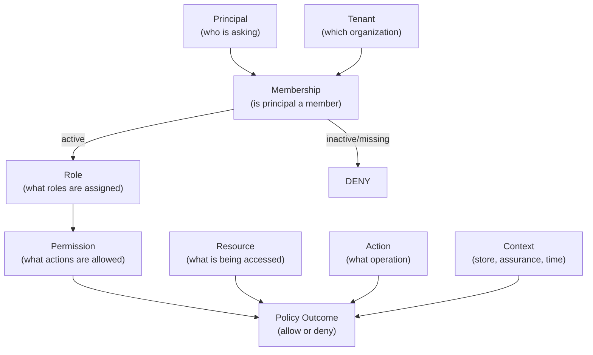
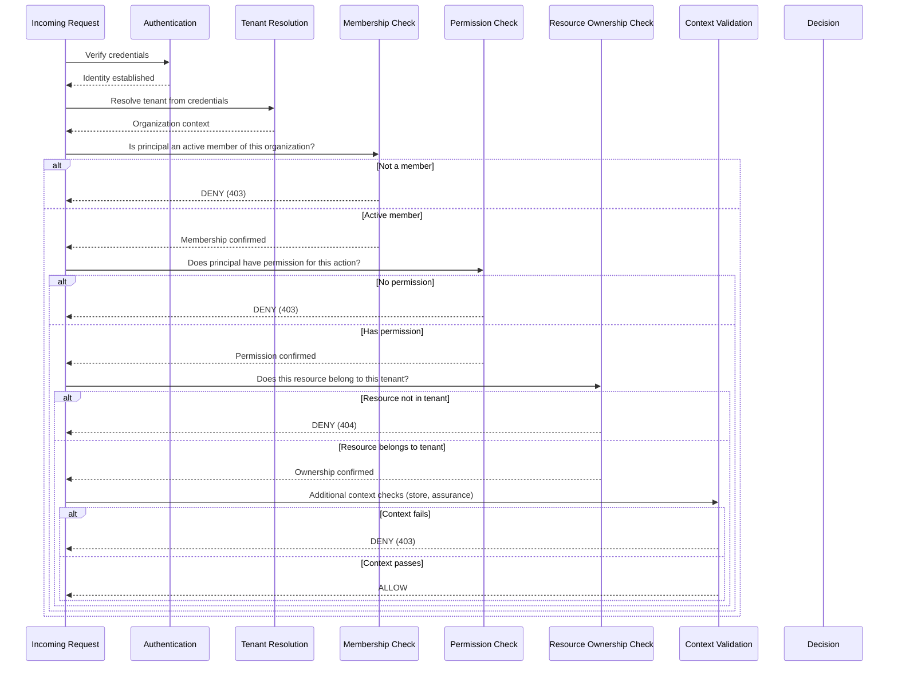

# Tenant-Aware Authorization

## Metadata

| Field | Value |
|-------|-------|
| Title | Kairo Tenant-Aware Authorization |
| Document ID | KAI-TEN-006 |
| Status | Draft |
| Version | 0.1 |
| Target Release | V1 |
| Owner | Multi-Tenant Authorization Architect |
| Created | 2026-07-20 |
| Last Updated | 2026-07-20 |
| Reviewers | TODO |
| Related Documents | [Authorization Architecture](../Security/Authorization-Architecture.md), [Identity and Authentication](../Security/Identity-and-Authentication.md), [Tenant Resolution](./Tenant-Resolution.md), [Tenant Isolation](./Tenant-Isolation.md), [Tenant Hierarchy](./Tenant-Hierarchy.md), [Audit and Security Monitoring](../Security/Audit-and-Security-Monitoring.md), [Organization Model](../../05-Platform-Core/Organization-Model.md), [Store Model](../../05-Platform-Core/Store-Model.md) |
| Dependencies | [Authorization Architecture](../Security/Authorization-Architecture.md), [Tenant Resolution](./Tenant-Resolution.md) |

---

## Purpose

This document defines how authorization decisions are made in a multi-tenant context. It extends the [Authorization Architecture](../Security/Authorization-Architecture.md) with tenant-specific rules that ensure every authorization decision considers membership, scope, and resource ownership within the correct tenant boundary.

Authorization in a multi-tenant platform must answer: "Does this principal have this permission, within this tenant, for this specific resource that belongs to this tenant?" Every element of that question is independently validated.

---

## Scope

This document covers:

- Tenant membership and its role in authorization.
- Scope rules for roles, permissions, resources, and access.
- Cross-organization and cross-store access governance.
- Privileged access (support, impersonation, platform admin).
- Access lifecycle (revocation, suspension, switching).
- Authorization decision model and flow.

This document does not cover:

- Complete permission catalogs per module — defined in module specifications.
- Authentication mechanisms — defined in [Identity and Authentication](../Security/Identity-and-Authentication.md).
- Tenant context resolution — defined in [Tenant Resolution](./Tenant-Resolution.md).
- Source code or policy engine implementation.

---

## Authorization Decision Model

Every authorization decision evaluates the following elements:

| Element | Description | Required |
|---------|-------------|:--------:|
| **Principal** | The authenticated actor (user, API key, service) | Always |
| **Tenant** | The organization resolved from authentication context | Always |
| **Membership** | The principal's active membership in the resolved tenant | Always |
| **Role** | Roles assigned to the principal within this tenant | Always |
| **Permission** | Permissions granted through assigned roles | Always |
| **Resource** | The specific entity being accessed (type + ID) | For resource operations |
| **Action** | The operation being attempted (read, create, update, delete, etc.) | Always |
| **Context** | Additional signals: store scope, authentication assurance, time, channel | When applicable |
| **Policy Outcome** | Allow (all checks pass) or Deny (any check fails) | Always |

---

## Authorization Decision Flow

### Decision Rules

Every authorization decision requires all of the following:

1. **Active membership in the relevant tenant.** The principal must be a current, non-suspended member of the resolved organization.
2. **Permission for the requested action.** The principal must hold the specific permission required for the operation (through one or more assigned roles).
3. **Authorization for the specific resource.** If the operation targets a specific resource, the principal must be authorized to access that resource within their scope (store assignment, customer ownership, etc.).
4. **Validation that the resource belongs to the resolved tenant.** The resource must be owned by the same organization that the principal is operating within. A resource ID from another tenant returns 404.
5. **Additional controls for sensitive actions.** Operations designated as sensitive require elevated authentication assurance (step-up MFA), approval, or additional scope validation.
6. **Audit records for privileged and impersonated actions.** Elevated access (admin operations, support impersonation) is always audit-logged with full context.

---

## 1. Tenant Membership

Membership is the foundational authorization gate. Without active membership, no authorization check proceeds.

| Rule | Description |
|------|-------------|
| Membership is per-organization | A principal's membership in Organization A has no bearing on Organization B. |
| Membership must be active | Suspended or removed members are denied regardless of their historical roles. |
| Membership is checked on every request | Not cached permanently. Membership changes take effect on the next request. |
| Membership is not implied by authentication | Being authenticated proves identity. It does not prove membership in any specific organization. |

---

## 2. Organization Membership

| Aspect | Rule |
|--------|------|
| Single-org principals (API keys, customers) | Membership is implicit — the key/token is bound to one organization. |
| Multi-org principals (workforce users) | Membership exists in each organization independently. Active context determines which membership is evaluated. |
| Membership lifecycle | Created by org admin. Suspended by org admin. Removed by org admin. |
| Membership verification | Checked in the authorization pipeline after tenant resolution. |

---

## 3. Store Access

Store access is a narrower scope within organization membership.

| Aspect | Rule |
|--------|------|
| Organization-level access | Principals with org-level roles can access all stores within the organization. |
| Store-scoped access | Principals with store-scoped roles can access only their assigned stores. |
| Store assignment | Managed by organization administrators. |
| Multiple store assignment | A principal may be assigned to multiple stores. Each store's access is independent. |
| Store validation | Every store-scoped request validates that the principal is authorized for the specified store. |

---

## 4. Role Scope

Roles are assigned within a specific scope:

| Role Scope | Meaning | Example |
|-----------|---------|---------|
| Organization-wide | Role applies to all stores within the organization | Organization Administrator |
| Store-specific | Role applies only to the assigned store | Store Manager for Store A |

### Role Scope Rules

- A role assigned at the organization level does not need per-store assignment. It covers all stores.
- A role assigned at the store level applies only to that store. It does not grant access to other stores.
- A principal may have different roles for different stores (Store Manager for Store A, Viewer for Store B).
- Roles are not global. A role name ("Admin") in one organization has no effect in another organization.

---

## 5. Permission Scope

Permissions are granted through roles and evaluated within the resolved scope.

| Rule | Description |
|------|-------------|
| Permissions are tenant-bound | A permission is effective only within the organization where the role is assigned. |
| Permissions are additive | Multiple roles contribute permissions. The effective set is the union of all assigned roles' permissions. |
| Permissions are action-specific | `catalog.product.read` does not imply `catalog.product.update`. Each action is independently authorized. |
| Permissions do not cross organizations | Permissions from Organization A have no effect in Organization B. |
| Store-scoped permissions are bound to store | A `catalog.product.create` permission scoped to Store A does not allow creating products in Store B. |

---

## 6. Resource Scope

Resources are authorized at the individual instance level.

| Rule | Description |
|------|-------------|
| Resource must belong to the resolved tenant | Every resource access verifies that the resource's organization matches the authenticated context. |
| Resource ID is not access | Providing a valid resource ID does not grant access. Authorization is evaluated independently of ID knowledge. |
| Resources outside scope return 404 | Resources belonging to another organization return 404 (not 403) to prevent enumeration. |
| Store-scoped resources validate store | A product in Store A is not accessible through a request scoped to Store B (unless the principal has org-level access). |

---

## 7. Application Scope

Applications (storefronts, mobile apps) have authorization bounded by their API key scope.

| Rule | Description |
|------|-------------|
| Key scope is the ceiling | An application cannot exceed its key's configured permission scope, regardless of the end user's permissions. |
| Publishable keys have minimal scope | Catalog read, cart, checkout, customer self-service. No administrative operations. |
| Secret keys have configurable scope | Set at key creation by the org admin. Cannot exceed the admin's own permissions. |
| Application + user = intersection | When a user operates through an application, effective permissions are the intersection of the user's permissions and the application's scope. |

---

## 8. API Credential Scope

| Rule | Description |
|------|-------------|
| Keys are organization-bound | A key belongs to one organization and cannot operate in another. |
| Keys have explicit scope | Permissions and store access are configured at creation. |
| Keys cannot escalate | A key cannot gain permissions beyond its initial configuration without explicit modification (audited). |
| Key scope is immutable per request | The key's scope does not change during a request. |

---

## 9. Customer Scope

Customers have self-service authorization within strict boundaries.

| Rule | Description |
|------|-------------|
| Customers access only their own resources | A customer can view their own orders, addresses, and profile. No other customer's data. |
| Customers operate within one organization | A customer token is bound to the organization where they registered. |
| Customers have no administrative permissions | Customers cannot access administrative endpoints regardless of token manipulation. |
| Guest checkout has no persistent authorization | Guest operations are limited to the active checkout session. |

---

## 10. Platform-Administrator Scope

Platform administrators manage the platform itself.

| Rule | Description |
|------|-------------|
| Platform admin is not org admin | Platform-level access does not automatically grant access to any organization's data. |
| Tenant data access requires explicit authorization | A platform admin accessing tenant data must go through the impersonation flow (audited, time-limited, read-only by default). |
| Platform scope covers platform operations | Infrastructure, configuration, platform health, platform user management. |
| Separation of concerns | Platform administration and tenant data access are separate authorization domains. |

---

## 11. Support-Personnel Scope

Support access is controlled, temporary, and audited.

| Rule | Description |
|------|-------------|
| Support access uses impersonation | Support personnel do not have standing access to tenant data. They enter through the impersonation flow. |
| Read-only by default | Impersonation grants read access. Write access requires additional, explicit authorization. |
| Time-limited | Impersonation sessions expire automatically after a short duration. |
| Audited | Every action during impersonation is logged with the support user's identity and the target tenant. |
| Tenant-visible | Tenants can see that support access occurred (via their audit trail). |
| **Permanent support access is prohibited** | Support access is always session-based, time-limited, and justified. No standing access exists. |

---

## 12. Cross-Organization Membership

| Rule | Description |
|------|-------------|
| A user may be a member of multiple organizations | Enables the agency model where one person manages multiple businesses. |
| Memberships are independent | Roles and permissions in Organization A are completely independent of Organization B. |
| No permission transfer | A user's admin role in Organization A does not grant any access in Organization B. |
| Active context is single-org | A user operates within one organization at a time. |

---

## 13. Cross-Store Access

| Rule | Description |
|------|-------------|
| Organization-level users access all stores | Users with organization-wide roles can access any store. |
| Store-scoped users access only assigned stores | Access is restricted to explicitly assigned stores. |
| Cross-store data is org-admin visible | Organization-wide reports spanning stores require org-level permission. |
| No implicit cross-store access | Being assigned to Store A does not grant any access to Store B unless explicitly assigned. |

---

## 14. Delegated Access

| Rule | Description |
|------|-------------|
| Applications act on behalf of users | The effective permission is the intersection of the application's scope and the user's permissions. |
| Integration keys act on behalf of the organization | The key operates with its configured scope. No user context is required. |
| Delegation cannot escalate | A delegate cannot have more access than the delegating principal. |

---

## 15. Temporary Access

| Rule | Description |
|------|-------------|
| Time-limited permissions are supported | Access can be granted for a defined duration. |
| Expired access is automatically revoked | No manual intervention needed. The platform rejects expired authorization. |
| Support impersonation is always temporary | Support sessions have mandatory expiration. |
| Temporary access is audited | Grant, use, and expiration are all recorded. |

---

## 16. Approval-Based Access

| Rule | Description |
|------|-------------|
| Sensitive operations may require approval (future) | V1 uses step-up authentication for sensitive operations. Multi-person approval is a future capability. |
| V1 sensitive-action controls | Elevated authentication assurance (recent MFA) required for defined sensitive operations. |
| Future approval model | Maker-checker patterns where one principal initiates and another approves. |

---

## 17. Impersonation

| Rule | Description |
|------|-------------|
| High-assurance authentication required | Support user must complete elevated authentication before impersonation. |
| Explicit session creation | Impersonation is an explicit, audited action targeting a specific organization. |
| Restricted permissions | Impersonation sessions have a defined, restricted permission set (not the full admin set). |
| Read-only default | Write access requires additional per-session authorization. |
| Tenant-visible | The tenant's audit trail shows that impersonation occurred. |
| **Silent tenant switching is prohibited** | Switching between impersonated tenants requires creating a new impersonation session (audited). |

---

## 18. Access Revocation

| Rule | Description |
|------|-------------|
| Membership removal | Revoking membership denies all access immediately on next request. |
| Role removal | Removing a role removes its permissions. Takes effect immediately. |
| Key revocation | Revoking an API key invalidates it immediately. |
| Session revocation | Revoking a session invalidates its token immediately. |
| Immediate effect | Revocation is not eventual. The next request with the revoked credential is denied. |

---

## 19. Membership Suspension

| Rule | Description |
|------|-------------|
| Suspended membership = no access | A suspended member cannot perform any operation within the organization. |
| Data is preserved | Suspension does not delete the user's membership or role assignments. They are inactive. |
| Reactivation restores access | When suspension is lifted, the previous roles and permissions become active again. |
| Organization suspension | If the entire organization is suspended, all members lose access (per [Organization Model](../../05-Platform-Core/Organization-Model.md)). |

---

## 20. Tenant Switching

| Rule | Description |
|------|-------------|
| Explicit action | Switching active organization requires an explicit API call or session action. |
| Reauthorized | Permissions are re-evaluated for the target organization. No carryover from the previous organization. |
| Membership validated | The switch is denied if the user is not an active member of the target organization. |
| Audited | Tenant switches are logged (from which org to which org, when, by whom). |
| **Silent tenant switching is prohibited** | The platform does not silently change the user's active organization based on request context. All switches are explicit. |

---

## 21. Context-Aware Authorization

Beyond basic membership and permission checks, authorization may consider:

| Context Factor | Effect on Authorization |
|---------------|----------------------|
| Store assignment | Restricts access to assigned stores only |
| Authentication assurance | Sensitive operations require elevated assurance (MFA) |
| Time of day (future) | Business-hours restrictions for certain operations |
| IP address (future) | Location-based access restrictions |
| Channel | Operations may be restricted to specific channels |
| Session age | Critical operations require recent authentication |

---

## 22. Sensitive Operation Authorization

Operations classified as sensitive require additional authorization controls:

| Sensitive Operation | Additional Control |
|--------------------|-------------------|
| User/role management | Step-up authentication (recent MFA) |
| Security setting changes | Step-up authentication |
| API key management | Step-up authentication |
| Data export (bulk) | Elevated permission + audit |
| Payment operations (refund) | Elevated permission + audit |
| Configuration changes (security-related) | Step-up authentication + audit |
| Support impersonation | High-assurance authentication + explicit session + audit |

---

## 23. Audit Requirements

| Audited Event | Details Recorded |
|--------------|------------------|
| Membership changes | Who changed membership, for whom, in which org, when |
| Role assignments/removals | Who assigned/removed, which role, which scope, for whom, when |
| Permission evaluations (denied) | Principal, action, resource, reason for denial, when |
| Tenant switching | Who switched, from which org, to which org, when |
| Impersonation sessions | Support user, target org, access level, start/end time, actions taken |
| Key creation/revocation | Who, which key (identifier only), scope, when |
| Sensitive operation execution | Principal, operation, resource, assurance level, when |
| Access revocation | Who revoked, target principal/key, reason, when |

---

## Explicit Prohibitions

The following are architecturally prohibited:

| Prohibition | Rationale |
|------------|-----------|
| **Global role names automatically granting access everywhere** | A role named "Admin" in Organization A has no meaning in Organization B. Role authorization is always tenant-scoped. |
| **Accepting organization IDs from the request without membership validation** | Client-supplied identifiers are untrusted. Membership must be verified against the platform's membership records. |
| **Trusting resource IDs without ownership verification** | Knowing an ID does not grant access. The resource must be verified as belonging to the authenticated tenant. |
| **Frontend-only permission checks** | Client-side checks are UX convenience. Server-side enforcement is the security boundary. Frontend checks provide no isolation. |
| **Permanent support access** | Support access is always temporary, session-based, and justified. Standing access to tenant data creates unacceptable risk. |
| **Silent tenant switching** | Changing the active tenant without explicit user action and reauthorization could cause operations in the wrong scope without the user's awareness. |

---

## Example Authorization Scenarios

### Scenario 1: Store Manager Reads an Order

| Step | Check | Outcome |
|------|-------|---------|
| Authentication | Valid token for user Alice | Identity: Alice |
| Tenant resolution | Token belongs to Organization "FashionCo" | Tenant: FashionCo |
| Membership | Alice is an active member of FashionCo | Pass |
| Store scope | Request targets Store "Premium". Alice is assigned to Store "Premium". | Pass |
| Permission | Alice has role "Store Manager" for Store "Premium". Role includes `order.read`. | Pass |
| Resource ownership | Order #12345 belongs to FashionCo, Store "Premium" | Pass |
| **Result** | **ALLOW** | |

### Scenario 2: User Attempts Cross-Store Access

| Step | Check | Outcome |
|------|-------|---------|
| Authentication | Valid token for user Bob | Identity: Bob |
| Tenant resolution | Token belongs to Organization "FashionCo" | Tenant: FashionCo |
| Membership | Bob is an active member of FashionCo | Pass |
| Store scope | Request targets Store "Outlet". Bob is assigned only to Store "Premium". | **FAIL** |
| **Result** | **DENY (403)** | |

### Scenario 3: API Key Attempts Operation Outside Scope

| Step | Check | Outcome |
|------|-------|---------|
| Authentication | Valid secret API key "key_abc" | Identity: key_abc |
| Tenant resolution | Key belongs to Organization "TechCo" | Tenant: TechCo |
| Membership | Key is active and bound to TechCo | Pass |
| Permission | Key scope includes `catalog.product.read` only. Request is `inventory.adjust`. | **FAIL** |
| **Result** | **DENY (403)** | |

### Scenario 4: Resource from Another Tenant

| Step | Check | Outcome |
|------|-------|---------|
| Authentication | Valid token for user Carol | Identity: Carol |
| Tenant resolution | Token belongs to Organization "ShopA" | Tenant: ShopA |
| Membership | Carol is an active member of ShopA | Pass |
| Permission | Carol has `catalog.product.read` | Pass |
| Resource ownership | Product #99999 belongs to Organization "ShopB", not "ShopA" | **FAIL** |
| **Result** | **DENY (404)** — returns 404 to prevent enumeration | |

### Scenario 5: Support Impersonation

| Step | Check | Outcome |
|------|-------|---------|
| Authentication | Support user Dave, high-assurance (MFA verified recently) | Identity: Dave (support) |
| Impersonation session | Dave creates impersonation session targeting Organization "ClientCo" | Session: active, read-only, 30-min expiry |
| Membership | Dave has support impersonation permission at platform level | Pass |
| Permission | Impersonation grants read access within ClientCo | Pass (read operations only) |
| Resource ownership | Order #54321 belongs to ClientCo | Pass |
| Audit | Action logged: Dave (support) accessed Order #54321 in ClientCo via impersonation | Recorded |
| **Result** | **ALLOW (read-only, audited)** | |

---

## V1 Baseline

| Capability | V1 Status |
|-----------|-----------|
| Organization membership validation on every request | Required |
| Store-scoped authorization | Required |
| Permission-based authorization (not role-name checks) | Required |
| Resource ownership verification | Required |
| API key scope enforcement | Required |
| Customer self-service scope | Required |
| Support impersonation (time-limited, audited, read-only default) | Required |
| Tenant switching with reauthorization | Required |
| Access revocation (immediate) | Required |
| Membership suspension | Required |
| Step-up authentication for sensitive operations | Required |
| Authorization audit for denials and privileged actions | Required |
| Separation of platform admin and tenant access | Required |
| 404 for out-of-scope resources (not 403) | Required |
| Application scope intersection with user permissions | Required |

## Future Capabilities

| Capability | Target Version | Description |
|-----------|---------------|-------------|
| Multi-person approval workflows | V2+ | Maker-checker for sensitive operations |
| Time-based access restrictions | V2+ | Business-hours policies for certain roles |
| IP-based access policies | V3+ | Location-aware authorization |
| Cross-organization authorization (marketplace) | V3+ | Controlled access grants between organizations |
| ABAC policies | V3+ | Attribute-based access beyond roles and permissions |
| Automated access review | V2+ | Periodic review of access assignments with expiration |
| Delegated administration | V2+ | Org admin delegates specific functions to sub-admins |
| Temporary permission grants with auto-expiry | V2+ | Time-limited elevated access for specific tasks |

---

## Version Gate

| Version | Tenant-Aware Authorization Gate |
|---------|-------------------------------|
| V1 | Organization membership is validated on every request. Store scope is enforced. Resource ownership is verified. API key scopes are enforced. Support impersonation is time-limited and audited. All prohibitions are architecturally enforced. Authorization denials are audited. |
| V2 | Multi-person approval for defined sensitive operations. Automated access review detects stale permissions. Temporary grants with auto-expiry. Delegated administration. |
| V3 | ABAC for complex scenarios. Cross-org authorization for marketplace. IP and time-based policies. Full conditional access evaluation. |

---

## Decision Summary

| Decision | Rationale |
|----------|-----------|
| Membership is the first gate | Without active membership, no further authorization is relevant. Membership is the cheapest check and eliminates unauthorized tenants immediately. |
| Permission-based, not role-based checks | Role names are administrative labels. Authorization evaluates permissions. This prevents "god role" anti-patterns and makes authorization stable across role restructuring. |
| Resource ownership is independently verified | Permission says "you can read orders." Ownership says "this order belongs to your tenant." Both are required. Removing either creates a vulnerability. |
| 404 for out-of-scope resources | Returning 403 reveals that the resource exists (in another tenant). 404 reveals nothing, preventing enumeration. |
| Support access is temporary | Standing support access creates long-term insider risk. Session-based access limits exposure to a defined, audited window. |
| No silent tenant switching | Implicit switches could cause operations in the wrong tenant without user awareness. Explicit switches with reauthorization prevent this. |
| Application scope intersects with user scope | An insecure application should not grant access beyond what the user has. An over-privileged user should not exceed what the application is designed for. Intersection provides least privilege. |

---

## Alternatives Considered

| Alternative | Rejected Because |
|------------|-----------------|
| Global roles that apply to all organizations | Violates tenant isolation. A role should mean something only within its organization. |
| Trust resource ID as proof of access | IDs can be guessed, leaked, or logged. ID knowledge is not authorization. |
| Standing support access with audit | Audit detects but does not prevent. Time-limited access limits exposure surface. |
| Implicit tenant switching based on resource ownership | If user requests resource from Org B, silently switching to Org B is dangerous. The user may not realize they've changed context. |
| Frontend permission checks as primary control | Frontends can be bypassed by any HTTP client. Server-side enforcement is the only real control. |

---

## Trade-offs

| Trade-off | Accepted Because |
|-----------|-----------------|
| Membership check on every request adds latency | Milliseconds of overhead. Caching membership reduces repeated lookups. The security guarantee justifies the cost. |
| Resource ownership verification adds a query | One additional check per resource access. Eliminates an entire class of cross-tenant vulnerabilities. |
| 404 instead of 403 makes debugging harder for the caller | The caller doesn't know if the resource doesn't exist or they're not authorized. This is intentional — preventing enumeration is more important than debugging convenience. |
| Explicit tenant switching adds UX friction for multi-org users | One click to switch organizations. Prevents potentially catastrophic wrong-tenant operations. |
| Impersonation session limits support efficiency | Support must create a new session per tenant. Prevents support from carelessly operating across tenants. |

---

## Architecture Impact

| Concern | Impact |
|---------|--------|
| Authorization pipeline | Must evaluate membership → permission → resource ownership → context in order. Each step is independent. |
| API gateway | Passes authenticated identity and resolved tenant to the authorization pipeline. |
| Module design | Modules declare required permissions per endpoint. Modules use platform utilities for resource ownership checks. |
| Data access | Resource ownership verification may require a lookup to confirm the resource belongs to the tenant before returning data. |
| API design | Every endpoint specifies required permission, scope, and resource authorization behavior. |
| Events | Authorization changes (role assignments, membership changes) publish events for audit consumption. |
| Testing | Tests must verify membership enforcement, permission checks, resource ownership, scope boundaries, and revocation immediacy. |

---

## Implementation Impact

| Area | Impact |
|------|--------|
| Modules | Must declare permissions. Must use platform authorization interface. Must not implement custom membership or ownership checks. |
| APIs | Must return 404 for out-of-scope resources. Must enforce key scope. Must support step-up for sensitive operations. |
| Support tooling | Must implement time-limited impersonation sessions. Must audit all impersonation actions. Must default to read-only. |
| Testing | Must test: membership denial, permission denial, resource ownership denial, scope boundary enforcement, revocation immediacy, impersonation controls. |
| Audit | Must log all denials, all privileged actions, all impersonation, all membership changes, and all role/permission changes. |

---

## Security Responsibilities

| Role | Authorization Responsibilities |
|------|-------------------------------|
| Multi-Tenant Authorization Architect | Defines tenant-aware authorization rules. Reviews authorization-impacting changes. |
| Platform Team | Implements membership validation, permission evaluation, resource ownership checks, and impersonation controls. |
| Product Teams | Declare permissions per endpoint. Use platform authorization interface. Write authorization tests. |
| Organization Administrators | Manage roles, permissions, store assignments, and API key scopes within their organization. |
| Security Team | Validates authorization through adversarial testing. Reviews impersonation logs. Tests cross-tenant access denial. |

---

## Out of Scope

This document does not define:

- Complete permission catalogs per module — defined in module specifications.
- Implementation code for authorization middleware — defined in development standards.
- Specific policy engine product or configuration — evaluated during implementation.
- Authentication mechanisms — defined in [Identity and Authentication](../Security/Identity-and-Authentication.md).
- Tenant resolution mechanics — defined in [Tenant Resolution](./Tenant-Resolution.md).

---

## Future Considerations

- **Authorization analytics** — Identify over-privileged accounts, unused permissions, and access patterns that indicate risk.
- **Just-in-time access** — Permissions granted only when needed and automatically revoked after use.
- **Consent-based access** — Tenant explicitly consents to specific access for support or partnership scenarios.
- **Authorization policy testing** — Simulation tools that evaluate "what if" scenarios for permission changes.
- **Federated authorization** — External identity providers contributing role/group information that maps to platform permissions.
- **Authorization event stream** — Real-time stream of authorization events for security monitoring and anomaly detection.

---

## Future Refactoring Triggers

This document should be revisited when:

- Cross-organization access is introduced (marketplace model requires multi-tenant authorization).
- ABAC is implemented (attribute-based policies add complexity to the decision model).
- A new principal type is introduced (new actor category needs authorization rules defined).
- A significant authorization bypass occurs (validate model, strengthen controls).
- Enterprise SSO introduces federated role mapping (external roles must map to platform permissions).
- Approval workflows are implemented (maker-checker changes the authorization flow).

---

## Change History

| Version | Date | Author | Description |
|---------|------|--------|-------------|
| 0.1 | 2026-07-20 | Multi-Tenant Authorization Architect | Initial draft |
