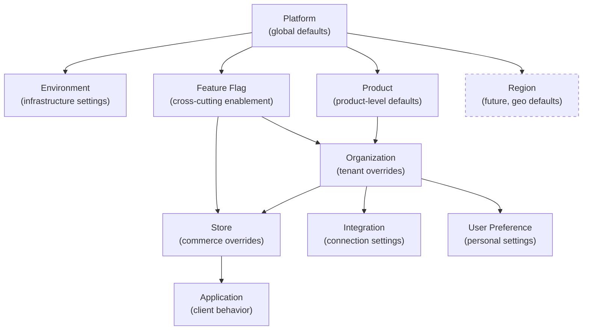
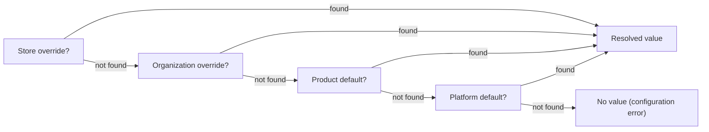

# Tenant Configuration

## Metadata

| Field | Value |
|-------|-------|
| Title | Kairo Tenant Configuration Architecture |
| Document ID | KAI-TEN-007 |
| Status | Draft |
| Version | 0.1 |
| Target Release | V1 |
| Owner | Tenant Configuration Architect |
| Created | 2026-07-20 |
| Last Updated | 2026-07-20 |
| Reviewers | TODO |
| Related Documents | [Configuration Architecture](../../05-Platform-Core/Configuration-Architecture.md), [Tenant Hierarchy](./Tenant-Hierarchy.md), [Tenant Isolation](./Tenant-Isolation.md), [Secrets and Key Management](../Security/Secrets-and-Key-Management.md), [Audit and Security Monitoring](../Security/Audit-and-Security-Monitoring.md), [Authorization Architecture](../Security/Authorization-Architecture.md), [Store Model](../../05-Platform-Core/Store-Model.md), [Organization Model](../../05-Platform-Core/Organization-Model.md) |
| Dependencies | [Configuration Architecture](../../05-Platform-Core/Configuration-Architecture.md), [Tenant Hierarchy](./Tenant-Hierarchy.md) |

---

## Purpose

This document defines how configuration operates in a multi-tenant context — how values are resolved across scopes, how inheritance works, what can be overridden at each level, and how tenant isolation is maintained in configuration access.

Configuration determines platform behavior without code changes. In a multi-tenant system, configuration must be both flexible (each tenant can customize their experience) and safe (no tenant can weaken security or see another tenant's settings).

---

## Scope

This document covers:

- Configuration scope definitions and hierarchy.
- Inheritance, precedence, and override rules.
- Tenant safety in configuration access and caching.
- Feature flags, secrets separation, and audit requirements.
- V1 model and future capabilities.

This document does not cover:

- Specific configuration keys or default values — defined in module specifications.
- Configuration storage schema — defined in implementation specifications.
- Secret storage implementation — defined in [Secrets and Key Management](../Security/Secrets-and-Key-Management.md).
- Configuration API endpoint contracts — defined in API specifications.

---

## Configuration Hierarchy

---

## Configuration Scopes

### Platform Scope

| Attribute | Detail |
|-----------|--------|
| Owner | Kairo platform team |
| Purpose | Global defaults and constraints that apply to every tenant |
| Examples | Minimum password length, default pagination size, rate limit ceilings, API version defaults |
| Visibility | Not visible to tenants. Tenants inherit platform defaults transparently. |
| Mutability | Changed by platform team only. Audited. |

### Environment Scope

| Attribute | Detail |
|-----------|--------|
| Owner | Platform operations |
| Purpose | Infrastructure settings that vary by deployment (development, staging, production) |
| Examples | Service endpoints, database connections, log verbosity, feature toggles for deployment |
| Visibility | Not visible to tenants. Infrastructure concern only. |
| Mutability | Changed at deployment or through operations tooling. Not changeable through business APIs. |

### Product Scope

| Attribute | Detail |
|-----------|--------|
| Owner | Product team |
| Purpose | Product-level defaults that apply to all tenants using a specific product |
| Examples | Default commerce behaviors, default event types published, module-specific defaults |
| Visibility | Tenants inherit product defaults. They cannot see or modify product-level values directly. |
| Mutability | Changed by product team through governance. Audited. |

### Organization Scope

| Attribute | Detail |
|-----------|--------|
| Owner | Organization administrator |
| Purpose | Tenant-level customization that overrides platform and product defaults |
| Examples | Timezone, locale, default currency, security policy settings, notification preferences |
| Visibility | Visible to organization administrators. Not visible to other organizations. |
| Mutability | Changed by org admins through configuration API. Audited. |

### Store Scope

| Attribute | Detail |
|-----------|--------|
| Owner | Store administrator (or org admin) |
| Purpose | Store-level customization that overrides organization defaults for commerce operations |
| Examples | Tax configuration, shipping methods, pricing defaults, checkout behavior, store locale |
| Visibility | Visible to users with store-level admin access. Not visible to other stores unless org admin. |
| Mutability | Changed by authorized store or org admins. Audited. |

### Application Scope

| Attribute | Detail |
|-----------|--------|
| Owner | Developer configuring the application |
| Purpose | Per-application settings that affect client behavior |
| Examples | Storefront-specific display settings, SDK defaults, application-level feature flags |
| Visibility | Visible to the application through its authenticated context. |
| Mutability | Changed through application configuration. Scoped to the organization. |

### Integration Scope

| Attribute | Detail |
|-----------|--------|
| Owner | Organization administrator |
| Purpose | Per-integration connection settings (non-secret configuration) |
| Examples | Payment provider mode (test/live), shipping carrier preferences, tax service region settings |
| Visibility | Visible to org admins. Used by platform integration service. |
| Mutability | Changed by org admins. Audited (as integration changes). |

### User Preference Scope

| Attribute | Detail |
|-----------|--------|
| Owner | Individual user |
| Purpose | Personal settings that do not affect business behavior |
| Examples | UI preferences, notification channel preferences, dashboard layout, locale preference |
| Visibility | Visible only to the owning user. |
| Mutability | Changed by the user. Not audited (personal preference, not business configuration). |

### Feature Flag Scope

| Attribute | Detail |
|-----------|--------|
| Owner | Platform team (controls availability). Org admin (controls opt-in where permitted). |
| Purpose | Runtime feature enablement without redeployment |
| Examples | New feature rollout, beta access, A/B testing participation |
| Visibility | Flag evaluation results are visible (feature available or not). Flag configuration is platform-managed. |
| Mutability | Platform controls global availability. Per-org enablement is platform-managed (not self-service in V1). |

### Future Regional Scope

| Attribute | Detail |
|-----------|--------|
| Owner | Platform team |
| Purpose | Region-specific defaults (data residency, locale, regulatory) |
| Examples | Default data residency policy, regional compliance settings, regional locale defaults |
| Visibility | Organizations assigned to a region inherit regional defaults. |
| Mutability | Platform team manages regional configuration. |
| V1 Status | Not applicable (single-region V1). Future capability. |

---

## 1. Configuration Ownership

| Scope | Owned By | Manages |
|-------|----------|---------|
| Platform | Platform team | Defaults, constraints, ceilings |
| Environment | Operations | Infrastructure settings |
| Product | Product team | Product-level defaults |
| Organization | Organization admin | Business customization |
| Store | Store admin / Org admin | Commerce customization |
| Application | Developer | Client settings |
| Integration | Organization admin | Connection configuration |
| User Preference | Individual user | Personal settings |
| Feature Flag | Platform team | Feature availability |

### Ownership Rules

- Each scope level has a defined owner. No configuration exists without clear ownership.
- Lower-scope owners cannot modify higher-scope settings.
- Higher-scope owners can view (but not directly modify) lower-scope overrides.
- Organization admins can view and manage all store-level configuration within their organization.

---

## 2. Configuration Inheritance

Configuration is resolved by traversing the hierarchy from the most specific scope to the most general:

### Inheritance Rules

- Resolution proceeds from most specific to most general.
- The first scope that defines a value provides the resolved value.
- If no scope defines a value, this is a configuration error (every setting should have a platform default).
- **Configuration inheritance must remain explainable.** A user or admin must be able to understand why a setting has its current value (which scope provided it).

---

## 3. Override Precedence

| Priority | Scope | Wins Over |
|:--------:|-------|-----------|
| 1 (highest) | Store | Organization, Product, Platform |
| 2 | Organization | Product, Platform |
| 3 | Product | Platform |
| 4 (lowest) | Platform | Nothing (base default) |

Special scopes:

| Scope | Precedence Rule |
|-------|----------------|
| Environment | Applied independently (infrastructure, not business hierarchy) |
| Feature Flag | Cross-cuts all levels. Evaluated at the most specific enabled scope. |
| User Preference | Applies to personal UI behavior only. Does not override business configuration. |
| Application | Applies within the application's configured scope. Does not override store/org settings. |
| Integration | Applies to the specific integration. Independent of commerce configuration hierarchy. |

### Precedence Determinism

- Precedence is deterministic. Given the same scopes and values, resolution always produces the same result.
- There is no ambiguity. No two scopes at the same level can provide conflicting values for the same request context.
- **Store overrides must not silently violate organization-level security constraints.** The override system rejects store-level values that would weaken organization security policies.

---

## 4. Defaults

| Rule | Description |
|------|-------------|
| Every setting has a platform default | No setting is undefined at the platform level. |
| Defaults are safe | Default values represent the most secure, most conservative behavior. |
| Defaults require no tenant action | A new organization operates correctly with platform and product defaults. No configuration is mandatory before first use. |
| Defaults are documented | Every configuration setting's default value is documented in the setting definition. |

---

## 5. Validation

| Rule | Description |
|------|-------------|
| Type validation | Values must match the defined type (string, number, boolean, enum). |
| Range validation | Numeric values must be within defined bounds. |
| Constraint validation | Security settings are validated against platform minimums (tightening-only rule). |
| Consistency validation | Interdependent settings are validated together. Invalid combinations are rejected. |
| Validation at write time | Invalid configuration is rejected when submitted, not discovered when resolved. |

### Security Constraint Validation

**Platform security constraints cannot be weakened by tenant overrides.**

| Constraint Type | Platform Minimum | Org Override | Store Override |
|----------------|-----------------|:------------:|:-------------:|
| Minimum password length | 8 | May increase | May not override org |
| MFA requirement | Optional | May require | May not relax org |
| Session timeout maximum | 12 hours | May decrease | May not exceed org |
| Rate limit ceiling | Defined | May not exceed | May not exceed org |

---

## 6. Activation

| Rule | Description |
|------|-------------|
| Immediate activation | Configuration changes take effect without redeployment. |
| Refresh propagation | Running services pick up changes within a defined refresh interval. |
| No downtime required | Configuration changes never require service restart. |
| Atomic application | A configuration change applies as a unit. Partial application is not possible. |

---

## 7. Versioning

| Rule | Description |
|------|-------------|
| Change history | Every configuration change is recorded with the previous value, new value, actor, and timestamp. |
| Rollback capability | Previous configuration values can be restored (rollback to prior state). |
| Version reference | A specific configuration state can be identified by timestamp or version for debugging. |

---

## 8. Auditability

**Configuration changes affecting security, payments, or integrations require audit coverage.**

| Configuration Category | Audit Required |
|----------------------|:--------------:|
| Security settings (password policy, MFA, session) | Yes |
| Payment configuration (provider settings, modes) | Yes |
| Integration configuration (credentials, endpoints) | Yes |
| Commerce settings (pricing, tax, shipping) | Yes |
| Feature flag changes | Yes |
| Store creation/modification | Yes |
| User preferences (personal) | No |
| Application display settings | No |

### Audit Content

Each audited configuration change records:

- Actor (who made the change)
- Scope (which organization/store)
- Setting (what was changed)
- Previous value (what it was before)
- New value (what it is now)
- Timestamp

---

## 9. Secret Separation

**Secrets and ordinary configuration are different categories.**

| Concern | Configuration | Secrets |
|---------|--------------|---------|
| Storage | Configuration store | Dedicated secret store |
| Access model | Readable through config API | Accessible only to authorized services at runtime |
| Visibility | Visible to appropriate admins | Never visible after initial creation |
| Logging | Changes may be logged with values | Values never logged |
| Caching | Standard caching permitted | In-memory only, never persistent cache |
| Examples | Timezone, locale, tax rates | API keys, provider credentials, encryption keys |

### Separation Rules

- The configuration system does not store secrets.
- Secret references (which secret to use for which integration) are configuration. Secret values are not.
- Retrieving configuration never returns secret material.
- Configuration audit logs may include values. Secret audit logs never include values.

See [Secrets and Key Management](../Security/Secrets-and-Key-Management.md) for secret lifecycle.

---

## 10. Configuration Caching

| Rule | Description |
|------|-------------|
| Resolved configuration is cached | Per-request resolution would be too expensive. Resolved values are cached per tenant+store. |
| Cache is tenant-scoped | Cached configuration for one tenant is never served to another. Cache keys include tenant context. |
| Cache invalidation on change | When a configuration value changes, the affected cache entries are invalidated. |
| Cache TTL | Cached values have a maximum TTL after which they are re-resolved (safety net for missed invalidations). |
| **A tenant must not read another tenant's effective configuration** | Cache isolation is mandatory. A cache lookup without tenant context is architecturally prevented. |

---

## 11. Configuration Refresh

| Rule | Description |
|------|-------------|
| Change propagation | Configuration changes propagate to running services within a defined interval (seconds to minutes). |
| Push or pull | Changes may be pushed (notification) or pulled (periodic poll). Either ensures timely propagation. |
| No restart required | Services adapt to new configuration without restart. |
| Stale reads are bounded | The maximum staleness window is defined. After this window, the new value is guaranteed to be active. |

---

## 12. Tenant-Safe Configuration Access

| Rule | Description |
|------|-------------|
| Scoped API | The configuration API returns values resolved for the authenticated tenant only. |
| No cross-tenant visibility | An organization admin cannot see another organization's configuration. |
| Platform defaults are transparent | Tenants see their effective configuration (resolved value) without needing to know which scope provided it. |
| Inheritance explanation | When needed, admins can see whether a value is inherited or overridden (and from which scope). |

---

## 13. Configuration Export

| Rule | Description |
|------|-------------|
| Tenant-scoped export | Configuration export returns only the requesting organization's overrides. |
| No secrets in export | Exported configuration never includes secret values. |
| Machine-readable format | Exports use a documented, standard format. |
| Includes provenance | Exported configuration indicates which scope owns each value. |

---

## 14. Configuration Migration

| Rule | Description |
|------|-------------|
| Between environments | Configuration can be promoted from staging to production in a controlled, reviewed manner. |
| Between stores | A store's configuration can be copied to create a new store with similar settings. |
| Between organizations | Not supported (each org is independent). Similar setup uses templates, not migration. |

---

## 15. Configuration Rollback

| Rule | Description |
|------|-------------|
| Per-setting rollback | Individual settings can be reverted to their previous value. |
| Timestamped states | Configuration state at a specific point in time can be reconstructed. |
| Rollback is audited | Rolling back is itself a configuration change and is audit-logged. |
| Rollback respects validation | A rollback to a value that now violates constraints (e.g., platform minimum was increased) is rejected. |

---

## 16. Feature Enablement

**Feature flags do not replace authorization.**

| Concern | Feature Flag | Authorization |
|---------|-------------|---------------|
| Purpose | Controls whether a feature is available at all | Controls who can use an available feature |
| Evaluation | Is this feature turned on for this tenant? | Does this user have permission for this action? |
| Scope | Platform, organization, or store | Organization, store, role, principal |
| Effect of "off" | Feature is unavailable to everyone in that scope | N/A (feature doesn't exist to authorize) |
| Effect of "on" | Feature is available. Still requires authorization. | Specific users/roles may use the feature. |

### Feature Flag Rules

- A feature being enabled (flag on) does not grant any user access. Authorization is still evaluated.
- A feature being disabled (flag off) overrides authorization. Even an authorized user cannot access a disabled feature.
- Feature flags are evaluated before authorization (if the feature is off, authorization is never reached).
- **Feature flags do not replace authorization.** They control availability. Authorization controls access within available features.

---

## 17. Product Entitlement Direction

Future direction for subscription-tier-based feature availability:

| Concept | Description |
|---------|-------------|
| Entitlement | A feature or capability that an organization has access to based on their subscription tier. |
| Relationship to flags | Entitlements may be implemented through feature flags (feature enabled for organizations on a specific tier). |
| V1 approach | V1 does not implement entitlement-based feature gating. All organizations have access to all V1 features. |
| Future approach | Subscription tiers control which features are available. Feature flags implement the enablement. Authorization controls access within enabled features. |

---

## 18. Store-Level Variation

Stores within an organization may have different configuration while sharing the same organization baseline:

| Variation Permitted | Examples |
|--------------------|---------|
| Commerce settings | Different currencies, different tax zones, different shipping methods per store |
| Locale settings | Different timezone, locale, measurement units per store |
| Pricing defaults | Different default price lists per store |
| Notification settings | Different sender address per store |

| Variation NOT Permitted | Reason |
|------------------------|--------|
| Weaker security policy | Security tightens only. Store cannot relax org policy. |
| Different authentication requirements (weaker) | Security constraint. |
| Different audit coverage (less) | Compliance constraint. |

---

## 19. Future Policy-Based Configuration

| Concept | Description |
|---------|-------------|
| Policy engine | Future capability where configuration is derived from rules and attributes rather than static values. |
| Example | "All stores in the EU region use EUR currency and EU tax rules" — derived from store location attribute. |
| V1 approach | V1 uses explicit configuration at each level. No policy derivation. |
| Future trigger | Pursued when organizational complexity makes manual per-store configuration impractical. |

---

## Override Eligibility Matrix

| Setting Category | Organization May Override | Store May Override | Security Direction |
|-----------------|:------------------------:|:-----------------:|-------------------|
| Locale (timezone, language, currency) | Yes | Yes | N/A |
| Commerce behavior (checkout, cart) | N/A (product default) | Yes | N/A |
| Tax configuration | N/A | Yes | N/A |
| Shipping configuration | N/A | Yes | N/A |
| Pricing defaults | N/A | Yes | N/A |
| Password policy | Yes (tighten only) | No | Tighten only |
| MFA policy | Yes (tighten only) | No | Tighten only |
| Session timeout | Yes (decrease only) | No | Decrease only |
| Rate limit allocation | No (platform-managed) | No | Platform-managed |
| Notification preferences | Yes | Yes | N/A |
| Integration configuration | Yes | No (V1) | N/A |
| Feature flags | Platform-managed | Platform-managed | N/A |
| Audit requirements | No (platform minimum) | No | Cannot weaken |

---

## V1 Baseline

| Capability | V1 Status |
|-----------|-----------|
| Platform → Organization → Store hierarchy | Required |
| Configuration inheritance with precedence | Required |
| Security tightening-only validation | Required |
| Configuration change auditing (security, payments, integrations) | Required |
| Secret separation from configuration | Required |
| Tenant-scoped configuration access (no cross-tenant visibility) | Required |
| Tenant-scoped configuration caching | Required |
| Configuration refresh without restart | Required |
| Feature flag evaluation per tenant | Required |
| Store-level commerce configuration variation | Required |
| Configuration change history | Required |
| Configuration rollback (per-setting) | Required |
| Configuration export (tenant-scoped, no secrets) | Required |

## Future Capabilities

| Capability | Target Version | Description |
|-----------|---------------|-------------|
| Regional configuration defaults | V2+ | Region-specific defaults for organizations assigned to a region |
| Product entitlement gating | V2+ | Subscription-tier-based feature availability |
| Policy-based configuration | V3+ | Rule-derived configuration based on attributes |
| Store-specific integration routing | V2+ | Different providers per store within shared credentials |
| Configuration promotion (staging → production) | V2+ | Controlled propagation between environments |
| Configuration templates | V2+ | Pre-built configuration sets for common business types |
| Self-service feature opt-in | V2+ | Organization admins opt into available features |
| Configuration validation rules (custom) | V3+ | Organization-defined validation for their own settings |

---

## Version Gate

| Version | Tenant Configuration Gate |
|---------|--------------------------|
| V1 | Full hierarchy (Platform → Organization → Store) operational. Inheritance and precedence are deterministic. Security constraints cannot be weakened. Configuration caching is tenant-scoped. Changes are audited for defined categories. Secrets are separate. Feature flags evaluate per tenant. |
| V2 | Regional defaults operational. Product entitlement gating available. Configuration promotion between environments is formalized. Store-specific integration routing available. |
| V3 | Policy-based configuration evaluated. Custom validation rules per organization. Full configuration analytics (what is overridden, what is inherited, what is unused). |

---

## Decision Summary

| Decision | Rationale |
|----------|-----------|
| Deterministic precedence (store > org > product > platform) | Predictability. Admins must know which value will apply without ambiguity. |
| Security tightening only | Preventing tenants from weakening security protects all users and the platform's compliance posture. |
| Secrets are not configuration | Secrets have different access patterns, storage requirements, and audit needs. Mixing them creates exposure risk. |
| Feature flags do not replace authorization | A feature being enabled does not mean everyone can use it. Availability and access are independent concerns. |
| Tenant-scoped caching | Without tenant scoping, one tenant could receive another's cached configuration. This is a cross-tenant leak. |
| Audit for security/payment/integration changes | These categories have compliance and financial impact. Non-audited changes are invisible to review. |
| Store cannot weaken org security | Security posture is organizational. A single store weakening password policy undermines the entire organization's security. |

---

## Alternatives Considered

| Alternative | Rejected Because |
|------------|-----------------|
| Flat configuration (no inheritance) | Every setting must be explicitly configured at every scope. Massive duplication. Any platform change requires touching every tenant. |
| Store overrides everything including security | A compromised store admin could weaken security for their scope, creating an attack surface within the organization. |
| Feature flags as authorization | Would create a parallel authorization system. Confusing, unmaintainable, and bypasses the permission model. |
| Secrets in configuration store | Configuration stores are optimized for readability and caching. Secrets require encryption, access control, and rotation that configuration stores don't provide. |
| Self-service feature flags in V1 | Adds complexity. V1 features are available to all or managed by the platform. Self-service opt-in is a V2 maturity. |

---

## Trade-offs

| Trade-off | Accepted Because |
|-----------|-----------------|
| Security settings cannot be customized downward | Limits flexibility for tenants who want weaker security. Acceptable because the platform guarantees a security baseline for all users. |
| Configuration caching adds invalidation complexity | Required for performance. The alternative (per-request resolution) is too expensive. TTL provides safety net. |
| Feature flags are platform-managed in V1 | Limits tenant self-service. Acceptable because V1 feature set is small and self-service adds authorization complexity. |
| Inheritance adds resolution complexity | The alternative (explicit-only) would require tenants to configure everything. Inheritance with explainable resolution is worth the complexity. |
| Audit for configuration changes adds write overhead | Only applied to defined categories (security, payments, integrations). Personal preferences are not audited. Proportional. |

---

## Architecture Impact

| Concern | Impact |
|---------|--------|
| Configuration service | Must implement hierarchical resolution with deterministic precedence. Must validate constraints. Must cache per-tenant. Must support change notification. |
| Module design | Modules request configuration values. The platform resolves them within the correct tenant+store context. Modules do not resolve hierarchy themselves. |
| API gateway | May resolve some configuration for rate limiting and feature flag evaluation. Must scope resolution to the authenticated tenant. |
| Caching | Configuration cache keys include tenant context. Invalidation propagates when values change. |
| Testing | Must verify inheritance correctness, constraint validation, cache isolation, and override eligibility. |
| Audit | Must log defined-category changes with full context (actor, scope, old value, new value). |

---

## Implementation Impact

| Area | Impact |
|------|--------|
| Modules | Must use platform configuration interface for all settings. Must not read configuration from files or environment directly. Must not cache resolved values beyond the platform-provided cache. |
| Configuration service | Must implement hierarchical resolution. Must enforce constraints. Must invalidate caches on change. Must separate secrets. Must audit defined categories. |
| APIs | Must scope configuration access to the authenticated tenant. Must support read, update, rollback, and export. Must validate on write. |
| Feature flags | Must evaluate per tenant and per store. Must not grant authorization. Must be evaluated before authorization in the request pipeline. |
| Testing | Must verify inheritance, constraint enforcement, cache isolation, audit coverage, and feature flag evaluation. |

---

## Security Responsibilities

| Role | Configuration Responsibilities |
|------|-------------------------------|
| Tenant Configuration Architect | Defines configuration architecture. Reviews hierarchy and constraint rules. |
| Platform Team | Implements configuration service, caching, inheritance, validation, and audit. Manages platform and product defaults. |
| Product Teams | Define configuration settings for their modules. Specify defaults, types, validation rules, and override eligibility. |
| Organization Administrators | Manage their organization's configuration overrides. |
| Store Administrators | Manage their store's configuration overrides within organization constraints. |
| Operations | Manage environment configuration. Monitor configuration propagation health. |

---

## Out of Scope

This document does not define:

- Specific configuration keys or their default values — defined in module specifications.
- Configuration storage schema — defined in implementation specifications.
- Configuration API endpoint contracts — defined in API specifications.
- Secret management lifecycle — defined in [Secrets and Key Management](../Security/Secrets-and-Key-Management.md).
- Feature flag product (specific tool) — technology decision.

---

## Future Considerations

- **Configuration drift detection** — Identify organizations whose configuration deviates significantly from recommended settings.
- **Configuration recommendations** — Suggest configuration improvements based on usage patterns.
- **Bulk configuration management** — Apply configuration changes across multiple organizations or stores simultaneously.
- **Configuration as code** — Version-controlled configuration definitions that are applied through CI/CD.
- **Configuration documentation generation** — Auto-generate configuration reference documentation from setting definitions.
- **Tenant configuration health score** — Rating based on best-practice adherence.

---

## Future Refactoring Triggers

This document should be revisited when:

- Regional configuration is introduced (new hierarchy level).
- Product entitlement gating is implemented (feature flag + subscription tier interaction).
- Policy-based configuration is evaluated (dynamic resolution from rules).
- Multi-product configuration interactions emerge (cross-product configuration dependencies).
- Self-service feature opt-in is introduced (authorization model for flag management).
- Configuration volume requires sharding or partitioning.

---

## Change History

| Version | Date | Author | Description |
|---------|------|--------|-------------|
| 0.1 | 2026-07-20 | Tenant Configuration Architect | Initial draft |
