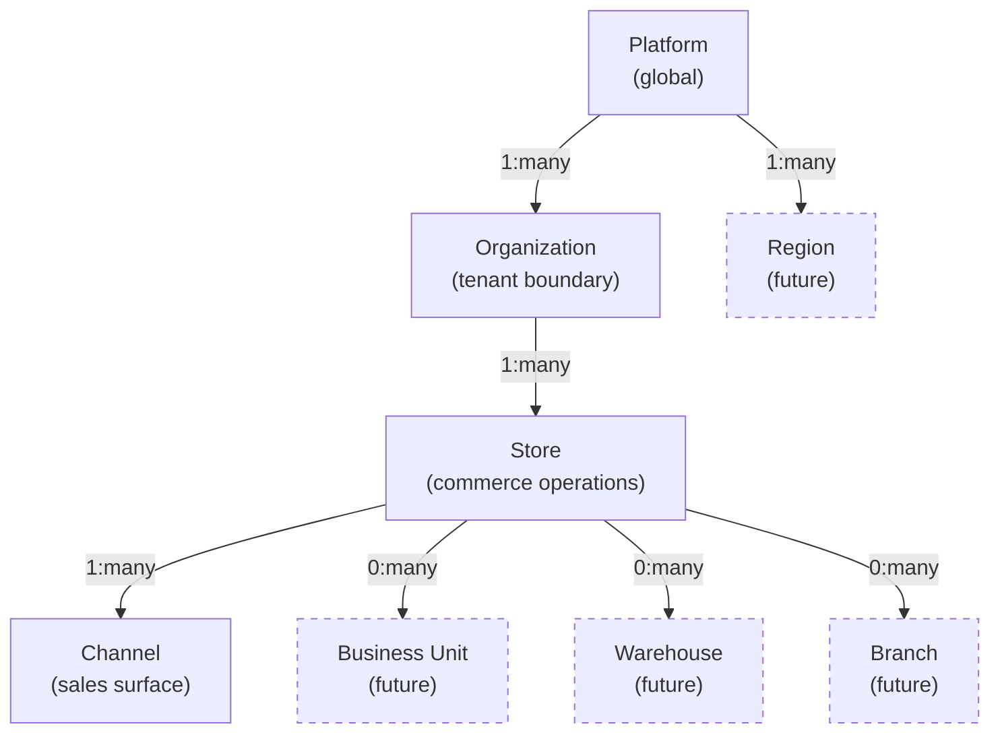
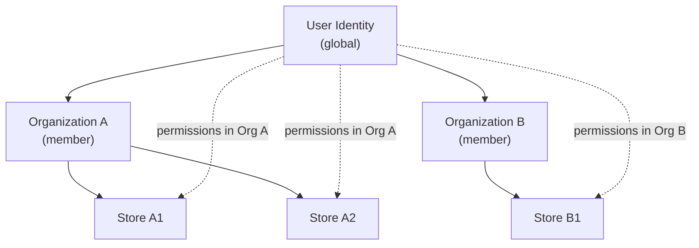
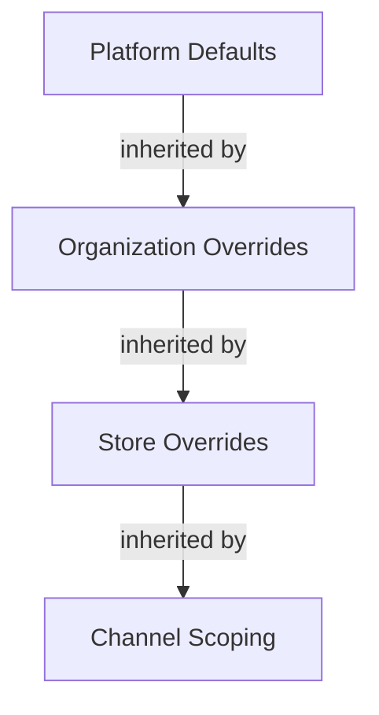

# Tenant Hierarchy and Scope Model

## Metadata

| Field | Value |
|-------|-------|
| Title | Kairo Tenant Hierarchy and Scope Model |
| Document ID | KAI-TEN-002 |
| Status | Draft |
| Version | 0.1 |
| Target Release | V1 |
| Owner | Domain and Multi-Tenancy Architect |
| Created | 2026-07-20 |
| Last Updated | 2026-07-20 |
| Reviewers | TODO |
| Related Documents | [Multi-Tenancy Architecture](./Multi-Tenancy-Architecture.md), [Platform Hierarchy](../../05-Platform-Core/Platform-Hierarchy.md), [Organization Model](../../05-Platform-Core/Organization-Model.md), [Store Model](../../05-Platform-Core/Store-Model.md), [Glossary](../../02-Products/Glossary.md), [Authorization Architecture](../Security/Authorization-Architecture.md), [Configuration Architecture](../../05-Platform-Core/Configuration-Architecture.md) |
| Dependencies | [Multi-Tenancy Architecture](./Multi-Tenancy-Architecture.md), [Platform Hierarchy](../../05-Platform-Core/Platform-Hierarchy.md) |

---

## Purpose

This document defines the complete hierarchy of scopes in the Kairo platform and the rules governing resource ownership, inheritance, and access at each level. It answers the question: "In what context does this resource, user, or operation exist?"

Every entity in the platform exists within a defined scope. Understanding which scope owns what, which scopes contain which, and how scopes relate to each other is essential for correct authorization, data access, configuration resolution, and multi-tenancy enforcement.

---

## Scope

This document covers:

- Definition and rules for every scope level (current and future).
- Resource ownership, inheritance, and override rules.
- Scope relationships and transition rules.
- Explicit answers to common scope ambiguity questions.
- V1 availability vs. future scope levels.

This document does not cover:

- Database schema or query implementations.
- API endpoint contracts.
- Authorization policy definitions (defined in [Authorization Architecture](../Security/Authorization-Architecture.md)).
- Configuration hierarchy implementation (defined in [Configuration Architecture](../../05-Platform-Core/Configuration-Architecture.md)).

---

## Scope Hierarchy

---

## Scope Definitions

### Terminology Distinction

These terms are not interchangeable. Each has a precise meaning as defined in the [Glossary](../../02-Products/Glossary.md) and elaborated here:

| Term | Definition | Is It a Tenant? |
|------|-----------|:---------------:|
| **Tenant** | The unit of data isolation. In Kairo, the organization is the tenant. | — (concept) |
| **Organization** | A business entity operating on the platform. The primary tenant boundary. | Yes |
| **Store** | A commercial operation within an organization. Operational scope, not a tenant. | No |
| **Business Unit** | A logical division within a store (future). Reporting scope. | No |
| **Branch** | A physical retail location (future). POS scope. | No |
| **Warehouse** | A physical inventory location (future). Fulfillment scope. | No |
| **Sales Channel** | A distinct sales surface within a store. Visibility scope. | No |
| **Application** | A client application consuming Kairo APIs. Identified by API key. | No |
| **Environment** | A deployment context (development, staging, production). Infrastructure scope. | No |
| **Region** | A geographic deployment area (future). Data residency scope. | No |

---

## 1. Platform Scope

The highest level. The platform itself.

| Attribute | Detail |
|-----------|--------|
| Owner | Kairo (the company) |
| Parent | None |
| Children | Organizations, Regions (future) |
| Configuration | Platform defaults that all tenants inherit |
| Authorization | Platform administrators only. Grants no tenant data access. |
| Data ownership | Platform operational data (infrastructure metrics, aggregate usage). No business data. |
| V1 | Yes |

### Platform Scope Resources

- Platform configuration defaults
- Platform-level security policies
- Shared service infrastructure
- Platform administrator accounts
- Global rate limit ceilings
- Platform health monitoring data

---

## 2. Organization Scope

The tenant boundary. The unit of business isolation.

| Attribute | Detail |
|-----------|--------|
| Owner | The subscribing business |
| Parent | Platform |
| Children | Stores |
| Configuration | Organization-level overrides of platform defaults |
| Authorization | Organization-level roles and permissions. Bounded — grants no access outside this organization. |
| Data ownership | All business data, users, API keys, integrations, audit trail |
| V1 | Yes |

### Organization Scope Resources

- Users and role assignments
- API keys (publishable and secret)
- Integration credentials
- Webhook registrations
- Organization configuration
- Audit trail
- All stores within the organization
- All business data across all stores

As defined in [Organization Model](../../05-Platform-Core/Organization-Model.md).

---

## 3. Store Scope

An operational commerce context within an organization.

| Attribute | Detail |
|-----------|--------|
| Owner | The organization |
| Parent | Organization |
| Children | Channels, Business Units (future), Warehouses (future), Branches (future) |
| Configuration | Store-level overrides of organization configuration |
| Authorization | Store-scoped permissions. A user may be restricted to specific stores. |
| Data ownership | Products, orders, customers, inventory, pricing, promotions, tax, fulfillment within this store |
| V1 | Yes |

### Store Scope Resources

- Product catalog (store-scoped)
- Price lists and pricing rules
- Inventory (stock levels per location)
- Orders
- Commerce customers
- Promotions and coupons
- Tax configuration
- Shipping and fulfillment configuration
- Channels

As defined in [Store Model](../../05-Platform-Core/Store-Model.md).

---

## 4. User Membership Scope

How users relate to organizations and stores.

| Question | Answer | Source |
|----------|--------|--------|
| **May users belong to multiple organizations?** | Yes. A user identity may be a member of multiple organizations (agency model). They operate within one organization context at a time. | [Organization Model](../../05-Platform-Core/Organization-Model.md) |
| **May users access multiple stores?** | Yes, within their organization. Access to specific stores is controlled by permissions. An org-level admin sees all stores. A store-scoped user sees only their assigned stores. | [Store Model](../../05-Platform-Core/Store-Model.md), [Authorization Architecture](../Security/Authorization-Architecture.md) |

### User Scope Rules

- A user's authentication is global (one identity, one set of credentials).
- A user's authorization is organization-scoped and optionally store-scoped within that organization.
- Switching organizations is an explicit action that changes the entire authorization context.
- Permissions in Organization A have no effect in Organization B.

---

## 5. Application Scope

How client applications relate to the hierarchy.

| Question | Answer |
|----------|--------|
| **Do applications belong to an organization?** | Yes. Applications are identified by API keys, which are scoped to an organization. |
| **Can one application serve multiple organizations?** | No. An API key is bound to one organization. An application serving multiple organizations uses separate keys per organization. |
| **What is an application's scope?** | The organization that owns the API key, further restricted by the key's permission scope. |

### Application Scope Rules

- Publishable keys: organization-scoped, limited to storefront operations.
- Secret keys: organization-scoped, limited to configured permission scope.
- An application operating within Store A (one channel) uses the same organization key but passes store/channel context that is validated against the key's scope.

---

## 6. Developer Integration Scope

How server-to-server integrations relate to the hierarchy.

| Question | Answer |
|----------|--------|
| **Do integrations belong to the platform, organization, or store?** | Integrations belong to the organization. Integration credentials are organization-scoped. A single integration may serve all stores within the organization. |
| **Can integrations be store-specific?** | In V1, integrations are configured at the organization level. Store-specific integration routing (different payment provider per store) is a future capability. |
| **Do API credentials belong to an organization, application, or environment?** | API credentials (keys) belong to the organization. Test and live credentials are separated by environment but owned by the same organization. |

### Integration Scope Rules

- Integration credentials are stored per organization in the secret store.
- All stores within an organization share access to the organization's configured integrations.
- Future: store-specific provider routing allows different external services per store within the shared credential pool.

---

## 7. Customer Scope

How commerce customers relate to the hierarchy.

| Question | Answer |
|----------|--------|
| **Are customers global or organization-scoped?** | Organization-scoped. A customer profile belongs to one organization. The same person registering with two different businesses creates two independent customer profiles. |
| **Are customers shared across stores within an organization?** | Configurable. By default, customers are accessible across all stores within the organization. Store-scoped customer isolation is a future option. |
| **Can customers operate across organizations?** | No. Customer data in Organization A is invisible to Organization B. A person may be a customer of both, but they are separate profiles. |

### Customer Scope Rules

- Customer identity (login credentials) is managed by the platform's identity layer.
- Customer commerce profile (addresses, order history, group membership) is organization-scoped.
- Customer self-service operations access only their profile within the current organization.

---

## 8. Shared Platform Scope

Resources and services that exist at the platform level and serve all tenants.

| Resource | Scope | Ownership | Tenant Visibility |
|----------|-------|-----------|-------------------|
| Identity service infrastructure | Platform | Platform | Invisible (consumed transparently) |
| Event bus infrastructure | Platform | Platform | Invisible (tenants publish/subscribe within their boundary) |
| API gateway | Platform | Platform | Invisible (routes requests to correct tenant) |
| Secret store | Platform | Platform | Invisible (tenants' secrets are stored within, access-controlled) |
| Configuration service | Platform | Platform | Tenants see their resolved configuration only |
| Search infrastructure | Platform | Platform | Tenants see their indexed data only |
| Media storage infrastructure | Platform | Platform | Tenants see their assets only |

### Shared Platform Rules

- Shared infrastructure serves all tenants without preference.
- Sharing infrastructure does not grant cross-tenant access.
- Tenants are unaware of other tenants using the same infrastructure.
- Platform scope is invisible to tenants through APIs.

---

## 9. Future Business Unit Scope

| Attribute | Detail |
|-----------|--------|
| Owner | The store |
| Parent | Store |
| Children | None |
| Purpose | Logical division for reporting, budget ownership, or departmental organization |
| Authorization | Permission scoping within a store. A user may be restricted to a specific business unit. |
| Data ownership | References store data. Does not own data independently. Provides a grouping/filter perspective. |
| V1 | No (future) |

---

## 10. Future Regional Scope

| Attribute | Detail |
|-----------|--------|
| Owner | Platform |
| Parent | Platform |
| Children | Organizations (assigned to a region) |
| Purpose | Data residency. A region determines where tenant data physically resides. |
| Authorization | Platform administration determines region assignment. Tenants may request a region. |
| Data ownership | The region is a deployment boundary, not a data owner. Data is owned by the organization. |
| V1 | No (future) |

### Regional Scope Direction

- In V1, all organizations exist in a single deployment region.
- Future: organizations are assigned to a region. Their data is stored and processed within that region.
- Regional scope does not create a new tenant boundary. The organization remains the tenant.

---

## 11. Future Channel Scope

Channels exist in V1 as defined in [Platform Hierarchy](../../05-Platform-Core/Platform-Hierarchy.md), but their scope model is limited:

| Attribute | Detail |
|-----------|--------|
| Owner | The store |
| Parent | Store |
| Children | None |
| Purpose | Scopes catalog visibility, pricing, promotions, and inventory for a specific sales surface |
| Authorization | V1: channels share the store's authorization scope. Future: channel-scoped permissions. |
| Data ownership | Channels do not own data. They filter/scope store-level data. |
| V1 | Yes (basic), enhanced in V2+ |

---

## 12. Future Warehouse Scope

| Attribute | Detail |
|-----------|--------|
| Owner | The store (or organization, depending on fulfillment model) |
| Parent | Store or Organization |
| Children | None |
| Purpose | Physical location for inventory storage and fulfillment |
| Authorization | Users may be scoped to specific warehouses for inventory management |
| Data ownership | Stock levels at this location. Fulfillment records from this location. |
| V1 | No (future) — V1 uses a simplified location model within inventory |

---

## Scope Summary Table

| Scope | Owner | Parent | Allowed Children | Config Ownership | Auth Boundary | Data Ownership | V1 | Future |
|-------|-------|--------|-----------------|-----------------|---------------|---------------|:---:|:------:|
| Platform | Kairo | None | Organizations, Regions | Platform defaults | Platform admin only | Platform operational data | Yes | — |
| Organization | Business | Platform | Stores | Organization overrides | Organization-scoped | All business data | Yes | — |
| Store | Organization | Organization | Channels, BUs, Warehouses, Branches | Store overrides | Store-scoped (within org) | Commerce data within store | Yes | — |
| Channel | Store | Store | None | Channel visibility rules | Store auth (V1) | No owned data (filters store data) | Yes | Enhanced V2+ |
| Business Unit | Store | Store | None | None (V1) | Store auth (V1) | No owned data (grouping) | No | V2+ |
| Warehouse | Store/Org | Store or Org | None | Location config | Warehouse-scoped (future) | Stock levels at location | No | V2+ |
| Branch | Store | Store | None | Branch config | Branch-scoped (future) | In-store transactions | No | V3+ (POS) |
| Region | Platform | Platform | Organizations | Regional defaults | Platform admin | No owned data (deployment boundary) | No | V2+ |
| Application | Organization | Organization | None | N/A | Key scope within org | No owned data (accesses org data) | Yes | — |
| Environment | Platform | Platform | None | Env-specific infrastructure | Operations only | No business data | Yes | — |

---

## 13. Resource Ownership Rules

**Every resource has an explicit owner at a defined scope level.**

| Resource | Owner Scope | Reasoning |
|----------|-------------|-----------|
| Users | Organization | Users are members of an organization. Their identity is global but their membership is per-org. |
| API keys | Organization | Keys authenticate at the org level. Store context is a routing/authorization concern, not key ownership. |
| Integration credentials | Organization | Integrations serve the business. All stores may use them. |
| Products and catalog | Store | Products are defined within a commercial operation. Different stores may have different catalogs. |
| Pricing and price lists | Store | Pricing strategies vary per commercial operation. |
| Inventory and stock levels | Store | Stock is tracked per store (and per location within a store in the future). |
| Orders | Store | Orders are placed within a store context. |
| Customers (commerce profile) | Organization | Customers may shop across stores within an organization. Their profile is shared within the org. |
| Promotions | Store | Promotional strategies are per commercial operation. |
| Configuration | Hierarchical | Platform → Organization → Store. Each level owns its overrides. |
| Audit trail | Organization | The audit trail spans all stores within the org. |
| Webhooks | Organization | Webhook registrations serve the organization's integration needs. |
| Events | Organization | Events are scoped to the org. Internal routing may filter by store. |

### Key Decisions

| Question | Answer |
|----------|--------|
| **Are products organization- or store-scoped?** | Store-scoped. Each store has its own catalog. An organization with multiple stores manages separate catalogs. Future: shared catalog with per-store visibility is a possible enhancement. |
| **Is inventory organization- or store-scoped?** | Store-scoped. Inventory is tracked within a store's operational context. Multi-location within a store is supported through the warehouse/location model. |

---

## 14. Inheritance Rules

Configuration and defaults flow downward through the hierarchy:

| Rule | Description |
|------|-------------|
| **Downward inheritance** | A lower scope inherits from its parent unless it explicitly overrides. |
| **No upward inheritance** | A child scope's settings never affect its parent or siblings. |
| **Implicit is inherited** | If a scope does not define a value, the parent's value applies. |
| **Explicit is local** | If a scope defines a value, it applies within that scope only. |
| **Security tightens only** | Security-related settings can only become stricter at lower levels (as defined in [Configuration Architecture](../../05-Platform-Core/Configuration-Architecture.md)). |
| **Deletion restores inheritance** | Removing an override causes the scope to inherit from its parent again. |

---

## 15. Override Rules

| Level | May Override From Parent | May NOT Override |
|-------|------------------------|-----------------|
| Organization | Business settings, regional settings, locale, notification preferences | Platform security minimums, rate limit ceilings, platform policies |
| Store | Commerce settings, tax, shipping, pricing defaults, locale | Organization security policies, organization-level integrations (V1) |
| Channel | Catalog visibility, active price lists, active promotions, inventory visibility | Store-level business rules, pricing logic, tax calculation |

### Override Principles

- Overrides are explicit actions by authorized users at the appropriate level.
- Overrides are audited (who changed what, when).
- Overrides cannot weaken security posture at any level.
- Overrides cannot grant access beyond what the parent scope allows.

---

## 16. Scope Transition Rules

| Transition | Permitted | Rules |
|-----------|:---------:|-------|
| User switches active organization | Yes | Explicit action. Authorization context changes completely. Previous org's permissions do not carry over. |
| User accesses a different store (within org) | Yes | Subject to store-scoped permissions. If the user has org-level access, all stores are accessible. |
| Resource moves between stores | Limited | Products may be duplicated or migrated between stores within an org. This is a business operation, not a scope violation. Cross-org resource movement is prohibited. |
| Resource moves between organizations | No | Resources cannot cross the tenant boundary. Data export + import into another org is the only path. |
| Organization moves between regions (future) | Future | Requires data migration. Not a runtime operation. |
| API key used in wrong organization context | Rejected | Keys are bound to one organization. A key cannot operate in a different org regardless of the request. |

---

## 17. Ambiguous Scope Prevention

The following rules prevent scope ambiguity:

| Rule | Purpose |
|------|---------|
| Every entity has an organization_id | No business entity exists without an explicit tenant owner |
| Every store-scoped entity has a store_id | No commerce entity exists without a store context |
| Tenant context is resolved from credentials, never from request body | Prevents client-side scope manipulation |
| Store context is validated against the user's authorized stores | Prevents accessing unauthorized stores |
| No "global" business entities | Every business entity belongs to a specific scope. There are no platform-wide products, orders, or customers. |
| Ambiguous scope defaults to denied | If scope cannot be determined, access is denied rather than granted with an assumed scope |
| New entities inherit scope from their creation context | A product created in Store A belongs to Store A. It cannot be accidentally created without a store context. |

---

## Version Gate

| Version | Tenant Hierarchy Gate |
|---------|----------------------|
| V1 | Platform → Organization → Store → Channel hierarchy is operational. Every resource has explicit ownership at the correct scope. User multi-org membership works. Store-scoped permissions work. Resource ownership rules are enforced. Ambiguous scope prevention is active. |
| V2 | Warehouse scope is operational for multi-location inventory. Channel-scoped permissions are available. Business unit scope is evaluated. Regional scope is architecturally designed (if triggered). |
| V3 | Branch scope is operational (POS). Regional data residency is enforced. Cross-organization sharing is architecturally defined (if marketplace model is triggered). |

---

## Decision Summary

| Decision | Rationale |
|----------|-----------|
| Organization is the tenant, store is not | Organizations are independent businesses requiring absolute isolation. Stores are operational divisions within a business that share users, integrations, and configuration. |
| Products are store-scoped | Different stores may sell different things with different catalogs. Organization-level shared catalog is a future enhancement, not V1. |
| Customers are organization-scoped | Customers may interact with multiple stores within one business. Organization scope enables a unified customer view. |
| Integrations are organization-scoped | External service connections serve the entire business. Per-store provider routing is future complexity. |
| API keys are organization-scoped | Keys authenticate the business entity. Store/channel context is a routing concern resolved after authentication. |
| Users may belong to multiple orgs | Agencies and consultants manage multiple businesses. Multi-org support is essential for the target customer. |
| Channel does not own data | Channels filter and scope store data. They provide views, not independent data stores. |
| No resource movement between organizations | Crossing the tenant boundary would create data integrity and security risks. Export/import preserves the boundary. |

---

## Alternatives Considered

| Alternative | Rejected Because |
|------------|-----------------|
| Store as tenant boundary | Stores share too much (users, integrations, audit). Forcing isolation between stores prevents legitimate cross-store operations. |
| Products at organization level | Some businesses need different catalogs per store. Organization-level products with per-store visibility adds complexity. Store-scoped products are simpler for V1. |
| Customers at store level | Customers shopping across stores within one business expect a unified experience. Store-scoped customers fragment the relationship. |
| Per-store API keys | Adds key management complexity without security benefit. Organization-level keys with store context validation is simpler. |
| Global customer identity across organizations | Violates tenant isolation. A customer at Business A should not be automatically recognized at Business B. |

---

## Trade-offs

| Trade-off | Accepted Because |
|-----------|-----------------|
| Store-scoped products prevent shared catalog across stores (V1) | Simplicity for V1. Shared catalog with per-store visibility is a valid future enhancement that does not require rearchitecting. |
| Organization-scoped customers require cross-store customer data | The benefit of unified customer experience outweighs the complexity of org-wide customer access. Permission controls limit who sees what. |
| Multi-org user membership adds session complexity | The agency use case is core to the target customer. Single-org-per-user would exclude a primary customer segment. |
| Organization-scoped integrations prevent per-store providers (V1) | Simplicity for V1. Most V1 customers have one payment provider and one shipping carrier. Per-store routing is added when validated need exists. |

---

## Architecture Impact

| Concern | Impact |
|---------|--------|
| Data model | Every entity includes scope identifiers (organization_id, store_id where applicable). Scope relationships are enforced through data structure. |
| API design | Requests resolve organization from credentials and store from request context. Both are validated before processing. |
| Authorization | Permission evaluation considers both organization scope and store scope. |
| Configuration | Resolution follows the inheritance hierarchy: platform → organization → store. |
| Events | Events include organization scope. Internal routing may additionally filter by store. |
| Caching | Cache keys include organization scope (mandatory) and store scope (where relevant). |
| Testing | Tests verify scope enforcement at every level: cross-org denial, cross-store permission control, inheritance correctness. |

---

## Implementation Impact

| Area | Impact |
|------|--------|
| Modules | Must include organization_id and store_id on all relevant entities. Must use platform scope resolution. Must not access entities outside the resolved scope. |
| APIs | Must resolve and validate organization and store context on every request. Must not return entities outside scope. Must validate store context against user's authorized stores. |
| Background jobs | Must carry and enforce scope context from the triggering operation. |
| Events | Must include scope context in event envelope. Subscribers must verify scope on consumption. |
| Testing | Must test cross-org denial, unauthorized store access denial, and scope inheritance behavior. |

---

## Security Responsibilities

| Role | Scope Responsibilities |
|------|----------------------|
| Multi-Tenancy Architect | Defines scope model. Reviews scope-impacting changes. Validates that new entities have correct ownership. |
| Platform Team | Implements scope resolution, enforcement, and propagation. |
| Product Teams | Assign correct scope to their entities. Use platform scope utilities. Write scope enforcement tests. |
| Security Team | Validates scope isolation through adversarial testing. |

---

## Out of Scope

This document does not define:

- Database schema for scope identifiers — defined in module specifications.
- Query filter implementation for scope enforcement — defined in development standards.
- Specific permission definitions per scope — defined in module specifications.
- Configuration key definitions per scope — defined in module specifications.
- API endpoint contracts for scope management — defined in module API specifications.

---

## Future Considerations

- **Shared product catalog** — Organization-level catalog with per-store visibility and pricing overrides.
- **Per-store integrations** — Different payment providers or shipping carriers per store.
- **Customer scope configuration** — Option to isolate customers per store for businesses that want separate customer pools.
- **Hierarchical organizations** — Parent-child relationships between organizations for franchise/holding models.
- **Scope-aware reporting** — Analytics that aggregate correctly across the hierarchy (store → org → platform for internal metrics).
- **Scope migration tooling** — Moving resources between stores within an organization (product catalog migration).

---

## Future Refactoring Triggers

This document should be revisited when:

- A new scope level is proposed (new entity type in the hierarchy).
- Resource ownership rules need to change (e.g., products moving from store-scoped to organization-scoped).
- Cross-organization sharing is introduced (marketplace, franchise model).
- Regional scope is implemented (data residency affects scope resolution).
- The POS product introduces branch scope with physical-location-specific requirements.
- Customer scope model needs to support per-store isolation.

---

## Change History

| Version | Date | Author | Description |
|---------|------|--------|-------------|
| 0.1 | 2026-07-20 | Domain and Multi-Tenancy Architect | Initial draft |
