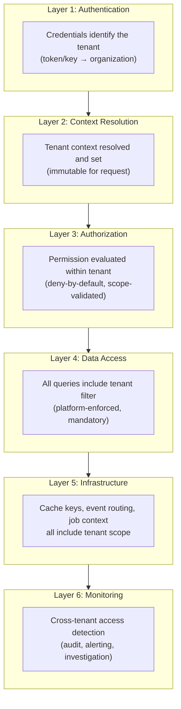

# Tenant Isolation

## Metadata

| Field | Value |
|-------|-------|
| Title | Kairo Tenant Isolation Architecture |
| Document ID | KAI-TEN-004 |
| Status | Draft |
| Version | 0.1 |
| Target Release | V1 |
| Owner | Tenant Isolation Security Architect |
| Created | 2026-07-20 |
| Last Updated | 2026-07-20 |
| Reviewers | TODO |
| Related Documents | [Multi-Tenancy Architecture](./Multi-Tenancy-Architecture.md), [Tenant Resolution](./Tenant-Resolution.md), [Tenant Hierarchy](./Tenant-Hierarchy.md), [Threat Model](../Security/Threat-Model.md), [Data Protection](../Security/Data-Protection.md), [Authorization Architecture](../Security/Authorization-Architecture.md), [Security Architecture](../Security/Security-Architecture.md), [Audit and Security Monitoring](../Security/Audit-and-Security-Monitoring.md) |
| Dependencies | [Multi-Tenancy Architecture](./Multi-Tenancy-Architecture.md), [Tenant Resolution](./Tenant-Resolution.md), [Authorization Architecture](../Security/Authorization-Architecture.md) |

---

## Purpose

This document defines the complete tenant isolation architecture for the Kairo platform. It specifies how isolation is enforced across every technical layer, identifies failure categories, and establishes defence-in-depth expectations.

Tenant isolation is the platform's most critical security property. Every other security control — authentication, authorization, encryption, audit — exists in part to support isolation. A failure in isolation exposes one tenant's data to another. This is a catastrophic trust event from which the platform may not recover commercially.

---

## Scope

This document covers:

- Isolation requirements for every technical and operational layer.
- Failure categories and their severity.
- Defence-in-depth layering.
- V1 controls and future controls.
- Explicit statements about what does and does not constitute isolation.

This document does not cover:

- Source code implementation of isolation filters.
- Physical database layout or partitioning configuration.
- Framework-specific middleware.
- Tenant resolution mechanics (defined in [Tenant Resolution](./Tenant-Resolution.md)).

---

## Isolation Principles

**No single isolation mechanism is sufficient.** Tenant isolation is achieved through defence-in-depth — multiple independent layers that each prevent cross-tenant access. A failure in one layer is contained by the remaining layers.

**Frontend filtering is not tenant isolation.** Client-side filtering is a user experience concern. It provides no security guarantee. Isolation is enforced server-side, in backend architecture.

**Hidden identifiers are not tenant isolation.** Unpredictable IDs (UUIDs) make enumeration harder. They do not prevent access. A valid resource ID from another tenant must still be rejected by authorization.

**Tenant-aware authorization is mandatory even when data queries are filtered.** Query-level filtering (WHERE organization_id = X) and authorization (does this actor have permission?) are independent controls. Both are required. Neither replaces the other.

**Data restoration must not overwrite or expose another tenant's resources.** Restoring a backup for one tenant must not inject data into another tenant's scope or make one tenant's data visible to another.

**Tenant-scoped rate limits and quotas may coexist with platform-wide protections.** Per-tenant limits prevent one tenant from monopolizing resources. Platform-wide limits protect infrastructure. Both operate simultaneously.

**Shared services must remain tenant-aware where they process tenant-owned resources.** A service being "shared" does not exempt it from tenant scoping. Every operation on tenant-owned data must be scoped, regardless of which service performs it.

---

## Defence-in-Depth

### Defence-in-Depth Rules

- Each layer operates independently. A failure at Layer 3 (authorization bypass) is caught by Layer 4 (data query scoping).
- No layer assumes the previous layer succeeded. Each layer validates its own scope.
- Monitoring (Layer 6) detects failures in all other layers after the fact.
- A successful cross-tenant access requires simultaneous failure in at least three layers. This is the design target.

---

## Isolation by Layer

### 1. Authentication

| Isolation Mechanism | Description |
|--------------------|-------------|
| Credentials are tenant-bound | API keys belong to one organization. Tokens carry organization membership. |
| Cross-tenant credentials do not exist | No credential grants access to multiple organizations simultaneously (except multi-org user switching, which requires reauthorization). |
| Revocation is tenant-scoped | Revoking one tenant's credentials does not affect another. |

### 2. Authorization

| Isolation Mechanism | Description |
|--------------------|-------------|
| Permissions are tenant-scoped | A role in Organization A grants no access in Organization B. |
| Deny-by-default | No implicit cross-tenant access exists. |
| Object-level checks | Every resource access validates that the resource belongs to the authenticated tenant. |
| ID is not access | Providing a resource ID from another tenant results in 404, not the resource. |

### 3. Application Services

| Isolation Mechanism | Description |
|--------------------|-------------|
| Tenant context is immutable per request | Services process within a single tenant context. |
| No global state carries tenant data | Application state does not bleed between requests from different tenants. |
| Error responses do not leak cross-tenant information | Errors about resources in other tenants return 404 (not 403, to prevent enumeration). |

### 4. Domain Logic

| Isolation Mechanism | Description |
|--------------------|-------------|
| Business rules execute within tenant scope | All calculations, validations, and state transitions operate on tenant-owned data only. |
| Cross-tenant business logic does not exist in V1 | No business rule references data from another organization. |
| Domain events are tenant-scoped | Events carry tenant context and are consumed within the same tenant boundary. |

### 5. Data Access

| Isolation Mechanism | Description |
|--------------------|-------------|
| Mandatory tenant filter | Every query to tenant data includes the organization ID filter. This is enforced by the platform data access layer, not by individual modules. |
| No unscoped queries | The data access layer rejects queries without tenant context for tenant-owned tables. |
| No cross-tenant joins | Queries never join data across organization boundaries. |
| Write operations are scoped | Inserts and updates carry tenant context. Data cannot be written without an owner. |

### 6. Caching

| Isolation Mechanism | Description |
|--------------------|-------------|
| Tenant-prefixed cache keys | All cache keys for tenant data include the organization ID as a prefix. |
| Platform cache interface enforces | The cache interface does not allow keys without tenant scope for tenant-specific data. |
| Cache invalidation is tenant-scoped | Invalidating one tenant's cache does not affect another. |
| Global cache is separate | Platform-level cache (non-tenant-specific data) uses a distinct namespace. |

### 7. Search

| Isolation Mechanism | Description |
|--------------------|-------------|
| Tenant-scoped indexes or mandatory filters | Search queries always include tenant scope. Results from other tenants are never returned. |
| Index isolation | Indexing processes are tenant-aware. Cross-tenant data does not enter the same unscoped index. |
| Search suggestions are tenant-scoped | Autocomplete and suggestions come from the authenticated tenant's data only. |

### 8. Background Jobs

| Isolation Mechanism | Description |
|--------------------|-------------|
| Per-job tenant context | Every job carries tenant context from its trigger. |
| Jobs execute within one tenant | A job never processes data from multiple tenants in a single execution. |
| Job failures are tenant-isolated | A failing job for Tenant A does not block or corrupt jobs for Tenant B. |
| Job results are tenant-scoped | Output of a job is stored within the tenant boundary. |

### 9. Queues

| Isolation Mechanism | Description |
|--------------------|-------------|
| Messages carry tenant context | Every queued message includes the organization ID in metadata. |
| Processing is tenant-scoped | Consumers process one tenant's message at a time within that tenant's context. |
| Poisoned messages do not affect other tenants | A repeatedly failing message from one tenant is dead-lettered without blocking other tenants' messages. |

### 10. Events

| Isolation Mechanism | Description |
|--------------------|-------------|
| Tenant context in envelope | Every event includes organization ID in its platform-managed envelope. |
| Routing is tenant-scoped | Subscribers receive only their own tenant's events. |
| Cross-tenant event delivery is impossible (V1) | No subscription mechanism delivers events across tenant boundaries. |
| Event payload does not contain other tenants' data | Publishing logic operates within tenant scope; other tenants' data is inaccessible. |

### 11. Files and Media

| Isolation Mechanism | Description |
|--------------------|-------------|
| Tenant-scoped storage paths | Files are stored in tenant-scoped locations. |
| Access control on retrieval | Retrieving a file requires authentication within the owning tenant. |
| URL generation is tenant-scoped | Pre-signed or access URLs are valid only for the owning tenant's session. |
| Uploads are tenant-attributed | Uploaded files are immediately associated with the authenticated tenant. |

### 12. Reporting

| Isolation Mechanism | Description |
|--------------------|-------------|
| Reports operate on tenant data only | Report queries are scoped to the authenticated organization. |
| Aggregate reports are tenant-internal | Aggregations span stores within an organization, never across organizations. |
| Platform-level reporting uses anonymized or aggregate data | Platform analytics never expose individual tenant data. |

### 13. Exports

| Isolation Mechanism | Description |
|--------------------|-------------|
| Exports are tenant-scoped | An export operation returns only the authenticated tenant's data. |
| Export files are tenant-attributed | Generated export files are stored within the tenant's access boundary. |
| Bulk export cannot cross tenants | Even platform operations that export data do so one tenant at a time. |

### 14. Imports

| Isolation Mechanism | Description |
|--------------------|-------------|
| Imported data is attributed to the authenticated tenant | Data imported through APIs or bulk import is assigned to the importing organization. |
| Import cannot overwrite another tenant's data | The import process operates within the authenticated scope. Cross-tenant writes are impossible. |
| Import validation includes scope checks | Referenced entities (IDs) are validated against the tenant's own data. Foreign-tenant references are rejected. |

### 15. Webhooks

| Isolation Mechanism | Description |
|--------------------|-------------|
| Registrations are tenant-scoped | Webhooks are registered within an organization. |
| Delivery carries tenant context | Outbound webhook payloads contain only the owning tenant's data. |
| Inbound webhooks resolve to the registration's tenant | External callbacks are routed to the correct tenant based on registration, not payload content. |
| One tenant's webhook failure does not affect another | Delivery retry for one tenant does not delay delivery to another. |

### 16. Integrations

| Isolation Mechanism | Description |
|--------------------|-------------|
| Credentials are tenant-scoped | Each organization has its own integration credentials. |
| Integration calls use the owning tenant's credentials | A call to an external service uses the credentials configured by that specific organization. |
| Integration data flows into the owning tenant | Data received from an integration is attributed to the organization that owns the integration. |

### 17. Notifications

| Isolation Mechanism | Description |
|--------------------|-------------|
| Notifications are tenant-scoped | A notification triggered by one tenant's event is delivered only to that tenant's users. |
| Notification content contains only the owning tenant's data | Templates are rendered with the triggering tenant's data. |
| Notification preferences are per-tenant | One tenant's notification settings do not affect another. |

### 18. Logs

| Isolation Mechanism | Description |
|--------------------|-------------|
| Logs include tenant context | Every log entry is tagged with the organization ID. |
| Tenant-visible logs are scoped | If tenants are given access to their logs, they see only their own. |
| Operational log access is controlled | Platform operators may see all logs but must have explicit authorization. |
| Log queries do not leak cross-tenant data | Query interfaces enforce scope (tenant admins see their org only). |

### 19. Metrics

| Isolation Mechanism | Description |
|--------------------|-------------|
| Per-tenant metrics are available | The platform tracks per-organization request counts, error rates, and performance. |
| Metrics visible to tenants are scoped | A tenant sees only their own metrics. |
| Aggregate metrics do not expose individual tenants | Platform-level dashboards use aggregation that prevents identifying individual tenant behavior. |

### 20. Audit Records

| Isolation Mechanism | Description |
|--------------------|-------------|
| Audit records are tenant-scoped | Every audit entry belongs to an organization. |
| Tenant audit API returns only their records | The audit query interface enforces organization scope. |
| Audit immutability prevents cross-tenant contamination | Once written, audit records cannot be modified or reassigned to a different tenant. |

### 21. Configuration

| Isolation Mechanism | Description |
|--------------------|-------------|
| Configuration is tenant-resolved | Configuration queries return values resolved for the authenticated tenant only. |
| One tenant's configuration does not affect another | Overrides at the organization or store level apply only within that tenant. |
| Configuration API is scoped | Tenants can view and modify only their own configuration. |

### 22. Feature Flags

| Isolation Mechanism | Description |
|--------------------|-------------|
| Flags are evaluated per tenant | A flag enabled for Organization A is not enabled for Organization B unless independently configured. |
| Flag evaluation includes tenant context | The flag evaluation engine receives the organization ID and resolves accordingly. |
| Flag state changes are tenant-scoped | Changing a flag's state for one tenant does not affect another. |

### 23. Rate Limits

| Isolation Mechanism | Description |
|--------------------|-------------|
| Rate limits are per-tenant | One tenant's rate limit consumption does not reduce another tenant's allowance. |
| Rate limit counters are tenant-scoped | Counters track usage per organization, not globally across tenants. |
| Exceeding a limit affects only the offending tenant | A rate-limited tenant does not degrade service for other tenants. |

### 24. Resource Quotas

| Isolation Mechanism | Description |
|--------------------|-------------|
| Quotas are per-organization | Each tenant has its own resource quota allocation. |
| Quota consumption is tracked per-tenant | One tenant approaching their quota does not affect another's availability. |
| Quota enforcement does not leak usage information | A tenant cannot determine another tenant's quota or usage. |

### 25. Administrative Tools

| Isolation Mechanism | Description |
|--------------------|-------------|
| Admin tools operate within tenant scope | Organization administrators see only their own data. |
| Platform admin tools have explicit tenant selection | Platform operators must explicitly select a tenant context (audited). |
| Admin tools do not provide cross-tenant views by default | Cross-tenant visibility requires platform-level authorization. |

### 26. Support Access

| Isolation Mechanism | Description |
|--------------------|-------------|
| Impersonation is tenant-specific | A support session targets one organization at a time. |
| Support access is read-only by default | Write access requires additional authorization. |
| Every support action is audited with tenant context | The tenant can see that support access occurred. |
| Support cannot access another tenant's data during a session | The impersonation scope is bounded to the target tenant. |

### 27. Testing Environments

| Isolation Mechanism | Description |
|--------------------|-------------|
| Test data is tenant-scoped | Test environments maintain the same tenant isolation model as production. |
| Production tenant data is not used in testing | Non-production environments use synthetic data or anonymized snapshots. |
| Test credentials access only test data | A test API key cannot access production tenant data. |

### 28. Backups and Restoration

| Isolation Mechanism | Description |
|--------------------|-------------|
| Backups preserve tenant boundaries | Backed-up data retains its tenant attribution. |
| Restoration is tenant-scoped | Restoring data for Tenant A cannot inject data into Tenant B's scope or overwrite Tenant B's data. |
| Point-in-time recovery respects isolation | A restoration to an earlier point does not mix tenants' data states. |
| Backup access is controlled | Only authorized operations personnel can access backups. Per-tenant backup extraction is possible. |

---

## Isolation Layer Matrix

| Layer | Mechanism | Enforced By | Independent of Other Layers | V1 |
|-------|-----------|-------------|:---------------------------:|:---:|
| Authentication | Tenant-bound credentials | Platform Identity | Yes | Yes |
| Context Resolution | Credential-derived context | Platform Gateway | Yes | Yes |
| Authorization | Permission within tenant scope | Platform Authorization | Yes | Yes |
| Data Access | Mandatory tenant filter | Platform Data Layer | Yes | Yes |
| Caching | Tenant-prefixed keys | Platform Cache Interface | Yes | Yes |
| Search | Tenant-scoped queries/indexes | Platform Search Interface | Yes | Yes |
| Events | Tenant-scoped routing | Platform Event Bus | Yes | Yes |
| Background Jobs | Per-job tenant context | Platform Job Framework | Yes | Yes |
| Files/Media | Tenant-scoped paths + access control | Platform Media Service | Yes | Yes |
| Webhooks | Registration-based routing | Platform Webhook Service | Yes | Yes |
| Configuration | Tenant-resolved values | Platform Configuration | Yes | Yes |
| Rate Limiting | Per-tenant counters | Platform Gateway | Yes | Yes |
| Logging | Tenant-tagged entries | Platform Logging | Yes | Yes |
| Audit | Tenant-scoped records | Platform Audit Service | Yes | Yes |
| Monitoring | Detection + alerting | Platform Security Monitoring | Yes | Yes |

Each layer is independently capable of preventing cross-tenant access. Together, they provide defence-in-depth.

---

## Isolation Failure Categories

Every failure category is classified as **Critical**. Cross-tenant access in any form is the most severe security event possible.

| Failure Category | Description | Detection |
|-----------------|-------------|-----------|
| **Cross-tenant read** | Data from Tenant B is returned to Tenant A | Authorization tests, query scoping tests, monitoring |
| **Cross-tenant write** | Tenant A's action modifies Tenant B's data | Data integrity checks, audit trail analysis |
| **Cross-tenant deletion** | Tenant A's action deletes Tenant B's data | Data integrity checks, audit trail analysis |
| **Cross-tenant metadata leakage** | Tenant A learns of Tenant B's existence or resource IDs | Error response analysis, enumeration testing |
| **Cross-tenant cache leakage** | Cached data from Tenant B is served to Tenant A | Cache key validation tests, isolation tests |
| **Cross-tenant search leakage** | Search results from Tenant B appear for Tenant A | Search isolation tests, index scoping verification |
| **Cross-tenant event leakage** | Events from Tenant B are delivered to Tenant A's subscribers | Event routing tests, subscription verification |
| **Cross-tenant notification leakage** | Notifications about Tenant B's activity reach Tenant A's users | Notification routing tests |
| **Cross-tenant export leakage** | Export for Tenant A includes Tenant B's data | Export scoping tests, data integrity verification |
| **Cross-tenant log leakage** | Tenant A views log entries from Tenant B | Log access control tests |
| **Cross-tenant configuration leakage** | Tenant A sees Tenant B's configuration values | Configuration API scoping tests |
| **Cross-tenant operational interference** | Tenant A's activity degrades Tenant B's performance or availability | Load testing, noisy-neighbor detection |

### Failure Response

All cross-tenant isolation failures are:

- Classified as **Critical (S1)** security incidents per [Incident Response](../Security/Incident-Response.md).
- Investigated immediately with full forensic analysis.
- Communicated to affected tenants.
- Resolved before the platform resumes normal operations for affected surfaces.
- Subject to post-incident review with corrective action.

---

## V1 Controls vs. Future Controls

| Layer | V1 Control | Future Control |
|-------|-----------|----------------|
| Authentication | Tenant-bound credentials. Single-org API keys. Multi-org tokens with explicit selection. | Federated tenant resolution. Certificate-based tenant binding. |
| Authorization | Platform-enforced deny-by-default. Object-level tenant validation. | ABAC with tenant attributes. Cross-org authorization for marketplace. |
| Data Access | Mandatory tenant filter on all queries (platform data layer). | Per-tenant database isolation for enterprise tenants. Tenant-specific encryption keys. |
| Caching | Tenant-prefixed keys. Platform interface enforcement. | Dedicated cache instances per high-value tenant. |
| Search | Tenant-scoped queries with mandatory filter. | Per-tenant search indexes for large tenants. |
| Events | Tenant-scoped routing. Context in envelope. | Per-tenant event partitions for high-volume tenants. |
| Background Jobs | Per-job context. Platform framework enforcement. | Per-tenant job queues for isolation and fair scheduling. |
| Rate Limiting | Per-tenant counters. Per-tenant limits. | Adaptive per-tenant limits based on subscription tier. |
| Monitoring | Cross-tenant access detection and alerting. | Automated response (immediate access revocation on detection). |
| Backup/Restore | Tenant-attributed backups. Scoped restoration. | Per-tenant backup schedules. Tenant-initiated point-in-time recovery. |
| Files/Media | Tenant-scoped storage paths. Access-controlled retrieval. | Dedicated storage accounts per enterprise tenant. |

---

## Shared Services Isolation Responsibilities

Shared platform services that process tenant-owned resources must maintain isolation:

| Shared Service | Tenant Isolation Responsibility |
|---------------|-------------------------------|
| Search | Index and query within tenant scope. Never return cross-tenant results. |
| Media | Store and serve within tenant scope. Never serve another tenant's assets. |
| Notifications | Route and render within tenant scope. Never deliver cross-tenant notifications. |
| Audit | Record and query within tenant scope. Never expose cross-tenant audit entries. |
| Configuration | Resolve within tenant scope. Never return another tenant's overrides. |
| Background Processing | Execute within tenant scope. Never process cross-tenant data in a single job. |
| Integration | Call external services with the correct tenant's credentials. Never use wrong-tenant credentials. |
| Export | Generate within tenant scope. Never include cross-tenant data. |

---

## Version Gate

| Version | Tenant Isolation Gate |
|---------|---------------------|
| V1 | All 15 isolation layers are operational. Every layer independently prevents cross-tenant access. Automated isolation tests verify cross-tenant denial for every data-accessing path. Failure detection and alerting are active. All shared services maintain tenant isolation. |
| V2 | Isolation is validated through adversarial testing (penetration testing with cross-tenant focus). Noisy-neighbor detection prevents operational interference. Per-tenant resource isolation options are available for enterprise tenants. |
| V3 | Physical isolation options (dedicated database, dedicated deployment) are available. Per-tenant encryption keys provide cryptographic isolation. Automated remediation responds to detected isolation failures. |

---

## Decision Summary

| Decision | Rationale |
|----------|-----------|
| Defence-in-depth (multiple layers) | No single mechanism is perfect. Multiple independent layers ensure that a failure in one is caught by another. |
| All failure categories are Critical | Any cross-tenant access — read, write, metadata, cache, or operational — is a catastrophic trust failure. No severity reduction is acceptable. |
| Frontend filtering is explicitly not isolation | Stating this prevents anyone from arguing that a client-side filter provides security. Backend enforcement is the boundary. |
| Hidden IDs are explicitly not isolation | Stating this prevents security-by-obscurity reasoning. Authorization is required regardless of ID predictability. |
| Shared services have explicit isolation responsibilities | "Shared" does not mean "unscoped." Explicit responsibilities prevent shared services from becoming isolation gaps. |
| Backup restoration is scoped | Restoration is a high-risk operation. Without explicit scoping, it could inject or expose cross-tenant data. |
| Rate limits are per-tenant | Global-only rate limits allow one tenant to consume another's capacity. Per-tenant limits prevent this. |

---

## Alternatives Considered

| Alternative | Rejected Because |
|------------|-----------------|
| Single-layer isolation (data filter only) | A bug in the filter exposes all tenants. Defence-in-depth prevents single-point failures. |
| Physical isolation for all tenants (V1) | Disproportionate cost for V1 scale. Logical isolation with defence-in-depth is proven and sufficient. Physical isolation remains a future option. |
| Trusting application logic for isolation | Application bugs are inevitable. Platform-level enforcement is more reliable than per-module correctness. |
| Cross-tenant access for platform analytics | Platform analytics must use anonymized or aggregated data. Direct cross-tenant data access for any purpose creates precedent and risk. |

---

## Trade-offs

| Trade-off | Accepted Because |
|-----------|-----------------|
| Per-request tenant validation adds latency | Milliseconds of overhead per request. Acceptable for the guarantee of correct scoping on every operation. |
| Tenant-prefixed cache keys reduce cache sharing efficiency | Isolation requires separate cache entries per tenant. The performance cost is offset by per-tenant cache hit rates that are still high. |
| Per-tenant rate limits require more counters | More counters mean more state. Acceptable because per-tenant fairness prevents noisy-neighbor degradation. |
| Defence-in-depth adds implementation complexity | More layers mean more code. Acceptable because each layer independently catches failures that other layers might miss. |
| Mandatory context in async processing adds framework constraints | Jobs and events must carry context. This adds metadata overhead. Acceptable because context-free async processing is an isolation gap. |

---

## Architecture Impact

| Concern | Impact |
|---------|--------|
| Platform data layer | Must enforce mandatory tenant filter on every query. Must reject unscoped queries. Must prevent cross-tenant joins. |
| Platform cache interface | Must include tenant prefix in all keys for tenant data. Must prevent keyless access for tenant data. |
| Platform event bus | Must include tenant context in all event envelopes. Must route events within tenant boundaries. |
| Platform job framework | Must carry tenant context on every job. Must reject jobs without context. Must isolate failures per tenant. |
| API gateway | Must resolve and validate tenant context. Must apply per-tenant rate limits. |
| Module design | Must use platform data/cache/event interfaces (which enforce isolation). Must not implement custom isolation logic. |
| Testing | Must include cross-tenant isolation tests for every data-accessing path. Must test cache, event, and search isolation. |
| Monitoring | Must detect cross-tenant access patterns. Must alert on isolation failures with Critical severity. |

---

## Implementation Impact

| Area | Impact |
|------|--------|
| Modules | Must use platform-provided tenant-scoped interfaces for all data access, caching, events, and media. Must not implement custom tenant filtering. Must not bypass platform interfaces. |
| APIs | Must validate tenant context on every request. Must return 404 (not 403) for out-of-scope resources. Must not leak cross-tenant information in error responses. |
| Background jobs | Must carry tenant context. Must validate on execution. Must fail safely on missing context. |
| Events | Must include tenant envelope. Must validate on consumption. Must never process cross-tenant events. |
| Cache | Must use platform cache interface with tenant scoping. Must not construct keys without tenant prefix for tenant data. |
| Search | Must apply tenant filter on every query. Must verify index isolation. |
| Exports/Imports | Must scope all operations. Must validate all referenced IDs against tenant ownership. |
| Backups | Must attribute data to tenants. Must scope restoration. Must not cross-contaminate during restore. |
| Testing | Must include dedicated cross-tenant isolation test suites. Must test all 12 failure categories. |

---

## Security Responsibilities

| Role | Isolation Responsibilities |
|------|--------------------------|
| Tenant Isolation Architect | Defines isolation architecture. Reviews isolation-impacting changes. Validates defence-in-depth coverage. |
| Platform Team | Implements all isolation mechanisms in platform interfaces. Ensures modules cannot bypass isolation. |
| Product Teams | Use platform interfaces exclusively. Write isolation tests. Report potential isolation concerns. |
| Security Team | Conducts adversarial isolation testing. Treats any isolation failure as Critical. Validates detection coverage. |
| Operations | Monitors for isolation failures. Responds immediately to alerts. Manages backup scoping. |

---

## Out of Scope

This document does not define:

- Database partitioning strategy or query filter implementation — defined in module/data specifications.
- Middleware code for context enforcement — defined in development standards.
- Specific cache key formats — defined in development standards.
- Physical infrastructure isolation topology — defined in infrastructure architecture.
- Incident response procedures for isolation failures — defined in [Incident Response](../Security/Incident-Response.md).

---

## Future Considerations

- **Cryptographic tenant isolation** — Per-tenant encryption keys that make cross-tenant data access cryptographically impossible even with direct storage access.
- **Physical isolation for enterprise** — Dedicated database and/or deployment for tenants with extreme isolation requirements.
- **Isolation compliance certification** — Formal third-party verification of tenant isolation mechanisms.
- **Automated isolation testing** — Continuous cross-tenant access attempts in production to validate isolation holds under real conditions.
- **Tenant isolation SLAs** — Formal guarantees about isolation enforcement, with defined remediation and compensation for failures.
- **Isolation health scoring** — Per-layer isolation health metrics with proactive alerting when confidence degrades.

---

## Future Refactoring Triggers

This document should be revisited when:

- Cross-organization sharing is introduced (marketplace model requires controlled isolation relaxation).
- Physical isolation options are implemented (new isolation layer with different characteristics).
- Per-tenant encryption keys are implemented (adds cryptographic isolation layer).
- A cross-tenant isolation failure occurs (validate and strengthen affected layer).
- New shared services are introduced (must define their isolation responsibilities).
- Multi-region deployment introduces region-level isolation concerns.
- The Payments product introduces PCI-scoped isolation within a tenant.

---

## Change History

| Version | Date | Author | Description |
|---------|------|--------|-------------|
| 0.1 | 2026-07-20 | Tenant Isolation Security Architect | Initial draft |
