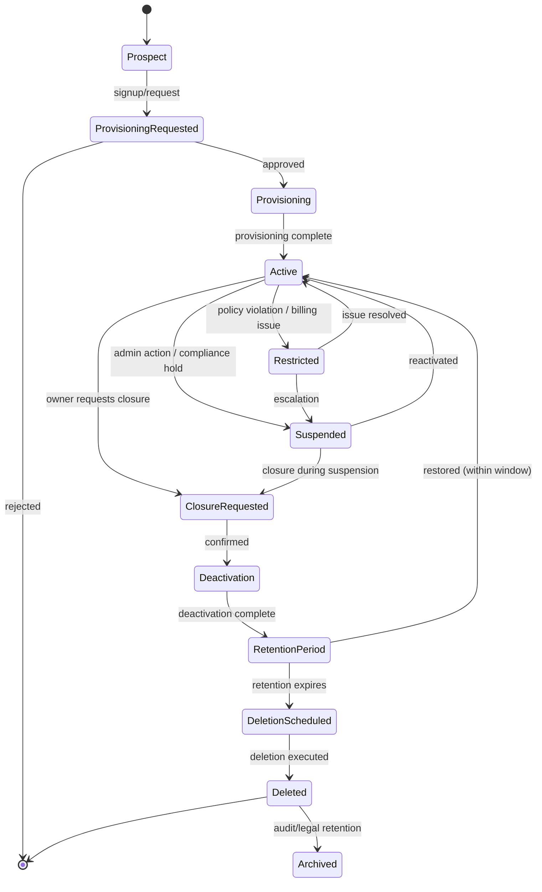

# Tenant Lifecycle

## Metadata

| Field | Value |
|-------|-------|
| Title | Kairo Tenant Lifecycle Architecture |
| Document ID | KAI-TEN-008 |
| Status | Draft |
| Version | 0.1 |
| Target Release | V1 |
| Owner | Tenant Lifecycle Architect |
| Created | 2026-07-20 |
| Last Updated | 2026-07-20 |
| Reviewers | TODO |
| Related Documents | [Multi-Tenancy Architecture](./Multi-Tenancy-Architecture.md), [Tenant Configuration](./Tenant-Configuration.md), [Tenant Isolation](./Tenant-Isolation.md), [Platform Lifecycle](../Platform-Lifecycle.md), [Data Protection](../Security/Data-Protection.md), [Incident Response](../Security/Incident-Response.md), [Organization Model](../../05-Platform-Core/Organization-Model.md) |
| Dependencies | [Multi-Tenancy Architecture](./Multi-Tenancy-Architecture.md), [Organization Model](../../05-Platform-Core/Organization-Model.md) |

---

## Purpose

This document defines the complete lifecycle of a tenant (organization) in the Kairo platform — from initial interest through provisioning, active operation, suspension, closure, deletion, and archival. It specifies what happens to every tenant-dependent subsystem at each stage and the rules governing transitions between stages.

Tenant lifecycle management is a distributed platform operation. Deleting a tenant is not deleting a record. It is coordinating the cleanup of data, credentials, events, caches, search indexes, backups, and audit records across every subsystem that holds tenant-owned resources.

---

## Scope

This document covers:

- Lifecycle stages and transitions.
- Operations performed at each lifecycle stage.
- Implications for all tenant-dependent subsystems.
- Suspension, deletion, restoration, and archival rules.
- V1 requirements and future capabilities.

This document does not cover:

- Billing implementation or subscription management — business concern documented separately.
- Database migration scripts or cleanup jobs — implementation detail.
- API endpoint contracts for lifecycle management — defined in API specifications.
- Customer support procedures — defined in operational documentation.

---

## Lifecycle State Diagram

---

## Lifecycle Stages

### 1. Prospect

A potential tenant has expressed interest but has not been provisioned.

| Aspect | Detail |
|--------|--------|
| Platform state | No organization exists. No data boundary established. |
| Data | None within the platform. |
| Credentials | None issued. |
| Transition | Moves to Provisioning Requested when signup/request is submitted. |

---

### 2. Provisioning Requested

A request to create an organization has been submitted.

| Aspect | Detail |
|--------|--------|
| Platform state | Request is recorded. No organization exists yet. |
| Validation | Identity of the requestor is verified. Request may require approval. |
| Transition | Approved → Provisioning. Rejected → End. |

---

### 3. Provisioning

The organization is being created. Platform resources are being allocated.

| Aspect | Detail |
|--------|--------|
| Operations performed | Organization record created. Tenant boundary established. Initial owner user created/associated. Default configuration applied. First store created (if applicable). Audit trail initiated. |
| Platform state | Organization exists but is not yet operational. |
| Data | Minimal (org identity, owner identity, default configuration). |
| Credentials | Initial owner credentials provisioned. |
| Transition | Provisioning complete → Active. |

---

### 4. Active

The organization is fully operational. All platform capabilities are available.

| Aspect | Detail |
|--------|--------|
| Operations available | Full commerce operations. User management. Configuration. Integrations. API key issuance. Store creation. All business activities. |
| Platform state | Fully operational. All subsystems serve the tenant. |
| Data | Growing. Products, orders, customers, inventory managed normally. |
| Credentials | Active. All API keys, tokens, and sessions function normally. |
| Transition | Restriction → Restricted. Suspension → Suspended. Closure request → Closure Requested. |

---

### 5. Restricted

The organization has limited capabilities due to a policy violation, billing issue, or platform decision.

| Aspect | Detail |
|--------|--------|
| Operations available | Read access may continue. Write operations may be limited. New resource creation may be blocked. |
| Platform state | Partially operational. Specific capabilities are disabled. |
| Data | Preserved. No deletion. |
| Credentials | Active (may be limited in scope). |
| Notifications | Tenant is notified of restriction and resolution path. |
| Transition | Issue resolved → Active. Escalation → Suspended. |

---

### 6. Suspended

The organization is fully inactive. No business operations are permitted.

| Aspect | Detail |
|--------|--------|
| Operations available | None. API requests return 403. Background jobs are paused. Webhooks are not delivered. |
| Platform state | Organization exists. Data is preserved. All operations are blocked. |
| Data | Fully preserved. Accessible for export if permitted during suspension. |
| Credentials | Not revoked but not accepted. Requests with valid credentials are rejected with suspension-specific messaging. |
| Isolation | Maintained. Suspension does not weaken isolation. |
| Transition | Reactivated → Active. Closure → Closure Requested. |

**Suspended tenants must not continue normal business operations.** Suspension blocks all data modification, order processing, event delivery, and integration activity. Only administrative access for the purpose of resolution may be permitted.

---

### 7. Closure Requested

The organization owner has requested closure, or closure has been initiated by the platform.

| Aspect | Detail |
|--------|--------|
| Operations available | Export operations are available (data portability). Normal business operations may continue for a defined grace period. |
| Platform state | Closure is pending. The tenant is notified of the timeline and their data export rights. |
| Data | Accessible for export during the grace period. |
| Credentials | Active during grace period (if business operations continue) or suspended (if closure is immediate). |
| Transition | Confirmed → Deactivation. Cancelled (within grace) → Active. |

---

### 8. Deactivation

The organization is being shut down. Access is revoked. Data is preserved for the retention period.

| Aspect | Detail |
|--------|--------|
| Operations performed | All API access revoked. All sessions terminated. All API keys deactivated. All webhooks disabled. All integrations disconnected. Background jobs cancelled. Search indexes removed. Caches purged. |
| Platform state | Organization is no longer operational. Data exists but is inaccessible through normal APIs. |
| Data | Preserved for the retention period. Available for platform-initiated export if not already completed. |
| Credentials | All revoked. No credential for this organization is accepted. |
| Transition | Deactivation complete → Retention Period. |

---

### 9. Retention Period

Data is retained for a defined period after deactivation.

| Aspect | Detail |
|--------|--------|
| Purpose | Allows restoration if closure was accidental or reconsidered. Satisfies legal/regulatory retention obligations. |
| Platform state | Organization is deactivated. Data exists in storage. No operations are possible. |
| Data | Preserved but inaccessible through APIs. May be accessible to platform operations for authorized purposes. |
| Duration | Defined per platform policy (days to months). Communicated to the tenant before closure. |
| Transition | Retention expires → Deletion Scheduled. Restoration requested → Active (if permitted). |

---

### 10. Deletion Scheduled

The retention period has elapsed. Data deletion is queued.

| Aspect | Detail |
|--------|--------|
| Platform state | Deletion is pending execution. This is the last point at which restoration is feasible (with extraordinary measures). |
| Data | Still exists but marked for deletion. |
| Transition | Deletion executed → Deleted. |

---

### 11. Deleted

Business data has been permanently removed.

| Aspect | Detail |
|--------|--------|
| Operations performed | All tenant business data removed from primary storage. All tenant data removed from backups beyond the backup retention window. Organization record marked as deleted. |
| Platform state | Organization ID is retired. It cannot be reused. |
| Data | Business data is gone. Audit records may be retained separately (see Archived). |
| Credentials | Permanently invalidated. Cannot be reissued or reconnected. |
| **This is irreversible.** |  |

**Deleting the primary application record is not sufficient tenant deletion.** Deletion must encompass all subsystems: database records, cache entries, search indexes, event subscriptions, webhook registrations, media files, export files, integration credentials, and backup references.

---

### 12. Restored (Where Allowed)

A deactivated or retention-period organization is restored to active status.

| Aspect | Detail |
|--------|--------|
| Conditions | Restoration is permitted only during the retention period. After deletion, restoration is impossible. |
| Operations performed | Organization reactivated. New credentials issued (old ones are not reconnected). Configuration restored. New API keys required. Webhooks must be re-registered. Integrations must be re-configured. |
| Safeguards | See Restoration Safeguards below. |
| Transition | Restored → Active. |

---

### 13. Archived (Where Required)

Audit records and legally required data are preserved after business data deletion.

| Aspect | Detail |
|--------|--------|
| What is retained | Audit trail entries. Compliance-relevant records. Legal-hold data. |
| What is NOT retained | Business data (products, orders, customers, inventory). Credentials. Configuration. |
| Access | Platform compliance/legal access only. Not accessible through tenant APIs (organization no longer exists). |
| Retention | Per regulatory and legal requirements. May be years. |
| **Audit or legally retained records may have different retention rules** than business data. | They outlive the organization. |

---

## Lifecycle Operations

### Organization Creation

| Step | Subsystem | Operation |
|------|-----------|-----------|
| 1 | Identity | Create organization record. Establish tenant boundary. |
| 2 | Identity | Create or associate initial owner user. |
| 3 | Configuration | Apply platform and product defaults. |
| 4 | Audit | Record organization creation event. |
| 5 | Commerce (optional) | Create default store if provisioning includes store setup. |

### Initial Owner Assignment

| Step | Operation |
|------|-----------|
| 1 | Owner user is created or an existing user is associated as the org owner. |
| 2 | Owner is assigned the Organization Owner role with full administrative permissions. |
| 3 | Owner receives credential provisioning (password setup, MFA enrollment invitation). |

### Store Creation

| Step | Operation |
|------|-----------|
| 1 | Store record created within the organization. |
| 2 | Default store configuration inherits from organization. |
| 3 | Default channel created within the store. |
| 4 | Audit records store creation. |

### User Invitations

| Step | Operation |
|------|-----------|
| 1 | Admin invites user (email). |
| 2 | Invitation is scoped to the organization. |
| 3 | Accepting creates membership in the organization with assigned role. |
| 4 | User creates credentials or links existing identity (multi-org). |

### Application and API Credential Creation

| Step | Operation |
|------|-----------|
| 1 | Admin creates API key (publishable or secret). |
| 2 | Key is bound to the organization. Scope is configured. |
| 3 | Key material is shown once (secret keys). |
| 4 | Audit records key creation (identifier, scope, creator). |

### Configuration Initialization

| Step | Operation |
|------|-----------|
| 1 | Platform defaults are inherited. |
| 2 | Organization-level overrides are available for admin configuration. |
| 3 | Store-level overrides become available when stores are created. |

### Feature Activation

| Step | Operation |
|------|-----------|
| 1 | Platform evaluates feature flags for the organization. |
| 2 | Features enabled for the organization become available. |
| 3 | Feature activation is audited. |

### Integration Activation

| Step | Operation |
|------|-----------|
| 1 | Admin configures integration (selects provider, configures settings). |
| 2 | Integration credentials are stored in the secret store (org-scoped). |
| 3 | Integration health check validates connectivity. |
| 4 | Audit records integration activation. |

### Suspension

| Step | Operation |
|------|-----------|
| 1 | Organization status set to Suspended. |
| 2 | All API requests for this org begin returning 403 (suspended). |
| 3 | Background jobs for this org are paused. |
| 4 | Webhook deliveries for this org are paused. |
| 5 | Integration calls for this org are halted. |
| 6 | Notifications for this org are suppressed (except suspension notices). |
| 7 | Audit records suspension (actor, reason, timestamp). |

### Reactivation

| Step | Operation |
|------|-----------|
| 1 | Organization status set to Active. |
| 2 | API requests are accepted again. |
| 3 | Background jobs resume. |
| 4 | Webhook deliveries resume. |
| 5 | Integrations reconnect. |
| 6 | Audit records reactivation. |

### Ownership Transfer

| Step | Operation |
|------|-----------|
| 1 | Current owner initiates transfer (or platform initiates under defined conditions). |
| 2 | New owner is verified (identity, membership). |
| 3 | Owner role is transferred. Previous owner's role is adjusted. |
| 4 | Audit records ownership transfer with full context. |
| 5 | New owner receives notification of transfer completion. |

### Export

| Step | Operation |
|------|-----------|
| 1 | Authorized user requests data export. |
| 2 | Export is scoped to the organization (all stores or specific store). |
| 3 | Export is generated in machine-readable format. |
| 4 | Export excludes secrets and internal metadata. |
| 5 | Audit records export (scope, requestor, timestamp). |

### Closure and Deletion

| Step | Operation |
|------|-----------|
| 1 | Owner requests closure. Grace period begins. |
| 2 | Export is offered/reminder sent. |
| 3 | Closure is confirmed. Deactivation begins. |
| 4 | All credentials revoked. All access terminated. |
| 5 | Retention period begins. Data preserved but inaccessible. |
| 6 | Retention expires. Deletion scheduled. |
| 7 | Deletion executes across all subsystems (see Deletion as Distributed Operation). |
| 8 | Organization ID retired. Business data gone. Audit archived. |

---

## Deletion as a Distributed Operation

**Tenant deletion must be deliberate, authorized, and auditable.**

Deletion is not a single database operation. It is coordinated across every subsystem:

| Subsystem | Deletion Action |
|-----------|----------------|
| Primary database | Remove all rows with the organization's tenant ID |
| Cache | Purge all keys prefixed with the organization's tenant scope |
| Search indexes | Remove all indexed documents for the organization |
| Event bus | Remove all subscriptions. Purge undelivered events. |
| Webhook registrations | Remove all registrations for the organization |
| Media/file storage | Remove all assets belonging to the organization |
| Integration credentials | Remove from secret store |
| API keys | Remove all keys for the organization |
| User memberships | Remove organization membership (not the user identity, if multi-org) |
| Configuration | Remove all organization and store overrides |
| Background jobs | Cancel all pending/scheduled jobs for the organization |
| Backups | Data is removed from backups as they rotate beyond the backup retention window |
| Export files | Remove any generated export files |
| Audit records | Moved to archive (not deleted — retained per compliance) |

### Deletion Rules

- Deletion is authorized by the organization owner (closure) or by platform administration (for cause, with governance).
- Deletion is audited (the act of deletion is recorded even after the data is gone).
- Deletion is verified. A post-deletion check confirms all subsystems have completed cleanup.
- Deletion is irreversible. No "undo" after the deletion stage completes.
- Organization IDs are never reused. This prevents stale references from accidentally associating with a new tenant.

---

## Lifecycle Implications by Subsystem

| Subsystem | Active | Restricted | Suspended | Deactivated | Deleted |
|-----------|:------:|:----------:|:---------:|:-----------:|:-------:|
| Authentication | Accepted | Accepted | Rejected (403) | Rejected (401) | Rejected (401) |
| Authorization | Evaluated | Evaluated (may limit writes) | N/A (blocked before auth-z) | N/A | N/A |
| API access | Full | Limited | Blocked | Blocked | Blocked |
| Background jobs | Running | Running (may limit) | Paused | Cancelled | Removed |
| Webhooks (outbound) | Delivered | Delivered | Paused | Disabled | Removed |
| Webhooks (inbound) | Processed | Processed | Rejected | Rejected | Rejected |
| Integrations | Active | Active | Halted | Disconnected | Removed |
| Notifications | Delivered | Delivered | Suppressed | None | None |
| Billing (direction) | Active | May trigger restriction | Paused/frozen | Closed | N/A |
| Data access | Full | Full (or read-only) | Preserved (no access) | Preserved (no access) | Gone |
| Data export | Available | Available | May be permitted | Platform-only | Impossible |
| Audit records | Generated | Generated | Generated (suspension events) | Final events recorded | Archived |
| Backups | Included | Included | Included | Included (during retention) | Rotated out |
| Search indexes | Active | Active | Frozen | Removed | Removed |
| Caches | Active | Active | Purged (or frozen) | Purged | N/A |

---

## Restoration Safeguards

**Restoration must preserve tenant ownership.**

When a deactivated organization is restored to active:

| Safeguard | Rule |
|-----------|------|
| Identity verified | Restoration is authorized by the original owner or platform administration. |
| Ownership preserved | The organization is restored under its original owner. Restoration does not transfer ownership. |
| Credentials are new | **Reprovisioning must not accidentally reconnect stale credentials or webhooks.** All API keys and credentials are newly issued. Old keys are permanently invalid. |
| Webhooks re-registered | All webhook registrations are cleared. The owner must re-register webhooks after restoration. |
| Integrations re-configured | Integration credentials must be re-configured. Old secrets are not restored. |
| Configuration preserved | Configuration settings (non-secret) are preserved and restored. |
| Data preserved | Business data is restored to its state at deactivation time. |
| Audit trail continuous | The audit trail includes the deactivation, retention, and restoration events. |
| Stale references cleared | Any external references that could auto-reconnect (cached tokens, webhook URLs) are invalidated. |

### Why Stale Reconnection Is Prohibited

If old credentials or webhooks were automatically restored:

- Compromised credentials from before deactivation would become active again.
- Webhook URLs that now point to different systems would receive data.
- Integration credentials that were rotated by the provider would fail.

All external connections are treated as new after restoration.

---

## V1 Baseline

| Capability | V1 Status |
|-----------|-----------|
| Organization creation (provisioning) | Required |
| Active state with full operations | Required |
| Suspension (block all operations, preserve data) | Required |
| Reactivation from suspension | Required |
| Closure request with grace period | Required |
| Deactivation (revoke all access) | Required |
| Data export before/during closure | Required |
| Retention period (configurable) | Required |
| Deletion (distributed, verified) | Required |
| Audit preservation after deletion | Required |
| Restoration within retention window | Required |
| Credential invalidation on deactivation | Required |
| Stale credential prevention on restoration | Required |
| Organization ID non-reuse | Required |
| Lifecycle event auditing | Required |

## Future Capabilities

| Capability | Target Version | Description |
|-----------|---------------|-------------|
| Automated restriction on billing failure | V2+ | Platform restricts org when billing threshold is exceeded |
| Self-service reactivation | V2+ | Owner reactivates after resolving suspension cause (payment, policy) |
| Scheduled deletion automation | V2+ | Retention expiry triggers automated deletion without manual intervention |
| Legal hold (prevent deletion) | V2+ | Legal hold overrides scheduled deletion during legal proceedings |
| Tenant hibernation | V3+ | Long-term inactive tenants reduce resource consumption while preserving data |
| Cross-subsystem deletion orchestration | V2+ | Coordinated deletion workflow with per-subsystem confirmation |
| Deletion verification dashboard | V2+ | Operations visibility into deletion completion per subsystem |
| Automated export on closure | V2+ | Platform generates and delivers export automatically when closure is confirmed |

---

## Version Gate

| Version | Tenant Lifecycle Gate |
|---------|---------------------|
| V1 | Full lifecycle (provisioning through deletion) is operational. Suspension blocks all operations. Deactivation revokes all credentials. Retention period preserves data. Deletion removes data from all subsystems. Restoration issues new credentials (no stale reconnection). Audit is preserved beyond deletion. |
| V2 | Automated restriction and self-service reactivation are operational. Deletion orchestration is coordinated with verification. Legal hold capability prevents premature deletion. |
| V3 | Tenant hibernation reduces resource usage for long-inactive tenants. Full lifecycle analytics (time in each stage, common transition patterns). |

---

## Decision Summary

| Decision | Rationale |
|----------|-----------|
| Suspension blocks all operations | A suspended tenant should not continue processing orders, delivering events, or consuming resources. Suspension is meaningful only if it is complete. |
| Deletion is distributed and verified | Data exists in many subsystems. Deleting one record leaves orphaned data everywhere. Verified deletion confirms completeness. |
| Credentials are never restored | Old credentials may be compromised. Automatic restoration of credentials creates a security risk. New credentials are safer. |
| Retention period exists between deactivation and deletion | Protects against accidental closure. Satisfies regulatory retention. Provides a restoration window. |
| Audit outlives business data | Compliance requires retaining records of what happened even after the business relationship ends. |
| Organization IDs are never reused | Reuse could associate stale references (backup data, logs, external system references) with the wrong tenant. |
| Lifecycle transitions are audited | Every state change has accountability. Who changed the state, when, and why is recorded. |

---

## Alternatives Considered

| Alternative | Rejected Because |
|------------|-----------------|
| Soft-delete only (never physically remove data) | Unbounded storage growth. Compliance requires actual deletion for privacy regulations. Cost increases indefinitely. |
| Immediate deletion on closure request | No recovery window. Accidental closure would be catastrophic. No time for data export. |
| Restore old credentials on reactivation | Security risk. Credentials may have been compromised during or before the inactive period. |
| Delete audit records with business data | Regulatory obligation to retain records of processing. Audit must outlive the data it describes. |
| Reuse organization IDs | Stale references in logs, backups, and external systems could accidentally associate with a new tenant. |

---

## Trade-offs

| Trade-off | Accepted Because |
|-----------|-----------------|
| Retention period delays storage reclamation | The recovery window and compliance benefits outweigh the storage cost for the defined retention duration. |
| Distributed deletion adds complexity | The alternative (single-point deletion) leaves orphaned data. Complexity is justified by completeness. |
| New credentials on restoration adds friction | The user must re-create keys and re-configure integrations. This friction prevents security risks from stale credentials. |
| Suspension affects all operations (no partial) | Partial suspension is ambiguous and hard to enforce consistently. Complete suspension is clear and enforceable. |

---

## Architecture Impact

| Concern | Impact |
|---------|--------|
| All subsystems | Must support lifecycle state awareness. Must respect suspension (block operations). Must participate in deletion (remove tenant data). |
| API gateway | Must check organization lifecycle state. Must reject requests for suspended/deactivated tenants. |
| Background processing | Must pause jobs for suspended tenants. Must cancel jobs for deactivated tenants. |
| Event bus | Must pause delivery for suspended tenants. Must remove subscriptions on deactivation. |
| Secret store | Must remove credentials on deactivation. Must not restore old credentials on reactivation. |
| Cache | Must purge on suspension/deactivation. Must not serve stale data from a previous lifecycle state. |
| Search | Must remove indexes on deactivation. Must rebuild on restoration. |
| Audit | Must continue recording through all lifecycle stages. Must preserve records beyond deletion. |

---

## Implementation Impact

| Area | Impact |
|------|--------|
| Modules | Must respect organization lifecycle state. Must not process requests for non-active tenants. Must participate in deletion cleanup for their owned data. |
| Platform services | Must implement lifecycle state checks. Must coordinate deletion across their managed resources. |
| Operations | Must manage suspension and reactivation. Must monitor deletion progress. Must handle restoration requests. |
| Testing | Must validate state transition behavior. Must verify suspension blocks operations. Must verify deletion completeness. Must verify restoration safeguards. |

---

## Security Responsibilities

| Role | Lifecycle Responsibilities |
|------|--------------------------|
| Tenant Lifecycle Architect | Defines lifecycle architecture. Reviews lifecycle-impacting changes. |
| Platform Team | Implements lifecycle state management, transition logic, and deletion coordination. |
| Operations | Executes suspension/reactivation. Monitors deletion. Handles restoration. |
| Organization Owner | Initiates closure. Manages export. Authorizes restoration. |
| Security Team | Reviews suspension decisions. Validates deletion completeness. Audits restoration safeguards. |
| Legal (future) | Defines legal-hold requirements. Determines archive retention periods. |

---

## Out of Scope

This document does not define:

- Billing implementation or subscription management — business concern.
- Database scripts for data deletion — implementation detail.
- API endpoint contracts for lifecycle operations — defined in API specifications.
- Customer communication templates for lifecycle events — defined in operations documentation.
- Legal retention period specifics per jurisdiction — defined in compliance documentation.

---

## Future Considerations

- **Automated lifecycle management** — Rules-based transitions (e.g., auto-restrict on billing failure, auto-delete on retention expiry).
- **Lifecycle webhooks** — Notify external systems of lifecycle state changes for the integration ecosystem.
- **Tenant migration during lifecycle** — Moving a tenant between infrastructure while preserving lifecycle state.
- **Lifecycle analytics** — Understanding common paths through the lifecycle for product and retention improvement.
- **Tenant health scoring** — Proactive identification of tenants approaching suspension or closure triggers.
- **Partial restoration** — Restoring specific data (e.g., one store) rather than the full organization.

---

## Future Refactoring Triggers

This document should be revisited when:

- Legal hold capability is required (prevents deletion during legal proceedings).
- Automated deletion orchestration is implemented (coordination workflow across subsystems).
- Multi-region deployment introduces region-specific retention requirements.
- Billing integration introduces automated restriction/suspension triggers.
- A deletion failure leaves orphaned data (validate and strengthen deletion coordination).
- Tenant hibernation is evaluated for long-inactive tenants.
- A restoration incident reveals safeguard gaps.

---

## Change History

| Version | Date | Author | Description |
|---------|------|--------|-------------|
| 0.1 | 2026-07-20 | Tenant Lifecycle Architect | Initial draft |
