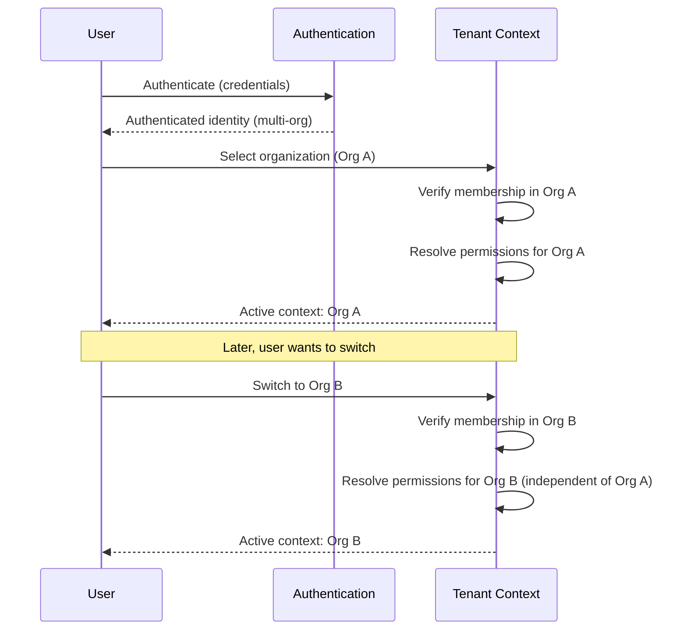
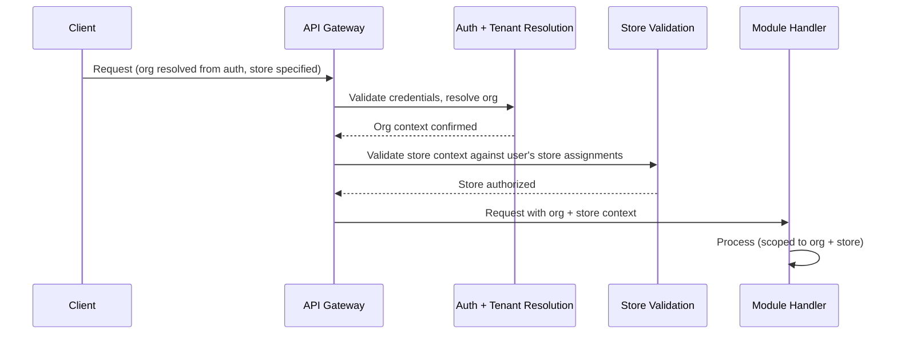
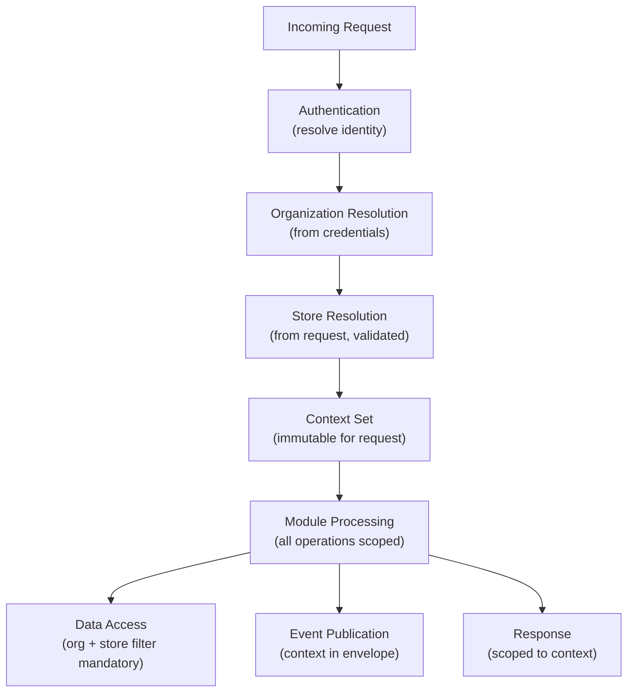
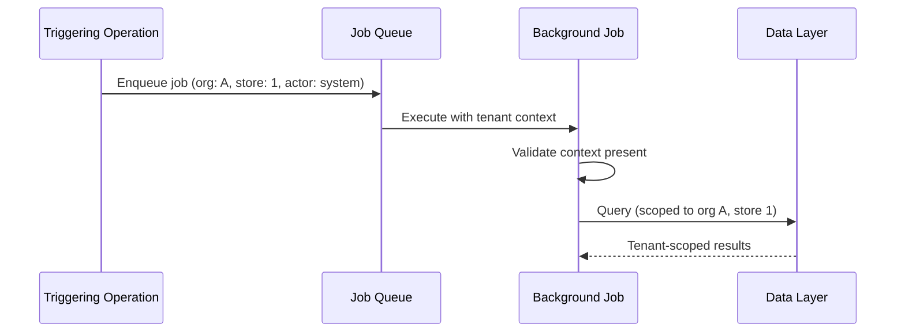
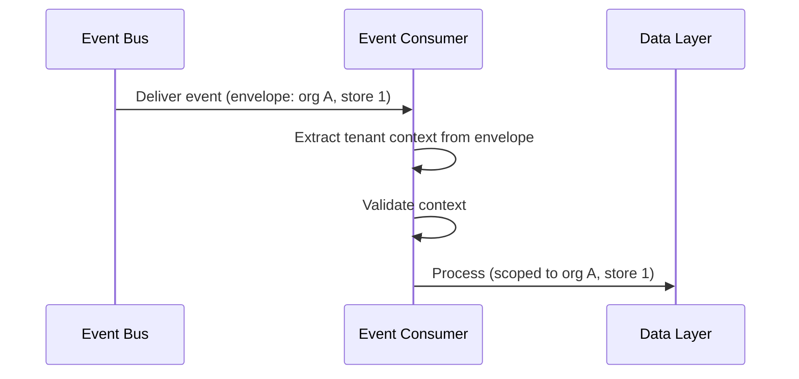
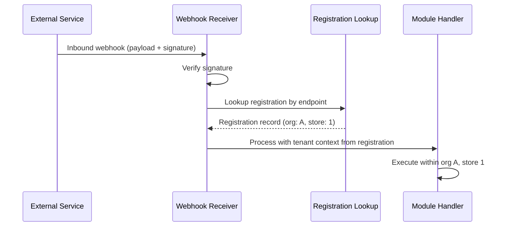

# Tenant Resolution

## Metadata

| Field | Value |
|-------|-------|
| Title | Kairo Tenant Resolution Architecture |
| Document ID | KAI-TEN-003 |
| Status | Draft |
| Version | 0.1 |
| Target Release | V1 |
| Owner | Tenant Context and Request Security Architect |
| Created | 2026-07-20 |
| Last Updated | 2026-07-20 |
| Reviewers | TODO |
| Related Documents | [Multi-Tenancy Architecture](./Multi-Tenancy-Architecture.md), [Tenant Hierarchy](./Tenant-Hierarchy.md), [Identity and Authentication](../Security/Identity-and-Authentication.md), [Authorization Architecture](../Security/Authorization-Architecture.md), [API Security](../Security/API-Security.md), [Platform Hierarchy](../../05-Platform-Core/Platform-Hierarchy.md), [Organization Model](../../05-Platform-Core/Organization-Model.md), [Store Model](../../05-Platform-Core/Store-Model.md) |
| Dependencies | [Multi-Tenancy Architecture](./Multi-Tenancy-Architecture.md), [Tenant Hierarchy](./Tenant-Hierarchy.md), [Identity and Authentication](../Security/Identity-and-Authentication.md) |

---

## Purpose

This document defines how the Kairo platform resolves, validates, and propagates tenant context for every operation — synchronous API requests, asynchronous background processing, event consumption, and webhook handling.

Tenant context determines whose data is accessed, whose configuration applies, and whose boundary governs the operation. Incorrect or missing tenant context leads to cross-tenant data exposure, the most critical security failure possible on a multi-tenant platform.

---

## Scope

This document covers:

- How tenant context is determined for every type of request and operation.
- Which sources of tenant identity are trusted and which are not.
- How context is validated, propagated, and maintained throughout processing.
- Behavior when context is missing, conflicting, or invalid.
- V1 resolution model and future routing capabilities.

This document does not cover:

- Specific middleware implementation, HTTP headers, or token claims.
- API endpoint formats or URL patterns.
- Framework-specific code.
- Authorization policy definitions (consumed from [Authorization Architecture](../Security/Authorization-Architecture.md)).

---

## Tenant Context Definition

Tenant context is the combination of:

| Component | Description | Required |
|-----------|-------------|:--------:|
| Organization ID | The primary tenant boundary. Identifies whose data is being accessed. | Always |
| Store ID | The operational scope within the organization. Identifies which commerce context applies. | For commerce operations |
| Actor identity | Who is performing the operation (user, service, API key). | Always |
| Authentication assurance | The strength of the current authentication. | Always |
| Environment | Production, staging, or development. | Always (implicit from deployment) |

Tenant context is not a single identifier. It is the full set of scope information needed to correctly authorize and execute an operation.

---

## Trusted Tenant Sources

The following sources are trusted for tenant context resolution:

| Source | Trust Basis | Provides |
|--------|------------|----------|
| Authenticated access token | Issued by the platform identity service after credential verification | Organization membership, user identity |
| API key (verified) | Hashed against the platform's key store, matched to an organization | Organization identity, key scope |
| Service credential | Platform-issued workload identity with defined scope | Service identity, authorized tenant(s) |
| Event envelope (internal) | Written by the platform event service with verified tenant context | Organization ID, store ID |
| Job context (internal) | Carried from the triggering operation by the platform job framework | Organization ID, store ID, triggering actor |

### Trust Rule

**Only credentials verified by the platform's authentication infrastructure are trusted for tenant context.** The platform resolves tenant context from these verified credentials. Modules receive resolved context — they do not resolve it themselves.

---

## Untrusted Tenant Inputs

The following inputs are **not trusted** for tenant context resolution:

| Input | Why Untrusted | Platform Response |
|-------|--------------|------------------|
| Tenant ID in request header | Client-supplied. Can be forged by any HTTP client. | Ignored for authorization. May be used for routing validation only (must match authenticated context). |
| Tenant ID in URL path | Client-supplied. Can be manipulated. | Same as header — ignored for authorization. |
| Tenant ID in query string | Client-supplied. Easily tampered. | Ignored for authorization. |
| Tenant ID in request body | Client-supplied. No trust basis. | Ignored for authorization. |
| Tenant ID in webhook payload | External system-supplied. No platform authentication. | Not used for resolution. Webhook registration determines tenant context. |
| Self-asserted tenant in JWT from external IdP (future) | External authority. Platform must validate membership. | Validated against platform membership records. |

### Explicit Statement

**Tenant identifiers supplied through headers, routes, query strings, or request bodies are not trusted merely because they are present.** Their presence does not establish authorization. Only platform-verified credentials establish tenant context.

Client-supplied tenant identifiers may be used for routing validation (confirming they match the authenticated context) but never as the source of truth for authorization.

---

## Authentication Context

**Authentication identity and tenant selection are separate concerns.**

Authentication proves who the actor is. Tenant selection determines which organization they are operating within. These are distinct steps:

1. **Authentication** — Verify credentials. Establish identity.
2. **Tenant resolution** — Determine which organization the identity operates within.
3. **Authorization** — Evaluate whether the identity has permission within the resolved tenant.

A user may be authenticated but not authorized for a specific tenant. An API key is both authenticated and tenant-bound in a single step (the key belongs to one organization).

---

## Authorization Validation

After tenant context is resolved, authorization validates that the actor has permission within that context:

| Validation | Check |
|-----------|-------|
| Organization membership | Is the user a member of the resolved organization? |
| Store assignment | Is the user authorized to access the resolved store? |
| Permission evaluation | Does the user have the required permission within this scope? |
| Key scope | Does the API key's scope include the requested operation? |
| Assurance level | Does the current authentication assurance meet the operation's requirements? |

Authorization is evaluated within the resolved tenant context, not independently. See [Authorization Architecture](../Security/Authorization-Architecture.md).

---

## Organization Selection

### Single-Organization Actors

For actors bound to a single organization (API keys, most customers), organization is implicit:

- API key → organization is determined from the key's registration.
- Customer token → organization is determined from the customer's registration context.
- No selection is needed. Context is resolved automatically.

### Multi-Organization Actors

For actors that belong to multiple organizations (agency users, multi-org staff):

- At authentication time, the user selects or is assigned an active organization context.
- The active organization is embedded in the session/token.
- Switching organizations requires explicit action and reauthorization.
- **Every tenant switch must be reauthorized.** Switching to Organization B re-evaluates permissions within Organization B. Permissions from Organization A do not carry over.

---

## Store Selection

Within the active organization, store context is determined per request:

| Actor Type | Store Resolution |
|-----------|-----------------|
| Org-level admin | May specify store context per request (validated against org membership) |
| Store-scoped user | Restricted to assigned stores. Store context must be within their assignments. |
| Publishable API key | Store context from configuration or per-request specification (validated) |
| Secret API key | Store context specified per request or defaulted (validated) |
| Customer | Store context from the storefront they are interacting with |

### Store Selection Rules

- Store context is validated against the actor's authorized stores.
- An actor cannot access a store they are not assigned to (unless they have org-level access).
- Store context, once resolved, is immutable for the duration of the request.
- Operations that span stores (org-level reports) explicitly declare their cross-store scope and require org-level permission.

---

## Application Context

Applications (storefronts, mobile apps) authenticate with API keys that determine their context:

| Key Type | Context Resolution |
|----------|-------------------|
| Publishable key | Organization is resolved from key. Store/channel may be configured on the key or specified per request. |
| Secret key | Organization is resolved from key. Store context specified per request (validated against key scope). |

Application context is a subset of tenant context — it identifies the application's organization and restricts operations to the key's scope.

---

## Environment Context

Environment (production, staging, development) is implicit from the deployment. It is not supplied by the client.

| Rule | Description |
|------|-------------|
| Environment is infrastructure-determined | The deployment environment determines which data, credentials, and services are active |
| No client-selected environment | A client cannot choose to operate in a different environment through a request parameter |
| Test and live credentials are separated | Test keys access test data. Live keys access live data. Cross-environment access is impossible. |

---

## Tenant Context Propagation

### Synchronous Request Flow

### Propagation Rules

- **Tenant context must remain immutable during a single business operation unless an explicitly approved cross-tenant workflow requires otherwise.** No module, middleware, or service may change the tenant context mid-request.
- Context is set once at the gateway and flows through all downstream processing.
- Modules receive context — they do not resolve or modify it.
- Data access layers receive context and apply it as a mandatory filter.
- Events published during processing carry the context in their envelope.

---

## Context Validation

| Validation Point | Check | Failure Response |
|-----------------|-------|-----------------|
| Gateway entry | Credentials are valid. Identity is established. | 401 Unauthorized |
| Organization resolution | Identity has membership in the resolved organization. | 403 Forbidden |
| Store validation | Actor is authorized for the specified store. | 403 Forbidden (or 404 to prevent enumeration) |
| Request processing | Context is present and consistent throughout. | 500 Internal Error (context loss is a system defect) |
| Event consumption | Event envelope contains valid tenant context. | Reject event. Dead-letter for investigation. |
| Background job | Job carries valid tenant context. | Reject job. Alert operations. |

---

## Context Expiry

- Tenant context is valid for the duration of a single request or operation.
- Session tokens that carry organization context have defined expiration. Expired sessions require re-authentication.
- Long-running operations (batch imports) carry context from initiation. Context does not expire mid-operation.
- Background jobs carry context from their trigger. Context is valid for the job's execution lifetime.

---

## Context Switching

**Every tenant switch must be reauthorized.**

| Switch Type | Mechanism | Authorization |
|------------|-----------|---------------|
| User switches active organization | Explicit API call. New token/session issued for the target organization. | Membership verified. Permissions re-evaluated for target org. |
| User accesses a different store | Store context changes per request (within the same org). | Store assignment validated per request. |
| Support impersonation (tenant switch) | Explicit impersonation session. Time-limited. Audited. | High-assurance authentication. Impersonation authorization. |

### Switching Rules

- Organization switching creates a new authorization context. The previous organization's permissions are not available.
- Store switching within an organization does not change the org context. It is a narrower scope selection.
- No implicit context switching. A response from one request cannot redirect the client to a different tenant context.

---

## Missing-Context Behavior

**Missing tenant context must fail safely for tenant-owned operations.**

| Scenario | Behavior |
|----------|----------|
| Request without authentication | 401 Unauthorized. No processing occurs. |
| Authenticated request without organization context (multi-org user, no org selected) | 400 Bad Request with guidance to select an organization. |
| Commerce request without store context | 400 Bad Request with guidance to specify store (unless the endpoint is org-level). |
| Background job without tenant context | Job is rejected. Alert raised. This is a system defect. |
| Event without tenant context | Event is dead-lettered. Alert raised. This is a system defect. |
| Cache lookup without tenant context | **A cache key without tenant context is unsafe for tenant-specific data.** Cache access without tenant scoping is architecturally prevented by the platform cache interface. |

### Rule

Missing context is never resolved by assuming a default tenant. Operations without context fail explicitly rather than proceeding with ambiguous scope.

---

## Conflicting-Context Behavior

When multiple signals provide conflicting tenant information:

| Scenario | Resolution |
|----------|-----------|
| Token says Org A, header says Org B | **Token wins. Client-supplied identifiers are not trusted.** The header is ignored or validated (must match token). |
| Token says Org A, URL path says Org B | **Token wins.** URL path may be used for routing but must match authenticated context. Mismatch returns 403. |
| Key belongs to Org A, request body says Org B | **Key wins.** Request body tenant identifiers are not trusted. |
| Event envelope says Org A, payload says Org B | **Envelope wins.** Envelope is set by the platform event service. Payload is set by the publishing module. If they conflict, the event is dead-lettered for investigation. |

### Rule

When sources conflict, the authenticated/platform-verified source always takes precedence. Client-supplied or payload-supplied identifiers are advisory at best and must match the verified context.

---

## Invalid-Context Behavior

When the resolved context is invalid (organization suspended, store deactivated, key revoked):

| Scenario | Behavior |
|----------|----------|
| Organization is suspended | 403 Forbidden. No operations permitted. Data preserved but inaccessible. |
| Organization is decommissioning | 403 Forbidden for new operations. Export operations may be permitted. |
| Store is inactive | 403 for operations on that store. Other stores in the org remain accessible. |
| API key is revoked | 401 Unauthorized. Key no longer authenticates. |
| User membership removed from organization | 403 Forbidden on next request. Active sessions may be revoked proactively. |

---

## Tenant Resolution by Request Type

### Administrative Web Applications

| Aspect | Resolution |
|--------|-----------|
| Authentication | Workforce user token (username/password + optional MFA) |
| Organization | From token (user's active organization) |
| Store | Per request. Validated against user's store assignments. Org-level admin accesses all stores. |
| Trust level | Low trust (authenticated). Step-up for sensitive operations. |

### Public Storefronts

| Aspect | Resolution |
|--------|-----------|
| Authentication | Publishable API key |
| Organization | From key registration |
| Store | From key configuration or request context (validated) |
| Trust level | Untrusted (limited to storefront operations) |

### Customer-Facing Applications

| Aspect | Resolution |
|--------|-----------|
| Authentication | Customer access token |
| Organization | From token (customer's registration organization) |
| Store | From the storefront context (determined by the application) |
| Trust level | Low trust (customer). Limited to self-service operations. |

### Backend API Integrations

| Aspect | Resolution |
|--------|-----------|
| Authentication | Secret API key |
| Organization | From key registration |
| Store | Specified per request (validated against key scope) |
| Trust level | Low trust (authenticated). Operations bounded by key scope. |

### SDK Requests

| Aspect | Resolution |
|--------|-----------|
| Authentication | API key (publishable or secret, depending on SDK context) |
| Organization | From key registration |
| Store | From SDK configuration or per-request specification |
| Trust level | Same as the underlying key type |

### Internal Services

| Aspect | Resolution |
|--------|-----------|
| Authentication | Service credential (platform-issued) |
| Organization | From the operation context (triggered by a tenant-scoped operation) |
| Store | From the operation context |
| Trust level | Trusted (internal). Scoped to the specific service function. |

### Background Jobs

| Aspect | Resolution |
|--------|-----------|
| Authentication | Service credential or inherited from triggering actor |
| Organization | Carried from the triggering operation. Embedded in job metadata. |
| Store | Carried from the triggering operation (if store-scoped). |
| Trust level | Trusted (internal). Context was validated at the triggering point. |
| Requirement | **Tenant context must be present in asynchronous work.** A job without context is a system defect. |

### Scheduled Tasks

| Aspect | Resolution |
|--------|-----------|
| Authentication | Service credential |
| Organization | Scheduled tasks that operate on tenant data must execute once per tenant. Each execution carries a specific tenant context. |
| Store | If store-scoped, each execution carries a specific store context. |
| Trust level | Trusted (internal). |

### Event Consumers

| Aspect | Resolution |
|--------|-----------|
| Authentication | Platform event service verifies subscription authorization |
| Organization | From event envelope (set by the platform event service at publication time) |
| Store | From event envelope (if the event is store-scoped) |
| Trust level | Trusted (internal). Envelope is written by platform infrastructure. |

### Webhook Processing

| Aspect | Resolution |
|--------|-----------|
| Authentication | Webhook signature verification |
| Organization | From the webhook registration record (not from the payload) |
| Store | From the webhook registration record (if store-scoped) |
| Trust level | Untrusted input, but registration provides trusted context after signature verification. |
| Rule | Tenant context comes from the registration, not from payload content. The external system does not dictate which tenant the webhook targets. |

### Support Tooling

| Aspect | Resolution |
|--------|-----------|
| Authentication | Support user token (high-assurance authentication required) |
| Organization | Specified through impersonation session creation (explicit, audited) |
| Store | Specified per request within the impersonation session |
| Trust level | Elevated trust (support). Time-limited. Audited. Read-only by default. |

### Data Exports

| Aspect | Resolution |
|--------|-----------|
| Authentication | Workforce user token or API key (with export permission) |
| Organization | From authenticated context |
| Store | From request (org-level exports include all stores; store-level exports are scoped) |
| Trust level | Elevated permission required. Audited. Rate-limited. |

---

## Logging and Trace Context

Every log entry and trace span includes tenant context:

| Context Field | Source | Purpose |
|--------------|--------|---------|
| Organization ID | Resolved tenant context | Enables per-tenant log filtering and investigation |
| Store ID | Resolved store context (if applicable) | Enables per-store operational analysis |
| Request ID | Gateway-generated | Enables end-to-end request tracing |
| Actor identity | Authentication | Enables attribution |

### Rules

- Tenant context in logs enables operational analysis per tenant without exposing other tenants' data.
- Log access is scoped. Tenants viewing their own logs see only their organization's entries.
- Platform operators see all logs but must have explicit authorization for per-tenant investigation.
- Trace context propagates through synchronous and asynchronous processing, maintaining tenant attribution throughout.

---

## V1 Resolution Model

| Aspect | V1 Approach |
|--------|------------|
| Organization resolution | From API key (single-org) or from token (active org for multi-org users) |
| Store resolution | Specified per request, validated against actor's authorized stores |
| Context propagation | Set at gateway, immutable through request lifecycle |
| Async context | Carried in job metadata and event envelopes |
| Webhook context | From registration record after signature verification |
| Conflict resolution | Authenticated source wins. Client-supplied identifiers validated against authenticated context. |
| Missing context | Fail safely. No default tenant assumption. |
| Validation | Every request validates org membership and store assignment |

---

## Future Routing Capabilities

| Capability | Target Version | Description |
|-----------|---------------|-------------|
| Region-aware routing | V2+ | Requests routed to the region where the tenant's data resides |
| Tenant-specific rate limiting | V2+ | Rate limits customized per organization tier |
| Tenant-specific feature routing | V2+ | Requests routed to different service versions based on tenant feature flags |
| Cross-organization context (marketplace) | V3+ | Controlled operations that span organization boundaries with explicit authorization |
| Tenant migration routing | Future | Transparent request routing during live tenant migration between infrastructure |

---

## Version Gate

| Version | Tenant Resolution Gate |
|---------|----------------------|
| V1 | Organization resolved from credentials for every request. Store validated per request. Context propagated to all async processing (jobs, events). Missing context fails safely. Conflict resolution favors authenticated source. Webhook context from registration. Logging includes tenant context. |
| V2 | Multi-org switching is seamless. Region-aware routing is evaluated. Tenant-specific rate limiting is operational. Context validation includes advanced checks (org lifecycle state, key expiration). |
| V3 | Cross-organization context for marketplace model is architecturally defined. Tenant migration routing is operationally feasible. |

---

## Decision Summary

| Decision | Rationale |
|----------|-----------|
| Credentials are the trusted source for org context | Credentials are verified by the platform. Client-supplied identifiers are unverified. |
| Store context is validated per request | Users may access different stores in different requests. Validation ensures they have permission for each. |
| Context is immutable during a request | Changing context mid-operation creates race conditions and data integrity risks. |
| Missing context fails explicitly | Defaulting to a tenant when context is absent risks operating in the wrong scope. Failure is safer than a guess. |
| Webhook context from registration, not payload | The external service should not be able to direct webhooks to arbitrary tenants by manipulating payload content. |
| Async processing carries context from trigger | Async operations must be scoped. Deriving context at execution time from ambient state is fragile and error-prone. |
| Conflicting signals resolve to authenticated source | When multiple signals disagree, the one verified by the platform's authentication is authoritative. |

---

## Alternatives Considered

| Alternative | Rejected Because |
|------------|-----------------|
| Tenant ID in URL path as primary resolution | Client-controlled. Requires URL-level authorization checking. Authenticated context is more secure. |
| Implicit tenant from "most recent" org | Ambiguous for multi-org users. Explicit selection prevents accidental cross-org operations. |
| Trust webhook payload for tenant context | External systems are untrusted. Payload manipulation could route events to wrong tenant. |
| Default to first org for multi-org users | "First" is arbitrary. Users must explicitly choose their operating context. |
| Allow context changes mid-request | Creates partial-execution risks where half the operation runs in one tenant and half in another. |

---

## Trade-offs

| Trade-off | Accepted Because |
|-----------|-----------------|
| Multi-org users must explicitly select an organization | Prevents accidental cross-org operations. The minor UX friction is justified by the security it provides. |
| Every request validates store assignment | Adds per-request validation overhead. Acceptable because store access may change (user permissions modified). Caching minimizes the cost. |
| Async jobs reject on missing context (fail-safe) | May cause job failures during development. Preferable to jobs silently operating without proper scope, which would be a security defect. |
| Webhook processing depends on registration lookup | Adds a lookup step. Necessary because external payloads cannot be trusted for tenant determination. |

---

## Architecture Impact

| Concern | Impact |
|---------|--------|
| API gateway | Must resolve and set tenant context on every request. Must propagate context to downstream processing. Must reject requests with unresolvable context. |
| Module design | Modules receive resolved context. They do not resolve it themselves. They cannot modify it. They use it for all data access and event publication. |
| Data access | The data access layer applies tenant context as a mandatory filter. It receives context from the request pipeline. |
| Events | The event system includes tenant context in every event envelope at publication time. |
| Background processing | The job framework carries tenant context from the trigger. Jobs validate context before processing. |
| Caching | The cache interface includes tenant context in all keys. No key can be constructed without tenant scope for tenant-specific data. |
| Testing | Tests verify context resolution, propagation, immutability, and failure behavior. Cross-tenant tests verify that wrong-context access fails. |

---

## Implementation Impact

| Area | Impact |
|------|--------|
| Modules | Must accept tenant context from the platform. Must not resolve context independently. Must pass context to all downstream calls (data, events, cache). Must not store resolved context in mutable state. |
| APIs | Must enforce that every request has resolved tenant context before processing. Must reject requests with unresolvable or conflicting context. |
| Background jobs | Must include tenant context in job metadata at enqueue time. Must validate context at execution time. Must fail on missing context. |
| Events | Must include tenant context in publication. Must validate context on consumption. |
| Cache | Must include tenant scope in all cache keys for tenant-specific data. Platform cache interface enforces this structurally. |
| Webhooks | Must resolve context from registration record, not from payload. Must verify signature before context resolution. |
| Logging | Must include tenant context in all log entries automatically through the platform logging interface. |

---

## Security Responsibilities

| Role | Tenant Resolution Responsibilities |
|------|-----------------------------------|
| Tenant Context Architect | Defines resolution model. Reviews context-impacting changes. Validates propagation coverage. |
| Platform Team | Implements resolution, propagation, validation, and failure handling in the gateway and framework layers. |
| Product Teams | Accept and use resolved context. Do not resolve independently. Write context propagation tests. |
| Security Team | Validates through adversarial testing that context cannot be manipulated, bypassed, or confused. |

---

## Out of Scope

This document does not define:

- Specific HTTP headers, token claims, or URL formats used for context.
- Middleware implementation code.
- Framework-specific context propagation mechanisms.
- Database query filter implementation.
- API endpoint contracts.

---

## Future Considerations

- **Context compression** — For high-throughput internal communication, context may be compressed or referenced by ID rather than carried in full.
- **Context caching** — Resolved context may be cached per session to reduce repeated resolution overhead.
- **Context delegation** — Allowing one service to act on behalf of a tenant without re-resolving (service-to-service context forwarding).
- **Ambient context for platform operations** — Platform-level operations (aggregate metrics, system maintenance) that do not operate within a tenant boundary.
- **Cross-tenant context (marketplace)** — Controlled operations that reference multiple tenants with explicit authorization (e.g., marketplace order involving seller and buyer orgs).

---

## Future Refactoring Triggers

This document should be revisited when:

- Cross-organization operations are introduced (marketplace model requires multi-tenant context).
- Regional routing is implemented (context must include region for data residency).
- A new actor type is introduced that does not fit existing resolution patterns.
- A context resolution failure leads to a security incident.
- Performance requirements demand context caching or compression.
- The Payments product introduces PCI-scoped context boundaries within a tenant.

---

## Change History

| Version | Date | Author | Description |
|---------|------|--------|-------------|
| 0.1 | 2026-07-20 | Tenant Context and Request Security Architect | Initial draft |
