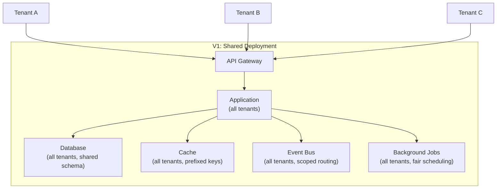
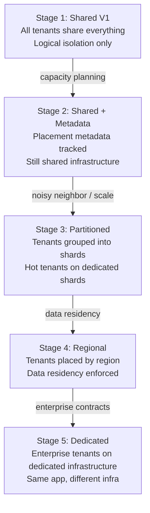

# Tenant Scaling and Placement

## Metadata

| Field | Value |
|-------|-------|
| Title | Kairo Tenant Scaling and Placement Strategy |
| Document ID | KAI-TEN-010 |
| Status | Draft |
| Version | 0.1 |
| Target Release | V1 |
| Owner | Multi-Tenant Scalability and Placement Architect |
| Created | 2026-07-20 |
| Last Updated | 2026-07-20 |
| Reviewers | TODO |
| Related Documents | [Data Isolation Strategy](./Data-Isolation-Strategy.md), [Multi-Tenancy Architecture](./Multi-Tenancy-Architecture.md), [Tenant Isolation](./Tenant-Isolation.md), [Architecture Roadmap](../Architecture-Roadmap.md), [Quality Attributes](../Quality-Attributes.md), [Architecture Constraints](../Architecture-Constraints.md), [Monolith Strategy](../Monolith-Strategy.md) |
| Dependencies | [Data Isolation Strategy](./Data-Isolation-Strategy.md), [Multi-Tenancy Architecture](./Multi-Tenancy-Architecture.md) |

---

## Purpose

This document defines how the Kairo platform scales to serve growing tenants, manages resource consumption fairness, and evolves toward tenant-specific placement — all without over-engineering V1.

Scaling and placement are operational concerns that become architectural when they affect isolation, performance, or reliability guarantees. This document ensures that V1 remains simple while the architecture does not foreclose future scaling paths.

---

## Scope

This document covers:

- V1 shared placement and its implications.
- Tenant-level resource management (quotas, rate limits, fairness).
- Noisy-neighbor risks and mitigation.
- Architectural evolution from shared to dedicated placement.
- Refactoring triggers that justify increased complexity.

This document does not cover:

- Kubernetes topology, pod scheduling, or container configuration.
- Specific cloud regions or availability zones.
- Database shard key design or partitioning schemes.
- Infrastructure cost modeling or pricing strategy.

---

## Architectural Principles

- **V1 must not implement complex tenant sharding without demonstrated need.** Sharding adds operational complexity. It is justified only by measured scale that exceeds single-database capacity.
- **V1 architecture must avoid choices that make future tenant movement impossible.** Placement metadata, tenant-scoped data access, and abstracted storage interfaces preserve the path to future placement flexibility.
- **Tenant-specific optimizations must not bypass authorization or audit rules.** A tenant moved to dedicated infrastructure still operates under the same authorization, isolation, and audit architecture. No placement decision weakens security.
- **Dedicated deployment is a future capability, not the default.** Shared infrastructure is the correct default for cost and operational simplicity. Dedication is an exception for demonstrated need.
- **Capacity management and security isolation are related but not identical.** Moving a tenant to dedicated infrastructure for performance reasons does not require different security rules. Moving for compliance reasons adds isolation guarantees beyond performance.

---

## 1. Shared V1 Placement

All tenants share a single deployment in V1:

### V1 Placement Rules

- All tenants share all infrastructure components.
- Isolation is logical (enforced by the platform layers defined in [Tenant Isolation](./Tenant-Isolation.md)).
- Scaling is horizontal (add application instances) and vertical (increase database resources).
- Per-tenant resource fairness is managed through rate limits and quotas.
- No tenant has dedicated infrastructure in V1.

---

## 2. Tenant Placement Concept

Even in V1, the architecture includes the concept of placement metadata:

| Attribute | V1 Value | Future Use |
|-----------|----------|-----------|
| Organization ID | Always present | Used for routing to correct infrastructure |
| Placement group | Default (all tenants in one group) | Groups tenants for shard/region assignment |
| Storage location | Default (shared database) | Routes to dedicated or regional database |
| Region | Default (single region) | Determines geographic placement |
| Tier | Default | Determines resource allocation and priority |

### Why Placement Metadata in V1

- Including placement metadata from the start means future routing decisions are a configuration change, not a code change.
- The cost in V1 is minimal (one field with a default value).
- The benefit in V2+ is significant (enables movement without restructuring).

---

## 3. Resource Consumption Isolation

Tenants share infrastructure but have independent resource consumption boundaries:

| Resource | Isolation Mechanism | V1 Status |
|----------|-------------------|:---------:|
| API request throughput | Per-tenant rate limits | Required |
| Database query load | Per-tenant query timeouts. Index optimization. | Required |
| Cache capacity | Per-tenant key prefix (shared pool). Cache eviction is tenant-fair. | Required |
| Event throughput | Per-tenant event volume monitoring | Required |
| Background job capacity | Per-tenant job concurrency limits | Required |
| Storage volume | Per-tenant storage quota tracking | Required |
| Search index size | Per-tenant index tracking | Required |
| Media storage | Per-tenant storage quota | Required |

---

## 4. Noisy-Neighbor Risks

A noisy neighbor is a tenant whose workload degrades the experience of other tenants on shared infrastructure.

| Risk | Symptom | Impact |
|------|---------|--------|
| High API request volume | Other tenants experience increased latency | Performance degradation |
| Expensive database queries | Database resources consumed by one tenant's complex queries | Increased query latency for all |
| Large background job volume | Job queue congestion delays other tenants' async processing | Delayed event processing |
| Excessive cache usage | Cache eviction removes other tenants' hot data | Increased cache misses, higher DB load |
| Large data imports | Database write throughput consumed during bulk operations | Write latency for other tenants |
| High event volume | Event bus congestion | Delayed event delivery for other tenants |

### Noisy-Neighbor Mitigation (V1)

| Mitigation | Description |
|-----------|-------------|
| Per-tenant rate limiting | Cap the request volume any single tenant can generate |
| Query timeout enforcement | Long-running queries are terminated before they monopolize database resources |
| Background job concurrency limits | Limit how many concurrent jobs one tenant can have executing |
| Bulk operation throttling | Large imports and exports are rate-limited to prevent burst resource consumption |
| Event publishing rate limits | Cap the event volume a single tenant can publish per time window |
| Monitoring and alerting | Detect when one tenant's resource consumption approaches thresholds that would affect others |

---

## 5. Tenant-Level Quotas

Quotas define long-term resource consumption limits per tenant:

| Quota Category | Examples | Enforcement |
|---------------|----------|-------------|
| Storage | Maximum database storage, maximum media storage | New writes rejected when quota reached |
| Entities | Maximum products, maximum API keys, maximum webhook registrations | Creation rejected when limit reached |
| Operations | Maximum monthly API calls, maximum monthly events published | Tracked. Notification at threshold. Enforcement at ceiling. |
| Concurrent | Maximum active carts, maximum concurrent background jobs | Creation queued or rejected at limit |

### Quota Rules

- Quotas are configured per organization (per subscription tier in future).
- Quota usage is tracked continuously and visible to organization administrators.
- Approaching quota triggers notification before enforcement.
- Quota enforcement does not affect other tenants — only the tenant at their limit is restricted.
- Quota increases require authorization (tier upgrade, manual adjustment).

---

## 6. Tenant-Level Rate Limits

Rate limits control request velocity per time window:

| Rate Limit Scope | Purpose |
|-----------------|---------|
| Per-organization (aggregate) | Total API throughput for the organization across all keys and users |
| Per-API-key | Throughput for a specific integration |
| Per-user | Throughput for a specific authenticated user |
| Per-endpoint | Protect expensive endpoints with tighter limits |

### Rate Limit Rules

- One tenant hitting their rate limit does not reduce another tenant's available capacity.
- Rate limit counters are per-tenant. They are not shared across tenants.
- Rate limiting is applied at the API gateway before requests reach application logic.
- Rate limit headers indicate remaining capacity and reset time.
- Platform-wide rate limits exist as a safety net above per-tenant limits (protects infrastructure from aggregate overload).

---

## 7. Tenant Workload Classification

Not all tenants generate the same type of workload:

| Workload Pattern | Characteristics | Resource Impact |
|-----------------|----------------|-----------------|
| Read-heavy (catalog browsing) | High read throughput, low write volume | Database read load, cache pressure |
| Write-heavy (order processing) | Moderate reads, high transaction volume | Database write load, event volume |
| Import-heavy (catalog sync) | Periodic bulk write bursts | Database write spikes, index rebuild |
| Integration-heavy (multi-system sync) | High event volume, many webhook deliveries | Event bus load, outbound HTTP capacity |
| Seasonal (flash sales) | Normal baseline with extreme spikes | All resources during peak |

### Classification Use

- V1 does not formally classify tenants. All tenants share the same resource pool with the same limits.
- Workload patterns inform future placement decisions (if a tenant is consistently write-heavy, they may benefit from dedicated write capacity).
- Monitoring tracks per-tenant workload patterns for operational awareness.

---

## 8. Large Tenant Handling

When a tenant's data volume or request volume significantly exceeds average:

| Concern | V1 Approach | Future Approach |
|---------|------------|-----------------|
| Large data volume | Monitor growth. Optimize indexes. Consider archival. | Move to dedicated database. |
| High request volume | Per-tenant rate limits. Scale shared infrastructure. | Move to dedicated compute or higher-tier rate limits. |
| Complex queries | Query timeout enforcement. Index optimization. | Dedicated read replica. |
| High event volume | Event rate limiting. Monitor queue depth. | Dedicated event partition. |

### Rules

- V1 handles large tenants through rate limits, quotas, and infrastructure scaling.
- If a single tenant's workload cannot be accommodated within shared infrastructure without degrading other tenants, this is a trigger for placement evolution (V2+).
- Large-tenant handling never bypasses authorization or audit.

---

## 9. Hot Tenant Detection

Identifying tenants that are consuming disproportionate resources:

| Signal | Detection Method | Response |
|--------|-----------------|----------|
| High request rate (sustained) | Per-tenant request counter exceeds threshold | Alert operations. Evaluate rate limit adjustment. |
| High database load (sustained) | Per-tenant query monitoring shows elevated I/O | Alert operations. Evaluate query optimization or tenant movement. |
| High event volume (sustained) | Event publishing rate exceeds threshold | Alert operations. Evaluate event rate limiting. |
| Storage growth (rapid) | Storage consumption growth rate exceeds threshold | Alert operations. Evaluate quota or archival. |
| Background job queue depth (sustained) | Tenant's pending jobs exceed threshold | Alert operations. Evaluate concurrency limits. |

### Detection Rules

- Hot tenant detection is operational monitoring, not a security control.
- Detection triggers investigation, not automatic action (V1). Automated responses are a V2+ capability.
- Detection does not reveal hot-tenant identity to other tenants.
- Hot-tenant status may inform future placement decisions.

---

## 10. Background Workload Fairness

Background processing must be fair across tenants:

| Fairness Mechanism | Description |
|-------------------|-------------|
| Per-tenant concurrency limits | Maximum concurrent jobs per organization |
| Round-robin scheduling | Job scheduler cycles through tenants rather than processing one tenant's queue entirely before the next |
| Priority queues | Critical operations (payment processing) have higher priority than low-priority operations (report generation) regardless of tenant |
| Dead-letter isolation | A failing job for one tenant does not block jobs for other tenants |
| Timeout enforcement | Long-running jobs are terminated before monopolizing workers |

---

## 11–14. Growth Concerns

### 11. Storage Growth

| Concern | V1 Approach | Trigger for Evolution |
|---------|------------|---------------------|
| Database size | Monitor growth. Optimize storage. Archival policies. | Approaching single-database capacity limits. |
| Per-tenant volume | Track per-tenant storage against quotas. | Single tenant exceeds a significant fraction of total capacity. |
| Growth rate | Monitor rate of growth for capacity planning. | Growth rate exceeds infrastructure scaling ability. |

### 12. Search Growth

| Concern | V1 Approach | Trigger for Evolution |
|---------|------------|---------------------|
| Index size | Monitor total index size. | Approaching search infrastructure capacity. |
| Per-tenant index | Track per-tenant document count. | Single tenant's index dominates search resources. |
| Query latency | Monitor per-tenant search latency. | Latency degradation from index size. |

### 13. Cache Growth

| Concern | V1 Approach | Trigger for Evolution |
|---------|------------|---------------------|
| Cache memory | Monitor total cache utilization. | Eviction rate impacts hit ratio significantly. |
| Per-tenant footprint | Tenant-prefixed keys allow per-tenant tracking. | Single tenant's cache usage causes excessive eviction for others. |
| Hit ratio | Monitor per-tenant and aggregate hit ratios. | Declining hit ratio indicates capacity issue. |

### 14. Integration Workload Growth

| Concern | V1 Approach | Trigger for Evolution |
|---------|------------|---------------------|
| Outbound webhook volume | Rate limit webhook delivery per tenant. | Delivery delays affect other tenants. |
| Inbound webhook processing | Rate limit inbound processing per source. | Processing delays cascade. |
| External API call volume | Monitor per-tenant outbound call rates. | External provider rate limits become an issue. |

---

## 15–20. Future Placement Capabilities

### 15. Tenant Movement

Moving a tenant from one placement (shared database) to another (dedicated database).

| Aspect | Architecture Requirement |
|--------|------------------------|
| Data migration | All tenant data extracted from shared and inserted into dedicated. Zero-downtime where feasible. |
| Routing update | Placement metadata updated. Data access layer routes to new location. |
| Application transparency | Modules are unaware of movement. Platform data layer handles routing. |
| Credential preservation | API keys and tokens continue to work (they don't know about storage location). |
| Audit continuity | Audit trail is continuous across the movement. |

### 16. Tenant Sharding

Distributing tenants across multiple database instances (shards) to handle aggregate growth.

| Aspect | Architecture Requirement |
|--------|------------------------|
| Shard assignment | Placement metadata determines which shard serves each tenant. |
| Cross-shard queries | Not permitted (each tenant is on exactly one shard). |
| Rebalancing | Tenants can be moved between shards (tenant movement mechanism). |
| Application transparency | Modules are unaware of sharding. Platform data layer routes. |

### 17. Regional Placement

Placing tenant data in a specific geographic region.

| Aspect | Architecture Requirement |
|--------|------------------------|
| Region assignment | Placement metadata includes region. |
| Data residency | All tenant data (primary, backup, cache, search) resides in the assigned region. |
| API routing | Requests are routed to the regional deployment serving the tenant. |
| Cross-region prohibition | Tenant data does not replicate outside its assigned region (unless tenant opts in). |

### 18. Data Residency

Legal requirement that data resides in a specific jurisdiction.

| Aspect | Architecture Requirement |
|--------|------------------------|
| Compliance | Tenant data stored and processed within the designated region. |
| Backup | Backups stored within the same region. |
| Processing | Background jobs execute in the same region as the tenant's data. |
| Verification | Data residency is auditable and verifiable. |

### 19. Dedicated Enterprise Placement

A specific tenant has dedicated infrastructure (database, possibly compute).

| Aspect | Architecture Requirement |
|--------|------------------------|
| Isolation guarantee | Physical separation. Not just logical isolation. |
| Operational independence | Dedicated infrastructure can be maintained independently. |
| Same security model | All authorization, audit, and isolation rules still apply. |
| Same application code | The application is identical. Only infrastructure differs. |
| Higher cost | Justified by enterprise contract or regulatory requirement. |

### 20. Future Tenant-Specific Infrastructure

| Component | Dedicated Option |
|-----------|-----------------|
| Database | Dedicated instance per enterprise tenant |
| Cache | Dedicated cache instance |
| Search | Dedicated search index/cluster |
| Event bus | Dedicated partition or instance |
| Compute | Dedicated application instances |
| Full deployment | Entirely independent platform deployment |

---

## Architectural Evolution

### Evolution Rules

- Each stage is triggered by measurable need, not by anticipation.
- Application code does not change between stages. Only platform infrastructure and routing change.
- Modules are never aware of placement. The platform data access layer abstracts location.
- Each stage adds operational complexity. Complexity is justified only by the trigger.
- Earlier stages remain available. Not all tenants move to later stages. A small tenant on the shared pool is never forced to dedicated infrastructure.

---

## Scaling Decision Matrix

| Scenario | V1 Response | Evolution Trigger | Future Response |
|----------|-------------|------------------|-----------------|
| One tenant generates 50% of API traffic | Per-tenant rate limiting. Scale shared infra. | Rate limits consistently hit. Other tenants affected. | Move to higher-tier limits or dedicated compute. |
| One tenant stores 50% of total data | Monitor. Optimize indexes. Quota enforcement. | Approaching database capacity. | Move to dedicated database. |
| Database approaches capacity | Scale vertically. Optimize. Archival. | Vertical scaling exhausted. | Shard by tenant groups. |
| Regulatory data residency required | Not applicable (single region V1). | Customer contract or regulation. | Regional placement. |
| Enterprise requires physical isolation | Not available in V1. | Enterprise contract. | Dedicated database or deployment. |
| Flash-sale spike from one tenant | Rate limits absorb. Auto-scaling absorbs. | Sustained spikes degrade others. | Dedicated compute for high-spike tenants. |
| Background job backlog growing | Concurrency limits. Fair scheduling. | Sustained backlog despite limits. | Dedicated job infrastructure for heavy tenants. |

---

## Refactoring Triggers

| Trigger | Measurement | Response |
|---------|-------------|----------|
| **Sustained noisy-neighbor impact** | Other tenants' p95 latency increases >20% due to one tenant's workload | Evaluate dedicated placement or tighter limits for the heavy tenant |
| **Tenant-specific compliance requirements** | Customer contract or regulation mandates physical data isolation | Implement dedicated database for that tenant |
| **Regional data requirements** | Regulation requires data to remain in a specific geography | Implement regional deployment |
| **Extreme storage growth** | Single tenant's data exceeds 30% of total database capacity | Evaluate dedicated database or archival strategy |
| **Extreme throughput** | Single tenant's sustained request volume exceeds 50% of shared capacity | Evaluate dedicated compute or load balancing |
| **Enterprise isolation contracts** | Enterprise customer contractually requires dedicated infrastructure | Implement dedicated deployment |
| **Operational instability from a single tenant** | One tenant's operations repeatedly cause incidents affecting others | Evaluate dedicated placement for stability |
| **Inability to meet recovery objectives** | Backup/restore time exceeds RTO due to total data volume | Evaluate partitioned backup strategy or per-tenant backup |

### Trigger Rules

- Triggers are based on measured data, not predictions.
- Each trigger leads to an ADR documenting the situation, the response options, and the selected approach.
- Triggers do not justify bypassing security or isolation architecture. Placement changes are infrastructure decisions, not authorization decisions.

---

## V1 Baseline

| Capability | V1 Status |
|-----------|-----------|
| All tenants on shared infrastructure | Required |
| Placement metadata tracked (default values) | Required |
| Per-tenant rate limits (API, events, jobs) | Required |
| Per-tenant quotas (storage, entities, operations) | Required |
| Background job fairness (round-robin, concurrency limits) | Required |
| Noisy-neighbor detection (monitoring and alerting) | Required |
| Query timeout enforcement | Required |
| Bulk operation throttling | Required |
| Per-tenant resource usage tracking | Required |
| Horizontal scaling of application instances | Required |
| Capacity planning based on aggregate growth | Required |

## Future Capabilities

| Capability | Target Version | Description |
|-----------|---------------|-------------|
| Tenant movement (shared → dedicated) | V2+ | Move a tenant's data to dedicated infrastructure without downtime |
| Tenant sharding | V2+ | Distribute tenants across multiple database instances |
| Regional placement | V2+ | Assign tenants to geographic regions for data residency |
| Dedicated database per tenant | V2+ | Physical data isolation for enterprise tenants |
| Dedicated compute per tenant | V3+ | Independent application instances for extreme workloads |
| Full dedicated deployment | Future | Complete platform deployment for a single enterprise tenant |
| Automated hot-tenant response | V2+ | Automatic throttling or movement in response to detected hot tenants |
| Tenant workload classification | V2+ | Formal classification of tenant patterns to inform placement decisions |
| Adaptive rate limiting | V2+ | Rate limits that adjust based on tenant tier and historical patterns |
| Cross-region replication (read replicas) | V3+ | Read replicas in secondary regions for latency optimization |

---

## Version Gate

| Version | Scaling and Placement Gate |
|---------|--------------------------|
| V1 | Shared infrastructure with per-tenant rate limits and quotas. Noisy-neighbor detection is active. Background fairness is operational. Placement metadata exists (default values). Horizontal scaling works. No single tenant can degrade the platform for others through normal operation. |
| V2 | Tenant movement procedure is documented and tested. At least one dedicated-placement tenant is operational (if triggered). Regional placement is architecturally defined (if data residency is required). Automated hot-tenant detection triggers alerts with recommendations. |
| V3 | Multiple placement options operate simultaneously (shared + dedicated). Regional placement is operational. Tenant workload classification informs placement recommendations. Adaptive rate limiting adjusts to tenant patterns. |

---

## Decision Summary

| Decision | Rationale |
|----------|-----------|
| Shared infrastructure for V1 | Lowest operational complexity. Lowest cost. Sufficient for V1 tenant volume. Isolation is enforced logically. |
| Placement metadata from V1 | Minimal V1 cost (one field). Significant future benefit (enables movement without restructuring). |
| Per-tenant rate limits and quotas | Prevent noisy-neighbor degradation without requiring physical separation. |
| No sharding in V1 | Sharding adds massive operational complexity. Not justified without measured scale that exceeds single-database capacity. |
| Evolution is trigger-based | Complexity is added only when measured need justifies it. Anticipatory scaling wastes resources and adds risk. |
| Dedicated is the exception | Most tenants are well-served by shared infrastructure. Dedicated placement is for tenants with demonstrated, exceptional needs. |
| Security unchanged by placement | A tenant on dedicated infrastructure has the same authorization, audit, and isolation model. Placement is not a security bypass. |

---

## Alternatives Considered

| Alternative | Rejected Because |
|------------|-----------------|
| Shard from day one | Massive operational overhead for <100 tenants. No measured need in V1. |
| No per-tenant resource limits in V1 | First heavy tenant would degrade all other tenants. Unacceptable risk. |
| Ignore noisy-neighbor risk | First incident would affect all customers. Prevention is cheaper than recovery. |
| Dedicated for all tenants | Disproportionate cost and operational burden. Shared is sufficient for 99% of V1 tenants. |
| No placement metadata until needed | Retrofitting routing metadata is significantly harder than including it from the start. |
| Auto-scale without rate limits | Auto-scaling is reactive. Rate limits are proactive. A tenant causing a 10x spike would degrade others before auto-scaling responds. |

---

## Trade-offs

| Trade-off | Accepted Because |
|-----------|-----------------|
| Per-tenant rate limits may restrict legitimate high-volume tenants | Limits can be adjusted per tenant (tier-based in future). Starting restrictive and adjusting up is safer than starting open. |
| Noisy-neighbor detection adds monitoring cost | The alternative (no detection) means problems are discovered through customer complaints. Proactive detection is operationally superior. |
| Placement metadata in V1 is "unused overhead" | One default-valued field per organization. The cost is negligible. The future benefit is substantial. |
| Background job fairness adds scheduling complexity | Without fairness, one tenant's batch import blocks all other tenants' event processing. Complexity is justified. |
| V1 cannot offer dedicated placement | Loses potential enterprise customers who require it today. Accepted because building dedicated infrastructure prematurely creates operational burden that slows the core platform. |

---

## Architecture Impact

| Concern | Impact |
|---------|--------|
| API gateway | Must enforce per-tenant rate limits. Must support future routing by placement metadata. |
| Data access layer | Must abstract storage location. Must support future routing to different databases. Modules must never know about placement. |
| Background processing | Must implement fair scheduling. Must enforce per-tenant concurrency limits. |
| Monitoring | Must track per-tenant resource consumption. Must detect hot tenants. Must alert on threshold breaches. |
| Module design | Must be placement-unaware. Must work identically on shared or dedicated infrastructure. |
| Platform services | Must support per-tenant quotas and limits. Must track placement metadata. |
| Testing | Must validate fairness under concurrent multi-tenant load. Must verify rate limit enforcement. |

---

## Implementation Impact

| Area | Impact |
|------|--------|
| Modules | Must not make assumptions about co-located data. Must not rely on cross-tenant database features. Must function correctly whether the database has 10 tenants or 1. |
| API gateway | Must implement and enforce per-tenant rate limiting. Must include placement-aware routing capability (V2+ activation). |
| Background jobs | Must implement fair scheduling. Must enforce concurrency limits per tenant. Must isolate job failures per tenant. |
| Monitoring | Must collect per-tenant metrics. Must implement hot-tenant alerting. Must track growth trends. |
| Operations | Must manage quotas. Must respond to hot-tenant alerts. Must plan capacity based on aggregate and per-tenant growth. |
| Data access | Must abstract storage location behind a routing layer. Must support future multi-location routing without application code changes. |

---

## Security Responsibilities

| Role | Scaling Responsibilities |
|------|------------------------|
| Scalability Architect | Defines scaling strategy. Reviews placement decisions. Monitors evolution triggers. |
| Platform Team | Implements rate limiting, quotas, fairness scheduling, and placement routing. |
| Operations | Monitors resource consumption. Responds to hot-tenant alerts. Plans capacity. Executes tenant movements (V2+). |
| Security Team | Validates that placement changes do not weaken security. Reviews ADRs for placement decisions. |
| Product Teams | Build modules that are placement-unaware. Use platform data access abstractions. |

---

## Out of Scope

This document does not define:

- Kubernetes topology, pod scheduling, or resource requests — defined in infrastructure architecture (dependency identified).
- Cloud regions or availability zones — defined in infrastructure decisions.
- Database shard key design — defined in data architecture specifications.
- Infrastructure cost modeling — business concern.
- Specific rate limit values — configured per deployment.
- Billing tier definitions — business concern.

---

## Future Considerations

- **Predictive scaling** — Using historical workload patterns to pre-scale infrastructure before anticipated peaks.
- **Tenant workload SLAs** — Formal guarantees about resource availability per subscription tier.
- **Automated tenant movement** — Rules-based automatic movement of tenants between placements without human intervention.
- **Multi-cloud placement** — Placing tenants on different cloud providers for vendor diversification or customer preference.
- **Cost-based placement optimization** — Optimizing tenant placement to minimize infrastructure cost while meeting performance and compliance requirements.
- **Tenant density analytics** — Understanding optimal tenant-per-infrastructure ratios for different workload patterns.

---

## Future Refactoring Triggers

This document should be revisited when:

- The shared database approaches capacity limits.
- A noisy-neighbor incident affects multiple tenants.
- An enterprise customer requires dedicated infrastructure.
- Data residency regulations require regional placement.
- The Infrastructure Architecture phase is formally defined (dependency resolved).
- Per-tenant resource consumption tracking reveals unexpected patterns.
- The platform exceeds 100 active tenants (approximate threshold for V1 scale assumptions).

---

## Change History

| Version | Date | Author | Description |
|---------|------|--------|-------------|
| 0.1 | 2026-07-20 | Multi-Tenant Scalability and Placement Architect | Initial draft |
