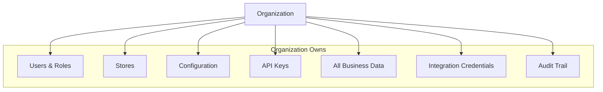
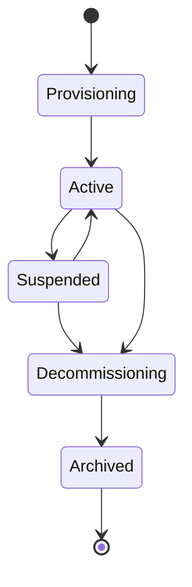
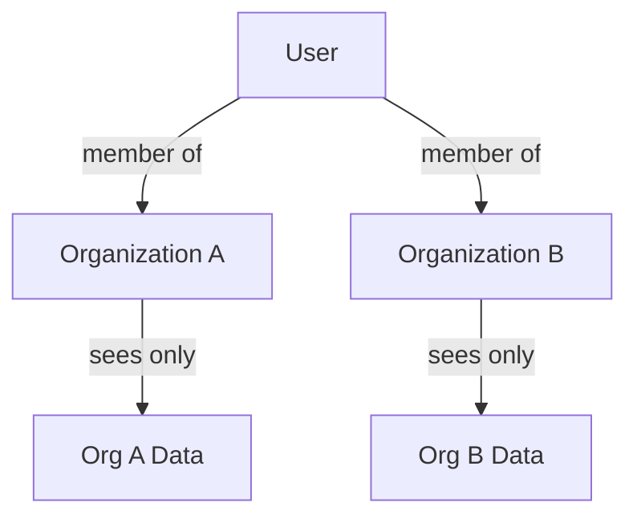
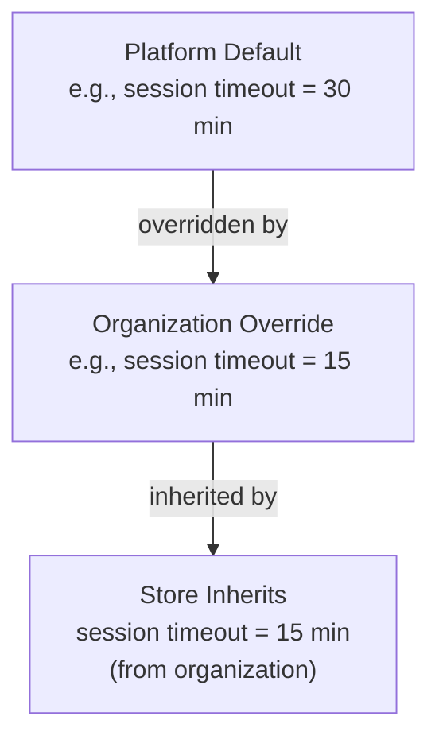

# Organization Model

## Metadata

| Field | Value |
|-------|-------|
| Title | Kairo Organization Model |
| Document ID | KAI-CORE-003 |
| Status | Draft |
| Version | 0.1 |
| Target Release | N/A |
| Owner | Chief Platform Architect |
| Created | 2026-07-17 |
| Last Updated | 2026-07-17 |
| Reviewers | TODO |
| Related Documents | [Platform Hierarchy](./Platform-Hierarchy.md), [Platform Core](../05-Platform-Core/Platform-Core.md), [System Architecture](./System-Architecture.md), [Cross-Cutting Concerns](./Cross-Cutting-Concerns.md), [Glossary](../02-Products/Glossary.md) |
| Dependencies | None |

---

## Purpose

The organization is the most important structural entity in the Kairo platform. It is the tenant boundary — the unit of data isolation, security enforcement, configuration ownership, and business identity. Every piece of business data in the platform belongs to exactly one organization.

This document defines what an organization is, what it owns, how it relates to other entities, and how it progresses through its lifecycle.

---

## What Is an Organization

An organization represents a single business entity operating on the Kairo platform. It is the answer to the question: "Whose data is this?"

- A small DTC brand operating one online store is one organization.
- An agency managing multiple client stores operates one organization per client.
- A multi-brand retailer with shared operations is one organization with multiple stores.

The organization is not a user, not a store, and not a subscription. It is the business itself.

---

## Ownership

### What the Organization Owns

| Asset | Description |
|-------|-------------|
| Users | All user accounts associated with this business. Users are members of the organization. |
| Stores | All commercial operations within this business. |
| Business data | Every product, order, customer, inventory record, and transaction belongs to the organization. |
| Configuration | Organization-level settings that override platform defaults. |
| API keys | All programmatic access credentials scoped to this organization. |
| Integration credentials | Connections to external services (payment providers, shipping carriers, tax services). |
| Audit trail | The complete record of significant actions within this organization. |
| Webhooks | All registered webhook endpoints for this organization's events. |

### What the Organization Does NOT Own

| Asset | Owner | Reason |
|-------|-------|--------|
| Platform infrastructure | Platform | Infrastructure serves all organizations equally. |
| Authentication mechanism | Platform (Identity) | Authentication is a platform service. Organizations consume it. |
| Event bus infrastructure | Platform | The event bus is shared. Organizations publish and subscribe within their scope. |
| Other organizations' data | Other organizations | Isolation is absolute. |
| Platform-level configuration | Platform | Platform defaults are set globally, not per organization. |

---

## Responsibilities

The organization entity is responsible for:

### Data Boundary

The organization defines the hard boundary for all data access. Every query, every API response, and every event is scoped to the requesting organization. Data from one organization is never visible to another.

### User Membership

Users belong to organizations. A user's permissions, roles, and access are evaluated within the context of their organization membership. The organization determines who can do what within its boundary.

### Configuration Scope

The organization provides the configuration layer between platform defaults and store-specific settings. Organization-level configuration applies to all stores within the organization unless overridden at the store level.

### Security Perimeter

The organization is the security perimeter. API keys, tokens, and sessions are scoped to an organization. A compromised credential in one organization cannot access another organization's data.

### Operational Context

All platform operations occur within an organization context. There is no "unscoped" operation in the system (platform administration excepted). The organization context is resolved from authentication credentials for every request.

---

## Lifecycle

### Stages

| Stage | Description |
|-------|-------------|
| **Provisioning** | The organization is being created. Platform resources are allocated. Initial configuration is applied. No business operations are possible yet. |
| **Active** | The organization is fully operational. All platform capabilities are available. Business data is created and managed. |
| **Suspended** | The organization is temporarily inactive. Data is preserved but API access is restricted. No new operations are permitted. Existing data remains intact. |
| **Decommissioning** | The organization is being shut down. Data export is available. A grace period allows final data retrieval. No new business operations are permitted. |
| **Archived** | The organization's operational data has been removed. Audit records are retained according to compliance requirements. The organization cannot be reactivated. |

### Lifecycle Rules

- An organization cannot be deleted instantly. The decommissioning stage ensures data can be exported and compliance obligations are met.
- Suspension is reversible. Reactivating a suspended organization restores full access with all data intact.
- Archival is irreversible. Once archived, the organization's business data is permanently removed. Only audit records remain.
- The lifecycle is managed by the platform, not by individual products. Products react to lifecycle events but do not control transitions.

---

## Relationships

### Organization → Platform

The organization is a tenant of the platform. The platform provides services; the organization consumes them. The platform enforces isolation between organizations.

### Organization → Users

Users are members of organizations. A user may belong to multiple organizations (agency model) but operates within one organization context at a time. Switching organization context changes what data and permissions are available.

### Organization → Stores

An organization contains one or more stores. Stores are the operational units within the organization. The organization provides the shared context (users, configuration, integrations) that stores inherit.

### Organization → Products

Products serve organizations. An organization may use Commerce, Payments, POS, or any combination of Kairo products. Each product operates within the organization's data boundary.

### Organization → External Systems

Organizations connect to external systems through the platform's integration framework. Integration credentials are scoped to the organization and accessible only within that organization's boundary.

---

## Configuration Ownership

The organization level is the primary business configuration layer.

| Configuration Area | Examples |
|-------------------|----------|
| Business identity | Organization name, legal entity details, contact information |
| Regional settings | Default timezone, default locale, default currency |
| Security policies | Password requirements, MFA enforcement, session duration (may only be stricter than platform minimums) |
| Notification preferences | Default notification channels, organization-wide notification rules |
| Feature enablement | Features enabled for this organization (controlled by platform via feature flags) |
| Usage limits | Rate limits, storage quotas, API call limits (determined by subscription tier) |

### Configuration Inheritance

Organizations can only make security policies stricter than platform defaults, never more permissive. A platform minimum of 8-character passwords cannot be overridden to allow 4-character passwords.

---

## Security Ownership

The organization is the security boundary that the platform enforces:

| Security Concern | Organization's Role |
|-----------------|---------------------|
| Data isolation | All data queries are automatically filtered to the current organization. No cross-organization access is possible. |
| Authentication scope | Tokens and API keys are issued within an organization context. They grant access only to that organization's data. |
| Permission boundary | Roles and permissions are defined and evaluated within the organization. A role in Organization A grants no access in Organization B. |
| Credential storage | Integration credentials (payment provider keys, shipping carrier accounts) are stored per organization and inaccessible to other organizations. |
| Audit scope | An organization's audit trail is visible only to that organization's administrators. |

### Security Guarantees

- A software bug in a product cannot expose one organization's data to another. Isolation is enforced at the platform layer, below product code.
- A compromised API key affects only the organization it belongs to. No lateral movement to other organizations is possible.
- An administrator in one organization has zero visibility into another organization, regardless of their permission level.

---

## Identity Ownership

The organization owns the identity context for its users:

| Identity Concern | Ownership |
|-----------------|-----------|
| User accounts | Platform (Identity) provides the authentication mechanism. The organization determines membership. |
| Roles | Defined within the organization. Role definitions in one organization are independent of another. |
| Permissions | Assigned to roles within the organization. Evaluated by the platform. |
| API keys | Created within and scoped to the organization. |
| Invitations | Organization administrators invite new members. The platform handles credential creation. |

### Multi-Organization Identity

A single user identity (email, credentials) may be a member of multiple organizations. This supports the agency model where one person manages multiple client businesses. However:

- The user operates in one organization context at a time.
- Permissions in one organization do not transfer to another.
- Switching organization context is an explicit action, not automatic.

---

## Business Ownership

The organization represents business ownership in the platform:

| Concern | Organization's Role |
|---------|---------------------|
| Commercial operations | The organization is the legal entity that sells. Stores, orders, and transactions belong to the organization. |
| Customer relationships | Commerce customers belong to the organization. A customer's data is organization-scoped. |
| Financial responsibility | The organization is the billing entity for platform usage. |
| Data stewardship | The organization is the data controller for all personal data stored within its boundary. |
| Contractual relationship | The organization holds the agreement with Kairo for platform access. |

---

## Architecture Impact

| Concern | Impact |
|---------|--------|
| Data model | Every business entity includes an organization identifier. All data access is filtered by organization. |
| API design | Organization context is resolved from authentication for every request. No endpoint operates without an organization context. |
| Multi-tenancy | The platform resolves organization context in the request pipeline before any product code executes. |
| Event scoping | Events are published within an organization context. Subscribers only receive events from organizations they have access to. |
| Caching | Cache keys include organization context. A cache entry for one organization is never served to another. |
| Search | Search indexes are organization-scoped. A search query returns results only from the requesting organization. |
| Testing | Integration tests must validate cross-organization isolation. A test that accidentally accesses another organization's data is a critical failure. |

---

## Decision Summary

| Decision | Rationale |
|----------|-----------|
| Organization is the tenant boundary | Commerce data requires absolute isolation between businesses. The organization provides that boundary. |
| Organizations are isolated by the platform, not by products | Products should not implement their own isolation logic. Platform enforcement prevents bugs from causing data leaks. |
| Multi-organization membership is supported | Agencies and consultants manage multiple businesses. They need one identity with multiple organization memberships. |
| Organization lifecycle includes suspension | Businesses may need to temporarily halt operations without losing data. Suspension provides this without the finality of decommissioning. |
| Security policies can only be stricter | An organization cannot weaken platform security minimums. This ensures a baseline security posture across all tenants. |
| Organization owns configuration | Business configuration belongs to the business. The platform provides defaults; the organization decides what applies to its operations. |

---

## Version Gate

| Version | Organization Model Expectation |
|---------|-------------------------------|
| V1 | Organization creation, activation, and data isolation are operational. Single-user membership works. Configuration inheritance (platform → organization) is functional. |
| V2 | Multi-organization user membership is supported. Organization suspension and reactivation work. Security policy configuration is available. Full configuration hierarchy (platform → organization → store) is proven. |
| V3 | Organization lifecycle (all stages) is complete. Cross-organization user identity is seamless. Organization-level reporting and usage tracking are available. |

---

## Out of Scope

This document does not define:

- Database schema for the organization entity — documented in module specifications.
- API endpoints for organization management — documented in API specifications.
- Billing and subscription model — business decision outside architecture scope.
- Organization onboarding workflow — documented in operational guides.
- Data retention policies per jurisdiction — documented in compliance documentation.

---

## Future Considerations

- **Organization hierarchy** — Parent-child relationships between organizations for franchise or holding company models.
- **Organization templates** — Pre-configured organization setups for common business types to accelerate onboarding.
- **Cross-organization data sharing** — Controlled sharing of specific data (catalogs, pricing) between organizations in a marketplace or franchise model.
- **Organization migration** — Moving an organization between platform deployments or regions for compliance or performance reasons.
- **Organization cloning** — Creating a new organization pre-populated with configuration and structure from an existing one (for agencies deploying similar client setups).

---

## Change History

| Version | Date | Author | Description |
|---------|------|--------|-------------|
| 0.1 | 2026-07-17 | Chief Platform Architect | Initial draft |
