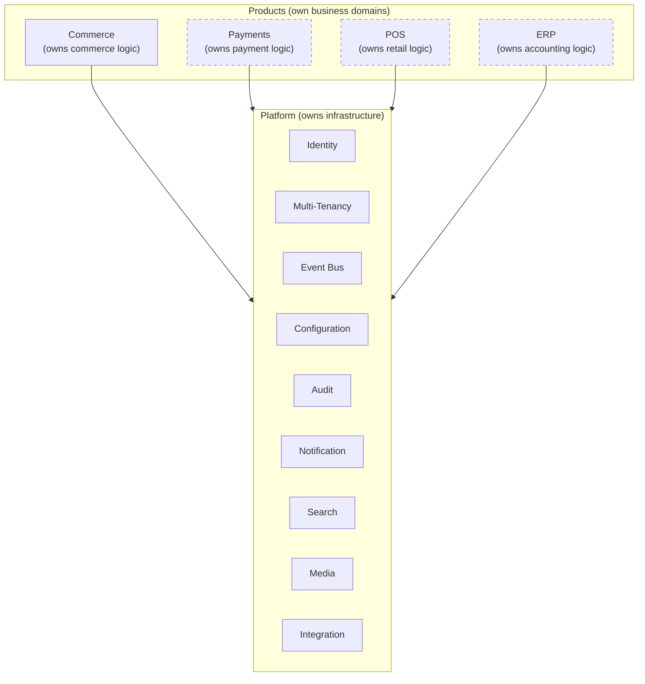

# Platform Core

## Metadata

| Field | Value |
|-------|-------|
| Title | Kairo Platform Core Architecture |
| Document ID | KAI-CORE-001 |
| Status | Draft |
| Version | 0.1 |
| Target Release | N/A |
| Owner | Chief Platform Architect |
| Created | 2026-07-17 |
| Last Updated | 2026-07-17 |
| Reviewers | TODO |
| Related Documents | [Architecture Overview](../04-Architecture/Architecture-Overview.md), [System Architecture](../04-Architecture/System-Architecture.md), [Kairo Platform](../02-Products/Kairo-Platform.md), [Product Ecosystem](../02-Products/Product-Ecosystem.md), [Shared Capabilities](../03-Business-Capabilities/Shared-Capabilities.md), [Cross-Cutting Concerns](../04-Architecture/Cross-Cutting-Concerns.md) |
| Dependencies | None |

---

## Version Gate

| Version | Platform Core Expectation |
|---------|--------------------------|
| V1 | Identity, multi-tenancy, event infrastructure, and configuration are operational. Platform enforces authentication, tenant isolation, and module boundaries. Products cannot bypass platform controls. |
| V2 | Full platform service suite is operational (audit, notification, search, media, integration). Platform services are stable and consumed by all Commerce modules. Platform conventions are proven through one release cycle. |
| V3 | Platform supports multiple independent products. Cross-product event routing, multi-product identity, and shared configuration hierarchy are proven. Platform services handle multi-product load. |
| Future | Platform operates at infrastructure-grade maturity with formal SLAs. Geographic distribution, enterprise reliability, and ecosystem-scale event routing are operational. |

---

## Purpose

This document defines what the Kairo Platform is at its conceptual foundation. It establishes the platform's identity as distinct from the products built upon it, defines what the platform is responsible for, and describes how products relate to the platform.

The platform is not a product. It is the infrastructure foundation that makes all products possible. Understanding this distinction is essential for every architectural and product decision.

---

## Platform Definition

The Kairo Platform is the shared infrastructure layer upon which all Kairo products are built. It provides the capabilities that every product needs but no product should own.

### What the Platform Is

- **A foundation** — The structural base that products build upon. Products inherit platform capabilities without reimplementing them.
- **An enforcer** — The authority that ensures security, isolation, and consistency across all products. Platform rules cannot be bypassed by product code.
- **A service provider** — A set of shared services (identity, events, audit, notifications) consumed by products through defined interfaces.
- **A contract** — A commitment to products that certain capabilities will exist, behave consistently, and remain stable.

### What the Platform Is NOT

- **Not a product** — The platform is not sold to customers. Products are sold. The platform enables products.
- **Not an application** — The platform has no user-facing interface. It operates entirely behind product APIs.
- **Not optional** — Products cannot opt out of platform services. Authentication, tenant isolation, and event infrastructure are mandatory.
- **Not a framework** — The platform does not dictate how products implement their business logic. It provides infrastructure, not patterns.

### Platform vs. Product

The boundary is clear: products own business domains, the platform owns infrastructure. When a capability does not belong to any business domain and is needed by multiple products, it belongs to the platform.

---

## Responsibilities

The platform is responsible for capabilities that must be consistent, secure, and universal across all products.

### Security Boundary

The platform is the security authority for the ecosystem. It owns:

- **Authentication** — Verifying the identity of every request. No product implements its own authentication.
- **Authorization framework** — Providing the permission evaluation engine. Products define their permissions; the platform evaluates them.
- **Tenant isolation** — Ensuring that data belonging to one organization is never accessible to another. This is enforced structurally, not by application logic.
- **Secret management** — Storing and retrieving sensitive credentials. Products never manage secrets independently.

### Communication Infrastructure

The platform owns all inter-module and inter-product communication:

- **Event bus** — Publishing, routing, and delivering events across the ecosystem. Products publish and subscribe; the platform handles delivery, retry, and dead-letter management.
- **API gateway** — Routing external requests to the correct product, enforcing rate limits, and managing API versioning.
- **Webhook delivery** — Dispatching event notifications to external systems registered by tenants.

### Operational Infrastructure

The platform provides the operational foundation:

- **Multi-tenancy** — Tenant resolution, data scoping, and tenant-level configuration. Every request operates within a tenant context provided by the platform.
- **Configuration** — Hierarchical configuration management with platform, product, and tenant-level overrides.
- **Audit** — Recording significant actions across all products in a unified, tamper-evident audit trail.
- **Health management** — Aggregating health signals from all products and platform services into system-level health status.

### Developer Infrastructure

The platform supports the developer experience:

- **SDK generation** — Providing consistent client libraries generated from product API specifications.
- **Sandbox environments** — Enabling developers to test against the platform without affecting production.
- **Documentation hosting** — Serving API documentation generated from product specifications.

---

## Platform Principles

### Products Are First-Class Citizens

The platform exists to serve products. Platform decisions are evaluated by their impact on product development velocity, product reliability, and product developer experience. A platform change that improves platform elegance but degrades product development is rejected.

### Consistency Is Non-Negotiable

Products built on the platform behave consistently because the platform enforces consistency. API error formats, authentication flows, tenant scoping, and event schemas are uniform — not because products choose to follow conventions, but because the platform makes divergence impossible.

### Platform Changes Affect Everyone

A change to the platform affects every product. This means platform changes are:

- Reviewed with greater scrutiny than product changes.
- Backward-compatible by default.
- Communicated to all product teams before deployment.
- Tested against all products, not just the product that motivated the change.

### Minimal Surface Area

The platform provides the minimum shared infrastructure needed. Capabilities that could belong to a product stay in that product until multiple products demonstrably need them. The platform does not grow speculatively.

### Stability Over Innovation

The platform prioritizes stability over novelty. Products can experiment and evolve quickly. The platform evolves slowly and deliberately because instability at the platform level cascades to every product.

### Invisible When Working

The best platform is one that products forget is there. Platform services should require minimal configuration, produce no surprises, and never become the bottleneck for product development.

---

## Shared Capabilities

The platform provides the following shared capabilities. Each is consumed by all products through defined interfaces.

| Capability | Responsibility | Consumption Model |
|-----------|---------------|-------------------|
| Identity | Authentication, token management, session lifecycle | Request pipeline (automatic) |
| Authorization | Permission evaluation, role management | Request pipeline (automatic) + explicit queries for resource-level checks |
| Multi-Tenancy | Tenant resolution, data scoping, isolation enforcement | Request pipeline (automatic) |
| Event Infrastructure | Event publishing, routing, delivery, retry | Publish interface + subscription registration |
| Configuration | Setting storage, hierarchy resolution, runtime refresh | Configuration interface (pull-based) |
| Audit | Action recording, retention, query | Audit interface (push-based per operation) |
| Notification | Message templating, multi-channel delivery, preference management | Event-driven (automatic based on subscriptions) |
| Search | Indexing, querying, faceting, relevance | Index interface (push) + query interface (pull) |
| Media | Asset storage, retrieval, transformation | Storage interface (push) + retrieval interface (pull) |
| Integration | External connection management, credential storage, health monitoring | Configuration interface + credential retrieval |
| Health | Liveness and readiness assessment, status aggregation | Health check registration (automatic) |

### Consumption Rules

- **Automatic capabilities** (Identity, Authorization, Multi-Tenancy, Health) are consumed without explicit product action. The platform request pipeline handles them.
- **Explicit capabilities** (Audit, Search, Media, Configuration) require products to interact with platform interfaces at defined points.
- **Event-driven capabilities** (Notification) react to events published by products without direct product involvement in delivery.

---

## Architecture Impact

The platform's architectural role has specific consequences:

| Concern | Impact |
|---------|--------|
| Request path | Every request passes through platform-owned middleware (auth, tenancy, rate limiting) before reaching product code. This adds latency that must be minimized but cannot be eliminated. |
| Data ownership | The platform owns identity data, configuration data, audit data, and integration credentials. Products own their business domain data. No overlap. |
| Failure isolation | Platform service failures have system-wide impact. Platform services must have higher availability targets than any individual product. |
| Change velocity | Platform changes require more review, more testing, and more coordination than product changes. This is intentional. |
| Scaling | Platform services must scale to support the aggregate load of all products. A platform service that becomes a bottleneck blocks the entire ecosystem. |
| Versioning | Platform interfaces are versioned independently from products. Platform and products can release on different cadences. |

---

## Decision Summary

| Decision | Rationale |
|----------|-----------|
| Platform is separate from products | Products own business domains. Platform owns infrastructure. Mixing them creates inappropriate coupling. |
| Platform enforces, not suggests | Security, isolation, and consistency must be guaranteed. Advisory guidelines are insufficient for infrastructure concerns. |
| Platform surface area is minimal | Every platform capability is a dependency for all products. Minimizing that surface reduces system-wide risk. |
| Platform evolves slowly | Stability at the infrastructure level enables velocity at the product level. |
| Products cannot bypass the platform | If products could bypass authentication, tenancy, or audit, the guarantees would be meaningless. |
| Shared capabilities require multi-product justification | A capability joins the platform only when multiple products need it. Single-product needs stay in that product. |

---

## Out of Scope

This document does not define:

- Platform service implementation details — documented in individual service specifications.
- Platform API contracts — documented in platform service API documentation.
- Platform deployment topology — documented in infrastructure architecture.
- Product-specific architecture — documented per product in their respective architecture documents.
- Technology choices for platform services — documented in [Technology Stack](../04-Architecture/Technology-Stack.md).

---

## Future Considerations

- **Platform SDK** — As the platform grows, products may benefit from a platform SDK that provides typed access to all platform services. This reduces integration boilerplate.
- **Platform versioning** — As products deploy independently, the platform may need to support multiple concurrent versions of its interfaces to avoid forced product upgrades.
- **Platform observability** — Dedicated monitoring for platform services that distinguishes platform health from product health.
- **Platform governance** — As the team grows, formal governance for platform changes (review boards, impact assessment requirements) may become necessary.
- **Multi-region platform** — Platform services may need to operate across regions while maintaining consistency for global capabilities (identity) and allowing locality for regional capabilities (media, search).

---

## Change History

| Version | Date | Author | Description |
|---------|------|--------|-------------|
| 0.1 | 2026-07-17 | Chief Platform Architect | Initial draft |
