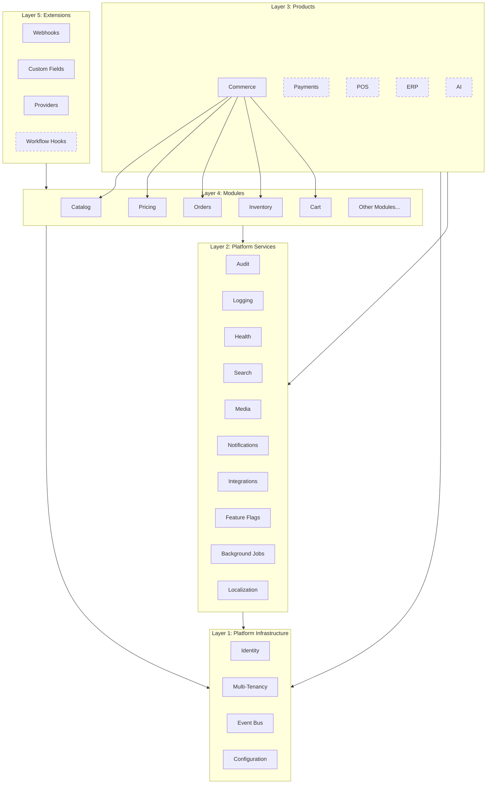
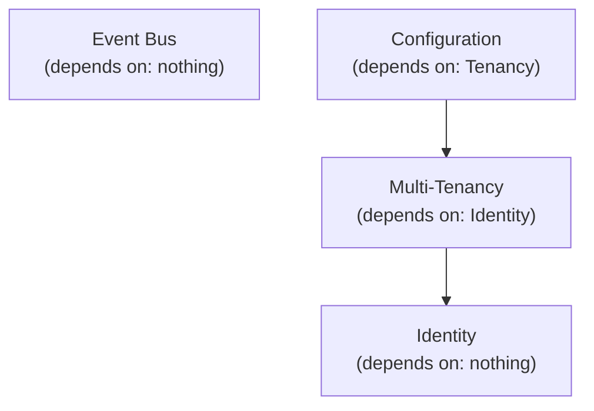
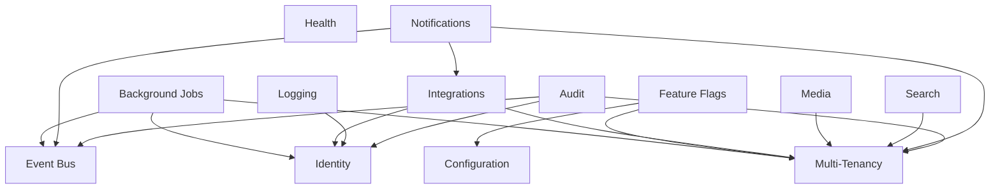
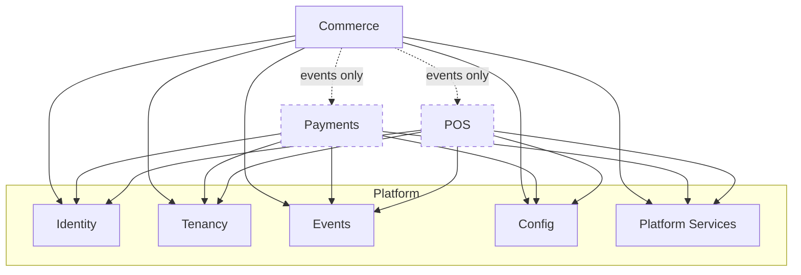
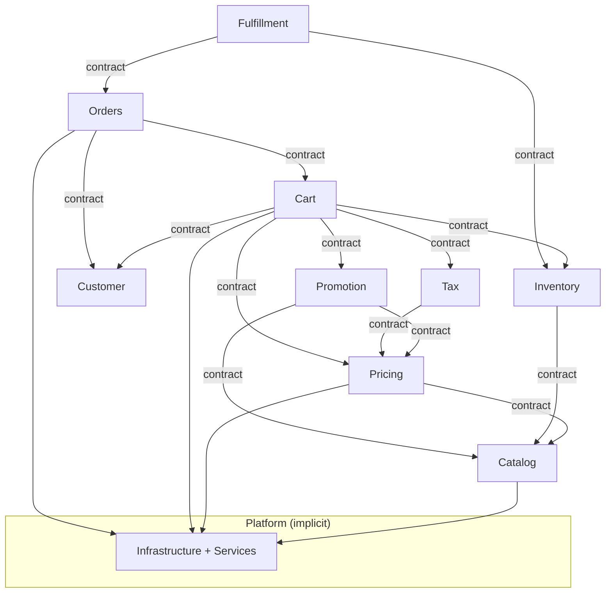
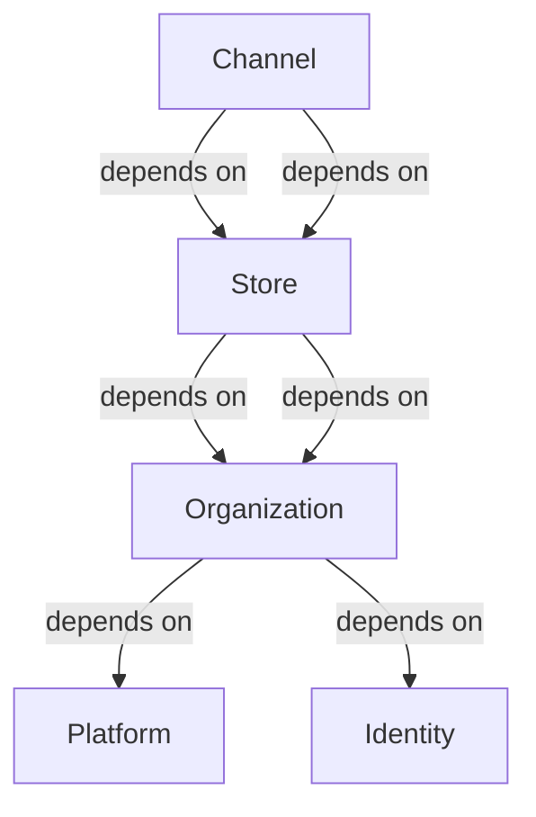
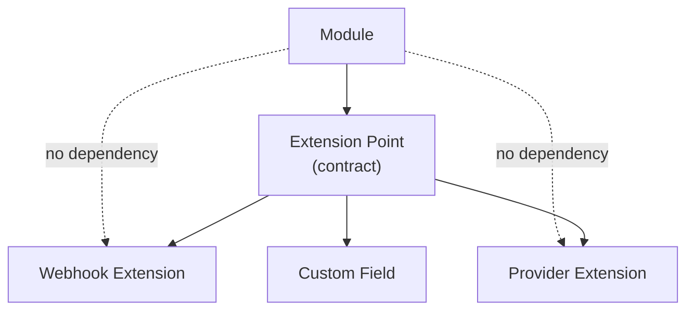

# Platform Dependencies

## Metadata

| Field | Value |
|-------|-------|
| Title | Kairo Platform Dependencies |
| Document ID | KAI-CORE-010 |
| Status | Draft |
| Version | 0.1 |
| Target Release | N/A |
| Owner | Chief Platform Architect |
| Created | 2026-07-18 |
| Last Updated | 2026-07-18 |
| Reviewers | TODO |
| Related Documents | [Platform Core](../05-Platform-Core/Platform-Core.md), [Platform Hierarchy](../05-Platform-Core/Platform-Hierarchy.md), [Module Architecture](./Module-Architecture.md), [Capability Dependencies](../03-Business-Capabilities/Capability-Dependencies.md), [Extension Architecture](./Extension-Architecture.md) |
| Dependencies | None |

---

## Purpose

This document defines the dependency rules that govern how every entity in the Kairo platform relates to every other entity. Dependencies determine what must exist before something else can function, what fails when a dependency is unavailable, and what is affected when a dependency changes.

Violating dependency rules creates hidden coupling, circular dependencies, and fragile systems. These rules are enforced architecturally, not by convention.

---

## Dependency Principles

- **Dependencies flow downward.** Higher-level entities depend on lower-level entities. Lower-level entities never depend on higher-level entities.
- **No circular dependencies.** If A depends on B, B must not depend on A — directly or transitively.
- **Depend on contracts, not implementations.** Every dependency is on a public contract (interface, event schema, API), never on internal implementation.
- **Platform dependencies are implicit.** Every product and module depends on the platform. This dependency is structural and does not need to be declared explicitly.
- **Failure in a dependency degrades, not destroys.** When a non-critical dependency is unavailable, the dependent entity degrades gracefully rather than failing completely.

---

## Dependency Layers

Dependencies flow downward only. Layer 5 depends on Layer 4. Layer 4 depends on Layers 1 and 2. No layer depends on a layer above it.

---

## Platform Infrastructure Dependencies

Platform infrastructure is the foundation. Everything depends on it. It depends on nothing within the platform.

| Service | Depends On | Depended On By |
|---------|-----------|----------------|
| Identity | Nothing | Everything. Identity is the root dependency. |
| Multi-Tenancy | Identity (tenant resolution requires authenticated context) | Configuration, all products, all modules |
| Event Bus | Nothing (operates independently) | All products, all modules, Notifications, Audit |
| Configuration | Multi-Tenancy (configuration is tenant-scoped) | All products, all modules, Feature Flags |

### Rules

- Identity must be operational before any other service or product can function.
- Multi-Tenancy must be operational before any tenant-scoped operation can occur.
- The Event Bus operates independently but must be available for modules that publish or subscribe to events.
- Configuration depends on Tenancy because configuration is resolved per tenant.

---

## Platform Service Dependencies

Platform services depend on platform infrastructure and may depend on each other within defined rules.

| Service | Depends On | Reason |
|---------|-----------|--------|
| Audit | Identity, Tenancy, Events | Actor identification, tenant scoping, event-driven entry collection |
| Logging | Identity | Request context enrichment with user identity |
| Health | Nothing | Operates independently to assess system state |
| Notifications | Events, Tenancy, Integrations | Event-driven triggering, tenant-scoped preferences, delivery through external channels |
| Search | Tenancy | Indexes and queries are tenant-scoped |
| Media | Tenancy | Asset storage is tenant-scoped |
| Integrations | Tenancy, Identity | Credentials are tenant-scoped, access is authenticated |
| Feature Flags | Configuration, Tenancy | Flags resolve through the configuration hierarchy per tenant |
| Background Jobs | Identity, Tenancy, Events | Jobs execute with a defined identity, within a tenant, triggered by events |
| Localization | Nothing | Provides formatting utilities independently |

### Rules

- Platform services may depend on platform infrastructure services.
- Platform services may depend on other platform services only if the dependency is acyclic.
- Platform services must not depend on any product or module. The platform layer is below the product layer.
- If a non-critical platform service is unavailable, products degrade rather than fail (e.g., if Notifications is down, orders still process — confirmations are queued for later delivery).

---

## Product Dependencies

Products depend on the platform. Products do not depend on each other.

### Rules

- Every product depends on platform infrastructure (Identity, Tenancy, Events, Configuration).
- Every product may consume platform services (Audit, Notifications, Search, etc.).
- Products do not depend on each other directly. Cross-product communication uses the platform event bus exclusively.
- A product's unavailability does not affect other products. Commerce being down does not prevent Identity from functioning.
- Products may consume events published by other products, but this is a loose coupling — the consuming product subscribes to events, not to the producing product's API.

---

## Module Dependencies

Modules depend on platform infrastructure, platform services, and other modules within the same product through their public contracts.

### Rules

- Modules depend on other modules through public contracts only. Never through internal implementation.
- Module dependencies must be acyclic. If Module A depends on Module B, Module B must not depend on Module A.
- Modules within the same product may have synchronous contract dependencies.
- Modules in different products communicate only through events. No synchronous cross-product module dependencies.
- Every module depends implicitly on platform infrastructure (Identity, Tenancy, Events, Configuration).
- A module may consume platform services (Audit, Search, Notifications) as needed.
- A module must not depend on a module that has not reached at least the Implementation lifecycle stage.

---

## Entity Hierarchy Dependencies

The platform hierarchy creates structural dependencies between entities.

| Entity | Depends On | Cannot Exist Without |
|--------|-----------|---------------------|
| Organization | Platform, Identity | A running platform with Identity operational |
| Store | Organization | An active organization |
| Channel | Store | An active store |
| Warehouse (future) | Store or Organization | An active store or organization |
| Branch (future) | Store | An active store |

### Rules

- An entity cannot be created if its parent dependency does not exist.
- An entity cannot be created if its parent is in a Suspended, Decommissioning, or Archived state.
- Deleting a parent entity cascades to its children (decommissioning an organization retires all its stores).
- Moving an entity between parents is not supported (a store cannot move between organizations).

---

## Extension Dependencies

Extensions depend on the extension points provided by modules. They do not depend on module internals.

### Rules

- Extensions depend on extension point contracts. They do not depend on module internals.
- Modules do not depend on extensions. An extension's absence does not affect module operation.
- Extension point contracts are versioned. Extensions declare which version they target.
- Extensions cannot create dependencies between modules. An extension in Module A cannot call Module B's internal logic.

---

## Dependency Failure Handling

| Dependency Type | Failure Impact | Handling |
|----------------|---------------|---------|
| Platform Infrastructure (Identity, Tenancy) | Critical — nothing functions | System is unavailable. Restart or repair required. |
| Platform Infrastructure (Events) | Significant — async processing stops | Synchronous operations continue. Events queue for delivery when restored. |
| Platform Service (Audit) | Degraded — audit entries are lost if not buffered | Buffer audit entries. Alert immediately. Operations continue. |
| Platform Service (Notifications) | Degraded — notifications delayed | Queue for delivery when restored. No impact on business operations. |
| Platform Service (Search) | Degraded — search unavailable | API queries still work. Search-specific endpoints return errors. |
| Module (upstream) | Degraded or failed — dependent operations fail | Return clear error to caller. Do not cascade failure further. |
| Extension (webhook, provider) | Isolated — extension fails | Platform fallback behavior applies. Module continues. Failed delivery is retried or dead-lettered. |

### Rules

- Critical dependencies (Identity, Tenancy) cause system-wide unavailability. These services have the highest availability requirements.
- Non-critical platform services degrade gracefully. Business operations continue.
- Module failures are isolated. A failing module does not crash adjacent modules.
- Extension failures are fully isolated. The platform never fails because an extension failed.

---

## Architecture Impact

| Concern | Impact |
|---------|--------|
| Startup order | Platform infrastructure must start before platform services. Platform services must start before products. Products must start before extensions are evaluated. |
| Health checks | Health propagation follows the dependency graph. An unhealthy dependency degrades the dependent's health status. |
| Testing | Integration tests validate behavior under dependency failure. Every dependency path has a defined failure mode. |
| Deployment | Rolling deployments must respect dependency order. A new version of a dependency is deployed before a new version of a dependent that requires it. |
| Scaling | Scaling a dependent does not require scaling its dependencies unless the dependency is the bottleneck. Scaling decisions follow the dependency graph. |
| Monitoring | Dependency health is monitored. Alerts fire when a dependency is degraded, not only when the dependent fails. |

---

## Decision Summary

| Decision | Rationale |
|----------|-----------|
| Dependencies flow downward only | Upward dependencies create circular coupling. Downward-only flow ensures a clear dependency tree. |
| Products do not depend on each other | Product independence is a core platform goal. Direct dependencies would force co-deployment and co-failure. |
| Cross-product communication uses events only | Events decouple products. A product can publish without knowing who subscribes. |
| Identity is the root dependency | Everything requires authentication. Identity having zero dependencies keeps the root simple and reliable. |
| Extensions never create module dependencies | Extensions are optional additions. They must not introduce structural coupling between modules. |
| Non-critical dependency failure degrades, not destroys | Commerce must continue processing orders even if search or notifications are temporarily unavailable. |
| Entity hierarchy dependencies are strict | A store cannot exist without an organization. Enforcing this structurally prevents orphaned data. |

---

## Version Gate

| Version | Dependency Expectation |
|---------|----------------------|
| V1 | Platform infrastructure dependency chain is operational (Identity → Tenancy → Configuration). Module dependency graph is acyclic and enforced. Graceful degradation is implemented for non-critical platform services. |
| V2 | Dependency failure handling is tested for every platform service. Cross-module dependency contracts are stable. Extension dependency isolation is proven. |
| V3 | Cross-product event dependencies are operational. Multi-product dependency graph is documented and monitored. Dependency health propagation is reflected in system health dashboards. |

---

## Change History

| Version | Date | Author | Description |
|---------|------|--------|-------------|
| 0.1 | 2026-07-18 | Chief Platform Architect | Initial draft |
