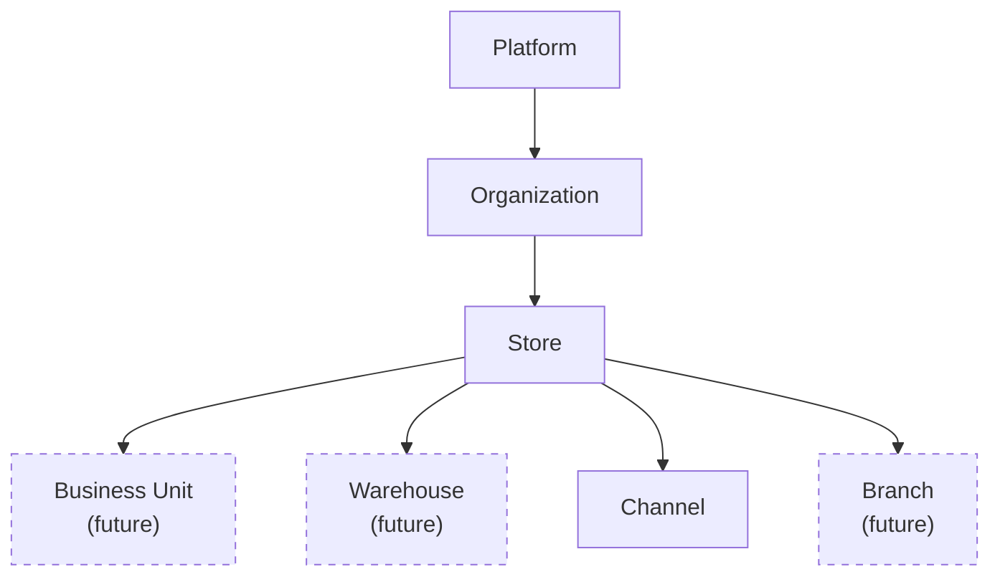
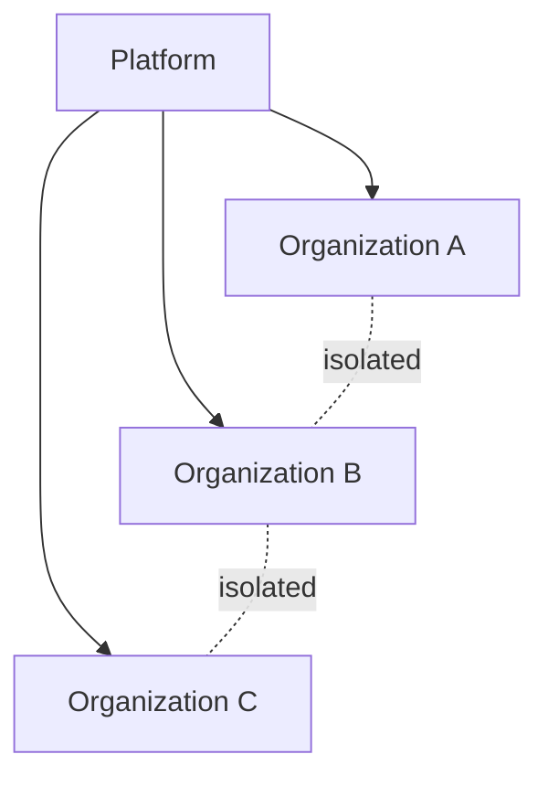
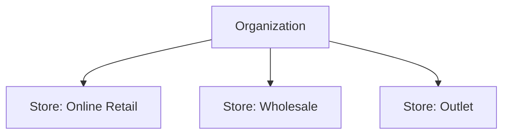
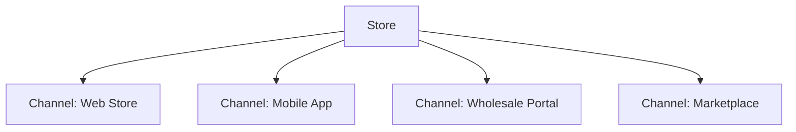
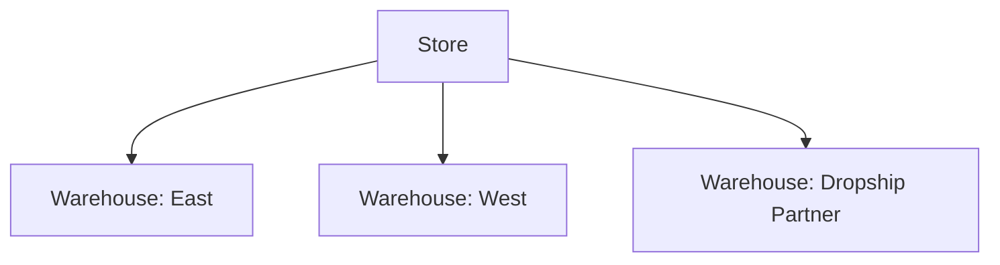
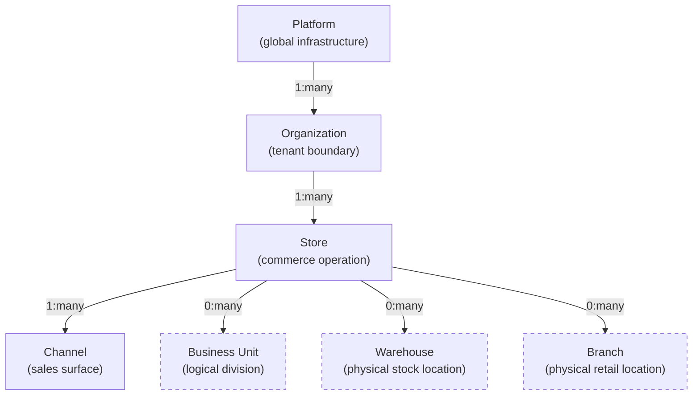
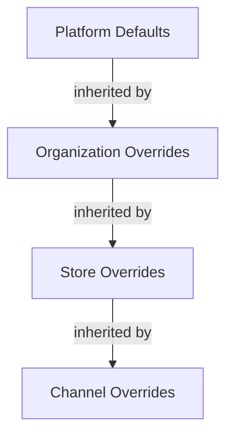

# Platform Hierarchy

## Metadata

| Field | Value |
|-------|-------|
| Title | Kairo Platform Hierarchy |
| Document ID | KAI-CORE-002 |
| Status | Draft |
| Version | 0.1 |
| Target Release | N/A |
| Owner | Chief Platform Architect |
| Created | 2026-07-17 |
| Last Updated | 2026-07-17 |
| Reviewers | TODO |
| Related Documents | [Platform Core](./Platform-Core.md), [System Architecture](../04-Architecture/System-Architecture.md), [Kairo Platform](../02-Products/Kairo-Platform.md), [Glossary](../02-Products/Glossary.md), [Cross-Cutting Concerns](../04-Architecture/Cross-Cutting-Concerns.md) |
| Dependencies | None |

---

## Purpose

This document defines the structural hierarchy of the Kairo platform — how entities are organized from the platform level down through organizations, stores, and operational units. This hierarchy determines data ownership, isolation boundaries, configuration inheritance, and permission scoping across the entire ecosystem.

Understanding this hierarchy is essential for every architectural decision involving multi-tenancy, data access, and configuration.

---

## Hierarchy Overview

---

## Hierarchy Levels

### Platform

The top level. The Kairo platform itself. There is exactly one platform.

| Attribute | Detail |
|-----------|--------|
| Cardinality | Exactly one |
| Ownership | Kairo (the company) |
| Responsibility | Global infrastructure, platform services, shared conventions, platform-level defaults |
| Isolation | Platform data is inaccessible to organizations. Platform configuration provides defaults that organizations may override. |

The platform level is where shared services live — identity infrastructure, event bus configuration, platform-wide security policies, and global rate limits. No business data exists at the platform level.

---

### Organization

The primary tenant boundary. An organization represents a single business entity operating on the platform.

| Attribute | Detail |
|-----------|--------|
| Cardinality | Many per platform |
| Ownership | The business that subscribes to Kairo |
| Responsibility | Tenant data boundary, user membership, organization-level configuration, billing context |
| Isolation | Complete data isolation between organizations. No organization can access another organization's data under any circumstance. |

The organization is the unit of:

- **Data isolation** — All business data is scoped to an organization.
- **User membership** — Users belong to one or more organizations.
- **Configuration** — Organization-level settings override platform defaults.
- **Billing** — Usage and subscription are tracked per organization.
- **API access** — API keys and tokens are scoped to an organization.

---

### Store

A commercial operation within an organization. A store represents a business that sells goods or services.

| Attribute | Detail |
|-----------|--------|
| Cardinality | One or more per organization |
| Ownership | The organization |
| Responsibility | Commerce operations context, store-level configuration, operational boundaries within the organization |
| Isolation | Stores within an organization share the organization's data boundary but may have distinct configuration, catalogs, and operational rules. |

A store is the unit of:

- **Commerce context** — Products, pricing, and inventory may be scoped per store.
- **Operational configuration** — Each store may have different tax rules, shipping methods, and fulfillment settings.
- **Staff assignment** — Staff members may be assigned to specific stores with store-scoped permissions.

An organization with a single commercial operation has one store. An organization with multiple brands, regions, or selling models has multiple stores.

---

### Channel

A distinct sales context within a store. Channels represent the surfaces through which customers interact with the store.

| Attribute | Detail |
|-----------|--------|
| Cardinality | One or more per store |
| Ownership | The store |
| Responsibility | Catalog visibility, pricing scope, promotion scope, inventory visibility for a specific sales surface |
| Isolation | Channels are operationally independent within a store. Configuration in one channel does not affect another. |

A channel is the unit of:

- **Catalog visibility** — Which products are visible in this sales context.
- **Pricing scope** — Which price lists apply.
- **Promotion scope** — Which promotions are active.
- **Inventory visibility** — Which stock is available for sale through this channel.

Channels enable a single store to serve different customer segments (retail vs. wholesale), different platforms (web vs. mobile), or different marketplaces with tailored experiences from shared underlying data.

---

### Business Unit (Future)

A logical division within a store for organizational or reporting purposes.

| Attribute | Detail |
|-----------|--------|
| Cardinality | Zero or more per store |
| Ownership | The store |
| Responsibility | Organizational grouping, reporting segmentation, budget ownership |
| Isolation | Business units may scope reporting and permissions but do not create hard data boundaries. |

Business units support organizations that need internal segmentation beyond stores — for example, a department within a retail operation or a product line within a brand. They are a future capability that will be introduced when validated customer requirements demand it.

---

### Warehouse (Future)

A physical location where inventory is stored and from which fulfillment occurs.

| Attribute | Detail |
|-----------|--------|
| Cardinality | One or more per store (or per organization) |
| Ownership | The store or organization depending on operational model |
| Responsibility | Inventory storage location, fulfillment source, stock level tracking per location |
| Isolation | Warehouses hold location-specific inventory data. Stock at one warehouse is distinct from stock at another. |

Warehouses enable:

- **Multi-location inventory** — Stock tracked per physical location.
- **Fulfillment routing** — Orders routed to the nearest or most appropriate warehouse.
- **Inventory visibility** — Channels may show availability from specific warehouses.

---

### Branch (Future)

A physical retail location associated with a store, where in-store operations occur.

| Attribute | Detail |
|-----------|--------|
| Cardinality | Zero or more per store |
| Ownership | The store |
| Responsibility | Physical retail presence, in-store operations (POS), local staff management |
| Isolation | Branches scope in-store operations, register sessions, and local staff assignments. |

Branches are relevant when the Kairo POS product is introduced. They represent the physical locations where customers interact in person.

---

## Complete Hierarchy Diagram

---

## Ownership and Inheritance

### Data Ownership

| Level | Owns |
|-------|------|
| Platform | Platform configuration, infrastructure state, global policies |
| Organization | Users, API keys, organization settings, billing data |
| Store | Products, prices, orders, customers, inventory, fulfillment configuration |
| Channel | Catalog visibility rules, channel-specific pricing scope, channel-specific promotions |
| Warehouse | Location-specific stock levels, location address |
| Branch | Register configuration, local staff assignments, in-store transaction history |

### Configuration Inheritance

Configuration flows downward through the hierarchy. Lower levels inherit from higher levels and may override where permitted.

| Level | Configuration Scope |
|-------|--------------------|
| Platform | Default timezone, default currency format, security policy minimums, rate limit defaults |
| Organization | Timezone, locale, default currency, security policy (may only be stricter than platform), notification preferences |
| Store | Tax configuration, shipping methods, fulfillment rules, pricing defaults |
| Channel | Catalog filters, active price lists, active promotions, inventory visibility rules |

### Permission Scoping

Permissions are evaluated at the most specific applicable level:

- A user with organization-level admin access has access to all stores within that organization.
- A user with store-level access can operate within that store only.
- A user with channel-level access can manage that channel's configuration only.

Permissions never grant access above the user's assigned level. A store-level user cannot access organization-level settings.

---

## Isolation Boundaries

| Boundary | Type | Enforcement |
|----------|------|-------------|
| Between organizations | Hard isolation | Platform-enforced. No data crosses this boundary. No configuration leaks. No user access spans organizations without explicit multi-organization membership. |
| Between stores | Soft isolation | Organization-enforced. Stores within an organization share the tenant boundary but have operationally distinct configuration. Cross-store visibility is controlled by permissions. |
| Between channels | Operational isolation | Store-enforced. Channels scope what is visible and active but share underlying store data (products exist once, visibility varies by channel). |
| Between warehouses | Data isolation | Stock data is distinct per warehouse. Aggregate views are computed, not shared storage. |

---

## Version Gate

| Version | Hierarchy Expectation |
|---------|----------------------|
| V1 | Platform → Organization → Store → Channel hierarchy is operational. Tenant isolation is enforced at the organization level. Configuration inheritance supports platform → organization → store. |
| V2 | Multi-store operations are proven. Channel scoping is fully functional. Permission scoping works at organization, store, and channel levels. Warehouse concept is introduced for multi-location inventory. |
| V3 | Business units and branches are introduced if validated by customer requirements. Full hierarchy supports POS (branches) and advanced fulfillment (warehouses with routing). |

---

## Architecture Impact

| Concern | Impact |
|---------|--------|
| Data model | Every business entity includes organization and store context. Queries are always scoped to the tenant boundary. |
| API design | API requests carry organization and store context (resolved from authentication or explicit header). Responses are scoped accordingly. |
| Multi-tenancy | The platform layer resolves tenant context for every request. Modules never need to implement their own tenant filtering. |
| Configuration | The configuration system supports hierarchical resolution. Modules request a setting; the platform resolves it at the correct hierarchy level. |
| Permissions | The authorization framework evaluates permissions at the appropriate hierarchy level. Modules declare required permissions; the platform evaluates them against the user's level. |
| Scaling | Organization is the primary data partition key. The system scales by distributing organizations, not by splitting organizations across partitions. |

---

## Decision Summary

| Decision | Rationale |
|----------|-----------|
| Organization is the tenant boundary | Organizations represent independent businesses. Complete isolation between them is a non-negotiable security and compliance requirement. |
| Store is below organization | A business may operate multiple commercial operations (brands, regions, segments). Stores provide operational separation within a single tenant. |
| Channel is below store | A single store may sell through multiple surfaces. Channels provide sales context without duplicating underlying data. |
| Warehouse is future | Multi-location inventory is a V2+ concern. The hierarchy supports it structurally but does not require it for V1. |
| Branch is future | Physical retail is a POS product concern. The hierarchy accommodates it but does not implement it until POS is active. |
| Configuration inherits downward | Lower levels should not need to repeat configuration that is the same as their parent. Override only where different. |

---

## Out of Scope

This document does not define:

- Database schema for hierarchy entities — documented in module specifications.
- API endpoints for hierarchy management — documented in API specifications.
- Specific permission definitions per level — documented in module specifications.
- Infrastructure partitioning strategy — documented in deployment architecture.
- Pricing for different hierarchy levels — business decision outside architecture scope.

---

## Future Considerations

- **Multi-organization users** — Users who operate across multiple organizations (agency staff managing multiple clients) will need cross-organization identity without cross-organization data access.
- **Organization hierarchy** — Parent-child relationships between organizations (franchise models, holding companies) may be needed for enterprise customers.
- **Shared warehouses** — Warehouses that serve multiple stores (or even multiple organizations in a marketplace model) will require careful data isolation design.
- **Dynamic hierarchy** — Some customers may need hierarchy levels that do not map cleanly to the predefined structure. Extension mechanisms for custom hierarchy levels may be evaluated.
- **Hierarchy-aware reporting** — Reporting that aggregates across hierarchy levels (all stores, all channels) requires careful scoping to respect isolation boundaries.

---

## Change History

| Version | Date | Author | Description |
|---------|------|--------|-------------|
| 0.1 | 2026-07-17 | Chief Platform Architect | Initial draft |
