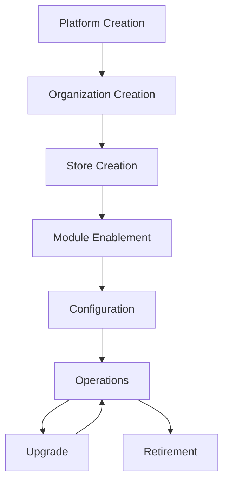
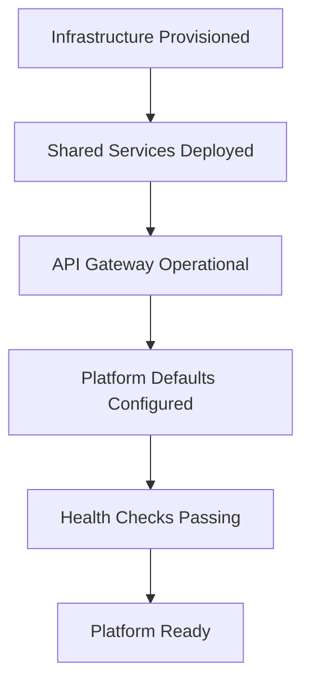
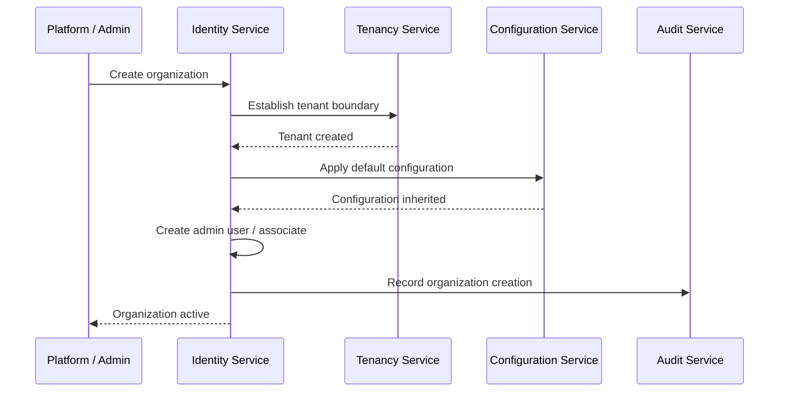
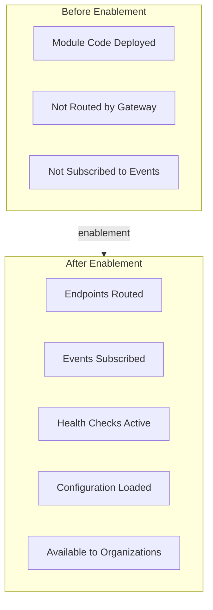
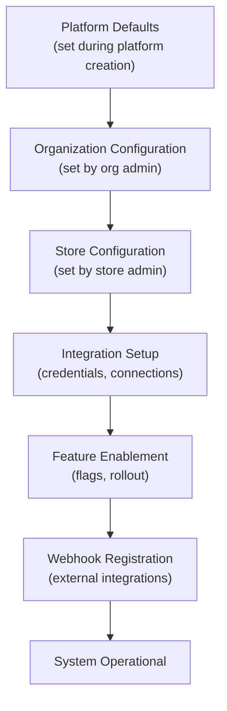
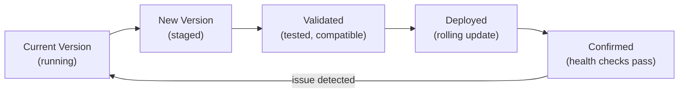

# Platform Lifecycle

## Metadata

| Field | Value |
|-------|-------|
| Title | Kairo Platform Lifecycle |
| Document ID | KAI-CORE-009 |
| Status | Draft |
| Version | 0.1 |
| Target Release | N/A |
| Owner | Chief Platform Architect |
| Created | 2026-07-18 |
| Last Updated | 2026-07-18 |
| Reviewers | TODO |
| Related Documents | [Platform Core](../05-Platform-Core/Platform-Core.md), [Platform Hierarchy](../05-Platform-Core/Platform-Hierarchy.md), [Organization Model](../05-Platform-Core/Organization-Model.md), [Store Model](../05-Platform-Core/Store-Model.md), [Module Lifecycle](./Module-Lifecycle.md), [Configuration Architecture](../05-Platform-Core/Configuration-Architecture.md) |
| Dependencies | None |

---

## Purpose

This document describes the lifecycle of the Kairo platform — from initial creation through organization onboarding, store activation, module enablement, daily operations, platform upgrades, and eventual entity retirement. It defines the sequence of events that bring the platform to life and keep it running.

This is not an operational runbook. It is the architectural view of how platform entities are created, configured, operated, and retired, and how these lifecycle stages relate to each other.

---

## Lifecycle Overview

---

## Platform Creation

The platform itself is instantiated — infrastructure is provisioned, shared services are deployed, and the platform is ready to accept organizations.

### What Happens

- Infrastructure is provisioned (compute, storage, networking, message broker, cache).
- Platform shared services are deployed (Identity, Configuration, Events, Audit, Logging, Health Monitoring).
- The API gateway is configured and operational.
- Platform-level configuration defaults are established.
- Health monitoring confirms all services are operational.
- The platform is ready to accept its first organization.

### Architectural Significance

Platform creation happens once per deployment environment. It establishes the infrastructure foundation that all organizations share. The platform must be fully operational before any organization is created.

### Rules

- No organization can be created until all platform services pass health checks.
- Platform defaults must be configured before the first organization inherits them.
- Platform creation is idempotent. Re-running the creation process on an existing platform does not duplicate or corrupt state.

---

## Organization Creation

A new business entity is onboarded to the platform. The organization becomes the tenant boundary for all its future data and operations.

### What Happens

- Organization identity is established (name, identifier, initial configuration).
- Tenant data boundary is created. All future data for this organization is isolated within this boundary.
- An initial administrator user is created or associated.
- Organization-level configuration inherits from platform defaults.
- API keys or initial authentication credentials are provisioned.
- Audit trail begins recording from the moment of creation.
- The organization enters the Active lifecycle state.

### Architectural Significance

Organization creation is the moment tenant isolation begins. From this point forward, every operation within this organization is scoped to its data boundary. No other organization can see or affect this organization's data.

### Sequence

### Rules

- An organization cannot operate without at least one authenticated user with administrative permissions.
- Organization creation is atomic. If any step fails, the organization is not partially created.
- The audit trail for the organization begins at creation. The creation event itself is the first audit entry.

---

## Store Creation

A commercial operation is created within an organization. The store provides the context for all commerce activity.

### What Happens

- Store identity is established within the organization (name, identifier, initial settings).
- Store-level configuration inherits from the organization.
- Default channel is created (every store has at least one channel).
- Commerce capabilities become available within the store context.
- Store is ready to receive products, pricing, and inventory data.

### Architectural Significance

Store creation does not create new infrastructure. Stores are logical entities within the organization's existing data boundary. The store adds an operational scope layer — commerce operations that were previously scoped to the organization are now scoped to a specific store within that organization.

### Rules

- A store belongs to exactly one organization. It cannot be moved.
- Store creation requires organization-level administrative permissions.
- A default channel is created automatically. Commerce operations require at least one channel.
- Store configuration inherits from the organization and can be overridden independently.
- Multiple stores within an organization are operationally independent.

---

## Module Enablement

Modules are activated within the platform to provide business capabilities to organizations and stores.

### What Happens

- Module code is deployed as part of the platform application.
- Module endpoints are registered with the API gateway.
- Module event subscriptions are activated.
- Module health checks are registered.
- Module configuration defaults are loaded into the configuration hierarchy.
- Module is available for use by all organizations (or controlled by feature flags for gradual rollout).

### Architectural Significance

Module enablement is distinct from module creation. The module exists in the codebase after implementation. Enablement makes it operational within the running platform. Enablement may be global (all organizations) or tenant-scoped (specific organizations via feature flags).

### Rules

- A module's upstream dependencies must be enabled before the module itself can be enabled.
- Module enablement is reversible. A module can be disabled if issues are discovered (with appropriate handling of in-flight operations).
- Feature flags control which organizations have access to newly enabled modules during gradual rollout.
- Module enablement does not migrate data. If a module requires initial data setup, that is a separate operation.

---

## Configuration

The platform, organizations, and stores are configured to match business requirements.

### What Happens

- Platform defaults are reviewed and adjusted if necessary.
- Organization administrators configure organization-level settings (timezone, locale, currency, security policies).
- Store administrators configure store-level settings (tax rules, shipping methods, pricing defaults).
- Integration credentials are configured (payment providers, shipping carriers, tax services).
- Feature flags are set for organization and store-level feature availability.
- Notification preferences are configured.
- Webhooks are registered for external system integration.

### Architectural Significance

Configuration is not a one-time event. It is an ongoing activity throughout the platform's operational life. The configuration architecture (hierarchical inheritance, security tightening rules, runtime refresh) supports continuous adjustment without redeployment.

### Configuration Sequence

### Rules

- Configuration changes take effect without redeployment.
- All configuration changes are audited.
- Security configuration can only be tightened at lower levels, never relaxed.
- Invalid configuration is rejected at write time, not discovered at read time.

---

## Operations

The platform is running in production, serving organizations and processing commerce operations.

### What Happens

- API requests are received, authenticated, routed, and processed.
- Domain events are published and consumed.
- Webhooks are delivered to external systems.
- Background jobs execute scheduled and event-driven tasks.
- Health monitoring tracks the status of all components.
- Logging and tracing capture operational telemetry.
- Audit trail records significant business actions.
- Alerts fire when anomalies or failures are detected.

### Architectural Significance

Operations is the steady state. The platform spends the majority of its lifetime in this stage. The architecture's quality attributes (availability, reliability, performance, observability) are exercised continuously during operations.

### Operational Concerns

| Concern | Platform Responsibility |
|---------|----------------------|
| Request handling | API gateway routes and authenticates. Modules process. Platform services support. |
| Event processing | Event bus delivers. Modules subscribe and react. Failed events are retried and dead-lettered. |
| Health | Health monitoring aggregates signals. Unhealthy instances are removed from routing. |
| Scaling | Instances are added or removed based on load. Stateless design enables horizontal scaling. |
| Incidents | Observability provides detection. Alerting provides notification. Operational procedures provide resolution. |
| Data integrity | Transactional consistency within modules. Event-based consistency across modules. Reconciliation detects drift. |

### Rules

- The platform operates without manual intervention for normal business operations.
- Failures in one module do not cascade to others.
- Failures in one organization do not affect other organizations.
- Operational changes (scaling, configuration) do not require downtime.

---

## Upgrade

The platform is updated to a new version — new capabilities, bug fixes, performance improvements, or security patches.

### What Happens

- New platform version is built, tested, and staged.
- Compatibility with existing data, configuration, and extensions is validated.
- Database migrations are applied (if needed) without downtime.
- New version is deployed using rolling update strategy. Old instances are replaced with new instances.
- Health checks confirm the new version is operational.
- Monitoring validates that behavior matches expectations.
- Rollback is available if issues are detected.

### Architectural Significance

Upgrades are the mechanism through which the platform evolves. The architecture must support upgrades without downtime, data loss, or breaking existing integrations.

### Upgrade Types

| Type | Scope | Downtime |
|------|-------|----------|
| Patch | Bug fixes, security patches | Zero downtime |
| Minor | New capabilities, backward-compatible changes | Zero downtime |
| Major | Breaking changes, significant structural updates | Planned maintenance window (minimized) |

### Rules

- Patch and minor upgrades must achieve zero downtime through rolling deployment.
- Major upgrades may require a maintenance window but must minimize its duration.
- Database migrations must be backward-compatible with the previous application version during rolling deployment (both versions run concurrently during the rollout).
- Rollback is always possible for patch and minor upgrades. Major upgrade rollback requires explicit planning.
- Extension compatibility is validated before upgrade. Extensions built for the current version must continue to work after upgrade (within the version compatibility window).
- Tenants are notified of major upgrades in advance. Patch and minor upgrades are transparent.

---

## Retirement

Platform entities (organizations, stores, modules) are retired when they are no longer needed.

### Organization Retirement

Follows the organization lifecycle defined in the [Organization Model](../05-Platform-Core/Organization-Model.md):

1. **Suspension** — Organization is deactivated. Data is preserved. API access is restricted.
2. **Decommissioning** — Data export is available. Grace period for final retrieval.
3. **Archival** — Business data is removed. Audit records are retained per compliance requirements.

### Store Retirement

1. Store is marked as inactive. No new orders are accepted.
2. In-progress orders are completed or cancelled.
3. Store data is archived within the organization's boundary.
4. Store configuration is removed.
5. The organization continues to operate with remaining stores.

### Module Retirement

Follows the module lifecycle defined in [Module Lifecycle](./Module-Lifecycle.md):

1. **Deprecation** — Module is marked deprecated. Migration guidance is provided.
2. **Removal** — Module endpoints are removed. Event subscriptions are cancelled. Data is archived.

### Rules

- Retirement is orderly. No entity is removed without a defined process.
- Data archival respects compliance and retention requirements.
- Retirement of one entity does not affect sibling entities (retiring one store does not affect other stores; retiring one organization does not affect other organizations).
- Audit records of retired entities are retained regardless of data removal.

---

## Future Expansion

The platform lifecycle accommodates growth without structural changes:

| Growth Type | Lifecycle Impact |
|-------------|-----------------|
| New organization | Organization creation process adds a tenant. No platform-level changes. |
| New store | Store creation adds a commerce operation within an existing organization. |
| New module | Module lifecycle (planning → activation) adds a capability to the platform. |
| New product | Product lifecycle adds a new set of modules. Platform services serve the new product without modification. |
| New region | Platform creation process is repeated for a new regional deployment. Cross-region coordination is a future consideration. |
| New version | Upgrade process delivers new capabilities to all organizations. |

### Rules

- Growth does not require re-architecture. The platform's structure accommodates new entities at every level.
- Each new entity follows the same lifecycle as existing entities. No special cases.
- Platform services scale to accommodate additional organizations, stores, and modules without per-entity configuration.

---

## Architecture Impact

| Concern | Impact |
|---------|--------|
| Provisioning | Platform, organization, and store creation must be atomic and idempotent. Partial creation leaves the system in an inconsistent state. |
| Configuration | The hierarchical configuration system is exercised at every lifecycle stage. Configuration inheritance, override, and validation are critical. |
| Data isolation | Tenant isolation begins at organization creation and persists through operations to retirement. Isolation must hold during upgrades. |
| Upgrades | Zero-downtime deployment requires stateless services, backward-compatible migrations, and rolling update support. |
| Retirement | Data archival and removal must respect compliance requirements. Audit records outlive the entities they describe. |
| Monitoring | Health monitoring covers the entire lifecycle — from initial deployment through operations to retirement confirmation. |

---

## Decision Summary

| Decision | Rationale |
|----------|-----------|
| Platform creation is a prerequisite for all other lifecycle stages | Shared services must be operational before any tenant can be onboarded. |
| Organization creation establishes the isolation boundary | All tenant data is scoped from the moment of creation. There is no unscoped period. |
| Store creation is lightweight | Stores are logical entities, not infrastructure. Creating a store does not provision new resources. |
| Module enablement is separate from module deployment | Deploying code and making it available to tenants are distinct operations. Feature flags bridge the gap. |
| Upgrades must be zero-downtime for patch and minor releases | Commerce infrastructure cannot afford regular downtime. Rolling updates are mandatory. |
| Retirement is orderly with data archival | Abrupt removal risks data loss and compliance violations. A staged process protects all parties. |
| Growth does not require re-architecture | The lifecycle must accommodate additional entities at every level without structural changes to the platform. |

---

## Version Gate

| Version | Platform Lifecycle Expectation |
|---------|-------------------------------|
| V1 | Platform creation, organization creation, store creation, and module enablement are operational. Configuration hierarchy works. Basic upgrade process (rolling deployment) is proven. |
| V2 | Zero-downtime upgrades are validated for minor releases. Organization suspension and reactivation work. Store retirement is operational. Feature flag-controlled module rollout is proven. |
| V3 | Full lifecycle including organization decommissioning and archival is operational. Multi-product module enablement works. Major upgrade process with maintenance window is documented and tested. |

---

## Change History

| Version | Date | Author | Description |
|---------|------|--------|-------------|
| 0.1 | 2026-07-18 | Chief Platform Architect | Initial draft |
