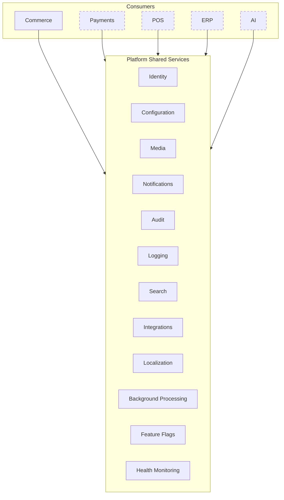

# Platform Shared Services

## Metadata

| Field | Value |
|-------|-------|
| Title | Kairo Platform Shared Services |
| Document ID | KAI-CORE-005 |
| Status | Draft |
| Version | 0.1 |
| Target Release | N/A |
| Owner | Chief Platform Architect |
| Created | 2026-07-17 |
| Last Updated | 2026-07-17 |
| Reviewers | TODO |
| Related Documents | [Platform Core](./Platform-Core.md), [Cross-Cutting Concerns](../04-Architecture/Cross-Cutting-Concerns.md), [Shared Capabilities](../03-Business-Capabilities/Shared-Capabilities.md), [System Architecture](../04-Architecture/System-Architecture.md) |
| Dependencies | [Platform Core](./Platform-Core.md) |

---

## Purpose

This document defines the platform-wide shared services that all Kairo products consume. These services exist at the platform layer because they are domain-neutral, required by multiple products, and must behave consistently across the entire ecosystem.

Each service is documented with its purpose, why it is shared, who consumes it, and how it will evolve. Individual service specifications will be documented separately as they are designed and implemented.

---

## Service Overview

---

## Identity

### Purpose

Verify who is making a request and determine what they are allowed to do. Identity is the trust layer that every other service and product depends on.

### Ownership

Platform layer. Identity is the most foundational shared service. It has no upstream dependencies within the platform.

### Why Shared

Every product needs to authenticate requests and evaluate permissions. If each product implemented its own identity system, users would need separate credentials per product, security policies would diverge, and single sign-on across the ecosystem would be impossible.

### Consumers

| Consumer | Usage |
|----------|-------|
| All products | Authentication of every API request |
| All products | Permission evaluation for every operation |
| All products | Tenant resolution from authenticated context |
| Organization management | User membership and role assignment |
| Integration service | Service-to-service authentication |

### Future Evolution

- Dedicated Kairo Identity product for advanced identity requirements (federation, customer self-service, advanced MFA).
- Machine-to-machine identity for inter-product communication.
- Identity event stream for real-time access revocation.

---

## Configuration

### Purpose

Provide hierarchical, tenant-aware settings that control platform, product, and store behavior without code changes or redeployment.

### Ownership

Platform layer. The configuration infrastructure, storage, resolution hierarchy, and runtime refresh mechanism are owned centrally.

### Why Shared

Every product and every module needs configuration. Without a shared system, each product would implement its own settings storage, its own hierarchy resolution, and its own refresh mechanism — creating inconsistency and operational overhead.

### Consumers

| Consumer | Usage |
|----------|-------|
| All products | Product-level settings (feature behavior, defaults) |
| All modules | Module-level settings (limits, thresholds, enabled features) |
| Platform services | Service configuration (retry policies, timeout values) |
| Tenant context | Organization and store-level overrides |

### Future Evolution

- Configuration change history and rollback.
- Configuration validation rules (prevent invalid combinations).
- Configuration export/import for environment promotion.
- Real-time configuration propagation with change notifications.

---

## Media

### Purpose

Store, retrieve, and transform binary assets (images, documents, files) for all products in the ecosystem.

### Ownership

Platform layer. Storage infrastructure, transformation pipelines, and CDN integration are owned centrally.

### Why Shared

Multiple products need media storage. Commerce needs product images. POS needs receipt logos. Future products will have their own media requirements. Duplicating storage infrastructure per product wastes resources and creates inconsistency in asset handling.

### Consumers

| Consumer | Usage |
|----------|-------|
| Commerce | Product images, category images, brand assets |
| POS | Store branding, receipt customization |
| Notifications | Email template images |
| Organization management | Organization logos, branding |

### Future Evolution

- Image transformation pipeline (resize, crop, format conversion).
- CDN integration for global asset delivery.
- Storage lifecycle policies (archival, cost optimization).
- Video and document support beyond images.

---

## Notifications

### Purpose

Deliver messages to users and external systems when significant platform events occur, across multiple delivery channels.

### Ownership

Platform layer. Delivery infrastructure, template management, channel routing, retry logic, and preference management are owned centrally.

### Why Shared

Order confirmations, payment receipts, shipping updates, security alerts — every product generates events that require external notification. A shared notification service ensures consistent delivery, unified preference management, and single-point monitoring of delivery health.

### Consumers

| Consumer | Usage |
|----------|-------|
| Commerce | Order confirmations, shipping updates, inventory alerts |
| Payments | Payment receipts, refund confirmations |
| Identity | Password resets, MFA codes, login alerts |
| POS | End-of-day summaries, staff notifications |
| Platform | System alerts, maintenance notifications |

### Future Evolution

- Multi-channel delivery (email, SMS, push notifications).
- Advanced template builder with variable substitution and conditional logic.
- Delivery analytics (open rates, delivery success).
- Scheduled notifications and digest mode.

---

## Audit

### Purpose

Record a tamper-evident, queryable history of all significant actions across the platform for compliance, accountability, and forensic investigation.

### Ownership

Platform layer. Audit storage, retention, immutability guarantees, and query interfaces are owned centrally.

### Why Shared

Regulatory compliance requires a unified audit trail. An auditor reviewing a transaction needs to trace it from order creation (Commerce) through payment capture (Payments) to accounting entry (ERP). This trace must exist in one place, in one format, with one query interface.

### Consumers

| Consumer | Usage |
|----------|-------|
| All products | Recording significant state changes |
| Compliance | Regulatory reporting and investigation |
| Security | Detecting unauthorized access or suspicious activity |
| Organization administrators | Reviewing actions taken within their organization |

### Future Evolution

- Configurable retention policies per organization and jurisdiction.
- Compliance reporting templates (GDPR access logs, SOC 2 evidence).
- Audit data export for external compliance tools.
- Real-time audit streaming for security monitoring.

---

## Logging

### Purpose

Provide structured, contextual log emission and aggregation infrastructure for operational visibility across all platform components.

### Ownership

Platform layer. Log format, context enrichment, aggregation pipeline, and query infrastructure are owned centrally.

### Why Shared

Operational troubleshooting requires consistent log formats, correlated request tracing, and centralized access. Per-product logging systems would produce incompatible formats, isolated logs, and fragmented debugging experiences.

### Consumers

| Consumer | Usage |
|----------|-------|
| All products | Operational log emission |
| All platform services | Service-level operational logs |
| Operations team | Troubleshooting and incident response |
| Monitoring | Log-based alerting and anomaly detection |

### Future Evolution

- Unified telemetry pipeline (OpenTelemetry for logs, metrics, and traces).
- Log-based alerting rules.
- Log sampling for high-volume paths.
- Long-term log archival with cost-optimized storage.

---

## Search

### Purpose

Provide full-text and structured search capabilities across product data with indexing, query processing, relevance ranking, and faceted navigation.

### Ownership

Platform layer. Search infrastructure, indexing pipelines, query engine, and relevance algorithms are owned centrally.

### Why Shared

Search is a horizontal capability. Commerce needs product search. POS needs in-store product lookup. Future products will need their own searchable entities. The search infrastructure (indexing, query parsing, relevance scoring) is domain-neutral and should be built once.

### Consumers

| Consumer | Usage |
|----------|-------|
| Commerce | Product search, order search, customer search |
| POS | Product lookup at register, customer lookup |
| ERP | Supplier search, purchase order search |
| Organization management | User search |

### Future Evolution

- Cross-entity search (search products and orders together).
- Search analytics (what users search for, what returns no results).
- AI-powered relevance tuning.
- Autocomplete and suggestion APIs.

---

## Integrations

### Purpose

Manage connections between the Kairo platform and external third-party systems — credential storage, connection lifecycle, health monitoring, and webhook dispatch.

### Ownership

Platform layer. Connection infrastructure, secure credential storage, health checks, and webhook delivery mechanics are owned centrally.

### Why Shared

Multiple products need external connectivity. Commerce connects to shipping carriers and tax services. Payments connects to payment providers. ERP connects to accounting systems. The mechanics of managing these connections (credential encryption, connection health, retry logic) are identical regardless of which product uses them.

### Consumers

| Consumer | Usage |
|----------|-------|
| Commerce | Shipping carriers, tax services, ERP connectors |
| Payments | Payment providers, fraud services |
| ERP | Accounting systems, banking integrations |
| Notifications | Email delivery services, SMS providers |
| All products | Webhook dispatch to external subscribers |

### Future Evolution

- Pre-built connector library for common external systems.
- Integration marketplace for community-contributed connectors.
- Integration health dashboard with alerting.
- Data transformation and mapping engine for complex integrations.

---

## Localization

### Purpose

Support locale-aware content, formatting, and system messages across the platform for international operations.

### Ownership

Platform layer. Locale resolution, formatting utilities, and system message translation infrastructure are owned centrally.

### Why Shared

Every product serves international customers. Date formatting, number formatting, currency display, and system messages must respect the user's locale. Implementing locale handling per product would create inconsistency (different date formats in different parts of the platform).

### Consumers

| Consumer | Usage |
|----------|-------|
| All products | System message translation, error message localization |
| All products | Date, time, number, and currency formatting |
| Commerce | Product description localization framework |
| Notifications | Locale-aware notification rendering |

### Future Evolution

- Community-contributed translations.
- Automatic locale detection from request context.
- Right-to-left (RTL) layout support signals.
- Locale-aware search (stemming, stop words per language).

---

## Background Processing

### Purpose

Execute asynchronous, scheduled, or long-running tasks outside the synchronous request-response cycle with reliability guarantees.

### Ownership

Platform layer. Job scheduling, execution infrastructure, retry logic, dead-letter handling, and monitoring are owned centrally.

### Why Shared

Every product has work that cannot or should not happen synchronously — event processing, report generation, batch imports, cleanup tasks. A shared job infrastructure provides consistent retry logic, monitoring, and operational visibility without per-product reimplementation.

### Consumers

| Consumer | Usage |
|----------|-------|
| Commerce | Order event processing, inventory reconciliation, catalog import |
| Payments | Settlement processing, reconciliation |
| Notifications | Asynchronous message delivery, retry on failure |
| Search | Index updates, reindexing |
| Audit | Asynchronous audit entry writing |
| All products | Scheduled maintenance tasks, data cleanup |

### Future Evolution

- Job priority queues (critical jobs processed before low-priority jobs).
- Job progress tracking and resumption for long-running tasks.
- Scheduled job management UI for operations.
- Job resource limits and tenant-scoped fair scheduling.

---

## Feature Flags

### Purpose

Control feature availability at runtime without redeployment, enabling gradual rollout, A/B testing, and per-tenant feature management.

### Ownership

Platform layer. Flag storage, evaluation engine, tenant-scoped resolution, and management interface are owned centrally.

### Why Shared

Feature rollout affects all products. A shared feature flag system ensures consistent evaluation, per-tenant control, and unified management. Per-product flag systems would create operational fragmentation and inconsistent rollout control.

### Consumers

| Consumer | Usage |
|----------|-------|
| All products | Gradual feature rollout |
| All products | Per-tenant feature enablement |
| Platform | Platform capability rollout |
| Operations | Emergency feature disablement (kill switches) |

### Future Evolution

- Percentage-based rollout (enable for X% of tenants).
- Flag dependencies (flag B requires flag A to be enabled).
- Flag analytics (usage tracking per flag).
- Automated flag cleanup reminders for stale flags.

---

## Health Monitoring

### Purpose

Assess and report the operational health of every component in the platform — services, dependencies, and infrastructure — for load balancing, orchestration, and operational awareness.

### Ownership

Platform layer. Health check framework, aggregation, endpoint exposure, and alerting integration are owned centrally.

### Why Shared

Kubernetes, load balancers, and monitoring systems need a consistent health interface. Per-product health implementations would produce inconsistent signals, unreliable routing decisions, and fragmented monitoring dashboards.

### Consumers

| Consumer | Usage |
|----------|-------|
| All products | Contributing health status for their modules |
| Orchestration (Kubernetes) | Liveness and readiness probe endpoints |
| Load balancer | Routing decisions based on instance health |
| Monitoring | System-wide health dashboards and alerting |
| Operations | Incident detection and response |

### Future Evolution

- Dependency health propagation (unhealthy dependency degrades service health).
- Predictive health (detecting degradation before failure).
- Health history and trend analysis.
- Automated remediation triggers based on health signals.

---

## Service Maturity by Version

| Service | V1 | V2 | V3 |
|---------|----|----|-----|
| Identity | Core | Advanced | Platform-grade |
| Configuration | Foundation | Core | Advanced |
| Media | — | Foundation | Core |
| Notifications | — | Core | Advanced |
| Audit | Foundation | Core | Advanced |
| Logging | Core | Advanced | Platform-grade |
| Search | — | Foundation | Core |
| Integrations | Foundation | Core | Advanced |
| Localization | Foundation | Core | Core |
| Background Processing | Foundation | Core | Advanced |
| Feature Flags | Foundation | Core | Core |
| Health Monitoring | Foundation | Core | Advanced |

---

## Decision Summary

| Decision | Rationale |
|----------|-----------|
| All listed services are platform-owned | They are domain-neutral, needed by multiple products, and must be consistent. No product should own them. |
| Services are consumed through defined interfaces | Products depend on service contracts, not implementations. Services can evolve internally without product impact. |
| Services are mandatory, not optional | Products cannot opt out of identity, audit, or logging. Consistency requires universal participation. |
| Service maturity is staggered | Not all services are needed at the same maturity level in V1. Foundation-level services provide enough for initial commerce operations. |
| Services scale independently from products | Platform services handle aggregate load from all products. Scaling decisions are made at the service level. |

---

## Version Gate

| Version | Platform Services Expectation |
|---------|------------------------------|
| V1 | Identity, Configuration, Audit, Logging, Integrations, Localization, Background Processing, Feature Flags, and Health Monitoring are operational at Foundation or Core maturity. |
| V2 | All 12 services are operational. Media, Notifications, and Search reach Core maturity. Services are proven under production load. |
| V3 | All services are mature and proven across multiple products. Platform-grade services (Identity, Logging) meet formal SLA targets. Cross-product service consumption is validated. |

---

## Change History

| Version | Date | Author | Description |
|---------|------|--------|-------------|
| 0.1 | 2026-07-17 | Chief Platform Architect | Initial draft |
