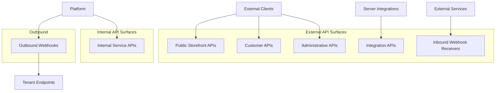
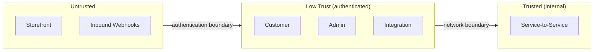

# API Security

## Metadata

| Field | Value |
|-------|-------|
| Title | Kairo API Security Architecture |
| Document ID | KAI-SEC-005 |
| Status | Draft |
| Version | 0.1 |
| Target Release | V1 |
| Owner | API Security Architect |
| Created | 2026-07-20 |
| Last Updated | 2026-07-20 |
| Reviewers | TODO |
| Related Documents | [Security Architecture](./Security-Architecture.md), [Identity and Authentication](./Identity-and-Authentication.md), [Authorization Architecture](./Authorization-Architecture.md), [Threat Model](./Threat-Model.md), [System Architecture](../System-Architecture.md), [Extension Architecture](../Extension-Architecture.md) |
| Dependencies | [Identity and Authentication](./Identity-and-Authentication.md), [Authorization Architecture](./Authorization-Architecture.md) |

---

## Purpose

This document defines the security requirements for every API surface in the Kairo platform. It establishes how APIs are protected, what trust level each surface operates at, and what controls are mandatory at each boundary.

APIs are the primary attack surface of the platform. Every security failure that affects a customer — data leakage, unauthorized access, financial manipulation — occurs through an API. API security is not a feature; it is the enforcement layer where the security architecture meets external reality.

---

## Scope

This document covers:

- Security posture for every API surface type.
- Authentication, authorization, validation, and abuse-prevention requirements.
- Webhook security in both inbound and outbound directions.
- Rate limiting, quotas, and resource-consumption controls.
- V1 baseline and future controls.

This document does not cover:

- Specific endpoint definitions or payload schemas — defined in module API specifications.
- Authentication protocol implementation details — defined in [Identity and Authentication](./Identity-and-Authentication.md).
- Permission catalog per module — defined in module specifications.
- Network-level security (TLS configuration, firewall rules) — defined in infrastructure documentation.

---

## API Surfaces

The platform exposes multiple API surfaces, each with a distinct security posture.

---

## API Trust Boundaries

Each API surface operates at a defined trust level:

| API Surface | Trust Level | Authentication | Typical Consumer |
|------------|-------------|---------------|-----------------|
| Public Storefront | Untrusted | Publishable API key | Storefronts, mobile apps |
| Customer | Low trust | Customer access token | Authenticated customer |
| Administrative | Low trust | Workforce access token (elevated) | Admin applications |
| Integration (server) | Low trust | Secret API key | Backend integrations |
| Inbound Webhooks | Untrusted | Signature verification | External services (payment providers, carriers) |
| Internal Service | Trusted (internal) | Service credential | Platform services |
| Outbound Webhooks | N/A (platform is sender) | Platform signs payloads | Tenant-registered endpoints |

### Boundary Rules

- Every trust boundary crossing requires credential verification.
- Higher-trust operations are never accessible from lower-trust surfaces.
- Administrative operations are never exposed on storefront API surfaces.
- Internal service APIs are never exposed to external networks.

---

## Authentication Requirements by API Surface

### Public Storefront APIs

| Requirement | Detail |
|------------|--------|
| Credential | Publishable API key (not secret) |
| Purpose | Identifies the organization and application. Does not authorize sensitive operations. |
| Capabilities | Catalog read, cart management, checkout initiation, customer registration |
| Restrictions | Cannot access administrative operations. Cannot read other customers' data. Cannot modify prices, inventory, or configuration. |

### Customer APIs

| Requirement | Detail |
|------------|--------|
| Credential | Customer access token (issued after authentication) |
| Purpose | Identifies and authenticates a specific customer within an organization |
| Capabilities | View own orders, manage own addresses, manage own profile, complete checkout |
| Restrictions | Cannot access other customers' data. Cannot perform administrative operations. |

### Administrative APIs

| Requirement | Detail |
|------------|--------|
| Credential | Workforce access token with appropriate permissions |
| Purpose | Manages products, orders, inventory, settings, and users |
| Capabilities | Full commerce management within authorized scope |
| Restrictions | Bound by role-based permissions. Sensitive operations require step-up authentication. |

### Integration APIs (Server-to-Server)

| Requirement | Detail |
|------------|--------|
| Credential | Secret API key |
| Purpose | Backend system integration (ERP sync, warehouse management, marketing) |
| Capabilities | Defined by key scope — may include read/write for specific modules |
| Restrictions | Bound by configured key scope. Cannot exceed key's permission set. |

**Frontend applications cannot protect secret keys.** Secret API keys must never be transmitted to, embedded in, or accessible from client-side code. This is a hard architectural constraint, not a guideline.

### Inbound Webhook Receivers

| Requirement | Detail |
|------------|--------|
| Credential | Signature verification (HMAC or provider-specific mechanism) |
| Purpose | Receive callbacks from external services (payment confirmations, shipping updates) |
| Capabilities | Trigger state transitions based on verified external events |
| Restrictions | Only configured providers. Only expected event types. Signature must verify before any processing. |

### Internal Service APIs

| Requirement | Detail |
|------------|--------|
| Credential | Service-to-service authentication token |
| Purpose | Platform-internal communication between services |
| Capabilities | Task-specific based on service identity |
| Restrictions | Never exposed externally. Scoped to specific service functions. |

---

## Authorization Requirements

All authorization requirements follow the [Authorization Architecture](./Authorization-Architecture.md). API-specific rules:

- Every endpoint declares its required permission in the API specification.
- Authorization is evaluated in the request pipeline before module code executes.
- Storefront endpoints authorize against publishable-key scope (limited operations only).
- Customer endpoints authorize against the customer's identity (own resources only).
- Administrative endpoints authorize against workforce permissions.
- Integration endpoints authorize against API key scope.
- Authorization failures return 403 (Forbidden) or 404 (Not Found) to prevent resource enumeration.

---

## Tenant Resolution

Tenant context is resolved for every API request:

| API Surface | Tenant Resolution Method |
|------------|--------------------------|
| Storefront | Derived from publishable API key |
| Customer | Derived from customer access token |
| Administrative | Derived from workforce access token |
| Integration | Derived from secret API key |
| Inbound Webhook | Derived from webhook registration (endpoint-to-tenant mapping) |
| Internal Service | Derived from service context or message metadata |

### Tenant Resolution Rules

- Tenant context is never derived from client-supplied identifiers in request headers or query parameters for authorization purposes.
- Tenant context is resolved from authenticated credentials exclusively.
- Once resolved, tenant context is immutable for the duration of the request.
- All data access is scoped to the resolved tenant. This scoping is applied at the platform layer.

---

## Request Validation

Every API request is validated at the boundary before business logic processes it.

### Validation Layers

| Layer | Validates | Rejects |
|-------|----------|---------|
| Gateway | Request format, content-type, size limits, well-formed JSON | Malformed requests before authentication |
| Authentication | Credential presence and validity | Unauthenticated requests |
| Authorization | Permission and scope | Unauthorized requests |
| Input Validation | Business field types, ranges, formats, required fields | Invalid input before module processing |

### Validation Rules

- **Server-side monetary and inventory validation is mandatory.** Prices, quantities, totals, discounts, and tax amounts are calculated and validated server-side. Client-provided monetary values are never trusted.
- All string inputs are validated for length, format, and content.
- Numeric inputs are validated for range. Negative values are rejected where inappropriate.
- Enumerated values are validated against allowed sets.
- Reference IDs (product IDs, order IDs) are validated for format and existence within the tenant boundary.
- No input validation relies solely on the client. Server-side validation is the authority.

---

## Response Filtering

API responses are controlled to prevent information leakage.

### Principles

- **Sensitive API responses use explicit contracts.** Each endpoint defines exactly what fields are returned. Responses are constructed from explicit field lists, not by serializing internal objects.
- Error responses do not include stack traces, internal identifiers, or system configuration details.
- Responses are scoped to the authenticated tenant. No response ever includes data from another tenant.
- Property-level authorization may exclude fields the caller is not permitted to see.
- Internal entity relationships are not exposed in ways that reveal system architecture.

### Response Rules

- 401 responses do not indicate whether credentials are expired, revoked, or invalid. They indicate "not authenticated."
- 403 responses do not indicate what permission is missing. They indicate "not authorized."
- 404 responses are used for resources outside the caller's scope, not 403, to prevent resource enumeration.
- Pagination metadata does not reveal total counts that the caller is not authorized to know.

---

## Rate Limiting

Rate limiting protects the platform from abuse, ensures fair resource allocation, and mitigates denial-of-service attacks.

### Dimensions

**Rate limiting must account for tenant, user, key, and endpoint context.**

| Dimension | Purpose |
|-----------|---------|
| Per tenant (organization) | Prevent one tenant from exhausting platform resources |
| Per API key | Prevent one key from monopolizing the tenant's allocation |
| Per user | Prevent one user session from overwhelming the system |
| Per endpoint | Protect expensive operations with tighter limits |
| Per source IP | Mitigate distributed attacks against authentication endpoints |

### Rate Limiting Rules

- Rate limits are applied at the API gateway before requests reach module code.
- Rate limit responses include standard headers indicating limit, remaining, and reset time.
- Authentication endpoints have stricter rate limits than business endpoints.
- Write operations have stricter limits than read operations.
- Rate limits are configurable per organization tier (within platform-defined maximums).
- Rate limit exhaustion returns 429 (Too Many Requests) with retry guidance.

---

## Quotas

Quotas define long-term resource consumption limits, distinct from rate limits (which control request velocity).

| Quota Type | Examples |
|-----------|----------|
| Storage | Media storage per organization, custom field count |
| API calls | Monthly API call allocation per organization |
| Entities | Maximum products, maximum orders per month, maximum webhook registrations |
| Concurrent operations | Maximum concurrent checkout sessions, maximum active carts |

### Quota Rules

- Quotas are configured per organization based on subscription tier.
- Quota exhaustion returns a clear error indicating which quota is reached and how to resolve it.
- Quotas are enforced at the platform level, not per module.
- Quota usage is tracked and visible to organization administrators.

---

## Abuse Prevention

Beyond rate limiting, the platform employs abuse-prevention mechanisms for business-logic exploitation.

### Mechanisms

| Mechanism | Protects Against |
|-----------|-----------------|
| Cart limits | Maximum items per cart, maximum active carts per session |
| Checkout velocity | Maximum checkout attempts per time window |
| Coupon velocity | Maximum coupon redemption attempts per time window |
| Registration velocity | Maximum account creation rate per source |
| Reservation limits | Maximum concurrent inventory reservations per customer |
| Query complexity | Maximum filter depth, maximum related-entity expansion |

### Rules

- Abuse thresholds are configured at the platform level with per-organization overrides where appropriate.
- Abuse detection does not block legitimate high-volume operations (bulk imports, batch processing via integration API).
- Abuse responses are indistinguishable from rate limit responses to avoid revealing detection logic.

---

## Idempotency

**Idempotency is mandatory for financial and order-creation operations.** Executing the same request multiple times must produce the same result as executing it once.

### Idempotent Operations

| Operation Category | Idempotency Requirement |
|-------------------|------------------------|
| Order creation (checkout) | Mandatory — prevents duplicate orders |
| Payment capture | Mandatory — prevents duplicate charges |
| Payment refund | Mandatory — prevents duplicate refunds |
| Inventory adjustment | Mandatory — prevents double-counting |
| Webhook processing | Mandatory — webhooks may be delivered more than once |

### Mechanism

- Clients provide an idempotency key with requests to idempotent endpoints.
- The platform stores the result of the first execution and returns it for subsequent requests with the same key.
- Idempotency keys are scoped to the tenant. A key in Organization A does not collide with the same key in Organization B.
- Idempotency key storage has a defined TTL. Keys expire after a reasonable window.

---

## Replay Protection

Replay protection prevents captured requests from being re-submitted by an attacker.

### Mechanisms

| Mechanism | Applies To |
|-----------|-----------|
| Short-lived access tokens | All authenticated endpoints — expired tokens are rejected |
| Idempotency keys | Financial and order-creation operations — duplicate submissions return cached result |
| Timestamp validation | Inbound webhooks — reject events with timestamps outside acceptable window |
| Nonce tracking | Critical operations (future) — single-use request identifiers |

### Rules

- Token-based authentication inherently provides replay protection through token expiration.
- Idempotency keys provide replay protection for state-changing business operations.
- Inbound webhooks validate timestamp freshness to reject delayed replay attempts.
- Critical financial operations may implement additional nonce-based protection in future versions.

---

## CORS Boundaries

Cross-Origin Resource Sharing (CORS) configuration controls which browser origins may call Kairo APIs.

**CORS is not an authentication or authorization mechanism.** CORS is a browser enforcement mechanism. It does not protect APIs from non-browser clients. Server-side security controls (authentication, authorization, validation) are the actual security boundary.

### CORS Policy

| API Surface | CORS Policy |
|------------|-------------|
| Storefront APIs | Configured origins per organization (domains the storefront runs on) |
| Customer APIs | Same as storefront (accessed from the same browser applications) |
| Administrative APIs | Restricted origins (admin application domains only) |
| Integration APIs | Not applicable (server-to-server, no browser) |
| Internal Service APIs | Not applicable (internal only) |

### CORS Rules

- CORS origins are configured per organization.
- Wildcard origins (`*`) are never permitted for authenticated endpoints.
- CORS preflight responses do not leak information about available endpoints.
- CORS configuration is a usability control, not a security control. All security enforcement occurs server-side regardless of CORS.

---

## CSRF Considerations

Cross-Site Request Forgery is mitigated by the platform's API-first architecture.

### Why CSRF Is Largely Mitigated

- Kairo APIs use token-based authentication (Authorization header), not cookie-based authentication.
- Browsers do not automatically attach Authorization headers to cross-origin requests (unlike cookies).
- API requests require explicit credential attachment by the client application.

### Where CSRF Remains Relevant

- If any future authentication mechanism uses cookies (e.g., session cookies for a platform-hosted admin UI), CSRF protections must be applied.
- V1 does not use cookie-based authentication for APIs. If this changes, CSRF controls become mandatory.

---

## API Key Security

### Publishable Keys

- Identify the organization and application.
- Are not secret. May be visible in client-side code.
- Grant access only to public storefront operations.
- Cannot be used for administrative, financial, or data-modification operations beyond customer self-service.
- Are revocable by the organization administrator.

### Secret Keys

- Authenticate server-to-server integrations.
- Must never appear in client-side code, version control, logs, or error responses.
- Have configurable permission scopes.
- Are rotatable with a grace period for old-key validity.
- Creation, usage, and revocation are audited.

### Key Security Rules

- The platform never returns a full secret key after initial creation. Only the key prefix is shown for identification.
- Key material is stored hashed. The platform cannot retrieve a raw key after creation.
- Keys are scoped to a single organization. A key cannot access multiple organizations.
- Compromised keys are revocable immediately with no grace period.

---

## Webhook Signing (Outbound)

When the platform delivers webhooks to tenant-registered endpoints, payloads are signed to prove authenticity.

### Signing Mechanism

- Every outbound webhook includes a signature header computed from the payload and a shared secret.
- The shared secret is unique per webhook registration.
- The signing algorithm is documented and stable.
- Timestamps are included in the signed data to enable replay detection by the receiver.

### Responsibilities

- **Platform responsibility:** Sign every outbound payload correctly. Rotate signing secrets when requested.
- **Consumer responsibility:** Verify the signature before processing. Reject payloads with invalid or missing signatures.

**Webhook payloads must be verified before business actions occur.** Consumers must never process an unverified webhook. The platform documents verification procedures for each supported language.

---

## Webhook Replay Protection (Inbound)

When the platform receives inbound webhooks from external services:

### Verification Requirements

- Verify the signature using the provider's documented mechanism.
- Validate the timestamp is within an acceptable freshness window.
- Process each event idempotently (webhooks may be delivered more than once).
- Reject events with unknown or unexpected structures.

### Rules

- No business action occurs before signature verification succeeds.
- Unknown event types are logged and ignored, not rejected with an error (to avoid provider retry storms).
- Idempotency prevents duplicate processing if the same event is delivered multiple times.

---

## Resource Consumption Controls

APIs must prevent consumers from triggering expensive operations that degrade platform performance.

### Controls

| Control | Purpose |
|---------|---------|
| Maximum request body size | Prevent memory exhaustion from oversized payloads |
| Maximum query complexity | Prevent expensive filter combinations that degrade database performance |
| Maximum expansion depth | Prevent deeply nested related-entity loading |
| Maximum batch size | Limit the number of items in bulk operations |
| Maximum response size | Prevent memory exhaustion from oversized responses |
| Request timeout | Prevent long-running requests from holding connections |

### Rules

- Resource limits are enforced at the gateway and within modules.
- Limits are documented in the API specification for each endpoint.
- Exceeding a limit returns a clear error indicating which limit was reached.
- Limits are consistent across API surfaces (admin and integration APIs have the same limits unless explicitly documented otherwise).

---

## Pagination and Query Limits

### Pagination

- All collection endpoints use cursor-based pagination.
- Page size has a configurable default and a platform-defined maximum.
- Clients cannot request pages larger than the maximum.
- Total count is provided only when the caller is authorized and the query is not prohibitively expensive.

### Query Limits

- Filter parameters have maximum complexity (maximum number of filter conditions).
- Sort parameters are limited to indexed fields.
- Date range queries have maximum span limits where appropriate.
- Full-text search queries have minimum length and maximum token limits.

---

## Error Response Security

### Principles

- Error responses never expose internal system details (stack traces, SQL errors, internal paths, dependency names).
- Error responses use a standardized format across all API surfaces.
- Error responses for authentication failures do not distinguish between "user not found" and "password incorrect."
- Error responses for authorization failures do not reveal what permission is missing or whether the resource exists.
- Validation errors identify which field is invalid and what format is expected, but do not reveal internal validation logic.

### Error Response Categories

| Status Code | Usage | Security Consideration |
|-------------|-------|----------------------|
| 400 | Input validation failure | Reveal which field is invalid, not internal validation rules |
| 401 | Authentication failure | Generic message. Do not reveal credential status. |
| 403 | Authorization failure | Generic message. Do not reveal permission details. |
| 404 | Resource not found or out of scope | Used for resources outside tenant boundary to prevent enumeration |
| 409 | Conflict (idempotency key reuse, state conflict) | Reveal the conflict type, not internal state details |
| 422 | Business rule violation | Reveal the rule violated in business terms |
| 429 | Rate limit exceeded | Include retry-after guidance |
| 500 | Internal server error | Generic message. Never expose internal details. Log internally. |

---

## API Inventory and Version Retirement

### API Inventory

- Every API endpoint is registered in the platform's API inventory.
- The inventory tracks endpoint path, version, required authentication, required permission, and owning module.
- Undocumented endpoints are prohibited. If it is not in the inventory, it does not exist.

### Version Retirement

- Deprecated API versions continue to function during the deprecation period.
- Deprecated versions return deprecation headers indicating the sunset date and migration path.
- Retired versions return 410 (Gone) with migration guidance.
- Version retirement follows the deprecation timeline defined in the [Module Lifecycle](../Module-Lifecycle.md).

---

## Security Logging and Traceability

### Logged Events

| Event | Details Captured |
|-------|-----------------|
| Authentication success/failure | Principal, method, source, timestamp |
| Authorization denial | Principal, action, resource, reason, timestamp |
| Rate limit hit | Principal, endpoint, limit type, timestamp |
| Validation failure | Endpoint, field, violation type (not the invalid value if sensitive) |
| Webhook signature verification failure | Source, endpoint, timestamp |
| Unusual access pattern | Principal, pattern description, timestamp |

### Traceability

- Every API request is assigned a unique request ID at the gateway.
- The request ID flows through all internal processing and appears in logs, audit entries, and error responses.
- Outbound webhook deliveries include a delivery ID traceable to the originating event.
- Request IDs enable end-to-end tracing from client request to response.

---

## V1 Baseline

| Capability | V1 Status |
|-----------|-----------|
| Authentication on every endpoint | Required |
| Authorization (permission-based) on every endpoint | Required |
| Tenant resolution from credentials (not client input) | Required |
| Request validation (all inputs, server-side) | Required |
| Response filtering (explicit field lists, no internal leakage) | Required |
| Rate limiting (per tenant, per key, per endpoint) | Required |
| Idempotency for financial and order operations | Required |
| CORS configuration per organization | Required |
| Outbound webhook signing | Required |
| Inbound webhook signature verification | Required |
| Error response security (no internal details) | Required |
| API request tracing (request ID) | Required |
| Security event logging | Required |
| Request size limits | Required |
| Pagination with maximum page size | Required |
| API key scope enforcement | Required |
| Secret key protection (hashed storage, no retrieval) | Required |

## Future Controls

| Capability | Target Version | Description |
|-----------|---------------|-------------|
| Advanced abuse detection | V2+ | ML-based pattern detection for business-logic abuse |
| Adaptive rate limiting | V2+ | Dynamic limits based on historical usage patterns |
| Request cost scoring | V2+ | Weight rate limits by operation cost, not just request count |
| API key usage analytics | V2+ | Per-key usage dashboards and anomaly alerting |
| Mutual TLS | V3+ | Certificate-based authentication for high-value integrations |
| Request signing | V3+ | Client-signed requests for non-repudiation |
| API threat intelligence | V3+ | Blocking known malicious sources based on threat feeds |
| GraphQL security controls | Future | Query depth limiting, cost analysis, field-level authorization for GraphQL layer |

---

## Version Gate

| Version | API Security Gate |
|---------|-------------------|
| V1 | All V1 baseline capabilities are operational. Every endpoint authenticates, authorizes, validates, and rate-limits. Idempotency is proven for financial operations. Webhook signing and verification work. Error responses reveal no internal details. |
| V2 | Abuse detection is operational for business-logic threats. Rate limiting is adaptive. API key analytics detect anomalous usage. Quota management is per-organization. |
| V3 | Mutual TLS is available for enterprise integrations. Request signing is available. Threat intelligence feeds inform rate limiting. Full API inventory with automated drift detection. |

---

## Decision Summary

| Decision | Rationale |
|----------|-----------|
| Every endpoint requires authentication | No anonymous access to any business operation. Even catalog reads require a publishable key to identify the tenant. |
| Tenant resolution from credentials only | Client-supplied tenant identifiers can be forged. Credential-derived context is tamper-evident. |
| Server-side validation for all monetary values | Clients cannot be trusted to calculate prices, taxes, or totals. The server is the authority. |
| Idempotency for financial operations | Network failures, client retries, and webhook re-delivery make duplicate execution a real risk. Idempotency makes duplicate execution safe. |
| CORS is not security | CORS controls browser behavior only. Non-browser clients bypass CORS entirely. Server-side controls are the actual security. |
| Separate trust levels per API surface | A storefront request and an admin request have fundamentally different risk profiles. Treating them identically either over-restricts storefronts or under-protects admin operations. |
| Error responses hide internals | Detailed error messages assist attackers in understanding system structure. Useful debugging information belongs in internal logs, not in API responses. |
| Webhook verification before processing | An unverified webhook may be spoofed. Processing it before verification allows attackers to trigger arbitrary business actions. |

---

## Architecture Impact

| Concern | Impact |
|---------|--------|
| API gateway | Enforces authentication, rate limiting, CORS, request size limits, and request ID generation before requests reach modules. |
| Module design | Modules declare required permissions, validation rules, and idempotency requirements per endpoint. Modules do not implement rate limiting or authentication. |
| API specification | Every endpoint must document: authentication type, required permission, request validation rules, response contract, rate limit category, and idempotency behavior. |
| Testing | Security tests validate every endpoint for authentication enforcement, authorization boundaries, input validation, error response safety, and rate limiting. |
| Monitoring | Security events (auth failures, rate limit hits, validation failures) are monitored with alerting thresholds. |

---

## Implementation Impact

| Area | Impact |
|------|--------|
| Modules | Must validate all inputs server-side. Must never trust client-provided prices, quantities, or calculated values. Must implement idempotency for state-changing operations. Must define explicit response contracts. |
| Gateway | Must enforce authentication, rate limiting, request size, and CORS before forwarding. Must generate and propagate request IDs. |
| Webhooks (outbound) | Must sign every payload. Must include timestamp in signature. Must use per-registration secrets. |
| Webhooks (inbound) | Must verify signature before any processing. Must validate timestamp freshness. Must process idempotently. |
| Error handling | Must use standardized error format. Must never expose stack traces, SQL errors, or internal paths. Must not distinguish between "not found" and "not authorized" for out-of-scope resources. |

---

## Security Responsibilities

| Role | API Security Responsibilities |
|------|------------------------------|
| API Security Architect | Defines API security architecture. Reviews API specifications for security compliance. |
| Platform Team | Implements gateway-level controls (auth, rate limiting, CORS, request ID). Implements webhook signing infrastructure. |
| Product Teams | Define per-endpoint permissions and validation rules. Implement server-side business validation. Implement idempotency. Define response contracts. |
| Operations | Monitor API security events. Tune rate limits based on observed patterns. Respond to abuse incidents. |

---

## Out of Scope

This document does not define:

- Specific endpoint paths or payload schemas — defined in module API specifications.
- Exact rate limit values — configured per deployment and per organization tier.
- TLS configuration details — defined in infrastructure documentation.
- Specific webhook provider integration procedures — defined per integration.
- API design standards (naming, pagination format, error schema) — defined in future API architecture documentation (dependency identified).

---

## Future Considerations

- **API gateway as WAF** — Evaluate web application firewall capabilities at the gateway layer.
- **Bot detection** — Distinguish human-driven requests from automated abuse without degrading integration API usability.
- **API observability** — Per-endpoint latency, error rate, and usage dashboards with security overlay.
- **Client SDK security** — Security guidance and enforcement within official SDKs (secure token storage, automatic refresh, key management).
- **API fuzzing** — Automated API fuzzing integrated into CI/CD for input validation coverage.

---

## Future Refactoring Triggers

This document should be revisited when:

- The API Architecture phase is formally defined (this document establishes security requirements that the API architecture must satisfy).
- A GraphQL layer is introduced (new query security concerns).
- A new API surface type is added (new trust boundary definition needed).
- A significant API-related security incident occurs.
- Rate limiting or abuse patterns require architectural change (e.g., dedicated abuse-prevention service).
- Multi-region deployment introduces geographic API routing concerns.

---

## Change History

| Version | Date | Author | Description |
|---------|------|--------|-------------|
| 0.1 | 2026-07-20 | API Security Architect | Initial draft |
