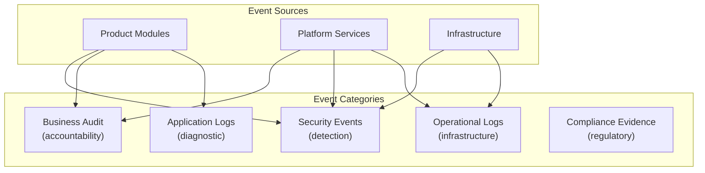
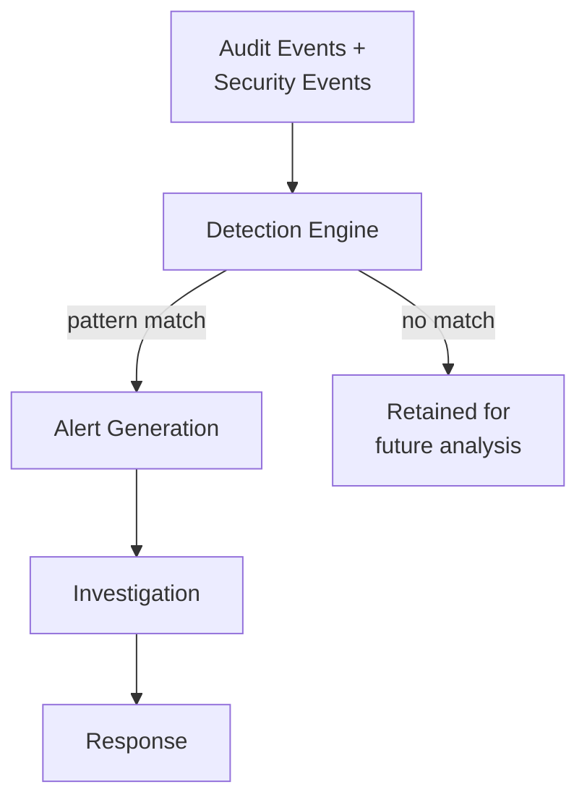
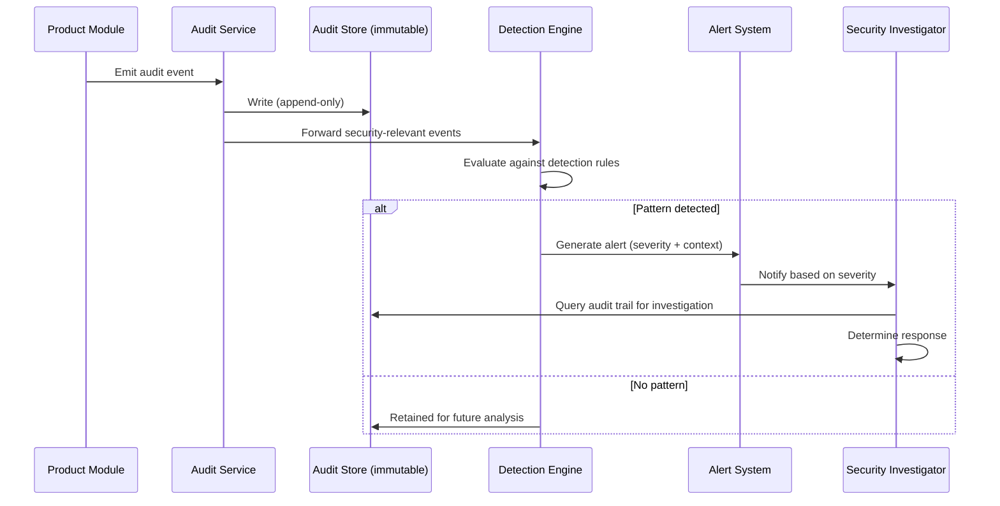

# Audit and Security Monitoring

## Metadata

| Field | Value |
|-------|-------|
| Title | Kairo Audit and Security Monitoring Architecture |
| Document ID | KAI-SEC-008 |
| Status | Draft |
| Version | 0.1 |
| Target Release | V1 |
| Owner | Security Observability Architect |
| Created | 2026-07-20 |
| Last Updated | 2026-07-20 |
| Reviewers | TODO |
| Related Documents | [Security Architecture](./Security-Architecture.md), [Threat Model](./Threat-Model.md), [Cross-Cutting Concerns](../Cross-Cutting-Concerns.md), [Platform Services](../../05-Platform-Core/Platform-Services.md), [Data Protection](./Data-Protection.md), [Identity and Authentication](./Identity-and-Authentication.md), [Authorization Architecture](./Authorization-Architecture.md) |
| Dependencies | [Security Architecture](./Security-Architecture.md), [Cross-Cutting Concerns](../Cross-Cutting-Concerns.md) |

---

## Purpose

This document defines the architecture for security auditing and monitoring across the Kairo platform. It establishes what events are recorded, how they are protected, how they are used for detection and investigation, and who is responsible for acting on them.

Auditing and monitoring serve distinct but complementary purposes:

- **Auditing** creates an immutable record of what happened, for accountability and compliance.
- **Monitoring** detects anomalies and threats in real-time, for operational security.

Both are architectural concerns. They are designed into the platform, not added after the fact.

---

## Scope

This document covers:

- Audit event categories and mandatory coverage.
- Distinction between audit, security events, and operational logs.
- Immutability, retention, and access controls for audit data.
- Detection use cases and alerting.
- Tenant-visible vs. platform-only events.
- V1 baseline and future enterprise capabilities.

This document does not cover:

- Specific log storage technology or SIEM product selection.
- Operational log format specifications (documented in development standards).
- Incident response procedures (documented in operational guides).
- Performance metrics and business analytics (documented in observability architecture).

---

## Log and Event Categories

The platform produces multiple categories of recorded information. These are distinct and must not be confused.

| Category | Purpose | Audience | Retention | Immutability | Sensitivity |
|----------|---------|----------|-----------|-------------|-------------|
| **Application logs** | Diagnostic troubleshooting for developers | Engineering team | Days to weeks | Mutable (rotatable) | Internal |
| **Operational logs** | Infrastructure health and performance monitoring | Operations team | Weeks to months | Mutable (rotatable) | Internal |
| **Security events** | Real-time threat detection and alerting | Security/operations | Months | Protected from casual modification | Internal |
| **Business audit events** | Accountability for business-significant actions | Tenant administrators, compliance | Months to years | Immutable | Confidential |
| **Compliance evidence** | Regulatory proof of controls | Compliance officers, auditors | Years | Immutable, tamper-evident | Confidential |

### Key Distinctions

- **Application logs** help developers debug. They are ephemeral, may contain request context, and are rotated frequently. They are not a security control.
- **Operational logs** help operators understand infrastructure behavior. They track health, performance, and capacity. They are not compliance evidence.
- **Security events** feed real-time detection. They are analyzed for anomalies, correlated across services, and trigger alerts. They inform but do not replace audit.
- **Business audit events** are the formal record of who did what, when, and on what resource. They are the primary accountability mechanism. They are immutable.
- **Compliance evidence** is a curated subset of audit and security events that satisfies specific regulatory requirements. It is preserved for extended periods.

---

## Audit Objectives

| Objective | Description |
|-----------|-------------|
| **Accountability** | Every significant action is attributable to an identified actor. |
| **Non-repudiation** | Actors cannot deny actions that the audit trail records. |
| **Detection** | Suspicious patterns are detectable through audit analysis. |
| **Investigation** | When an incident occurs, the audit trail provides the forensic evidence needed to understand what happened. |
| **Compliance** | Regulatory requirements for record-keeping are satisfied. |
| **Transparency** | Tenants can review actions taken within their organization. |

---

## Audit Event Categories

### Authentication Events

| Event | Audit Level | Details Recorded |
|-------|-------------|------------------|
| Successful login | Business audit | Actor, method, assurance level, source, timestamp |
| Failed login | Security event | Attempted identity, failure reason, source, timestamp |
| MFA enrollment | Business audit | Actor, method enrolled, timestamp |
| MFA verification (success/failure) | Security event | Actor, success/failure, timestamp |
| Session creation | Business audit | Actor, session scope, expiration, timestamp |
| Session revocation | Business audit | Actor, revoking identity, reason, timestamp |
| Account lockout | Security event | Target account, trigger (attempt count), timestamp |
| Password change | Business audit | Actor, initiated by (self/admin), timestamp |
| Account recovery | Security event + audit | Target account, method, timestamp |

### Authorization Failures

| Event | Audit Level | Details Recorded |
|-------|-------------|------------------|
| Permission denied | Security event | Actor, attempted action, target resource, missing permission, timestamp |
| Cross-tenant access attempt | Security event (critical) | Actor, source tenant, target resource, timestamp |
| Scope violation (API key used beyond scope) | Security event | Key identifier, attempted action, key scope, timestamp |
| Elevated operation without step-up | Security event | Actor, attempted action, current assurance level, required level, timestamp |

### Role and Permission Changes

| Event | Audit Level | Details Recorded |
|-------|-------------|------------------|
| Role created | Business audit | Creator, role name, initial permissions, timestamp |
| Role modified | Business audit | Modifier, role name, permissions added/removed, timestamp |
| Role deleted | Business audit | Deleter, role name, timestamp |
| Role assigned to user | Business audit | Assigner, target user, role, scope (org/store), timestamp |
| Role removed from user | Business audit | Remover, target user, role, scope, timestamp |
| Permission added to role | Business audit | Modifier, role, permission added, timestamp |
| Permission removed from role | Business audit | Modifier, role, permission removed, timestamp |

### API Key Lifecycle Events

| Event | Audit Level | Details Recorded |
|-------|-------------|------------------|
| API key created | Business audit | Creator, key identifier (not value), scope, permissions, timestamp |
| API key rotated | Business audit | Rotator, key identifier, timestamp |
| API key revoked | Business audit | Revoker, key identifier, reason, timestamp |
| API key scope modified | Business audit | Modifier, key identifier, old scope, new scope, timestamp |
| Unusual API key usage | Security event | Key identifier, anomaly description, timestamp |

### Administrative Actions

| Event | Audit Level | Details Recorded |
|-------|-------------|------------------|
| User created | Business audit | Creator, new user identifier, assigned roles, timestamp |
| User deactivated | Business audit | Deactivator, target user, reason, timestamp |
| User reactivated | Business audit | Reactivator, target user, timestamp |
| Organization settings changed | Business audit | Actor, setting name, old value, new value, timestamp |
| Store created/modified/deactivated | Business audit | Actor, store identifier, change description, timestamp |

### Product Price Changes

| Event | Audit Level | Details Recorded |
|-------|-------------|------------------|
| Price created | Business audit | Actor, product/variant, price list, amount, currency, timestamp |
| Price modified | Business audit | Actor, product/variant, price list, old amount, new amount, timestamp |
| Price list created/modified | Business audit | Actor, price list identifier, change description, timestamp |
| Bulk price update | Business audit | Actor, scope (count of affected items), timestamp |

### Inventory Adjustments

| Event | Audit Level | Details Recorded |
|-------|-------------|------------------|
| Stock adjusted | Business audit | Actor, variant, location, old quantity, new quantity, reason, timestamp |
| Stock reserved | Business audit | Trigger (order/cart), variant, quantity, timestamp |
| Stock released | Business audit | Trigger, variant, quantity, reason, timestamp |
| Bulk inventory update | Business audit | Actor, scope, timestamp |

### Payment, Refund, and Subscription Actions

| Event | Audit Level | Details Recorded |
|-------|-------------|------------------|
| Payment initiated | Business audit | Actor/system, order reference, amount, currency, timestamp |
| Payment captured | Business audit | System, transaction reference, amount, timestamp |
| Payment failed | Business audit + security event | System, order reference, failure reason, timestamp |
| Refund initiated | Business audit | Actor, order reference, amount, reason, timestamp |
| Refund completed | Business audit | System, transaction reference, amount, timestamp |
| Subscription created/modified/cancelled | Business audit | Actor, subscription reference, change, timestamp |

### Data Exports

| Event | Audit Level | Details Recorded |
|-------|-------------|------------------|
| Bulk data export initiated | Business audit | Actor, export scope, estimated volume, timestamp |
| Bulk data export completed | Business audit | Actor, export scope, actual volume, timestamp |
| Customer data export (portability) | Business audit + compliance | Actor/customer, scope, timestamp |
| Customer data deletion | Business audit + compliance | Actor/customer, scope, timestamp |

### Support Impersonation

| Event | Audit Level | Details Recorded |
|-------|-------------|------------------|
| Impersonation session started | Business audit + security event | Support user, target tenant, access level, timestamp |
| Action during impersonation | Business audit | Support user, action, target resource, timestamp |
| Impersonation session ended | Business audit | Support user, target tenant, duration, timestamp |

### Configuration Changes

| Event | Audit Level | Details Recorded |
|-------|-------------|------------------|
| Platform configuration changed | Business audit | Actor, setting, old value, new value, timestamp |
| Organization configuration changed | Business audit | Actor, setting, old value, new value, timestamp |
| Store configuration changed | Business audit | Actor, store, setting, old value, new value, timestamp |
| Feature flag changed | Business audit | Actor, flag, old state, new state, scope, timestamp |

### Webhook and Integration Changes

| Event | Audit Level | Details Recorded |
|-------|-------------|------------------|
| Webhook registered | Business audit | Actor, endpoint URL, event subscriptions, timestamp |
| Webhook modified | Business audit | Actor, webhook identifier, changes, timestamp |
| Webhook deleted | Business audit | Actor, webhook identifier, timestamp |
| Integration credential configured | Business audit | Actor, integration type, timestamp (not credential value) |
| Integration credential rotated | Business audit | Actor, integration type, timestamp |

### Security Setting Changes

| Event | Audit Level | Details Recorded |
|-------|-------------|------------------|
| Password policy changed | Business audit + security event | Actor, old policy, new policy, timestamp |
| MFA policy changed | Business audit + security event | Actor, old requirement, new requirement, timestamp |
| Session policy changed | Business audit + security event | Actor, old policy, new policy, timestamp |
| IP allowlist changed | Business audit + security event | Actor, change description, timestamp |
| CORS configuration changed | Business audit | Actor, old origins, new origins, timestamp |

---

## Audit Immutability

Audit records are immutable once written. This is a non-negotiable architectural requirement.

### Immutability Guarantees

| Guarantee | Implementation Direction |
|-----------|------------------------|
| No modification | Audit records cannot be updated or altered by any application logic, API, or administrative action. |
| No deletion | Audit records cannot be deleted by application logic. Retention expiration is the only deletion mechanism. |
| Tamper evidence | Audit storage supports tamper detection. Unauthorized modification of the audit store is detectable. |
| Separation of duty | The team that writes audit records does not have the ability to modify or delete them. |
| Append-only | The audit store accepts new records only. No update or delete operations are available. |

### Rules

- No API endpoint allows modification or deletion of audit records.
- Administrative access to the audit store is restricted to read-only for investigation. Write access is limited to the audit service.
- Audit data is stored separately from business data. Deleting a tenant's business data does not delete their audit records (audit retention outlives business data).
- Backup and replication of audit data follows the same immutability principles.

---

## Timestamp and Actor Requirements

Every audit event must include:

| Field | Requirement |
|-------|-------------|
| **Timestamp** | UTC timestamp with millisecond precision. System clock synchronized via NTP. |
| **Actor** | The authenticated identity that performed the action. For automated actions, the service identity. |
| **Actor type** | Human user, API key, service, or system (distinguishes how the action was initiated). |
| **Tenant context** | The organization within which the action occurred. |
| **Action** | What was done (using the platform's permission/event naming convention). |
| **Resource** | What was acted upon (entity type + identifier). |
| **Outcome** | Success or failure. For failures, the reason. |

### Rules

- Anonymous audit entries are prohibited. Every entry has an identified actor.
- System-initiated actions (background jobs, scheduled tasks) use the service identity as the actor.
- Timestamp must reflect when the action occurred, not when the audit entry was written (though the difference should be minimal).

---

## Correlation and Trace IDs

Audit events are correlated with the broader request context:

| ID | Purpose | Source |
|----|---------|--------|
| **Request ID** | Correlates the audit event with the API request that triggered it | Generated at the API gateway |
| **Trace ID** | Links the audit event to the distributed trace for the full request flow | Generated by the tracing infrastructure |
| **Session ID** | Links the audit event to the user session | From the authentication context |
| **Event ID** | Unique identifier for the audit event itself | Generated by the audit service |

### Correlation Rules

- Every audit event includes the request ID and trace ID from the triggering request.
- Investigation workflows can query by any correlation ID to reconstruct the full picture.
- Cross-service audit events for the same business operation share the same trace ID.

---

## Detection Use Cases

Security events and audit data feed detection logic that identifies threats.

### Detection Categories

| Use Case | Signals | Severity |
|----------|---------|----------|
| Credential stuffing | Multiple failed logins across accounts from similar sources | High |
| Account takeover | Successful login after failed attempts, followed by unusual actions | Critical |
| Privilege escalation attempt | Authorization failures on administrative endpoints from non-admin users | High |
| Cross-tenant probing | Authorization failures where the resource belongs to a different tenant | Critical |
| Unusual data export | Bulk export from an account that has not previously performed exports | Medium |
| Configuration tampering | Security settings weakened (shorter passwords, MFA disabled) | High |
| API key abuse | Key used from unusual location, at unusual volume, or for unusual operations | High |
| Support access anomaly | Impersonation session with unusual duration or unusual actions | Medium |
| Inventory manipulation | Large inventory adjustments without corresponding business activity | Medium |
| Payment anomaly | Refund volume or value exceeding normal patterns | High |

---

## Alert Severity Model

| Severity | Meaning | Response Time | Notification |
|----------|---------|--------------|-------------|
| **Critical** | Active compromise or cross-tenant exposure suspected. Immediate action required. | Minutes | Immediate page to security on-call |
| **High** | Significant security event requiring prompt investigation. | Hours | Alert to security team |
| **Medium** | Suspicious activity requiring investigation within business hours. | Business day | Queued for security review |
| **Low** | Informational event for awareness. May indicate emerging patterns. | Batch review | Included in periodic security digest |

### Alert Rules

- Alerts are actionable. Every alert has a defined investigation procedure.
- Alert fatigue is managed. Alert thresholds are tuned to minimize false positives.
- Critical alerts cannot be silenced without documented justification and expiration.
- Alert escalation occurs automatically if acknowledgment does not happen within the response time.

---

## Retention Direction

| Event Category | Retention Direction | Rationale |
|---------------|--------------------|-----------| 
| Business audit events | Months to years (per compliance requirements) | Legal accountability and regulatory evidence |
| Security events | Months | Threat detection pattern analysis and incident investigation |
| Compliance evidence | Years (per specific regulation) | Regulatory requirements define minimum retention |
| Application logs | Days to weeks | Diagnostic use only. Short retention reduces cost and exposure. |
| Operational logs | Weeks to months | Infrastructure analysis. Longer than app logs for trend detection. |

### Retention Rules

- Retention periods are configurable per organization where regulations differ by jurisdiction.
- Audit records are never deleted before the retention period expires, even if the tenant requests organization deletion.
- Expired records are deleted automatically. No manual intervention required.
- Retention applies to all copies (primary, backup, replica).

---

## Tenant-Visible vs. Platform-Only Events

| Visibility | Examples | Access |
|-----------|----------|--------|
| **Tenant-visible** | Login events, role changes, price changes, order actions, data exports, configuration changes within their organization | Organization administrators through audit APIs |
| **Platform-only** | Infrastructure events, cross-tenant detection events, platform configuration changes, support access details, internal service events | Platform security and operations team only |

### Visibility Rules

- Tenants see audit events within their organization. They never see events from other organizations.
- Tenants see that support impersonation occurred (for transparency). They do not see platform-internal details of how support access was provisioned.
- Platform-only events are never exposed through tenant-facing APIs.
- Tenant audit APIs support filtering by time range, actor, action type, and resource.

---

## Monitoring Ownership

| Responsibility | Owner |
|---------------|-------|
| Audit event generation | Product modules (business events) and platform services (security events) |
| Audit event storage and immutability | Platform audit service |
| Security event detection and alerting | Platform security/operations |
| Alert triage and investigation | Security team (or on-call operations in V1) |
| Incident response | Security team + engineering leadership |
| Tenant audit API | Platform audit service |
| Audit retention enforcement | Platform operations |
| Detection rule maintenance | Security team |

---

## Event Generation to Investigation Flow

---

## V1 Baseline

| Capability | V1 Status |
|-----------|-----------|
| Audit events for all authentication actions | Required |
| Audit events for all authorization failures | Required |
| Audit events for role and permission changes | Required |
| Audit events for API key lifecycle | Required |
| Audit events for administrative actions | Required |
| Audit events for price changes | Required |
| Audit events for inventory adjustments | Required |
| Audit events for payment and refund actions | Required |
| Audit events for data exports | Required |
| Audit events for support impersonation | Required |
| Audit events for configuration changes | Required |
| Audit events for webhook/integration changes | Required |
| Audit events for security setting changes | Required |
| Audit immutability (append-only store) | Required |
| Timestamp and actor on every event | Required |
| Request ID correlation | Required |
| Tenant-visible audit API (read-only) | Required |
| Basic alerting for critical security events | Required |
| Separation of audit from application logs | Required |
| Audit retention enforcement | Required |

## Future Capabilities

| Capability | Target Version | Description |
|-----------|---------------|-------------|
| SIEM integration | V2+ | Export security events to external SIEM for advanced correlation and detection |
| Enterprise audit export | V2+ | Scheduled or on-demand export of audit data for external compliance tools |
| Advanced detection rules | V2+ | ML-based anomaly detection, behavioral baselines per tenant |
| Custom alert rules per tenant | V3+ | Tenants define their own alerting thresholds for their organization's audit events |
| Real-time audit streaming | V2+ | WebSocket or event stream for real-time audit consumption |
| Compliance reporting templates | V3+ | Pre-built reports mapping audit events to regulatory requirements (SOC 2, GDPR) |
| Cross-product correlation | V3+ | Detect patterns spanning multiple Kairo products |
| Audit data analytics | Future | Long-term trend analysis across audit data for risk assessment |
| Third-party audit attestation | Future | Independent verification of audit integrity for enterprise customers |

---

## Version Gate

| Version | Audit and Monitoring Gate |
|---------|--------------------------|
| V1 | All V1 baseline audit events are emitted and stored. Immutability is enforced. Tenant audit API is operational. Basic alerting detects critical events (cross-tenant access, credential compromise signals). Correlation IDs link audit to request traces. |
| V2 | SIEM integration is available. Enterprise audit export is operational. Detection rules cover all threat model categories. Alert severity model is tuned with minimal false positives. Retention automation is proven. |
| V3 | Advanced detection (behavioral baselines) is operational. Compliance reporting templates are available. Cross-product correlation detects multi-product attack patterns. Custom tenant alerting is available. |

---

## Decision Summary

| Decision | Rationale |
|----------|-----------|
| Audit is separate from logging | Audit serves accountability and compliance. Logs serve debugging. Conflating them degrades both — logs are too noisy for audit, and audit retention is too expensive for logs. |
| Audit is immutable | If audit records can be modified, they cannot serve as evidence. Immutability is the foundation of audit trustworthiness. |
| Every event has an actor | Anonymous events provide no accountability. Even automated actions have a service identity. |
| Correlation IDs link audit to traces | Investigation requires seeing the full picture. Audit tells what happened; traces tell how it flowed through the system. |
| Tenant-visible audit API | Transparency builds trust. Tenants should be able to review what happened in their organization without asking Kairo. |
| Detection is separate from audit storage | Detection requires real-time processing and pattern matching. Audit storage requires immutability and retention. Different systems serve different needs. |
| Alert severity drives response time | Not all security events are equal. Severity classification ensures critical events get immediate attention while lower-severity events are handled efficiently. |

---

## Architecture Impact

| Concern | Impact |
|---------|--------|
| Module design | Every module emits audit events for defined business actions through the platform audit interface. Modules do not implement their own audit storage. |
| Request pipeline | Request ID and trace ID are propagated to all audit events automatically. |
| Data layer | Audit storage is separate from business data storage. Different retention, access control, and immutability requirements. |
| API design | Tenant audit API exposes read-only access to organization-scoped audit events. Platform audit API serves internal investigation. |
| Performance | Audit event emission must not block business operations. Asynchronous emission with guaranteed delivery. |
| Storage | Audit data grows continuously. Storage architecture must handle append-only, high-volume writes with long retention. |

---

## Implementation Impact

| Area | Impact |
|------|--------|
| Modules | Must emit audit events for all defined business actions. Must include actor, action, resource, and outcome. Must not emit sensitive field values in audit payloads. |
| Platform services | Must emit audit events for security and administrative actions. Must propagate correlation IDs. |
| Audit service | Must enforce append-only writes. Must expose tenant-visible and platform-internal query interfaces. Must enforce retention policies. |
| Detection | Must process security events in near-real-time. Must evaluate against defined detection rules. Must generate alerts with appropriate severity. |
| Operations | Must respond to alerts within defined timeframes. Must investigate and escalate as needed. Must maintain detection rules. |

---

## Security Responsibilities

| Role | Audit and Monitoring Responsibilities |
|------|--------------------------------------|
| Security Observability Architect | Defines audit architecture. Maintains event category definitions. Reviews detection coverage. |
| Platform Team | Implements audit service, storage, APIs, and event emission framework. |
| Product Teams | Emit audit events for their module's business actions. Define which actions are audit-worthy. |
| Security Team | Maintains detection rules. Triages alerts. Investigates incidents. Tunes alert thresholds. |
| Operations | Monitors audit infrastructure health. Manages retention. Responds to storage capacity alerts. |
| Compliance (future) | Defines compliance evidence requirements. Validates audit coverage against regulations. |

---

## Out of Scope

This document does not define:

- Specific log storage technology or SIEM product — follows approved Technology Stack or future infrastructure decisions (dependency identified).
- Operational log formats and structured logging standards — documented in development standards.
- Incident response procedures — documented in operational security guides.
- Performance monitoring and business analytics — documented in future observability architecture (dependency identified).
- Specific detection rule implementations — documented in operational security configuration.

---

## Future Considerations

- **Behavioral baselines** — Per-tenant, per-user behavioral models that define "normal" and flag deviations.
- **Automated response** — Automatic actions triggered by detection (account lockout, key revocation, rate limit tightening).
- **Audit integrity verification** — Periodic cryptographic verification that audit records have not been tampered with.
- **Cross-platform correlation** — Correlating Kairo audit events with tenant-side events for end-to-end visibility.
- **Audit visualization** — Timeline and relationship visualizations for investigation workflows.
- **Tenant security dashboards** — Self-service security posture visibility for organization administrators.

---

## Future Refactoring Triggers

This document should be revisited when:

- An observability platform is formally selected (technology decisions for event processing and storage).
- Infrastructure architecture is defined (deployment topology affects event routing and storage).
- A specific compliance certification is pursued (audit coverage must map to regulatory controls).
- A security incident reveals gaps in audit coverage or detection.
- Multi-product deployment introduces cross-product event correlation needs.
- SIEM integration is implemented (event format and export pipeline must be defined).

---

## Change History

| Version | Date | Author | Description |
|---------|------|--------|-------------|
| 0.1 | 2026-07-20 | Security Observability Architect | Initial draft |
