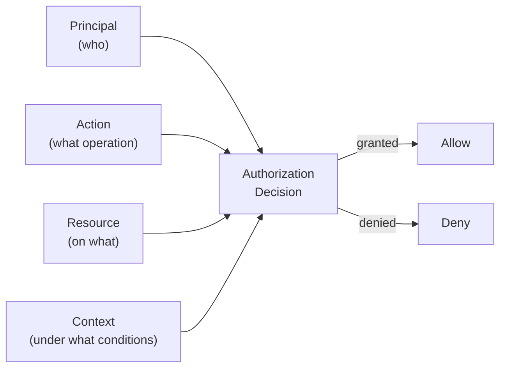
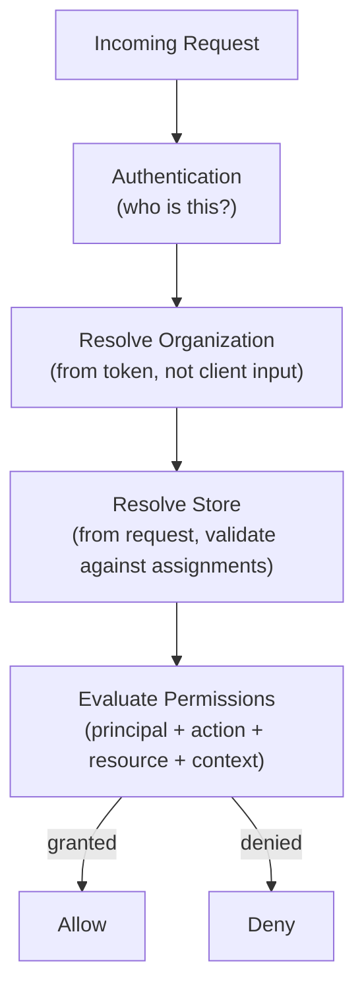
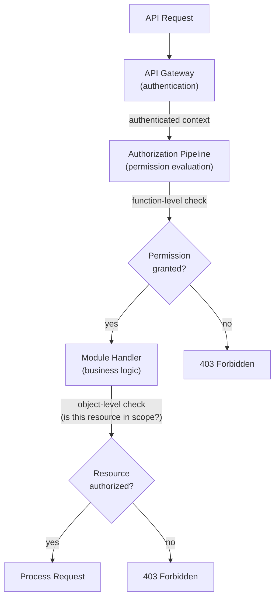

# Authorization Architecture

## Metadata

| Field | Value |
|-------|-------|
| Title | Kairo Authorization Architecture |
| Document ID | KAI-SEC-004 |
| Status | Draft |
| Version | 0.1 |
| Target Release | V1 |
| Owner | Authorization and Access Control Architect |
| Created | 2026-07-18 |
| Last Updated | 2026-07-18 |
| Reviewers | TODO |
| Related Documents | [Identity and Authentication](./Identity-and-Authentication.md), [Security Architecture](./Security-Architecture.md), [Threat Model](./Threat-Model.md), [Organization Model](../../05-Platform-Core/Organization-Model.md), [Store Model](../../05-Platform-Core/Store-Model.md), [Platform Hierarchy](../../05-Platform-Core/Platform-Hierarchy.md), [Module Architecture](../Module-Architecture.md), [Glossary](../../02-Products/Glossary.md) |
| Dependencies | [Identity and Authentication](./Identity-and-Authentication.md), [Security Architecture](./Security-Architecture.md) |

---

## Purpose

This document defines the authorization architecture for the Kairo platform. Authorization answers one question: **"Is this authenticated actor permitted to perform this action on this resource in this context?"**

Authentication proves identity. Authorization evaluates permission. Authentication is a prerequisite for authorization, but a valid identity does not imply any specific access. Every operation requires an explicit authorization decision.

Authorization is the primary defence against unauthorized data access, cross-tenant compromise, privilege escalation, and business logic abuse. It is enforced by the platform, not by individual modules.

---

## Scope

This document covers:

- The authorization model (principals, resources, actions, context).
- Role-based and permission-based access control.
- Object-level, function-level, and property-level authorization.
- Scope model for API keys and applications.
- Support access, delegated access, and separation of duties.
- V1 baseline and future enterprise capabilities.

This document does not cover:

- Authentication mechanisms — defined in [Identity and Authentication](./Identity-and-Authentication.md).
- Specific permission catalogs per module — defined in module specifications.
- Database schemas for authorization data.
- Source code for authorization enforcement.

---

## Deny-by-Default Policy

The platform's authorization posture is deny-by-default. Every request to every resource is denied unless an explicit policy grants access.

- A new endpoint is inaccessible until permissions are defined for it.
- A new role has zero permissions until permissions are explicitly assigned.
- A new user has no access until assigned to a role.
- A new API key has no capabilities until scopes are explicitly configured.

There are no backdoors, no implicit admin access, no "superuser bypasses authorization" paths. Every access decision is explicit, auditable, and reversible.

---

## Authorization Model

Authorization decisions evaluate four elements:



### Principal

The authenticated actor requesting access. May be:

- A human user (organization user, store user, customer, platform administrator, support personnel).
- A workload (application via publishable key, server integration via secret key, background service).

The principal's identity is established by authentication. Authorization evaluates what that identity is permitted to do.

### Action

The operation being attempted. Actions are named using a consistent convention:

```
{module}.{entity}.{operation}
```

Conceptual examples:

- `catalog.product.read`
- `catalog.product.create`
- `catalog.product.update`
- `catalog.product.delete`
- `order.read`
- `order.cancel`
- `payment.refund`
- `inventory.adjust`
- `report.export`
- `organization.settings.update`
- `store.settings.update`

These are illustrative. The complete permission catalog is defined in individual module specifications.

### Resource

The specific entity the action targets. Authorization is not just "can this user read orders?" but "can this user read **this specific order** in **this specific store** within **this specific organization**?"

Resource identification includes:

- Entity type (product, order, customer).
- Entity identity (specific resource ID).
- Ownership context (which organization, which store).

### Context

Additional conditions that influence the authorization decision:

- Organization context (which organization is the principal operating in).
- Store context (which store, if applicable).
- Time (is this within business hours, is the action within an approval window).
- Authentication assurance level (does this action require elevated authentication).
- Channel (is this a storefront request or an admin request).

---

## Organization and Store Scope

Authorization is always evaluated within a hierarchy scope as defined in [Platform Hierarchy](../../05-Platform-Core/Platform-Hierarchy.md) and the [Organization Model](../../05-Platform-Core/Organization-Model.md).

### Organization Scope

- Every authorization decision occurs within an organization context.
- A principal's permissions are defined within an organization. Permissions in Organization A have no effect in Organization B.
- The organization context is derived from the authenticated token, never from a client-supplied identifier.

### Store Scope

- Permissions may be further scoped to specific stores within an organization as defined in the [Store Model](../../05-Platform-Core/Store-Model.md).
- An organization-level user may have access to all stores. A store-scoped user has access only to their assigned stores.
- Store context is resolved from the request (header or path) and validated against the principal's store assignments.

### Scope Resolution



---

## Role-Based Access Control

Roles group permissions into named collections that represent a job function. Roles simplify administration — assigning a role is easier than assigning dozens of individual permissions.

### Role Principles

- A role is a named set of permissions. It is not a permission itself.
- Roles are defined within an organization. Each organization manages its own roles.
- The platform provides default roles as starting points. Organizations may modify them or create custom roles.
- A user may be assigned multiple roles. Their effective permissions are the union of all assigned roles' permissions.
- Roles do not grant access directly. They contain permissions that grant access. The authorization engine evaluates permissions, not role names.

### Role vs. Permission

| Concept | Purpose | Used By |
|---------|---------|---------|
| Role | Administrative convenience — groups related permissions | Organization administrators assigning access |
| Permission | Authorization decision — defines a specific allowed action | Authorization engine evaluating requests |

**Roles and permissions are not the same concept.** Authorization checks evaluate permissions, not roles. Code that checks "is this user an admin?" rather than "does this user have `catalog.product.delete`?" is an anti-pattern.

### Default Roles (Conceptual)

| Role | Scope | Typical Permissions |
|------|-------|-------------------|
| Organization Owner | Organization-wide | All permissions within the organization |
| Organization Admin | Organization-wide | User management, settings, store management |
| Store Manager | Specific store(s) | Product, order, inventory, and fulfillment management within assigned stores |
| Store Operator | Specific store(s) | Order processing, inventory updates within assigned stores |
| Viewer | Varies | Read-only access to assigned scope |

These are illustrative defaults. Organizations define their own roles with their own permission sets.

---

## Permission-Based Authorization

Permissions are the atomic unit of authorization. Each permission represents a single action on a single entity type.

### Permission Structure

```
{module}.{entity}.{operation}
```

- **Module** — The bounded context (catalog, order, inventory, payment).
- **Entity** — The business entity within the module (product, order, stock-level).
- **Operation** — The action (read, create, update, delete, cancel, refund, adjust, export).

### Permission Rules

- Permissions are defined by the module that owns the entity. The Catalog module defines `catalog.product.*` permissions. No other module defines permissions for Catalog entities.
- Permissions are evaluated by the platform authorization engine, not by module code.
- Permissions are additive. A principal has a permission only if it is explicitly granted through a role assignment. There is no "deny" permission — absence of a grant is denial.
- Permissions are granular. `catalog.product.read` does not imply `catalog.product.update`. Each operation is independently authorized.

---

## Attribute and Context-Aware Authorization

Beyond role and permission checks, authorization may consider contextual attributes:

| Attribute | Example |
|-----------|---------|
| Store assignment | User has `order.read` but only for Store A, not Store B |
| Channel context | API key is scoped to the wholesale channel only |
| Time window | Approval is valid only within a defined time window |
| Authentication assurance | Operation requires elevated assurance (MFA verified recently) |
| Resource state | Order can only be cancelled while in a cancellable state |

Context-aware authorization extends the basic permission check. A principal may have the `order.cancel` permission but be denied because the order is in a non-cancellable state, or because their session lacks the required assurance level.

---

## Object-Level Authorization

Object-level authorization verifies that the principal is permitted to access **this specific resource instance**, not just resources of this type.

### What It Prevents

- A user in Organization A accessing an order belonging to Organization B (cross-tenant).
- A store-scoped user accessing a product in a store they are not assigned to (cross-store).
- A customer viewing another customer's order (cross-customer).

### Enforcement

- Every data access query is scoped to the authenticated organization. This is enforced at the platform layer.
- Store-scoped access is validated against the principal's store assignments.
- Customer-scoped access (e.g., "my orders") validates that the requested resource belongs to the authenticated customer.
- Resource ownership checks occur in the authorization pipeline, not in business logic.

### What Is Explicitly Prohibited

- **Trusting tenant identifiers supplied by the client.** The organization context is derived from the authenticated token. A client-supplied organization ID is never used for authorization.
- **Relying on hidden or unpredictable resource IDs.** Unpredictable IDs (UUIDs) are not a security boundary. Authorization must not rely on the assumption that an attacker cannot guess a resource ID.

---

## Function-Level Authorization

Function-level authorization verifies that the principal is permitted to invoke **this specific operation**, regardless of the target resource.

### What It Prevents

- A viewer invoking a create operation.
- A store operator modifying organization settings.
- A customer accessing administrative endpoints.

### Enforcement

- Every API endpoint declares its required permission.
- The platform evaluates the permission in the request pipeline before the request reaches module code.
- Function-level authorization is enforced at the gateway/pipeline level, not by individual modules.

### What Is Explicitly Prohibited

- **Authorization checks only in the frontend.** Client-side authorization checks are a UX convenience. They are not a security control. Server-side enforcement is mandatory.
- **Hardcoded role checks scattered across modules.** Authorization logic belongs in the authorization engine. Module code checks permissions through the platform interface, not through if-statements comparing role names.

---

## Property-Level Authorization

Property-level authorization controls access to specific fields within a resource.

### When Required

- Sensitive fields (e.g., customer email, phone number) that should be visible to administrators but masked for other roles.
- Financial fields (cost price, margin) that should be accessible to finance roles but hidden from operational roles.
- Configuration fields that require elevated permissions to modify.

### V1 Approach

- V1 implements property-level authorization for a defined set of sensitive fields.
- The mechanism is field-level visibility (include/exclude from API response) controlled by permissions.
- Full property-level write authorization (different permissions for different fields on the same entity) is a future capability.

---

## Support Access and Impersonation

Support personnel access is governed by the impersonation safeguards defined in [Identity and Authentication](./Identity-and-Authentication.md). From an authorization perspective:

- Support impersonation sessions have a defined, restricted permission set. Support users do not inherit the target organization's roles.
- Support access defaults to read-only. Write access requires explicit, additional authorization per session.
- Every action during an impersonation session is authorized against the support permission set, not against the impersonated user's permissions.
- Support access is time-limited. Permissions expire when the impersonation session ends.

### What Is Explicitly Prohibited

- **Direct support access without auditing.** Every support access action is recorded with both the support user identity and the target tenant context.
- **Implicit access inherited without documented policy.** Support access permissions are defined in a documented support access policy, not inherited from a "super admin" role.

---

## Delegated Access

Delegated access allows one principal to act on behalf of another within defined constraints.

### Application Delegation

When a storefront application acts on behalf of a customer (e.g., placing an order), the application operates within the customer's authorization scope. The application cannot perform actions that the customer is not authorized to perform.

### API Key Delegation

An API key operates on behalf of the organization that created it. The key's effective permissions are the intersection of:

- The permissions assigned to the key's scope.
- The permissions available within the organization.

A key cannot exceed its configured scope, regardless of the creating user's permissions.

---

## Application Scopes

Applications (storefronts, mobile apps) authenticate with publishable API keys that have limited, defined scopes.

| Scope Category | Examples | Purpose |
|---------------|----------|---------|
| Storefront | Catalog read, cart management, checkout, customer self-service | Powers customer-facing commerce experiences |
| Admin | Full module access within assigned permissions | Powers back-office management applications |
| Integration | Specific module operations as configured | Powers server-side integrations |

Application scopes are the outermost authorization boundary for the application. An application with a storefront scope cannot invoke administrative operations even if the underlying user has admin permissions.

---

## API Key Scopes

Secret API keys have configurable permission scopes that restrict their capabilities.

### Scope Principles

- A key's scope defines the maximum permissions the key can exercise.
- Scopes are defined at key creation time by the organization administrator.
- Scopes cannot exceed the creating administrator's own permissions.
- A key with a narrow scope (e.g., `catalog.product.read` only) cannot be used for any other operation, even if the organization has access to those operations.
- Scope changes require re-creation or explicit modification of the key, with audit logging.

---

## Separation of Duties

Certain operations must not be performed by the same principal to prevent fraud and abuse.

### Principles

- The platform supports separation of duties through permission granularity. Operations that should be separated are represented by distinct permissions that can be assigned to different roles.
- The platform does not enforce separation of duties through hard constraints in V1. It enables it through permission design.

### Examples

| Operation A | Operation B | Why Separate |
|------------|------------|-------------|
| Create refund | Approve refund | Prevent self-approved refunds |
| Modify pricing | Approve pricing changes | Prevent unauthorized price changes |
| Create purchase order | Approve purchase order | Prevent unauthorized procurement |

### Future Capability

Enforced separation of duties (the platform prevents the same user from performing both operations) is a future capability, not a V1 requirement.

---

## Approval Requirements for Sensitive Operations

Sensitive operations may require approval from a second principal before execution.

### V1 Approach

- V1 supports the concept through step-up authentication (requiring recent MFA for sensitive operations).
- Formal multi-person approval workflows (maker-checker) are a future capability.

### Future Capability

- Approval workflows where one user initiates and another approves.
- Configurable per operation and per organization.
- Approval chains with escalation and timeout.

---

## Policy Evaluation Ownership

### Where Authorization Is Evaluated



### Evaluation Layers

| Layer | Responsibility | Owner |
|-------|---------------|-------|
| Gateway | Authentication verification | Platform |
| Authorization Pipeline | Function-level permission evaluation | Platform |
| Module (via platform utilities) | Object-level authorization (tenant scoping, resource ownership) | Module using platform-provided utilities |
| Module | Business rule enforcement (state-based access, e.g., "order is cancellable") | Module |

### Ownership Rules

- The platform owns the authorization engine and evaluates function-level permissions.
- Modules use platform-provided utilities for object-level checks (tenant scoping, store scoping). Modules do not implement their own tenant filtering.
- Modules own business-rule access control (state-dependent authorization). This is domain logic, not infrastructure.
- Authorization evaluation must never be deferred to the data layer. Authorization is decided before data is accessed, not filtered after retrieval.

---

## Authorization Auditing

All authorization-relevant events are recorded:

| Event | Recorded Data |
|-------|--------------|
| Permission granted | Principal, action, resource, context, timestamp |
| Permission denied | Principal, action, resource, context, reason, timestamp |
| Role assignment | Assigning user, target user, role, scope, timestamp |
| Role removal | Removing user, target user, role, scope, timestamp |
| API key scope change | Modifying user, key identifier, old scope, new scope, timestamp |
| Support access authorization | Support user, target tenant, granted permissions, timestamp |

### Auditing Rules

- Authorization denials are always audited. They are potential attack indicators.
- Authorization grants for sensitive operations are audited.
- Bulk authorization changes (role modifications affecting multiple users) are audited as a single event with full details.
- Audit entries never contain credentials, tokens, or secrets.

---

## V1 Baseline

| Capability | V1 Status |
|-----------|-----------|
| Deny-by-default policy | Required |
| Permission-based authorization (function-level) | Required |
| Role-based access control (role → permissions) | Required |
| Organization-scoped permissions | Required |
| Store-scoped permissions | Required |
| Object-level authorization (tenant scoping) | Required |
| API key scopes | Required |
| Application scopes (storefront vs. admin) | Required |
| Authorization auditing (grants and denials) | Required |
| Default roles (Organization Owner, Admin, Manager, Operator, Viewer) | Required |
| Custom role creation by organization admins | Required |
| Support access with read-only default and auditing | Required |
| Step-up authentication for sensitive operations | Required |
| Property-level authorization for defined sensitive fields | Required |
| Permission naming convention enforcement | Required |

---

## Future Enterprise Authorization Capabilities

The following capabilities are planned for future versions. They are not V1 requirements.

| Capability | Target Version | Description |
|-----------|---------------|-------------|
| Enforced separation of duties | V2+ | Platform prevents the same user from performing both sides of a separated operation |
| Multi-person approval workflows | V2+ | Maker-checker patterns for sensitive operations |
| Attribute-based access control (ABAC) | V3+ | Policy evaluation using arbitrary attributes (device, location, risk score) |
| Conditional access policies | V3+ | Dynamic authorization based on contextual signals |
| Delegated administration | V2+ | Organization admin delegates specific administrative functions to sub-admins |
| Cross-organization authorization | V3+ | Controlled access grants between organizations (marketplace, franchise models) |
| Authorization analytics | V2+ | Permission usage analysis, over-privileged account detection |
| Policy simulation | V3+ | "What if" analysis for permission changes before they are applied |
| External policy engine integration | Future | Integration with dedicated authorization services for complex policy evaluation |

---

## Version Gate

| Version | Authorization Gate |
|---------|-------------------|
| V1 | Deny-by-default is enforced. Permission-based authorization gates every endpoint. Role-based access control is operational. Object-level authorization prevents cross-tenant and cross-store access. API key and application scopes are enforced. Authorization auditing covers all defined events. |
| V2 | Enforced separation of duties for defined operation pairs. Delegated administration is operational. Authorization analytics detect over-privileged accounts. Multi-person approval is available for configured operations. |
| V3 | ABAC policies are evaluated for complex scenarios. Conditional access policies are operational. Cross-organization authorization is available for marketplace models. Policy simulation supports safe permission planning. |

---

## Decision Summary

| Decision | Rationale |
|----------|-----------|
| Deny by default | Explicit grants are auditable and reviewable. Implicit access is invisible and error-prone. |
| Permissions, not roles, are the authorization unit | Checking roles creates brittle code. Checking permissions creates a stable authorization surface independent of organizational structure. |
| Tenant context from token, not client input | Client-supplied tenant identifiers can be forged. Token-derived context is tamper-evident. |
| Object-level authorization is mandatory | Function-level authorization alone allows cross-tenant access. Object-level checks close this gap. |
| Unpredictable IDs are not a security boundary | UUIDs prevent enumeration but do not prevent access. Authorization must be evaluated regardless of ID predictability. |
| Authorization before data access | Filtering data after retrieval risks returning unauthorized data if the filter fails. Evaluating authorization before data access prevents this. |
| Modules use platform utilities for tenant scoping | Per-module tenant filtering implementations would diverge and create isolation gaps. Platform utilities ensure consistency. |
| Support access is read-only by default | Minimizing support access scope limits the blast radius of compromised or misused support credentials. |

---

## Architecture Impact

| Concern | Impact |
|---------|--------|
| API gateway | Passes authenticated context to the authorization pipeline. Does not evaluate permissions itself. |
| Request pipeline | Evaluates function-level permissions before requests reach module code. Rejects unauthorized requests with standard error responses. |
| Module design | Modules declare required permissions per endpoint. Modules use platform utilities for object-level checks. Modules own business-rule access control. |
| Data access | All queries are scoped to the authenticated tenant. Store-scoped queries are validated against principal assignments. Scoping is applied before execution, not after. |
| API design | Every endpoint documents its required permission. Error responses for authorization failures are consistent and do not leak information about resource existence. |
| Configuration | Role definitions and permission assignments are configurable per organization through the configuration hierarchy. |
| Events | Authorization changes (role assignments, scope modifications) publish events for audit and external consumption. |

---

## Implementation Impact

| Area | Impact |
|------|--------|
| Modules | Must declare permissions in their module specification. Must use platform authorization interface, never custom authorization logic. Must not check role names directly. |
| APIs | Must specify required permission per endpoint in API specification. Must return 403 for authorization failures and 404 for resources outside scope (to prevent resource enumeration). |
| Frontend | Must implement authorization checks for UX purposes (hiding unavailable actions) but must not rely on them for security. Server-side enforcement is the authority. |
| Testing | Must test authorization for every endpoint: granted access, denied access, cross-tenant access, cross-store access, scope boundaries. |
| API keys | Must enforce configured scopes. Must not allow scope escalation. Must audit scope changes. |

---

## Security Responsibilities

| Role | Authorization Responsibilities |
|------|------------------------------|
| Authorization Architect | Defines authorization architecture. Reviews authorization-impacting changes. |
| Platform Team | Implements authorization engine, permission evaluation, tenant scoping utilities. |
| Product Teams | Define permissions for their modules. Declare required permissions per endpoint. Use platform utilities for object-level checks. |
| Organization Administrators | Manage roles, assign permissions, create API keys with appropriate scopes. |
| Operations | Monitor authorization events. Investigate authorization anomalies. |

---

## Out of Scope

This document does not define:

- Complete permission catalogs per module — defined in module specifications.
- Database schemas for roles, permissions, or assignments.
- Source code for authorization enforcement.
- Specific error response bodies for authorization failures.
- Multi-tenancy enforcement implementation — depends on the future Multi-Tenancy architecture phase, which will detail the data-layer enforcement that this architecture requires.

---

## Future Considerations

- **Policy-as-code** — Authorization policies defined in a declarative policy language, version-controlled alongside documentation.
- **Fine-grained audit analytics** — Pattern detection across authorization events to identify anomalous access.
- **Self-service permission requests** — Users request access to specific permissions with approval workflows.
- **Time-limited permissions** — Temporary permission grants that expire automatically.
- **Data-driven authorization** — Permissions based on data relationships (e.g., user can access customers they created).

---

## Future Refactoring Triggers

This document should be revisited when:

- The Multi-Tenancy architecture is formally defined (data-layer enforcement of tenant scoping).
- A new product is added (new permission domains, new scope patterns).
- Enterprise SSO is implemented (external role mapping, federated authorization).
- Marketplace or franchise models are introduced (cross-organization authorization).
- A significant authorization-related security incident occurs.
- Regulatory requirements impose specific access control obligations.

---

## Change History

| Version | Date | Author | Description |
|---------|------|--------|-------------|
| 0.1 | 2026-07-18 | Authorization and Access Control Architect | Initial draft |
