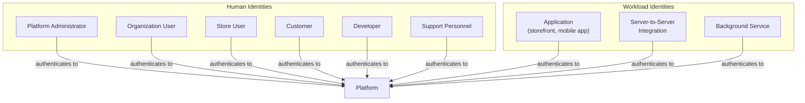
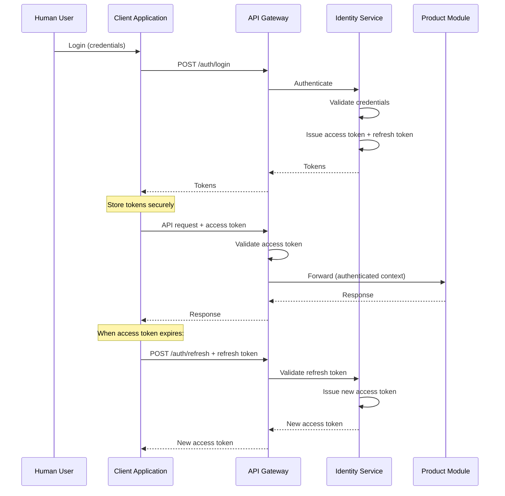

# Identity and Authentication

## Metadata

| Field | Value |
|-------|-------|
| Title | Kairo Identity and Authentication Architecture |
| Document ID | KAI-SEC-003 |
| Status | Draft |
| Version | 0.1 |
| Target Release | V1 |
| Owner | Identity Security Architect |
| Created | 2026-07-18 |
| Last Updated | 2026-07-18 |
| Reviewers | TODO |
| Related Documents | [Security Architecture](./Security-Architecture.md), [Threat Model](./Threat-Model.md), [Platform Core](../../05-Platform-Core/Platform-Core.md), [Platform Hierarchy](../../05-Platform-Core/Platform-Hierarchy.md), [Organization Model](../../05-Platform-Core/Organization-Model.md), [Store Model](../../05-Platform-Core/Store-Model.md), [Platform Services](../../05-Platform-Core/Platform-Services.md), [Glossary](../../02-Products/Glossary.md) |
| Dependencies | [Security Architecture](./Security-Architecture.md) |

---

## Purpose

This document defines the identity and authentication architecture for the Kairo platform. It establishes who can authenticate, how they authenticate, and what assurance levels are required for different contexts.

Authentication answers one question: **"Who are you?"** It does not answer "What are you allowed to do?" — that is authorization, a separate concern documented separately. Authentication proves identity. Authorization evaluates permission. These responsibilities must never be conflated.

---

## Scope

This document covers:

- Identity categories for all actors that interact with the platform.
- Authentication mechanisms for human and machine identities.
- Session and token architecture at a conceptual level.
- V1 baseline requirements and future enterprise capabilities.

This document does not cover:

- Authorization (permission model, role definitions, access control policies).
- Concrete JWT claim structures, exact token expiration values, or endpoint contracts.
- Database schemas for identity data.
- Vendor-specific identity provider configuration.

---

## Identity Categories

### Human Identities

| Identity | Description | Organization Scope | Authentication Context |
|----------|-------------|-------------------|----------------------|
| Platform Administrator | Kairo staff managing the platform itself. | Platform-wide (not tenant-scoped). | Highest assurance. Direct infrastructure access. |
| Organization User | Staff member of a business operating on Kairo. Manages organization settings, users, and cross-store operations. | Single organization. May belong to multiple organizations. | Standard workforce authentication. |
| Store User | Staff member operating within a specific store. Manages products, orders, inventory within their assigned store(s). | Single organization, scoped to assigned stores. | Standard workforce authentication. |
| Customer | A person or business that purchases through a Kairo-powered storefront. | Single organization (commerce customer profile). | Consumer-grade authentication. |
| Developer | An engineer integrating with Kairo APIs. May be building a storefront, admin tool, or integration. | Operates through API keys or tokens scoped to an organization. | Developer credential (API key or user token). |
| Support Personnel | Kairo staff providing customer support. May need to view tenant data for troubleshooting. | Controlled, audited access to specific tenants. Never permanent. | Elevated authentication with audit trail. |

### Workload Identities

| Identity | Description | Credential Type | Scope |
|----------|-------------|----------------|-------|
| Application | A client-side application (storefront, mobile app, SPA) consuming Kairo APIs on behalf of users. | Publishable API key (not secret). | Organization-scoped, limited permissions. |
| Server-to-Server Integration | A backend system integrating with Kairo APIs (ERP sync, warehouse system, marketing tool). | Secret API key. | Organization-scoped, permission-defined. |
| Background Service | Internal platform services executing asynchronous tasks (event processing, scheduled jobs). | Service credential (internal). | Platform-scoped, task-specific permissions. |

---

## Human vs. Workload Identity

The platform maintains a clear separation between human and workload identities:

| Concern | Human Identity | Workload Identity |
|---------|---------------|-------------------|
| Authentication mechanism | Username/password, MFA, passkeys | API keys, service credentials |
| Session model | Interactive session with expiration and renewal | Stateless per-request authentication |
| MFA applicability | Required or available depending on assurance level | Not applicable (machine-to-machine) |
| Account recovery | Password reset, recovery codes | Key rotation, re-provisioning |
| Audit attribution | Named individual | Named application or service |
| Lifecycle | Created, suspended, deactivated by organization admin | Created, rotated, revoked by organization admin or platform |

Human and workload identities are never interchangeable. A human does not authenticate with an API key for interactive sessions. An application does not authenticate with a username and password.

---

## Authentication Assurance Levels

Different contexts require different levels of confidence in the authenticated identity.

| Level | Description | When Required | V1 Mechanism |
|-------|-------------|--------------|-------------|
| **Basic** | Single-factor authentication (password or API key). Sufficient for standard operations. | Default for most API access, customer login | Password + secure session, or API key |
| **Elevated** | Multi-factor authentication. Required for sensitive operations. | Organization administration, security settings, user management | MFA (TOTP) |
| **High** | Recent authentication with strongest available factor. Required for critical operations. | Platform administration, support impersonation, secret management | MFA with recency check |

### Step-Up Authentication

Sensitive actions may require a stronger assurance level than the current session provides. When a user authenticated at Basic level attempts an operation requiring Elevated assurance, the platform prompts for step-up authentication (MFA verification) before proceeding.

Step-up authentication does not create a new session. It elevates the current session's assurance level for a limited time window.

---

## Password Authentication

Password authentication is the baseline credential for human interactive sessions.

### Principles

- Passwords are never stored in plaintext. They are hashed with a modern, slow hashing algorithm.
- Password policies are configurable per organization (minimum length, complexity) but cannot be weaker than platform minimums.
- Password strength is evaluated at creation time. Commonly breached passwords are rejected.
- Password transmission occurs only over TLS. The platform never accepts credentials over unencrypted connections.
- Failed authentication attempts are rate-limited to prevent brute-force attacks.

### Platform Minimums

Platform minimums are defined in platform configuration. Organizations may enforce stricter requirements. See [Configuration Architecture](../../05-Platform-Core/Configuration-Architecture.md) for the tightening-only rule.

---

## MFA and Passkeys

### Multi-Factor Authentication (V1)

- TOTP (time-based one-time password) is the V1 MFA mechanism.
- MFA is available for all workforce identities (organization users, store users).
- MFA may be required at the organization level through security policy configuration.
- MFA is optional for customer identities in V1.
- Recovery codes are provided at MFA enrollment for account recovery if the MFA device is lost.

### Passkeys (Future)

- Passkey (WebAuthn/FIDO2) support is a future capability, not required for V1.
- Passkeys will serve as a passwordless authentication option for human identities.
- Passkeys provide phishing-resistant authentication, addressing credential stuffing and phishing threats.

### Future MFA Capabilities

- Hardware security keys (FIDO2 authenticators).
- Push-based MFA.
- Biometric authentication integration.

All future MFA capabilities are clearly not V1 requirements.

---

## Session Architecture

### Session Principles

- Sessions are represented by tokens. The platform does not use server-side session storage for API consumers.
- Access tokens are short-lived. They represent the current authentication state.
- Refresh tokens are longer-lived. They allow obtaining new access tokens without re-authenticating.
- Sessions are scoped to a single organization context. Switching organizations requires explicit action.
- Session metadata includes the authentication assurance level and the time of last authentication.
- Sessions can be revoked by the user, by an organization administrator, or by the platform.

---

## Access Token Principles

- Access tokens represent a verified identity with a defined scope and expiration.
- Access tokens are short-lived to limit the damage window if a token is compromised.
- Access tokens contain the minimum information needed for the platform to resolve identity and tenant context. They are not a general-purpose data transport.
- Access tokens are validated on every request at the API gateway. Expired or malformed tokens are rejected before reaching product code.
- Access tokens are bearer tokens. Possession of the token grants the associated access. They must be transmitted only over TLS and stored securely by clients.
- **Authentication does not replace authorization.** A valid access token proves identity. It does not prove permission for a specific operation. Authorization is evaluated separately.

---

## Refresh Token Principles

- Refresh tokens are used to obtain new access tokens without requiring the user to re-enter credentials.
- Refresh tokens are longer-lived than access tokens but still have a defined expiration.
- Refresh tokens are single-use. Using a refresh token issues a new access token and a new refresh token. The old refresh token is invalidated.
- Refresh token reuse (attempting to use an already-consumed refresh token) is treated as a potential compromise signal. The platform may revoke the entire session family.
- Refresh tokens are stored securely by the client. For server-side applications, this means secure server storage. For client-side applications, this means secure browser storage mechanisms.

---

## API Key Authentication

API keys authenticate applications and server-to-server integrations. They are not session-based.

### Key Types

| Key Type | Intended Use | Secrecy | Capabilities |
|----------|-------------|---------|-------------|
| **Publishable key** | Client-side applications (storefronts, mobile apps) | Not secret. May be embedded in client code. | Identifier only. Grants access to public-facing operations (catalog read, cart management). Does not authorize administrative or sensitive operations. |
| **Secret key** | Server-side integrations (backend systems, ERP sync) | Secret. Must never appear in client-side code, logs, or version control. | Full API access within the key's defined permission scope. |

### Key Principles

- **Secret API keys are backend-only.** They must never be transmitted to, stored in, or accessible from client-side applications. No obfuscation makes a client-side secret safe.
- **Publishable keys are identifiers, not authorization boundaries.** A publishable key identifies the organization and application. It does not grant access to sensitive operations. Authorization is evaluated separately for every request.
- API keys are scoped to an organization. A key issued for Organization A cannot access Organization B's data.
- API keys have configurable permission scopes. A key may be restricted to specific operations (read-only, specific modules).
- API key creation, usage, and revocation are audited.
- API keys do not expire automatically but support manual rotation and revocation.
- **Tokens must be scoped and short-lived where appropriate.** API keys that need time-limited access should use a key-to-token exchange where the key authenticates and a short-lived token is issued for ongoing requests.

---

## OAuth/OIDC Direction

The platform's authentication architecture is designed to align with OAuth 2.0 and OpenID Connect (OIDC) standards.

### V1 Approach

- Token-based authentication follows OAuth 2.0 patterns (access tokens, refresh tokens, scopes).
- Full OAuth 2.0 authorization server implementation is not required for V1 if simpler token issuance meets platform needs.
- The architecture does not preclude OAuth 2.0 adoption. Token formats and flows are designed to be compatible.

### Future Capabilities

- Full OAuth 2.0 authorization server for third-party application authorization.
- OIDC-compliant identity tokens for customer identity.
- Authorization code flow for server-side integrations.
- PKCE for public client applications.

These are not V1 requirements.

---

## Service Credentials

Internal platform services (background processors, event handlers, scheduled jobs) authenticate using service credentials.

### Principles

- Service credentials are managed by the platform, not by individual developers.
- Service credentials have the minimum permissions required for the service's function.
- Service credentials are rotated automatically on a defined schedule.
- Service credential usage is audited.
- Service credentials are distinct from human and API key credentials. They are not interchangeable.

---

## Login Throttling

- Failed authentication attempts are rate-limited per account and per source.
- Progressive delay increases the wait time between allowed attempts after consecutive failures.
- Account lockout occurs after a defined number of consecutive failures. Lockout is temporary with automatic recovery after a cooldown period.
- Lockout applies to the specific account, not to the source IP globally (to prevent legitimate user lockout through distributed attacks).
- Rate limiting on authentication endpoints is stricter than on other API endpoints.

---

## Account Recovery

- Password reset is initiated by the account holder through a verified email flow.
- Password reset tokens are single-use, short-lived, and transmitted over TLS.
- MFA recovery uses recovery codes issued at enrollment time.
- Account recovery for organization users may be performed by an organization administrator (password reset, MFA reset) with audit logging.
- Account recovery for platform administrators requires elevated verification (out-of-band confirmation).
- Account recovery never reveals whether an account exists. Reset flows return the same response regardless of whether the email is registered.

---

## Session Revocation

- A user can revoke their own sessions (logout, revoke all sessions).
- An organization administrator can revoke sessions for any user in their organization.
- The platform can revoke all sessions for an account (compromise response).
- Session revocation is immediate for new requests. In-flight requests complete normally.
- Revocation is audited with the identity of the revoking actor.
- Token revocation is checked at the gateway. Revoked tokens are rejected before reaching product code.

---

## Credential Rotation

| Credential Type | Rotation Model |
|----------------|---------------|
| Passwords | User-initiated or admin-forced. Organization policy may require periodic rotation. |
| MFA secrets | User-initiated re-enrollment. |
| API keys (secret) | Manual rotation by organization admin. Old key remains valid for a grace period during transition. |
| API keys (publishable) | Rotation supported but rarely needed (not secret). |
| Service credentials | Automated rotation on a defined schedule. |
| Integration credentials | Managed through the integration framework. Rotation follows provider requirements. |

### Rotation Principles

- Rotation must be possible without downtime. Old and new credentials are valid concurrently during a transition window.
- Rotation is audited.
- Forced rotation (after suspected compromise) invalidates the old credential immediately with no grace period.

---

## Test vs. Live Credentials

- The platform supports separate credential sets for test (sandbox) and live (production) environments.
- Test credentials access test data only. They cannot access live tenant data.
- Live credentials cannot be used in test environments.
- Test and live credentials are visually distinguishable (naming convention or prefix).
- This separation prevents accidental production operations during development and testing.

---

## Step-Up Authentication

**Sensitive actions may require recent or stronger authentication.** The platform supports step-up authentication for operations that demand higher assurance than the current session provides.

### Step-Up Triggers

| Operation | Minimum Assurance |
|-----------|------------------|
| Change security settings | Elevated |
| Manage users and roles | Elevated |
| Access secret API keys | Elevated |
| Modify integration credentials | Elevated |
| Platform administration | High |
| Support impersonation | High |

### Step-Up Flow

1. User attempts a sensitive operation with a Basic assurance session.
2. The platform returns a step-up challenge indicating the required assurance level.
3. The user completes the additional authentication factor (MFA).
4. The session's assurance level is elevated for a limited time window.
5. The original operation proceeds.

---

## Support Impersonation Safeguards

Support personnel may need to view a tenant's data to resolve support requests. This access is tightly controlled.

### Safeguards

- Support impersonation requires High assurance authentication.
- Impersonation sessions are time-limited. They expire automatically after a short duration.
- Every action taken during an impersonation session is audited with both the support user's identity and the impersonated tenant context.
- Impersonation grants read access by default. Write access requires explicit, additional authorization.
- The tenant is notified when support impersonation occurs (notification or audit entry visible to the tenant).
- Impersonation cannot be used to access credentials, secrets, or authentication settings.
- Impersonation sessions are visually or contextually distinguishable from normal sessions in audit records.

---

## Authentication Event Auditing

All authentication-related events are recorded in the audit trail:

| Event | Recorded Data |
|-------|--------------|
| Successful login | User identity, timestamp, authentication method, assurance level, client context |
| Failed login | Attempted identity (if provided), timestamp, failure reason, client context |
| MFA enrollment | User identity, timestamp, method enrolled |
| MFA verification | User identity, timestamp, success/failure |
| Session creation | User identity, session identifier, expiration, scope |
| Session revocation | User identity, revoking actor, timestamp, reason |
| API key creation | Creating user, key identifier (not the key value), permissions, timestamp |
| API key revocation | Revoking user, key identifier, timestamp, reason |
| Password change | User identity, timestamp, initiated by (self or admin) |
| Account lockout | User identity, timestamp, trigger (failed attempts count) |
| Step-up authentication | User identity, timestamp, required level, success/failure |
| Support impersonation start | Support user, target tenant, timestamp, access level |
| Support impersonation end | Support user, target tenant, timestamp, duration |

### Auditing Rules

- Authentication events are never suppressed. They are part of the mandatory audit trail.
- Failed authentication events are as important as successful ones. They are attack indicators.
- Audit entries for authentication never contain credentials, tokens, or secrets.

---

## Customer Identity vs. Workforce Identity

**Customer identity and workforce identity remain distinct concepts.**

| Concern | Workforce Identity | Customer Identity |
|---------|-------------------|-------------------|
| Purpose | Manage the business (products, orders, settings) | Purchase goods and services |
| Authentication | Username/password + MFA | Email/password, social login (future), guest checkout |
| MFA | Required or available per organization policy | Optional in V1 |
| Managed by | Organization administrator | Self-service registration + organization admin |
| Data owned | Access permissions, role assignments | Commerce profile (addresses, order history, preferences) |
| Session context | Organization + assigned stores | Organization (as a customer of that business) |

These identities share the same authentication infrastructure but are conceptually and operationally separate. A workforce user managing orders is not the same identity type as a customer placing orders, even if they happen to be the same person.

---

## V1 Baseline

| Capability | V1 Status |
|-----------|-----------|
| Password authentication for workforce users | Required |
| Password authentication for customers | Required |
| TOTP MFA for workforce users | Required |
| MFA for customers | Optional (available, not enforced) |
| API key authentication (publishable + secret) | Required |
| Access tokens (short-lived) | Required |
| Refresh tokens (single-use) | Required |
| Session revocation | Required |
| Login throttling and account lockout | Required |
| Account recovery (password reset) | Required |
| Credential rotation (manual) | Required |
| Authentication event auditing | Required |
| Step-up authentication | Required for defined sensitive operations |
| Test vs. live credential separation | Required |
| Support impersonation with safeguards | Required |
| Service credentials for background services | Required |
| Guest checkout (no customer account required) | Required |

## Future Enterprise Capabilities

The following capabilities are planned for future versions. They are not V1 requirements.

| Capability | Target Version | Description |
|-----------|---------------|-------------|
| Enterprise SSO | V2+ | Organization-level single sign-on through external identity providers |
| SAML 2.0 | V2+ | SAML-based federation for enterprise workforce identity |
| OIDC provider | V2+ | Full OpenID Connect identity provider for customer and workforce identity |
| SCIM provisioning | V3+ | Automated user provisioning and deprovisioning from enterprise directories |
| Hardware security keys | V2+ | FIDO2 hardware authenticator support for high-assurance authentication |
| Passkeys (WebAuthn) | V2+ | Passwordless authentication for workforce and customer identities |
| Conditional access | V3+ | Context-based access policies (device trust, location, risk score) |
| Dedicated identity deployment | Future | Isolated identity infrastructure for enterprise tenants with regulatory requirements |
| Social login for customers | V2+ | OAuth-based customer authentication through social providers |
| Adaptive authentication | V3+ | Risk-based authentication that adjusts assurance requirements dynamically |

---

## Version Gate

| Version | Identity and Authentication Gate |
|---------|-------------------------------|
| V1 | All V1 baseline capabilities are operational. Password + MFA authentication works. API key authentication works. Token lifecycle (issue, refresh, revoke) is proven. Authentication event auditing covers all defined events. Step-up authentication is functional for sensitive operations. |
| V2 | Enterprise SSO and SAML are available. Social login for customers is available. Passkey support is evaluated. Automated credential rotation is operational. Authentication anomaly detection is in place. |
| V3 | SCIM provisioning is available. Conditional access policies are operational. Adaptive authentication is evaluated. Full OAuth 2.0/OIDC compliance is achieved. |

---

## Decision Summary

| Decision | Rationale |
|----------|-----------|
| Human and workload identities are separate | They have different lifecycle, authentication, and audit requirements. Conflating them creates security gaps. |
| Secret API keys are backend-only | Client-side secrets are not secret. No obfuscation changes this. |
| Publishable keys are identifiers, not authorization | A key that identifies an application does not grant permission. Authorization is evaluated separately on every request. |
| Access tokens are short-lived | Short lifetimes limit the damage window of token compromise. |
| Refresh tokens are single-use | Detecting reuse of a consumed refresh token is a strong compromise signal. |
| Step-up authentication for sensitive operations | Not all operations need the same assurance level. Requiring MFA for every request degrades usability without proportional security benefit. |
| Customer and workforce identity are distinct | A customer placing an order and a staff member managing orders have different security contexts, even on the same platform. |
| Support impersonation is audited and time-limited | Support access to tenant data is necessary but must be controlled, visible, and temporary. |

---

## Architecture Impact

| Concern | Impact |
|---------|--------|
| API gateway | Validates tokens on every request. Rejects expired, malformed, or revoked tokens. Resolves tenant context from authenticated identity. |
| Request pipeline | Authentication runs before authorization. Assurance level is available for step-up decisions. |
| Module design | Modules receive authenticated context from the pipeline. Modules never implement their own authentication. |
| Data model | Identity entities (users, API keys, sessions) are platform-owned. Commerce customer profiles reference identity but do not duplicate authentication data. |
| Events | Authentication events are published for audit and monitoring. Token revocation events propagate to the gateway cache. |
| Configuration | Authentication policies (password rules, MFA requirements, lockout thresholds) are configurable per organization through the configuration hierarchy. |

---

## Implementation Impact

| Area | Impact |
|------|--------|
| Modules | Must accept authenticated context from the pipeline. Must never authenticate users directly. Must not store or log credentials or tokens. |
| APIs | Must require authentication on every endpoint. Must distinguish between publishable-key and secret-key access levels. Must support step-up challenge responses. |
| Frontend guidance | Must never embed secret keys. Must store tokens using secure client-side mechanisms. Must handle token refresh transparently. |
| Background services | Must authenticate with service credentials. Must not reuse human or API key credentials. |
| Testing | Must validate authentication for every endpoint. Must test token expiration, revocation, and refresh flows. Must verify that failed authentication is rate-limited. |

---

## Security Responsibilities

| Role | Authentication Responsibilities |
|------|-------------------------------|
| Identity Security Architect | Defines authentication architecture. Reviews authentication-impacting changes. |
| Platform Team (Identity) | Implements authentication mechanisms, token lifecycle, session management, credential storage. |
| Product Teams | Consume authenticated context. Define which of their operations require elevated assurance. |
| Operations | Monitor authentication events. Respond to credential compromise. Manage service credential rotation. |
| Organization Administrators | Manage user accounts, API keys, and authentication policies for their organization. |

---

## Out of Scope

This document does not define:

- Authorization architecture (permissions, roles, access policies) — documented separately.
- Concrete JWT claim structures or token formats — documented in implementation specifications.
- Exact token expiration values — configured per deployment, not architectural constants.
- Database schemas for identity entities — documented in module specifications.
- Vendor-specific identity provider integration details — documented in integration guides.
- Compliance-specific identity requirements (GDPR consent, PCI identity controls) — documented in compliance documentation.

---

## Future Considerations

- **Decentralized identity** — Evaluate decentralized identity standards as they mature.
- **Passwordless-first** — Passkeys may eventually replace passwords as the primary authentication method.
- **Identity analytics** — Authentication pattern analysis for proactive threat detection.
- **Identity federation marketplace** — Pre-built integrations with common enterprise identity providers.
- **Customer identity platform** — Dedicated customer identity management beyond basic authentication (progressive profiling, consent management).

---

## Future Refactoring Triggers

This document should be revisited when:

- The Kairo Identity product enters active development (dedicated identity capabilities beyond platform baseline).
- Enterprise SSO or SAML is implemented (federation changes the authentication model).
- A new product is added (new identity categories or authentication contexts may emerge).
- A significant authentication-related security incident occurs.
- Passwordless authentication becomes the preferred standard.
- Regulatory requirements impose specific authentication obligations.

---

## Change History

| Version | Date | Author | Description |
|---------|------|--------|-------------|
| 0.1 | 2026-07-18 | Identity Security Architect | Initial draft |
