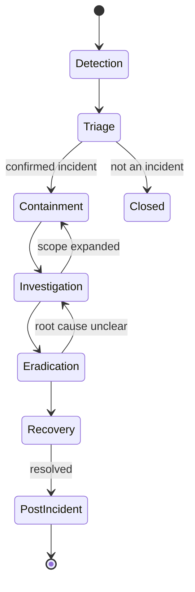

# Incident Response

## Metadata

| Field | Value |
|-------|-------|
| Title | Kairo Security Incident Response Architecture |
| Document ID | KAI-SEC-010 |
| Status | Draft |
| Version | 0.1 |
| Target Release | V1 |
| Owner | Security Incident Response Architect |
| Created | 2026-07-20 |
| Last Updated | 2026-07-20 |
| Reviewers | TODO |
| Related Documents | [Security Architecture](./Security-Architecture.md), [Threat Model](./Threat-Model.md), [Secrets and Key Management](./Secrets-and-Key-Management.md), [Audit and Security Monitoring](./Audit-and-Security-Monitoring.md), [Data Protection](./Data-Protection.md), [Identity and Authentication](./Identity-and-Authentication.md) |
| Dependencies | [Audit and Security Monitoring](./Audit-and-Security-Monitoring.md), [Secrets and Key Management](./Secrets-and-Key-Management.md) |

---

## Purpose

This document defines the architecture and governance for security incident response at Kairo. It establishes how incidents are classified, detected, contained, investigated, resolved, and learned from.

Incidents will happen. The measure of a platform is not whether it experiences incidents, but how quickly they are detected, how effectively they are contained, and how completely they are prevented from recurring. This document ensures that when an incident occurs, the response is structured, accountable, and effective.

This is a governance and architecture document. It defines the framework. Operational runbooks with step-by-step procedures are documented separately as the operational team matures.

---

## Scope

This document covers:

- Incident classification, severity, and ownership.
- Incident lifecycle from detection through post-incident review.
- Playbook categories for defined incident types.
- Evidence preservation and communication requirements.
- Responsibility model and maturity direction.

This document does not cover:

- Step-by-step operational procedures (documented in future operational runbooks).
- Specific monitoring tool configuration (documented in infrastructure guides).
- Vendor-specific commands or contact information.
- Business continuity planning beyond security incidents (documented separately).

---

## Incident Definition

A security incident is any event that:

- Compromises or threatens the confidentiality, integrity, or availability of the platform or tenant data.
- Violates or threatens to violate the security architecture, policies, or controls defined in this repository.
- Requires immediate action beyond normal operational procedures to contain or resolve.

Not every anomaly is an incident. The triage stage determines whether a detected event requires incident response or standard operational handling.

---

## Incident Categories

| Category | Description | Examples |
|----------|-------------|---------|
| **Data exposure** | Unauthorized access to or disclosure of data | Cross-tenant data leakage, personal data exposure, unintended API response content |
| **Unauthorized access** | Access to systems or data by an unauthorized actor | Account takeover, credential compromise, privilege escalation |
| **Service integrity** | Unauthorized modification of system behavior or data | Malicious code deployment, configuration tampering, data corruption |
| **Availability** | Disruption to platform availability or performance | DDoS attack, resource exhaustion, infrastructure failure caused by attack |
| **Supply chain** | Compromise through a third-party dependency or provider | Malicious dependency update, compromised integration provider, CI/CD breach |
| **Financial** | Unauthorized financial transactions or payment system compromise | Payment integration compromise, unauthorized refunds, transaction manipulation |

---

## Severity Model

| Severity | Definition | Impact | Response Time | Escalation |
|----------|-----------|--------|--------------|-----------|
| **Critical (S1)** | Active compromise with confirmed data exposure or cross-tenant impact. Platform integrity at risk. | Multiple tenants affected or potential for all tenants to be affected. Financial, legal, or reputational damage is imminent. | Immediate (minutes) | Engineering leadership + founder notified immediately |
| **High (S2)** | Confirmed security violation with limited scope. Single tenant or single system component affected. | One tenant affected, or one system compromised but containment is possible. | Within 1 hour | Security lead + engineering leadership notified |
| **Medium (S3)** | Suspicious activity or vulnerability under active exploitation. Containment prevents escalation. | Potential for impact but no confirmed data loss or unauthorized access. | Within 4 hours | Security lead notified |
| **Low (S4)** | Security-relevant event that requires investigation but poses no immediate threat. | No confirmed impact. Investigation determines whether escalation is needed. | Within 1 business day | Queued for security review |

### Severity Rules

- Severity is assessed at detection and may be upgraded or downgraded as investigation reveals more information.
- When in doubt, escalate to the higher severity. Downgrade after investigation, not before.
- Cross-tenant impact automatically elevates to Critical regardless of other factors.
- Data breach (confirmed unauthorized data access) is always High or Critical.
- Severity determines response time, not importance. All incidents are resolved.

---

## Incident Lifecycle

---

## Detection

Incidents are detected through multiple channels:

| Detection Source | Examples |
|-----------------|---------|
| Automated monitoring | Alert from security monitoring (authorization failures, anomalous access patterns, cross-tenant signals) |
| Audit analysis | Pattern identified during audit log review |
| External report | Customer reports suspicious activity, security researcher discloses vulnerability |
| Internal discovery | Engineer discovers issue during development or code review |
| Third-party notification | Provider notifies of a breach affecting credentials or data |
| Dependency alert | Vulnerability scanner identifies actively exploited dependency |

### Detection Requirements

- All detection sources feed into a single incident intake process.
- Detection-to-triage time is minimized. Automated alerts trigger immediate triage.
- Detection is never suppressed. Alert fatigue is managed by tuning thresholds, not by ignoring alerts.
- All detection events are logged regardless of whether they become incidents.

---

## Triage

Triage determines whether a detected event is a security incident and assigns initial severity.

### Triage Questions

1. Is this a confirmed or suspected security violation?
2. Is data confidentiality, integrity, or availability affected?
3. Is the impact limited to one tenant or potentially cross-tenant?
4. Is the threat active (ongoing) or historical (already concluded)?
5. What is the blast radius if the event is not contained?

### Triage Outcomes

| Outcome | Action |
|---------|--------|
| Confirmed incident | Assign severity. Begin containment. |
| Suspected incident | Assign preliminary severity. Begin investigation to confirm or dismiss. |
| Not an incident | Document the event. Close. Update detection rules if the false positive is recurring. |
| Vulnerability (not exploited) | Route to vulnerability management. Not an incident unless actively exploited. |

---

## Containment

Containment limits the blast radius of an active incident. It prevents further damage while investigation proceeds.

### Containment Principles

- **Speed over completeness.** Contain first, investigate second. Limiting damage is the priority.
- **Preserve evidence.** Containment actions must not destroy evidence needed for investigation.
- **Minimize disruption.** Contain the incident without taking the entire platform offline unless absolutely necessary.
- **Communicate.** Notify stakeholders that containment is in progress.

### Containment Actions (by category)

| Category | Containment Options |
|----------|-------------------|
| Unauthorized access | Revoke compromised credentials. Terminate active sessions. Block source. |
| Data exposure | Remove unauthorized access path. Disable affected endpoint. Isolate affected data. |
| Malicious deployment | Rollback to last known good version. Disable affected service. |
| DDoS | Engage infrastructure-level mitigation. Increase rate limiting. Block attack sources. |
| Supply chain | Disable affected dependency. Rollback to unaffected version. Isolate affected systems. |
| Financial | Disable affected payment integration. Pause automated refunds. Isolate transaction processing. |

### Containment Rules

- Containment is authorized for the incident responder without waiting for approval (for S1/S2).
- Containment decisions are documented in real-time (what was done, when, by whom).
- Containment may cause controlled service degradation. This is acceptable to prevent uncontrolled damage.

---

## Investigation

Investigation determines what happened, how it happened, what was affected, and why controls failed.

### Investigation Activities

| Activity | Purpose |
|----------|---------|
| Timeline reconstruction | Establish the sequence of events from initial compromise to detection |
| Scope assessment | Determine which tenants, systems, and data were affected |
| Root cause analysis | Identify the vulnerability or failure that enabled the incident |
| Attack vector identification | Determine how the attacker gained access or exploited the system |
| Impact assessment | Quantify the damage (data exposed, transactions affected, systems compromised) |

### Investigation Principles

- **Follow the evidence.** Conclusions are supported by audit records, logs, and system state — not assumptions.
- **Assume the scope is larger than initial appearance.** Investigate broadly before concluding containment is complete.
- **Document everything.** Investigation findings are recorded in the incident record in real-time.
- **Do not destroy evidence.** System changes during investigation are documented. Affected systems are preserved for forensic analysis where feasible.

---

## Eradication

Eradication removes the root cause and all artifacts of the compromise from the system.

### Eradication Activities

| Activity | Examples |
|----------|---------|
| Remove attacker access | Delete backdoors, revoke all potentially compromised credentials, close exploited entry points |
| Patch vulnerability | Deploy fix for the exploited vulnerability |
| Remove malicious artifacts | Delete injected code, corrupted data, unauthorized accounts |
| Verify removal | Confirm that all indicators of compromise are eliminated |
| Harden against re-exploitation | Apply additional controls to prevent the same attack vector from succeeding again |

### Eradication Rules

- Eradication is confirmed through verification, not assumed through action.
- If the root cause is unclear, eradication cannot be confirmed. Investigation continues.
- Eradication may require coordinated action across multiple systems.

---

## Recovery

Recovery restores the platform to normal operation with confidence that the incident is fully resolved.

### Recovery Activities

| Activity | Purpose |
|----------|---------|
| Restore service | Return affected components to normal operation |
| Verify integrity | Confirm that restored systems are clean and functioning correctly |
| Validate controls | Verify that security controls are operational post-recovery |
| Monitor for recurrence | Increase monitoring intensity for the attack vector for a defined period |
| Communicate resolution | Notify stakeholders that the incident is resolved |

### Recovery Principles

- Recovery is not rushed. Restoring a compromised system to operation without verifying integrity risks re-compromise.
- Recovery monitoring is intensified. The same attack vector is watched closely after recovery.
- Recovery is declared by the incident lead, not by any individual action completing.

---

## Communication

### Internal Communication

| Severity | Communication |
|----------|--------------|
| Critical (S1) | Real-time updates to engineering leadership and founder. Continuous coordination channel. |
| High (S2) | Regular updates to security lead and engineering leadership. |
| Medium (S3) | Updates to security lead. Broader team informed at resolution. |
| Low (S4) | Documented in incident record. Team informed at resolution. |

### Customer Communication

| Condition | Communication |
|-----------|--------------|
| Confirmed tenant data exposure | Affected tenants notified with details of what was exposed, when, and what actions to take |
| Service disruption affecting tenants | Status communication during the incident and post-resolution summary |
| No tenant impact confirmed | No customer communication required. Internal documentation only. |

### Communication Rules

- Customer communication is factual and timely. Do not speculate. Do not minimize.
- Customer communication includes: what happened, what was affected, what was done, and what they should do.
- Communication timing is driven by severity and impact, not by convenience.
- Legal and regulatory notification requirements are assessed for every data exposure incident.

---

## Customer Impact Assessment

For every incident, customer impact is assessed:

| Assessment Question | Purpose |
|--------------------|---------|
| Was any tenant's data accessed by an unauthorized party? | Determines data breach notification obligation |
| Was any tenant's data modified without authorization? | Determines data integrity impact |
| Was any tenant's service availability affected? | Determines SLA impact |
| Was any financial transaction affected? | Determines financial remediation need |
| How many tenants were affected? | Determines scale and communication scope |
| What is the customer's required action? | Determines guidance provided (password reset, key rotation, etc.) |

---

## Evidence Preservation

Evidence is preserved throughout the incident lifecycle for investigation, legal proceedings, and post-incident review.

### Preservation Requirements

| Evidence Type | Preservation Method |
|--------------|-------------------|
| Audit records | Immutable by architecture. No additional preservation needed. |
| Application and security logs | Marked for extended retention. Not rotated until investigation completes. |
| System state (memory, processes, network connections) | Captured before containment actions modify the system (where feasible). |
| Attacker artifacts (malicious files, injected code) | Preserved in isolated, access-controlled storage. |
| Timeline and communications | Documented in the incident record. |
| Forensic images | Created for critically affected systems (where feasible). |

### Preservation Rules

- Evidence preservation begins at detection, before containment modifies system state.
- Containment actions that destroy evidence are documented (what was lost and why the containment priority justified it).
- Evidence is access-controlled. Only the investigation team accesses preserved evidence.
- Evidence retention follows legal and compliance requirements.

---

## Credential and Key Rotation

Every incident involving potential credential compromise triggers rotation:

| Credential Type | Rotation Trigger | Rotation Process |
|----------------|-----------------|-----------------|
| API keys (tenant) | Key may have been exposed | Tenant notified. Old key revoked. New key issued. |
| Platform secrets | Infrastructure compromise suspected | Immediate rotation per [Secrets and Key Management](./Secrets-and-Key-Management.md) |
| Signing keys | Token forgery suspected | Key rotation with rollover period for valid tokens |
| Integration credentials | Provider compromise or SSRF | Credential rotation. Provider notified. |
| User passwords | Account takeover confirmed | Forced password reset for affected accounts |
| Encryption keys | Key material exposure suspected | Key rotation. Assess whether data re-encryption is needed. |

### Rotation Rules

- Rotation is proactive. If there is any doubt about whether a credential was compromised, rotate it.
- Rotation follows the procedures defined in [Secrets and Key Management](./Secrets-and-Key-Management.md).
- Rotation is documented in the incident record.
- Post-rotation verification confirms the new credentials work and the old ones are rejected.

---

## Tenant-Specific vs. Platform-Wide Incidents

| Scope | Characteristics | Response Difference |
|-------|----------------|-------------------|
| **Tenant-specific** | Affects one organization. Caused by tenant-level compromise (stolen API key, phished user). | Containment scoped to the affected tenant. Other tenants unaffected. Communication to affected tenant only. |
| **Platform-wide** | Affects multiple tenants or the platform itself. Caused by platform-level vulnerability or infrastructure compromise. | Containment may require platform-wide action. All potentially affected tenants assessed. Broader communication. |

### Scope Determination Rules

- An incident starts as tenant-specific until evidence suggests broader impact.
- Any incident involving platform infrastructure, shared services, or platform credentials is treated as platform-wide until scoped otherwise.
- Cross-tenant data access is always platform-wide (architectural isolation failure).

---

## Third-Party Provider Incidents

When a third-party service used by the platform is compromised:

| Step | Action |
|------|--------|
| Assessment | Determine what Kairo data or credentials the provider had access to |
| Credential rotation | Rotate all credentials shared with the affected provider |
| Impact analysis | Determine whether the provider compromise affected Kairo or its tenants |
| Communication | Notify affected tenants if their data may have been exposed through the provider |
| Containment | Disable or isolate the affected integration until the provider confirms resolution |
| Re-enablement | Re-enable only after provider confirms resolution and new credentials are in place |

---

## Data Breach Considerations

When an incident involves confirmed unauthorized access to personal data or payment data:

| Consideration | Requirement |
|--------------|-------------|
| Regulatory notification | Assess obligation under applicable regulations (GDPR 72-hour notification, etc.) |
| Tenant notification | Notify affected tenants with breach details and recommended actions |
| Customer notification | If end-customer personal data is exposed, tenants are responsible for notifying their customers (with Kairo support) |
| Legal consultation | Engage legal counsel for breach notification obligations |
| Documentation | Maintain detailed records of the breach, response actions, and notifications for regulatory compliance |
| Remediation | Implement controls to prevent recurrence. Document in post-incident review. |

---

## Post-Incident Review

Every incident of Medium severity or above receives a post-incident review. Critical and High incidents receive a formal, documented review.

### Review Timing

- Post-incident review occurs within 5 business days of incident closure.
- The review is conducted with all participants and stakeholders, not just the incident responder.

### Review Content

| Topic | Questions |
|-------|-----------|
| Timeline | What happened and when? Was detection timely? Was response timely? |
| Detection | How was the incident detected? Could it have been detected earlier? |
| Containment | Was containment effective? Was the blast radius minimized? |
| Root cause | What vulnerability or failure enabled the incident? Why did it exist? |
| Controls | Which controls failed? Which controls worked? What is missing? |
| Communication | Was communication timely and appropriate? Were the right people involved? |
| Recovery | Was recovery complete and verified? Is there residual risk? |
| Process | Did the incident response process work? What should be improved? |

### Review Principles

- Post-incident reviews are blameless. The goal is learning, not punishment.
- Reviews focus on systemic causes, not individual errors.
- Reviews produce specific, actionable corrective actions with owners and timelines.

---

## Corrective Actions

Post-incident reviews produce corrective actions that prevent recurrence.

| Action Type | Examples |
|------------|---------|
| Technical fix | Patch vulnerability, add missing validation, strengthen isolation |
| Detection improvement | Add alert rule, lower detection threshold, add monitoring coverage |
| Process improvement | Update runbook, add review step, modify gate requirements |
| Architecture improvement | Strengthen trust boundary, add defence layer, improve isolation mechanism |
| Documentation update | Update threat model, update security architecture, add new playbook |
| Training | Address knowledge gap that contributed to the incident |

### Corrective Action Rules

- Every corrective action has an owner and a deadline.
- Corrective actions are tracked to completion.
- Corrective actions that address architectural weaknesses are prioritized over procedural fixes.
- Corrective actions from Critical incidents are treated as high-priority work.

---

## Documentation Updates

After every incident, the following documents are reviewed and updated if the incident revealed gaps:

| Document | Update Trigger |
|----------|---------------|
| [Threat Model](./Threat-Model.md) | New threat identified, risk assessment changed |
| [Security Architecture](./Security-Architecture.md) | Architectural weakness identified |
| [Audit and Security Monitoring](./Audit-and-Security-Monitoring.md) | Detection gap identified |
| [Secrets and Key Management](./Secrets-and-Key-Management.md) | Credential handling issue identified |
| This document | Process improvement identified |
| Module specifications | Module-specific vulnerability or control gap identified |

---

## Playbook Categories

The following incident types have dedicated playbook categories. Detailed procedures are documented in operational runbooks as the team matures.

### Cross-Tenant Data Exposure

| Phase | Key Actions |
|-------|------------|
| Containment | Identify and close the exposure path. Isolate affected data access. |
| Investigation | Determine which tenants' data was exposed, to whom, and for how long. |
| Communication | Notify all affected tenants. Assess regulatory notification obligations. |
| Eradication | Fix the isolation failure. Verify isolation across all similar paths. |

### Administrative Account Takeover

| Phase | Key Actions |
|-------|------------|
| Containment | Revoke compromised account sessions. Force password reset. Disable account if necessary. |
| Investigation | Determine actions taken with the compromised account. Identify access vector. |
| Communication | Notify the affected organization. |
| Eradication | Secure the account. Address the access vector (phishing, credential reuse, etc.). |

### API Key Leakage

| Phase | Key Actions |
|-------|------------|
| Containment | Revoke the leaked key immediately. |
| Investigation | Determine where the key was exposed. Identify any unauthorized usage. |
| Communication | Notify the key owner. Provide new key. |
| Eradication | Remove the key from the exposure location. Address root cause (committed to code, logged, etc.). |

### Payment Integration Compromise

| Phase | Key Actions |
|-------|------------|
| Containment | Disable affected payment integration. Pause automated transactions. |
| Investigation | Determine scope of unauthorized transactions. Coordinate with payment provider. |
| Communication | Notify affected tenants. Coordinate with provider on customer notification. |
| Eradication | Rotate credentials. Re-enable only after provider confirms resolution. |

### Malicious Deployment

| Phase | Key Actions |
|-------|------------|
| Containment | Rollback to last known good deployment. Isolate affected infrastructure. |
| Investigation | Determine how malicious code entered the pipeline. Identify all affected artifacts. |
| Communication | Internal escalation. Tenant notification if data or availability affected. |
| Eradication | Secure the pipeline. Rotate all credentials the malicious code may have accessed. |

### Data Exfiltration

| Phase | Key Actions |
|-------|------------|
| Containment | Block the exfiltration path. Revoke access used for exfiltration. |
| Investigation | Determine what data was taken, volume, and duration. |
| Communication | Notify affected tenants. Assess regulatory notification. |
| Eradication | Close the access path. Strengthen data access controls. |

### DDoS

| Phase | Key Actions |
|-------|------------|
| Containment | Engage infrastructure mitigation. Increase rate limiting. Block attack sources where identifiable. |
| Investigation | Characterize the attack (volumetric, application-layer, target). |
| Communication | Status update to affected tenants if availability is degraded. |
| Recovery | Validate service restoration. Monitor for resumption. |

### Dependency Compromise

| Phase | Key Actions |
|-------|------------|
| Containment | Remove or pin the affected dependency. Rollback if the compromised version was deployed. |
| Investigation | Determine whether the malicious code executed and what it accessed. |
| Communication | Internal notification. Tenant notification if impact is confirmed. |
| Eradication | Replace the dependency. Rotate any credentials it may have accessed. |

### Backup or Recovery Failure

| Phase | Key Actions |
|-------|------------|
| Assessment | Determine the scope of data loss or corruption. |
| Recovery | Attempt alternative recovery paths. Engage infrastructure team. |
| Communication | Notify affected tenants of data loss with details on what period is affected. |
| Eradication | Fix the backup/recovery mechanism. Verify through recovery testing. |

---

## Responsibility Model

| Role | Incident Response Responsibilities |
|------|-----------------------------------|
| **Incident Responder** | First responder. Triages. Initiates containment. Coordinates response. Documents actions. |
| **Security Lead** | Escalation point. Approves major containment actions. Leads Critical/High incidents. Conducts post-incident review. |
| **Engineering Leadership** | Notified for High/Critical. Provides resources. Makes business impact decisions. Approves customer communication. |
| **Platform Team** | Executes technical containment and eradication. Provides platform expertise during investigation. |
| **Product Teams** | Provide domain expertise. Execute module-specific investigation and fixes. |
| **Operations** | Infrastructure containment. Log preservation. System state capture. Monitoring adjustments. |
| **Founder** | Notified for Critical. Final authority on customer communication and business decisions. |

### Responsibility Rules

- Every incident has a designated lead from detection to closure.
- Responsibility transfers are explicit and documented.
- No incident remains unowned. If the designated lead is unavailable, escalation is automatic.

---

## Future 24/7 Operational Maturity

### V1 Approach

- V1 operates with a small team. 24/7 coverage is not achievable.
- Critical alerts route to an on-call engineer.
- Response times are best-effort outside business hours for non-Critical incidents.
- Automated containment (account lockout, key revocation) provides initial response while humans engage.

### Future Direction

- Dedicated security operations capability with defined shift coverage.
- 24/7 monitoring and response for Critical and High incidents.
- Tiered on-call rotation with defined escalation paths.
- Automated playbook execution for defined incident types.
- Incident management platform for coordination and documentation.

---

## V1 Baseline

| Capability | V1 Status |
|-----------|-----------|
| Incident severity model defined | Required |
| Detection through automated monitoring | Required |
| Triage process defined | Required |
| Containment actions documented per category | Required |
| Evidence preservation requirements defined | Required |
| Credential rotation process defined | Required |
| Customer communication framework | Required |
| Post-incident review for Medium+ incidents | Required |
| Corrective action tracking | Required |
| Playbook categories defined | Required |
| On-call routing for Critical alerts | Required |
| Incident documentation template | Required |

## Future Capabilities

| Capability | Target Version | Description |
|-----------|---------------|-------------|
| Dedicated security operations | V2+ | Trained team with incident response as primary function |
| 24/7 monitoring coverage | V2+ | Continuous human monitoring for Critical alerts |
| Automated containment | V2+ | Defined automated responses for specific incident patterns |
| Incident management platform | V2+ | Dedicated tooling for incident coordination and documentation |
| Tabletop exercises | V2+ | Regular practice scenarios to validate response readiness |
| Third-party incident response retainer | V3+ | External expertise available for complex investigations |
| Regulatory notification automation | V3+ | Tooling to manage breach notification timelines and obligations |
| Incident metrics and trends | V2+ | Tracking MTTD, MTTR, severity distribution, and recurrence |

---

## Version Gate

| Version | Incident Response Gate |
|---------|----------------------|
| V1 | Severity model, triage process, containment playbooks, credential rotation, evidence preservation, post-incident review, and corrective action tracking are defined and operational. On-call routing works for Critical alerts. |
| V2 | Dedicated security operations coverage during business hours. Automated containment for defined patterns. Incident metrics tracked. Tabletop exercises conducted at least twice per year. |
| V3 | 24/7 coverage for Critical/High. Automated regulatory notification tracking. External incident response retainer. Incident response maturity formally assessed. |

---

## Decision Summary

| Decision | Rationale |
|----------|-----------|
| Containment before investigation | Limiting damage is more important than understanding the full picture immediately. |
| Cross-tenant incidents are always Critical | Tenant isolation is the platform's most fundamental security promise. Any failure is catastrophic to trust. |
| Evidence preservation is mandatory | Without evidence, investigation is speculation. Legal proceedings require preserved evidence. |
| Post-incident review is mandatory for Medium+ | Learning from incidents prevents recurrence. Without formal review, the same failures repeat. |
| Blameless post-incident reviews | Blame discourages reporting and honest analysis. Systemic fixes prevent recurrence better than individual accountability. |
| Credential rotation on suspicion (not confirmation) | Waiting for confirmation extends the window of compromise. Proactive rotation is low-cost and high-value. |
| Automated containment for defined patterns | Human response has latency. Automated containment (lockout, revocation) limits damage while humans engage. |

---

## Architecture Impact

| Concern | Impact |
|---------|--------|
| Monitoring | Security monitoring must detect incidents as defined in [Audit and Security Monitoring](./Audit-and-Security-Monitoring.md). Alert routing must reach responders. |
| Audit | Audit records are the primary evidence source. Audit immutability is essential for incident investigation. |
| Secrets management | Credential rotation must be operationally feasible without downtime, as defined in [Secrets and Key Management](./Secrets-and-Key-Management.md). |
| Deployment | Rollback must be possible for malicious deployment containment. Deployment history must be preserved. |
| Tenant isolation | Isolation architecture must prevent cross-tenant incidents. When isolation fails, detection must be immediate. |
| Communication | Customer-facing status communication requires defined channels and templates. |

---

## Implementation Impact

| Area | Impact |
|------|--------|
| Platform | Must support credential rotation, session revocation, and service rollback as containment actions. |
| Monitoring | Must route Critical alerts to on-call. Must preserve logs during incidents. Must support extended retention marking. |
| Operations | Must maintain on-call rotation. Must execute containment within response time targets. Must conduct post-incident reviews. |
| Documentation | Must update security documents after incidents that reveal gaps. Must maintain playbook accuracy. |
| Testing | Must validate that containment actions work (credential revocation, rollback, isolation). Recovery testing verifies restoration capability. |

---

## Security Responsibilities

| Role | Incident Response Responsibilities |
|------|-----------------------------------|
| Security Incident Response Architect | Defines incident response architecture. Reviews process effectiveness. Updates framework. |
| Security Lead | Leads Critical/High response. Conducts post-incident reviews. Maintains playbooks. |
| Platform Team | Provides containment capabilities. Executes technical response. Maintains rollback capability. |
| Product Teams | Provide domain expertise during investigation. Implement corrective actions in their modules. |
| Operations | First-line response for on-call alerts. Infrastructure containment. Evidence preservation. |
| Engineering Leadership | Resource allocation. Business impact decisions. Communication approval. |

---

## Out of Scope

This document does not define:

- Step-by-step operational runbooks — documented as the operational team matures (dependency on future Operational documentation identified).
- Specific monitoring tool alerting configuration — documented in infrastructure guides.
- Business continuity for non-security events (hardware failure, natural disaster) — documented in future Reliability documentation (dependency identified).
- Legal counsel selection or regulatory notification templates — defined with legal guidance.
- Customer support procedures for incident-related inquiries — defined in support documentation.

---

## Future Considerations

- **Incident simulation** — Regular simulated incidents to validate detection, response, and communication.
- **Chaos engineering for security** — Injecting security faults to verify that detection and containment work.
- **Cross-platform incident coordination** — Coordinating response across multiple Kairo products when incidents span product boundaries.
- **Customer-triggered incident reports** — Self-service for tenants to report suspected security events.
- **Incident knowledge base** — Searchable repository of past incidents and resolutions for rapid reference.
- **Automated severity assessment** — Using event correlation to automatically classify incident severity.

---

## Future Refactoring Triggers

This document should be revisited when:

- The operational team grows beyond the founding team (roles and coverage model change).
- A dedicated security operations function is established.
- Regulatory requirements impose specific incident response obligations.
- A significant incident reveals gaps in the response framework.
- Multi-product deployment introduces cross-product incident coordination needs.
- 24/7 operations capability is established.
- Operational and Reliability documentation is formally defined (dependency resolved).

---

## Change History

| Version | Date | Author | Description |
|---------|------|--------|-------------|
| 0.1 | 2026-07-20 | Security Incident Response Architect | Initial draft |
