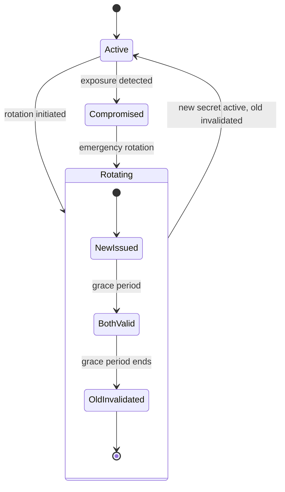
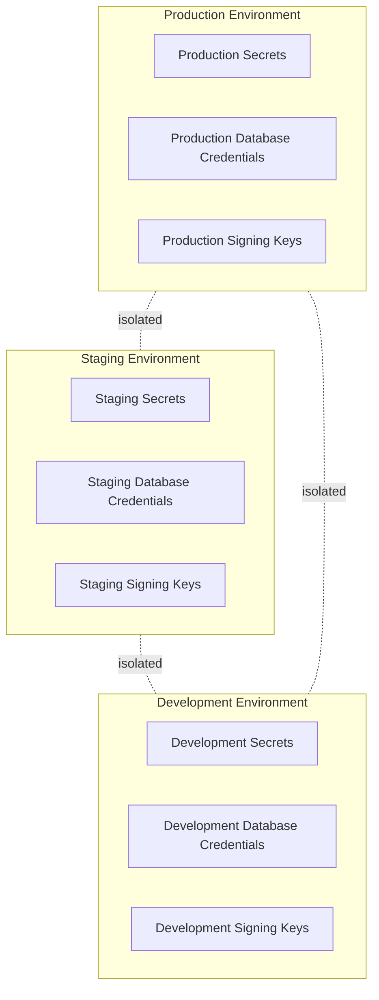
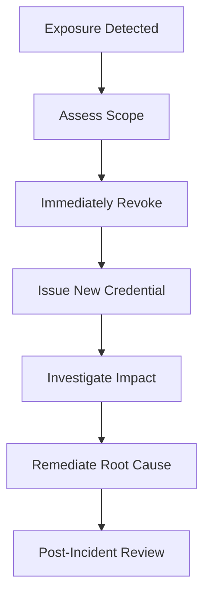
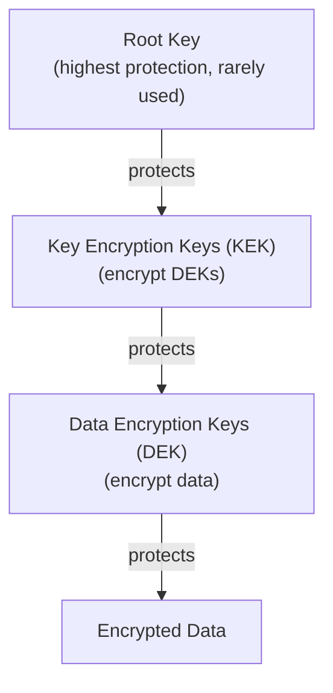

# Secrets and Key Management

## Metadata

| Field | Value |
|-------|-------|
| Title | Kairo Secrets and Key Management Architecture |
| Document ID | KAI-SEC-007 |
| Status | Draft |
| Version | 0.1 |
| Target Release | V1 |
| Owner | Secrets and Cryptographic Key Management Architect |
| Created | 2026-07-20 |
| Last Updated | 2026-07-20 |
| Reviewers | TODO |
| Related Documents | [Security Architecture](./Security-Architecture.md), [Data Protection](./Data-Protection.md), [Identity and Authentication](./Identity-and-Authentication.md), [Configuration Architecture](../../05-Platform-Core/Configuration-Architecture.md), [Threat Model](./Threat-Model.md), [API Security](./API-Security.md) |
| Dependencies | [Security Architecture](./Security-Architecture.md), [Configuration Architecture](../../05-Platform-Core/Configuration-Architecture.md) |

---

## Purpose

This document defines the architectural requirements for managing secrets, credentials, and cryptographic keys across the Kairo platform. It establishes how secrets are categorized, stored, retrieved, rotated, revoked, and audited.

Secrets are the keys to the kingdom. A leaked database credential exposes all tenant data. A stolen signing key allows forged tokens. A compromised API key grants unauthorized access. The architecture must make secret compromise difficult, detectable, and recoverable.

---

## Scope

This document covers:

- Secret categories and ownership for all credential types in the platform.
- Storage, retrieval, rotation, and revocation requirements.
- Environment separation and lifecycle management.
- Break-glass access and exposure response.
- Auditability and key hierarchy.

This document does not cover:

- Specific vault product selection (unless already approved in the Technology Stack).
- Encryption algorithm selection or key length specifications.
- Database schemas for secret storage.
- Operational procedures for rotation execution (documented in operational guides).

---

## Secret Categories

Every secret in the platform belongs to a defined category with specific handling rules.

| Category | Examples | Owner | Scope | Rotation |
|----------|---------|-------|-------|----------|
| Platform secrets | Database master credentials, message broker credentials, cache authentication | Platform operations | Environment-wide | Automated, scheduled |
| Environment secrets | Deployment tokens, infrastructure access keys, monitoring credentials | Platform operations | Single environment | Automated, scheduled |
| Provider credentials | Payment provider API keys, shipping carrier credentials, tax service tokens | Organization (stored by platform) | Per organization | Manual or provider-scheduled |
| Merchant credentials | Organization-level secret API keys | Organization administrator | Per organization | Manual by organization admin |
| API keys (secret) | Server-to-server integration keys | Organization administrator | Per organization, per key scope | Manual with grace period |
| Webhook signing secrets | Per-registration signing keys for outbound webhooks | Platform (per registration) | Per webhook registration | Rotatable on request |
| Encryption keys | Data encryption keys, field-level encryption keys | Platform | Per environment, per key purpose | Automated with envelope encryption |
| Signing keys | Token signing keys, webhook signature keys | Platform | Per environment | Automated, scheduled |
| Workload credentials | Service-to-service authentication tokens, background job identities | Platform | Per service, per environment | Automated, short-lived |

---

## Platform Secrets

Credentials that the platform uses to access its own infrastructure.

| Aspect | Rule |
|--------|------|
| Examples | Database connection credentials, Redis authentication, RabbitMQ credentials, secret store authentication |
| Owner | Platform operations team |
| Access | Platform services only. Never accessible to tenant code, API responses, or logs. |
| Storage | Dedicated secret store. Never in configuration files or environment variables at rest. |
| Rotation | Automated on a defined schedule. Old credentials remain valid during a brief transition window. |
| Exposure impact | Critical — grants access to all tenant data across all organizations. |

---

## Environment Secrets

Credentials specific to a deployment environment (development, staging, production).

| Aspect | Rule |
|--------|------|
| Examples | CI/CD deployment tokens, infrastructure provisioning credentials, monitoring API keys |
| Owner | Platform operations team |
| Access | CI/CD pipelines and operations tooling only |
| Storage | Environment-specific secret store or pipeline secret management |
| Rotation | Automated or on a defined schedule |
| Isolation | **Each environment has its own credentials. Credentials are never shared across environments.** |

---

## Provider Credentials

Credentials for third-party services that the platform connects to on behalf of tenants.

| Aspect | Rule |
|--------|------|
| Examples | Payment gateway API keys, shipping carrier account credentials, tax calculation service tokens, email delivery service keys |
| Owner | The organization that configured the integration (stored and protected by the platform) |
| Access | The platform's integration service only. Retrieved at runtime when the integration is invoked. |
| Storage | Encrypted in the platform's secret store, scoped to the owning organization |
| Rotation | Follows the external provider's rotation requirements. Platform supports rotation without downtime. |
| Isolation | Per-organization. One organization's provider credentials are never accessible to another organization. |

---

## Merchant Credentials

Secret API keys issued by the platform to organizations for server-to-server access.

| Aspect | Rule |
|--------|------|
| Examples | Organization's secret API keys for backend integration |
| Owner | Organization administrator |
| Access | The organization's backend systems. Never in client-side code. |
| Storage | Hashed in the platform database. The raw value is shown only at creation time. |
| Rotation | Manual by organization admin. Old key remains valid during a configurable grace period. |
| Revocation | Immediate on request. No grace period for compromised keys. |

---

## API Keys

Covered in detail in [Identity and Authentication](./Identity-and-Authentication.md) and [API Security](./API-Security.md). Key management aspects:

- **Secret keys** are stored hashed. The platform cannot retrieve the raw value after creation.
- **Publishable keys** are identifiers, not secrets. They do not require secret-level protection.
- No secret key is assumed safe for frontend exposure. **Only explicitly publishable keys may appear in client-side code.**

---

## Webhook Signing Secrets

Per-registration secrets used to sign outbound webhook payloads.

| Aspect | Rule |
|--------|------|
| Owner | Platform (generated per webhook registration) |
| Access | Platform webhook delivery service (for signing). Tenant (for verification, shared at registration time). |
| Storage | Encrypted in the platform's secret store, associated with the webhook registration |
| Rotation | Supported on request. New secret takes effect immediately. Old payloads in transit may still use the previous secret during a brief overlap. |
| Exposure | Shared with the tenant once at registration. If the tenant loses it, a new secret is generated (old one is invalidated). |

---

## Encryption Keys

Cryptographic keys used to encrypt data at rest.

| Aspect | Rule |
|--------|------|
| Types | Key Encryption Keys (KEK), Data Encryption Keys (DEK) |
| Owner | Platform |
| Access | Platform encryption service only. Never exposed through any API. |
| Storage | KEKs in the secret store. DEKs encrypted by KEKs and stored alongside the encrypted data (envelope encryption). |
| Rotation | KEK rotation re-wraps DEKs without re-encrypting all data. DEK rotation is per-entity or per-batch. |
| Key hierarchy | See Key Hierarchy section below. |

---

## Signing Keys

Keys used to sign tokens, webhooks, and other verifiable artifacts.

| Aspect | Rule |
|--------|------|
| Examples | JWT signing keys, webhook HMAC keys, artifact signing keys |
| Owner | Platform |
| Access | Platform identity service (for signing). Verification may use public keys. |
| Storage | Private keys in the secret store. Public keys published for verification where applicable. |
| Rotation | Automated on a defined schedule. Both old and new keys are valid during rotation window (key rollover). Token verification accepts signatures from the current and previous key. |

---

## Workload Credentials

Short-lived credentials used by platform services and background jobs.

| Aspect | Rule |
|--------|------|
| Examples | Service-to-service tokens, background job identity tokens |
| Owner | Platform |
| Access | The specific service or job that the credential was issued to |
| Storage | In-memory only. Never persisted to disk. |
| Lifetime | Short-lived (minutes to hours). Automatically refreshed. |
| Rotation | Automatic through credential refresh. No manual intervention. |
| Scope | Minimal. Each workload credential grants access only to what that specific workload requires. |

---

## Secret Ownership

| Owner | Secrets Owned | Responsibilities |
|-------|--------------|-----------------|
| Platform operations | Platform secrets, environment secrets, encryption keys, signing keys | Provisioning, rotation, access control, incident response |
| Platform (automated) | Workload credentials, webhook signing secrets | Automated issuance and refresh |
| Organization administrator | Merchant credentials (API keys), provider credentials (configured integrations) | Configuration, rotation initiation, revocation |
| Platform identity service | Token signing keys, session secrets | Automated management, key rollover |

---

## Storage Requirements

### Mandatory

- All secrets are stored in a dedicated secret management system.
- The secret store provides encryption at rest, access control, and audit logging.
- Secrets are never stored in:
  - Source code repositories
  - Configuration files (application settings, YAML, JSON)
  - Environment variables at rest (they may be injected at runtime)
  - Frontend application bundles
  - Log files
  - Database tables accessible to application queries (credential storage uses dedicated, access-controlled structures)

### Secret Store Capabilities

| Capability | Requirement |
|-----------|-------------|
| Encryption at rest | Mandatory |
| Access control | Per-secret or per-path granularity |
| Audit logging | Every read, write, and deletion is logged |
| Versioning | Previous versions retained for rollback during rotation |
| Automatic expiration | Secrets can have TTLs. Expired secrets are inaccessible. |
| High availability | Secret store failure must not prevent platform operation (caching layer for runtime access) |

---

## Retrieval Requirements

- Secrets are retrieved at runtime by the service that needs them.
- Retrieval is authenticated. Only authorized services can access specific secrets.
- Retrieved secrets are held in memory for the duration of use. They are not written to disk.
- Retrieval is audited. Every access is logged with the requesting service identity and timestamp.
- Caching of retrieved secrets is permitted for operational efficiency but must respect TTL and invalidation signals.
- Secrets are never returned through business APIs. No endpoint exposes secret values.

---

## Rotation

Secret rotation is a normal operation, not an emergency procedure.

### Rotation Rules

- Every secret type supports rotation without downtime.
- During rotation, both old and new credentials are valid for a defined grace period.
- Grace period duration depends on secret type (signing keys: hours/days for token expiration; API keys: configurable by admin; platform secrets: minutes).
- Rotation is automated where possible. Manual rotation is available as a fallback.
- Rotation is audited. The rotation event, initiator, and timestamp are recorded.
- Post-rotation verification confirms the new credential works before the old one is invalidated.

### Rotation Schedule

| Secret Type | Rotation Frequency | Automation |
|------------|-------------------|-----------|
| Signing keys | Scheduled (weeks to months) | Automated |
| Platform secrets | Scheduled (weeks) | Automated |
| Encryption KEKs | Scheduled (months) | Automated |
| Workload credentials | Continuous (minutes to hours) | Automated |
| API keys (merchant) | On demand by organization admin | Manual |
| Provider credentials | Per provider requirements | Manual (platform supports it) |
| Webhook signing secrets | On demand | Manual |

---

## Revocation

Revocation immediately invalidates a credential. Unlike rotation, there is no grace period.

### Revocation Triggers

- Suspected or confirmed compromise.
- Employee departure (for credentials they had access to).
- Integration decommissioning.
- Organization request.
- Anomalous usage detected.

### Revocation Rules

- Revocation takes effect immediately. The revoked credential is rejected on the next use.
- Revocation is irreversible. A revoked credential cannot be reinstated. A new credential must be issued.
- Revocation is audited with the reason, the revoking actor, and the timestamp.
- Dependent systems are notified of revocation where possible (e.g., token revocation propagated to gateway cache).

---

## Expiration

- Secrets that are not rotated or revoked must have a defined maximum lifetime.
- Expired secrets are automatically inaccessible. No manual intervention is needed.
- Expiration warnings are issued before the secret expires (notification to the owner).
- Expiration does not require the secret to be deleted — it becomes inaccessible until renewed or replaced.

| Secret Type | Expiration Model |
|------------|-----------------|
| Access tokens | Short-lived (minutes). Expire automatically. |
| Refresh tokens | Medium-lived (hours to days). Expire automatically. |
| Workload credentials | Short-lived (minutes to hours). Refreshed automatically. |
| API keys | No automatic expiration (rotatable and revocable). Future: configurable expiration. |
| Signing keys | No expiration (rotated on schedule). |
| Encryption keys | No expiration (rotated on schedule, old keys retained for decryption). |

---

## Environment Separation

**Credentials are never shared across environments.**

### Environment Isolation Rules

- Each environment has its own secret store (or isolated namespace within a shared store).
- Production credentials never exist in non-production environments.
- Non-production credentials cannot access production systems.
- CI/CD pipelines use environment-specific credentials scoped to the target environment.
- Developers do not have access to production secrets for local development. Local development uses dedicated development credentials.

---

## Test and Live Credential Separation

As defined in [Identity and Authentication](./Identity-and-Authentication.md):

- Test (sandbox) and live (production) credentials are completely separate.
- Test credentials access only test data. They cannot interact with live systems.
- Live credentials cannot be used in test environments.
- The naming convention makes test and live credentials visually distinguishable.
- Test credential compromise has no impact on production security.

---

## Break-Glass Access

Emergency access to secrets when normal access paths are unavailable.

### When Break-Glass Is Used

- Secret store is unavailable and platform operation requires credential access.
- Normal rotation paths are broken and an emergency rotation is needed.
- Incident response requires direct access to credentials outside normal tooling.

### Break-Glass Rules

- Break-glass access is never the first option. It is used only when normal paths have failed.
- Break-glass access is logged with highest priority alerting. The security team is notified immediately.
- Break-glass credentials are themselves rotated after use.
- Break-glass access requires multi-person authorization where feasible (two-person integrity).
- The scope of break-glass access is minimal — access only what is needed for the specific emergency.
- Post-incident review evaluates whether break-glass was justified and whether the normal path should be improved.

---

## Secret Exposure Response

When a secret is suspected or confirmed to be compromised:

### Response Steps

1. **Detect** — Exposure is identified (monitoring alert, report, discovery in logs or code).
2. **Assess** — Determine what type of secret, what scope of access it grants, and what data may be affected.
3. **Revoke** — Immediately revoke the compromised credential. No grace period.
4. **Rotate** — Issue a new credential. Update all systems that use it.
5. **Investigate** — Determine whether the secret was used maliciously. Review access logs.
6. **Remediate** — Fix the root cause of the exposure (code commit, log leak, misconfiguration).
7. **Review** — Post-incident review to prevent recurrence.

### Exposure Indicators

| Indicator | Source |
|-----------|--------|
| Secret found in source code | Code scanning tools |
| Secret found in logs | Log analysis |
| Unusual API key usage pattern | Usage monitoring |
| Secret found in public repository | External scanning services |
| Report from employee or external party | Reporting channels |

---

## Auditability

### Audited Events

| Event | Recorded Data |
|-------|--------------|
| Secret creation | Creator identity, secret type, scope, timestamp |
| Secret retrieval | Requesting service, secret identifier (not value), timestamp |
| Secret rotation | Initiator, secret identifier, rotation reason, timestamp |
| Secret revocation | Revoking actor, secret identifier, reason, timestamp |
| Break-glass access | Actor(s), justification, scope, timestamp |
| Failed access attempt | Requesting identity, secret identifier, failure reason, timestamp |

### Audit Rules

- **Secret values are never logged.** Audit records reference secrets by identifier, never by value.
- All secret access is audited, including automated (service) access.
- Failed access attempts are audited and alerted — they may indicate an attack.
- Audit records for secret access are retained for the compliance period.
- Audit records are tamper-evident. They cannot be modified or deleted by the actors they record.

---

## Key Hierarchy

The platform uses an envelope encryption pattern with a defined key hierarchy.

### Hierarchy Rules

| Level | Key | Purpose | Storage | Rotation Impact |
|-------|-----|---------|---------|----------------|
| Root | Root key | Protects the key hierarchy itself | Hardware-backed or highest-security storage | Requires re-wrapping all KEKs |
| KEK | Key Encryption Keys | Encrypt/decrypt DEKs | Secret store, encrypted by root key | Requires re-wrapping affected DEKs (not re-encrypting data) |
| DEK | Data Encryption Keys | Encrypt/decrypt actual data | Stored encrypted (by KEK) alongside or near the data | New DEK for new data. Old DEKs retained for decryption of existing data. |

### Benefits of Key Hierarchy

- Rotating a KEK does not require re-encrypting all data — only re-wrapping the DEKs.
- Compromising a DEK exposes only the data encrypted by that specific key, not all data.
- The root key is used infrequently, reducing exposure risk.
- Key hierarchy supports future per-tenant key isolation (tenant-specific KEKs).

---

## Future Hardware-Backed Key Management

### V1 Approach

- V1 uses software-based secret storage with strong access controls and encryption.
- Key material is protected by the secret store's encryption and access control mechanisms.

### Future Direction

- Hardware Security Modules (HSMs) for root key protection and critical signing operations.
- Cloud-provider key management services for KEK management with hardware backing.
- Hardware-backed attestation for workload identity.
- FIPS 140-2/3 validated key management for compliance-sensitive deployments.

These are not V1 requirements. The architecture supports future adoption without restructuring.

---

## Explicit Prohibitions

The following practices are architecturally prohibited:

| Prohibition | Rationale |
|------------|-----------|
| **Secrets committed to Git** | Source control is not a secret store. History is permanent. Exposure is immediate and irreversible. |
| **Secrets stored in frontend bundles** | Client-side code is fully visible to users. No obfuscation provides real protection. |
| **Secrets written to logs** | Logs are widely accessible, retained, and often exported. Secret exposure in logs is a high-probability breach vector. |
| **Shared credentials across environments** | Environment isolation prevents a non-production compromise from affecting production. Shared credentials eliminate this protection. |
| **Permanent broad cloud credentials in CI/CD** | CI/CD pipelines should use short-lived, minimally-scoped credentials. Permanent broad credentials make pipeline compromise catastrophic. |
| **Untracked manual secret distribution** | Secrets sent via email, chat, or documents are unaudited, unrevocable, and uncontrolled. All secret distribution must go through the secret management system. |

---

## V1 Baseline

| Capability | V1 Status |
|-----------|-----------|
| Dedicated secret store for all credential types | Required |
| No secrets in source code (enforced by scanning) | Required |
| No secrets in logs (enforced by redaction framework) | Required |
| Environment-separated credentials | Required |
| Test/live credential separation | Required |
| Secret retrieval audit logging | Required |
| API key hashing (raw value not retrievable) | Required |
| Signing key rotation support | Required |
| Platform secret rotation (automated) | Required |
| Workload credentials (short-lived, auto-refreshed) | Required |
| Provider credential encryption at rest | Required |
| Webhook signing secret management | Required |
| Envelope encryption for data at rest | Required |
| Secret revocation (immediate, audited) | Required |
| Break-glass access procedure (documented, audited) | Required |
| Secret exposure response procedure (documented) | Required |

## Future Capabilities

| Capability | Target Version | Description |
|-----------|---------------|-------------|
| HSM-backed root keys | V2+ | Hardware protection for the key hierarchy root |
| Automated provider credential rotation | V2+ | Platform-initiated rotation for external provider credentials |
| Per-tenant encryption keys | V3+ | Cryptographic tenant isolation through tenant-specific KEKs |
| Secret expiration enforcement | V2+ | Configurable maximum lifetimes for all secret types |
| CI/CD credential vending | V2+ | Short-lived, per-run credentials for pipeline execution |
| Key ceremony procedures | V3+ | Formal multi-person procedures for root key operations |
| FIPS-validated key management | Future | Compliance-certified cryptographic operations |
| Secret scanning in pre-commit hooks | V2+ | Prevent secrets from entering the repository at all |

---

## Version Gate

| Version | Secrets and Key Management Gate |
|---------|-------------------------------|
| V1 | All V1 baseline capabilities are operational. Secret store is deployed and all credentials are migrated. No secrets in code or logs (verified by scanning). Rotation works for signing and platform secrets. Audit covers all access. |
| V2 | HSM-backed root keys are evaluated. Automated rotation covers provider credentials. Secret expiration is enforced. CI/CD uses short-lived credentials. Pre-commit secret scanning is active. |
| V3 | Per-tenant encryption keys are available. Key ceremony procedures are defined for root operations. FIPS validation is evaluated for compliance-sensitive deployments. |

---

## Decision Summary

| Decision | Rationale |
|----------|-----------|
| Dedicated secret store (not config files or env vars) | Secrets require access control, audit, and encryption that configuration systems do not provide. |
| Envelope encryption with key hierarchy | Enables key rotation without data re-encryption. Limits blast radius of key compromise. |
| No secrets in source control | Source history is permanent and widely accessible. A committed secret is permanently compromised. |
| Environment isolation for all credentials | Non-production compromise must not affect production. Shared credentials eliminate this guarantee. |
| Short-lived workload credentials | Long-lived service credentials are high-value targets. Short-lived credentials limit the window of compromise. |
| Rotation as normal operation | Treating rotation as emergency-only means it is never practiced. Normal rotation ensures the process works when urgently needed. |
| Immediate revocation without grace | Compromised credentials must be invalidated instantly. A grace period during compromise extends the attack window. |

---

## Architecture Impact

| Concern | Impact |
|---------|--------|
| Platform startup | Services must authenticate to the secret store before they can access any other resource. Secret store is the first dependency. |
| Module design | Modules retrieve credentials through the platform's secret interface. They never store, cache persistently, or log credentials. |
| Configuration | Secrets are separate from configuration. The configuration system does not store secret values. [Configuration Architecture](../../05-Platform-Core/Configuration-Architecture.md) defines this boundary. |
| CI/CD | Pipelines use scoped, short-lived credentials. Pipeline definitions never contain secret values. Secret injection happens at runtime. |
| Testing | Tests use test credentials in isolated test environments. Integration tests validate that secrets are not leaked in responses or logs. |
| Monitoring | Secret access patterns are monitored. Anomalous retrieval patterns trigger alerts. |

---

## Implementation Impact

| Area | Impact |
|------|--------|
| Modules | Must use platform secret interface for all credential access. Must never hardcode, log, or serialize credential values. |
| APIs | Must never return secret values in responses (except at creation time for API keys, shown once). |
| Logging | Must use the redaction framework. Must never construct log messages containing secret values. |
| CI/CD | Must use pipeline secret management. Must not store secrets in pipeline definitions or artifact outputs. |
| Infrastructure | Must provision and maintain the secret store. Must implement rotation automation. Must monitor secret access. |
| Operations | Must execute rotation schedules. Must respond to exposure incidents. Must conduct break-glass reviews. |

---

## Security Responsibilities

| Role | Secrets Management Responsibilities |
|------|-------------------------------------|
| Secrets Architect | Defines key management architecture. Reviews secret handling patterns. Maintains key hierarchy. |
| Platform Operations | Provisions secret store. Executes automated rotation. Responds to exposure incidents. Manages break-glass. |
| Platform Team | Implements secret retrieval interface, rotation support, and revocation mechanisms. |
| Product Teams | Use platform secret interface. Never implement custom credential storage. Report potential exposure. |
| Organization Administrators | Manage their organization's API keys and provider credentials through platform interfaces. |

---

## Out of Scope

This document does not define:

- Specific vault product or cloud service selection — follows approved Technology Stack or documented in infrastructure decisions (dependency identified).
- Specific encryption algorithms or key bit lengths — documented in implementation specifications.
- Operational runbooks for rotation execution — documented in operations guides.
- Incident response procedures for data breaches — documented in security operations.
- Deployment and infrastructure architecture — dependency identified for future phases.

---

## Future Considerations

- **Secrets-as-a-service for tenants** — Allow tenants to store their own application secrets within the platform's secret management system.
- **Secret dependency mapping** — Automated tracking of which services use which secrets, enabling impact assessment for rotation and revocation.
- **Quantum-resistant cryptography** — Evaluate post-quantum algorithms for long-lived encryption keys as standards mature.
- **Secret sprawl detection** — Automated discovery of secrets that exist outside the managed secret store.
- **Credential vending machine** — Just-in-time, minimally-scoped credentials issued for specific operations and automatically revoked after use.

---

## Future Refactoring Triggers

This document should be revisited when:

- A specific vault or key management service is selected (Infrastructure phase dependency).
- Deployment architecture is formally defined (secret distribution in multi-node deployments).
- Multi-region deployment is introduced (regional key management, cross-region key availability).
- PCI compliance is pursued (specific key management requirements).
- Per-tenant encryption is implemented (tenant key lifecycle management).
- A secret exposure incident occurs (validate architecture effectiveness).

---

## Change History

| Version | Date | Author | Description |
|---------|------|--------|-------------|
| 0.1 | 2026-07-20 | Secrets and Cryptographic Key Management Architect | Initial draft |
