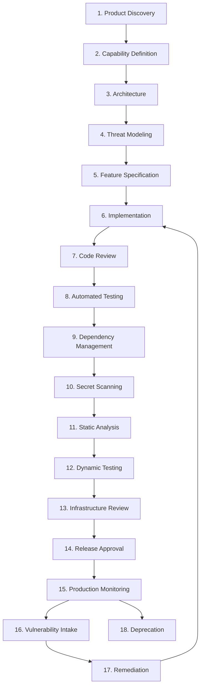

# Secure Development Lifecycle

## Metadata

| Field | Value |
|-------|-------|
| Title | Kairo Secure Development Lifecycle |
| Document ID | KAI-SEC-009 |
| Status | Draft |
| Version | 0.1 |
| Target Release | V1 |
| Owner | Product Security and Secure SDLC Architect |
| Created | 2026-07-20 |
| Last Updated | 2026-07-20 |
| Reviewers | TODO |
| Related Documents | [Security Architecture](./Security-Architecture.md), [Threat Model](./Threat-Model.md), [API Security](./API-Security.md), [Authorization Architecture](./Authorization-Architecture.md), [Audit and Security Monitoring](./Audit-and-Security-Monitoring.md), [Document Lifecycle](../../00-Governance/Document-Lifecycle.md), [Module Lifecycle](../Module-Lifecycle.md) |
| Dependencies | [Security Architecture](./Security-Architecture.md), [Threat Model](./Threat-Model.md) |

---

## Purpose

This document defines the secure development lifecycle (SDL) for the Kairo platform. It establishes the security activities required at every stage of development — from initial product discovery through architecture, implementation, testing, release, and production monitoring.

Security is not a final gate before release. It is integrated throughout the development process. Every stage produces security artifacts or validates security properties. Issues found earlier are cheaper and safer to fix than issues found in production.

---

## Scope

This document covers:

- Security activities at every lifecycle stage.
- Security gates for high-risk changes.
- Security testing categories and requirements.
- Per-task security checklist for API implementations.
- AI coding agent security constraints.

This document does not cover:

- Specific CI/CD tooling or commands — documented in future Development Standards (dependency identified).
- Specific testing framework configuration — documented in testing guides.
- Incident response procedures — documented in operational guides.
- Compliance audit procedures — documented in compliance documentation.

---

## Secure Development Lifecycle Stages

---

### 1. Product Discovery

Security considerations begin when a new capability or product is being explored.

| Activity | Output |
|----------|--------|
| Identify sensitive data the feature will handle | Data classification assessment |
| Identify trust boundaries the feature crosses | Trust boundary impact statement |
| Identify regulatory implications | Compliance impact note |
| Evaluate whether the feature introduces new attack surface | Attack surface assessment |

---

### 2. Capability Definition

When a capability is formally defined and added to the capability map.

| Activity | Output |
|----------|--------|
| Define data sensitivity of the capability's entities | Data classification per entity |
| Define authorization requirements (who can access what) | Permission model direction |
| Identify multi-tenancy implications | Tenant isolation requirements |
| Identify integration points with external systems | Integration security requirements |

---

### 3. Architecture

When the module or feature is architecturally designed.

| Activity | Output |
|----------|--------|
| Define authentication model for new API surfaces | Authentication requirements in architecture document |
| Define authorization model and permissions | Permission definitions in module specification |
| Define data protection requirements per field | Data classification in module specification |
| Define event and audit requirements | Audit event definitions |
| Review against security architecture principles | Architecture review confirmation |

---

### 4. Threat Modeling

Every new module and significant feature change receives threat modeling.

| Activity | Output |
|----------|--------|
| Identify assets at risk | Asset inventory for the feature |
| Identify threat actors relevant to the feature | Threat actor assessment |
| Map attack vectors | Attack vector analysis |
| Identify required controls | Control requirements |
| Update platform threat model if new threat categories emerge | Threat model update |

---

### 5. Feature Specification

When a feature is specified in enough detail for implementation.

| Activity | Output |
|----------|--------|
| Define validation rules for all inputs | Validation specification |
| Define error handling (what is safe to reveal) | Error response specification |
| Define rate limiting requirements | Rate limit specification |
| Define idempotency requirements for state-changing operations | Idempotency specification |
| Define audit events for the feature | Audit event list |
| Specify security test cases | Security test requirements |

---

### 6. Implementation

During coding.

| Activity | Output |
|----------|--------|
| Use platform authentication — never custom | Authenticated endpoint |
| Use platform authorization — never custom role checks | Authorized endpoint |
| Validate all inputs server-side | Validated handlers |
| Use parameterized queries exclusively | Injection-safe data access |
| Use platform logging with redaction — never log secrets | Safe log statements |
| Implement idempotency where specified | Idempotent operations |
| Emit audit events for defined actions | Audit coverage |
| Handle errors without exposing internals | Safe error responses |

---

### 7. Code Review

Every change receives security-aware code review.

| Activity | Reviewer Checks |
|----------|----------------|
| Authentication is enforced on new endpoints | Present and correct |
| Authorization checks use permissions, not role names | Correct pattern |
| Input validation covers all fields | Complete |
| No secrets, tokens, or credentials in code | Absent |
| No sensitive data in log statements | Absent |
| Tenant scoping is applied to all queries | Present |
| Error responses do not leak internal details | Safe |
| Idempotency is implemented where required | Present |
| Audit events are emitted for specified actions | Complete |
| Dependencies are justified and scanned | Reviewed |

---

### 8. Automated Testing

Security properties are validated through automated tests in the CI/CD pipeline.

| Activity | Verification |
|----------|-------------|
| Authorization tests verify deny-by-default | Every endpoint tested for unauthorized access |
| Tenant isolation tests verify cross-tenant denial | Cross-tenant requests return 404/403 |
| Input validation tests verify rejection of invalid input | Malformed, oversized, and malicious inputs rejected |
| Idempotency tests verify duplicate safety | Duplicate requests produce same result |
| Rate limit tests verify throttling | Excess requests return 429 |
| Audit tests verify event emission | Expected audit events are recorded |

---

### 9. Dependency Management

Third-party dependencies are managed as a security surface.

| Activity | Requirement |
|----------|-------------|
| Dependency vulnerability scanning | Runs on every build. Blocks on critical/high vulnerabilities. |
| License compliance check | Ensures dependencies use approved licenses. |
| Lockfile enforcement | Prevents unintended dependency changes. |
| Dependency update cadence | Regular updates on a defined schedule. Security patches applied promptly. |
| New dependency approval | New dependencies require justification and security review. |

---

### 10. Secret Scanning

Prevent secrets from entering the codebase.

| Activity | Requirement |
|----------|-------------|
| Pre-commit scanning | Block commits containing patterns matching secrets. |
| CI pipeline scanning | Scan every push for secret patterns. Block if found. |
| Historical scanning | Periodic full-history scan for secrets that predate scanning. |
| Remediation | Found secrets are revoked immediately. Commits are cleaned from branches. |

---

### 11. Static Analysis (SAST)

Automated analysis of source code for security vulnerabilities.

| Activity | Requirement |
|----------|-------------|
| SAST in CI pipeline | Runs on every pull request. |
| Rule set | Covers OWASP Top 10 patterns, injection, authentication bypass, sensitive data exposure. |
| Failure threshold | Critical findings block merge. High findings require acknowledgment. |
| False positive management | Suppressed findings are documented with justification. |

---

### 12. Dynamic Testing (DAST)

Automated testing of running application for vulnerabilities.

| Activity | Requirement |
|----------|-------------|
| DAST against staging environment | Runs before release. |
| Coverage | Crawls API surface. Tests for injection, authentication bypass, misconfiguration. |
| Authenticated scanning | Tests with different credential levels to verify authorization enforcement. |
| Findings | Critical findings block release. High findings require remediation plan. |

---

### 13. Infrastructure Review

Infrastructure changes receive security review.

| Activity | Requirement |
|----------|-------------|
| Network exposure review | No unintended public exposure. |
| Secret management validation | Secrets are in the secret store, not in configuration. |
| Access control review | Principle of least privilege for infrastructure access. |
| Encryption validation | All transport and storage encryption is in place. |
| Container image scanning | Base images scanned for vulnerabilities. |

---

### 14. Release Approval

Before production deployment.

| Activity | Requirement |
|----------|-------------|
| All automated security tests pass | Gate |
| No unresolved critical security findings | Gate |
| Threat model reviewed for new attack surface | Confirmed |
| Audit events verified for new features | Confirmed |
| Dependency scan clean | Gate |
| Secret scan clean | Gate |
| SAST clean (critical) | Gate |
| DAST findings addressed | Confirmed |
| Rollback plan documented | Present |

---

### 15. Production Monitoring

After deployment.

| Activity | Requirement |
|----------|-------------|
| Security event monitoring active | Continuous |
| Audit events flowing for new features | Verified |
| Alerting covers new attack surface | Configured |
| Performance within expected bounds (abuse indicator) | Monitored |
| No unexpected errors from security controls | Monitored |

---

### 16. Vulnerability Intake

Receiving vulnerability reports from any source.

| Activity | Requirement |
|----------|-------------|
| Intake channels defined (internal discovery, external reports, scanning tools) | Documented |
| Severity assessment against platform threat model | Timely |
| Acknowledge receipt to reporter | Defined timeline |
| Triage and prioritize | Based on severity and exploitability |

---

### 17. Remediation

Fixing identified vulnerabilities.

| Activity | Requirement |
|----------|-------------|
| Critical vulnerabilities | Remediated within defined SLA (hours to days) |
| High vulnerabilities | Remediated within defined SLA (days to weeks) |
| Medium vulnerabilities | Scheduled for next release |
| Low vulnerabilities | Tracked and addressed when feasible |
| Verification | Fix is confirmed through testing. Regression test added. |

---

### 18. Deprecation

When a feature or module is retired.

| Activity | Requirement |
|----------|-------------|
| Revoke credentials and access associated with deprecated feature | Complete |
| Remove attack surface (endpoints, integrations) | Complete |
| Audit that the deprecated surface is unreachable | Verified |
| Update threat model to remove deprecated surfaces | Complete |

---

## Security Gates

High-risk changes require additional security review beyond the standard code review.

| Change Type | Security Gate |
|------------|--------------|
| New modules | Threat model required. Architecture security review required. |
| New API surfaces | Authentication, authorization, validation, and rate limiting specified and reviewed. |
| Payment changes | Elevated review. Idempotency verified. Financial threat assessment. PCI scope evaluation. |
| Authentication changes | Security architect review mandatory. Threat model update. |
| Authorization changes | Security architect review. Permission model impact assessment. |
| File upload capabilities | Malware scanning requirement. Storage isolation. Size and type validation. |
| Third-party integrations | Credential management review. SSRF prevention. Data exposure assessment. |
| Data exports | Access control review. Rate limiting. Audit logging. Personal data filtering. |
| Cross-tenant queries | **Prohibited by default.** Any cross-tenant data access requires security architect approval with ADR. |
| Infrastructure changes | Network exposure review. Secret management validation. Access control audit. |

### Gate Rules

- Security gates are mandatory. They cannot be bypassed under time pressure.
- Gate outcomes are documented. Approval, conditional approval, or rejection with reasons.
- Conditional approvals include specific remediation requirements and timelines.
- **AI coding agents are explicitly prohibited from bypassing security gates.** An AI agent must not implement changes that require a security gate without that gate being satisfied. If a gate is required, the agent must flag the requirement and halt until the gate is addressed.

---

## Security Testing Categories

### Unit Security Tests

Tests that verify security properties of individual components in isolation.

| Focus | Examples |
|-------|---------|
| Input validation | Malformed input rejected, boundary values handled, type coercion prevented |
| Business rule enforcement | Negative quantities rejected, price floors enforced, state transitions validated |
| Output filtering | Internal fields excluded from DTOs, sensitive fields masked |
| Error handling | Exceptions do not leak internal details, error codes are appropriate |

### Authorization Tests

Tests that verify the permission model.

| Focus | Examples |
|-------|---------|
| Deny by default | Requests without permissions are rejected |
| Permission enforcement | Each endpoint rejects requests lacking the required permission |
| Scope boundaries | Store-scoped users cannot access other stores |
| Elevation prevention | Non-admin users cannot perform admin operations |

### Tenant Isolation Tests

Tests that verify cross-tenant data cannot be accessed.

| Focus | Examples |
|-------|---------|
| Query scoping | Requests in tenant A never return tenant B's data |
| ID-based access | Providing a resource ID from another tenant returns 404 |
| Cache isolation | Cached data from tenant A is never served to tenant B |
| Event isolation | Events from tenant A are never delivered to tenant B's subscribers |

### Contract Tests

Tests that verify module contracts remain compatible.

| Focus | Examples |
|-------|---------|
| Response structure | API responses match documented contracts |
| Error format | Error responses use the standard format |
| Event schema | Published events match documented schemas |
| Backward compatibility | Old clients continue to work with new versions |

### Dependency Scanning

Automated identification of known vulnerabilities in third-party libraries.

| Focus | Requirement |
|-------|-------------|
| Frequency | Every build |
| Blocking threshold | Critical and high vulnerabilities block the build |
| Update cadence | Dependencies updated on a defined schedule |
| New dependency review | Security assessment before adoption |

### Secret Scanning

Automated detection of credentials in source code and configuration.

| Focus | Requirement |
|-------|-------------|
| Pre-commit | Block commits containing secret patterns |
| CI pipeline | Scan every push |
| Coverage | API keys, tokens, passwords, private keys, connection strings |
| Response | Immediate revocation of exposed credentials |

### SAST (Static Application Security Testing)

Source code analysis for vulnerability patterns.

| Focus | Requirement |
|-------|-------------|
| Coverage | Injection, authentication bypass, sensitive data handling, cryptographic misuse |
| Integration | Runs on every pull request |
| Threshold | Critical blocks merge |
| Maintenance | Rule set updated with emerging patterns |

### DAST (Dynamic Application Security Testing)

Runtime testing of the deployed application.

| Focus | Requirement |
|-------|-------------|
| Coverage | API surface crawling, authenticated and unauthenticated paths |
| Integration | Runs against staging before release |
| Threshold | Critical blocks release |
| Scope | Tests injection, misconfig, auth bypass on live endpoints |

### Load and Abuse Testing

Testing the system under stress and adversarial usage patterns.

| Focus | Requirement |
|-------|-------------|
| Rate limit effectiveness | Limits engage at defined thresholds |
| Resource exhaustion | System degrades gracefully, does not crash |
| Abuse scenarios | Cart flooding, reservation exhaustion, checkout replay |
| Recovery | System recovers automatically after abuse stops |

### Penetration Testing

Manual expert testing that automated tools cannot replicate.

| Focus | Requirement |
|-------|-------------|
| Frequency | Before major releases. Annually at minimum. |
| Scope | Full API surface, authentication, authorization, business logic |
| Findings | Mapped to threat model. Remediated by severity SLA. |
| Retest | Remediation verified through retest |

### Recovery Testing

Testing the system's ability to recover from security incidents.

| Focus | Requirement |
|-------|-------------|
| Credential rotation | System recovers after credential rotation |
| Key revocation | Tokens and keys can be revoked without downtime |
| Data restoration | Backups can be restored with integrity |
| Rollback | Application can be rolled back to previous version |

---

## API Implementation Security Checklist

**Every implementation task involving an API must consider the following. No exceptions.**

| Concern | Requirement |
|---------|-------------|
| **Authentication** | Endpoint requires valid authentication. Authentication type is specified (token, API key, service credential). |
| **Tenant resolution** | Tenant context is derived from authenticated credentials. Never from client-supplied identifiers. |
| **Authorization** | Required permission is declared. Permission is evaluated in the pipeline before handler executes. |
| **Validation** | All inputs validated server-side. Types, ranges, formats, and business rules enforced. |
| **Rate limits** | Endpoint is covered by appropriate rate limiting (per tenant, per key, per endpoint). |
| **Idempotency** | State-changing operations that are financial or order-related implement idempotency. |
| **Audit events** | Significant actions emit audit events with actor, action, resource, and outcome. |
| **Error handling** | Errors return standard format. No internal details, stack traces, or system information exposed. |
| **Security tests** | Authorization test, tenant isolation test, validation test, and error response test are written. |

This checklist is not optional. It applies to every API endpoint created or modified, regardless of perceived risk level.

---

## AI Coding Agent Constraints

AI coding agents operating on the Kairo codebase must:

- **Never bypass security gates.** If a change requires a security gate (new API surface, authentication change, payment change), the agent must flag the requirement and halt.
- **Never implement custom authentication or authorization.** Use the platform's authentication and authorization framework exclusively.
- **Never log sensitive data.** Use the platform logging framework with redaction.
- **Never hardcode secrets.** Use the platform's secret management interface.
- **Never skip security tests.** Every endpoint implementation includes authorization, isolation, and validation tests.
- **Never trust client-provided tenant identifiers.** Tenant context comes from authenticated credentials only.
- **Never suppress or bypass automated security scanning.** If a scan blocks, the issue must be fixed, not the scan disabled.
- **Always apply the API implementation security checklist.** Every API endpoint addresses all nine concerns.
- **Report potential security concerns.** If an agent identifies a pattern that may be a security issue, it must flag it for human review rather than proceeding.

---

## V1 Baseline

| Capability | V1 Status |
|-----------|-----------|
| Threat modeling for all modules before implementation | Required |
| Security-aware code review for all changes | Required |
| Authorization testing for every endpoint | Required |
| Tenant isolation testing for every data-accessing endpoint | Required |
| Input validation testing | Required |
| Dependency vulnerability scanning (blocking on critical/high) | Required |
| Secret scanning (pre-commit and CI) | Required |
| SAST in CI pipeline (blocking on critical) | Required |
| API implementation security checklist applied to every endpoint | Required |
| Security gates for high-risk changes | Required |
| Audit event coverage for all defined categories | Required |
| Release approval gate (all security tests pass) | Required |
| Production security monitoring | Required |
| Vulnerability intake and remediation process | Required |
| AI agent security constraints enforced | Required |

## Future Capabilities

| Capability | Target Version | Description |
|-----------|---------------|-------------|
| DAST in CI pipeline | V2+ | Automated dynamic testing integrated into the release pipeline |
| Penetration testing program | V2+ | Regular third-party penetration testing with defined cadence |
| Bug bounty program | V3+ | External researcher engagement for vulnerability discovery |
| Automated remediation tracking | V2+ | Vulnerability-to-fix tracking with SLA enforcement |
| Security training requirements | V2+ | Defined security training for all contributors |
| Security champion program | V3+ | Designated security champions within product teams |
| Compliance evidence automation | V3+ | Automated collection of SDL evidence for audit |
| Threat model automation | Future | Tooling to maintain and validate threat models against implementation |

---

## Version Gate

| Version | Secure Development Lifecycle Gate |
|---------|----------------------------------|
| V1 | Threat modeling, code review, authorization tests, tenant isolation tests, dependency scanning, secret scanning, SAST, release approval gate, and production monitoring are all operational. API security checklist is enforced. AI agent constraints are active. |
| V2 | DAST is integrated. Penetration testing is conducted. Vulnerability SLAs are defined and tracked. Security gates are proven through multiple releases. Remediation tracking is automated. |
| V3 | Bug bounty is active. Security champions are designated. Compliance evidence collection is automated. Threat model maintenance is tooling-assisted. Full SDL maturity is assessed and documented. |

---

## Decision Summary

| Decision | Rationale |
|----------|-----------|
| Security before implementation | Discovering security requirements during implementation creates rework. Discovering them in production creates incidents. |
| Threat modeling for all modules | Modules without threat models have unknown risk. Unknown risk is unmanaged risk. |
| Automated security testing blocks builds | Manual security review does not scale. Automated enforcement ensures consistent application. |
| API checklist is mandatory for every endpoint | The most common vulnerabilities (missing auth, missing validation, missing audit) are preventable through consistent checklist application. |
| High-risk changes get stronger gates | Not all changes carry equal risk. Payment and authentication changes have disproportionate impact and require disproportionate review. |
| AI agents cannot bypass gates | AI agents execute at speed. Without explicit constraints, they may optimize for velocity over security. Constraints ensure security is maintained regardless of who (or what) writes the code. |
| Cross-tenant queries are prohibited by default | Any cross-tenant data access is architecturally dangerous. Requiring explicit approval with an ADR ensures it is never accidental. |

---

## Architecture Impact

| Concern | Impact |
|---------|--------|
| Module design | Every module is threat-modeled before implementation. Permissions, audit events, and validation rules are defined in the module specification. |
| API design | Every endpoint is designed with the security checklist. Authentication, authorization, validation, rate limits, idempotency, audit, and error handling are addressed in the API specification. |
| CI/CD pipeline | Security tools (dependency scanning, secret scanning, SAST, authorization tests, isolation tests) run on every change. Critical findings block progression. |
| Testing | Security tests are not separate from functional tests. They run in the same pipeline with the same blocking authority. |
| Release process | Release approval requires all security gates to pass. No exceptions. |
| Production | Security monitoring covers all deployed surfaces. New features verify audit event coverage post-deployment. |

---

## Implementation Impact

| Area | Impact |
|------|--------|
| Modules | Must be threat-modeled. Must define permissions. Must emit audit events. Must validate all inputs. Must include security tests. |
| APIs | Must satisfy the 9-point security checklist. Must declare authentication, permission, and rate limit requirements. |
| Code review | Must include security considerations as a first-class review concern. Reviewers check the security checklist. |
| Testing | Must include authorization, tenant isolation, and validation tests for every endpoint. |
| Dependencies | Must be scanned. Must be approved before adoption. Must be updated regularly. |
| CI/CD | Must run secret scanning, dependency scanning, and SAST. Must block on critical findings. |
| Operations | Must monitor security events. Must respond to vulnerabilities within SLA. Must verify remediation. |

---

## Security Responsibilities

| Role | SDL Responsibilities |
|------|---------------------|
| Product Security Architect | Defines SDL. Maintains security gates. Reviews high-risk changes. Manages threat model program. |
| Platform Team | Implements security tooling integration (scanning, testing frameworks). Maintains platform security controls. |
| Product Teams | Execute SDL for their modules. Write security tests. Respond to findings. Follow the API security checklist. |
| Security Team | Conducts threat model reviews. Manages penetration testing. Triages vulnerabilities. Maintains detection rules. |
| AI Coding Agents | Follow all SDL constraints. Flag security gate requirements. Never bypass automated checks. |
| Engineering Leadership | Ensures SDL is resourced. Accepts risk decisions. Approves exceptions (with ADR). |

---

## Out of Scope

This document does not define:

- Specific CI/CD tooling or commands — documented in future Development Standards (dependency identified).
- Specific SAST/DAST product configuration — documented in tooling guides.
- Incident response procedures — documented in operational security guides.
- Compliance certification procedures — documented in compliance documentation.
- Security training curriculum — documented in future training materials.

---

## Future Considerations

- **Shift-left security tooling** — IDE-integrated security analysis providing real-time feedback during development.
- **Security scorecards** — Per-module security posture scores based on test coverage, finding count, and SDL compliance.
- **Automated SDL compliance** — Tooling that verifies each module has completed all required SDL activities before release.
- **Supply chain attestation** — Cryptographic verification of the full build pipeline from source to deployment.
- **Security metrics dashboard** — Visibility into SDL effectiveness (mean time to remediate, finding density, gate pass rate).

---

## Future Refactoring Triggers

This document should be revisited when:

- Development Standards are formally defined (SDL activities must align with development workflow).
- CI/CD pipeline architecture is specified (security tool integration points must be defined).
- A new product is added (SDL must scale across multiple product teams).
- A significant security incident reveals an SDL gap.
- Compliance requirements impose specific SDL evidence obligations.
- The team grows beyond the point where all reviews are done by a single security reviewer.

---

## Change History

| Version | Date | Author | Description |
|---------|------|--------|-------------|
| 0.1 | 2026-07-20 | Product Security and Secure SDLC Architect | Initial draft |
