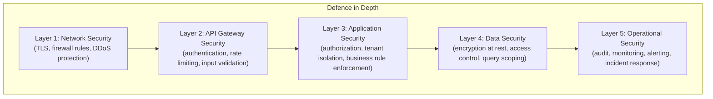

# Security Architecture

## Metadata

| Field | Value |
|-------|-------|
| Title | Kairo Security Architecture |
| Document ID | KAI-SEC-001 |
| Status | Draft |
| Version | 0.1 |
| Target Release | V1 |
| Owner | Chief Information Security Architect |
| Created | 2026-07-18 |
| Last Updated | 2026-07-18 |
| Reviewers | TODO |
| Related Documents | [Platform Core](../../05-Platform-Core/Platform-Core.md), [Platform Hierarchy](../../05-Platform-Core/Platform-Hierarchy.md), [Organization Model](../../05-Platform-Core/Organization-Model.md), [Architecture Principles](../Architecture-Principles.md), [Cross-Cutting Concerns](../Cross-Cutting-Concerns.md), [Platform Dependencies](../Platform-Dependencies.md), [Quality Attributes](../Quality-Attributes.md) |
| Dependencies | None |

---

## Purpose

This document defines the security architecture foundation for the Kairo platform. It establishes the security model, principles, trust boundaries, and governance that protect the platform, its tenants, and the data they manage.

Security at Kairo is structural. It is enforced by the platform's architecture, not by developer discipline. A correctly structured platform prevents entire categories of security failures — not through vigilance, but through design.

This document does not define specific authentication protocols, compliance procedures, or implementation details. It defines the architectural frame within which all security decisions are made.

---

## Scope

This document covers:

- Security objectives and principles for the entire Kairo ecosystem.
- Trust boundaries between platform layers, products, tenants, and external systems.
- Security responsibility model (who is responsible for what).
- Defence-in-depth and zero-trust philosophy.
- V1 security baseline requirements.
- Security evolution direction for future versions.

This document does not cover:

- Implementation-level security controls (documented in development standards and module specifications).
- Specific compliance procedures (documented separately when compliance programs are established).
- Operational security processes (documented in operational guides).

---

## Security Objectives

| Objective | Description |
|-----------|-------------|
| **Confidentiality** | Data is accessible only to authorized parties. Tenant data is invisible to other tenants. Sensitive data is protected at rest and in transit. |
| **Integrity** | Data is accurate and unmodified by unauthorized actors. Transactions are complete or fully rolled back. Audit records are tamper-evident. |
| **Availability** | The platform remains operational and accessible to authorized users. Security controls do not create single points of failure. |
| **Accountability** | Every significant action is attributable to an identified actor. The audit trail provides forensic traceability. |
| **Isolation** | Each tenant operates within a boundary that prevents any interaction with other tenants' data, configuration, or operations. |

---

## Security Principles

### Deny by Default

Every request is denied unless an explicit rule grants access. There are no open endpoints, no public-by-default resources, no implicit permissions. A new endpoint, a new entity, a new operation — all are inaccessible until authorization is explicitly configured.

### Least Privilege

Users, services, and extensions receive only the permissions required to perform their specific function. No actor receives broad access when narrow access is sufficient. Permissions are granted at the most restrictive scope that enables the required operation.

### Explicit Authorization

Authorization decisions are made explicitly in the request pipeline. No operation proceeds without a documented permission check. Authorization is never implied by authentication alone — being authenticated proves identity, not access.

### Tenant Isolation

Tenant data is isolated at the platform layer. No application logic, no query filter, no developer decision determines whether tenant isolation holds. The platform enforces isolation structurally so that even a bug in product code cannot expose one tenant's data to another.

### Assume Breach

The architecture assumes that any single layer can be compromised. Defence-in-depth ensures that a breach at one layer does not grant unrestricted access. Monitoring and audit provide detection. Isolation contains the blast radius.

### Secure Defaults

Default configuration is the secure configuration. A new organization, a new endpoint, a new feature — all default to the most restrictive, most secure behavior. Relaxing security requires explicit, audited action.

### Defence in Depth

Security is enforced at multiple layers simultaneously. The failure of any single security control does not result in a complete breach. Each layer provides independent protection.

### Traceability

Every significant action is recorded in the audit trail with the actor, the action, the target, and the outcome. Security-relevant events (authentication, authorization failures, configuration changes) are logged with sufficient detail for forensic reconstruction.

### Minimize Sensitive Data

The platform collects and stores only the data necessary for its function. Sensitive data that is not needed is not stored. Sensitive data that is needed is encrypted, access-controlled, and retained only as long as required.

### Security Before Convenience

When security and convenience conflict, security wins. A more convenient flow that weakens security is rejected. A less convenient flow that maintains security is accepted and improved through better design, not by reducing protection.

### Automated Verification

Security controls are verified through automated testing in the CI/CD pipeline. Security is not a manual review step that can be skipped under pressure. Automated checks run on every change and block deployment when they fail.

### No Secret Credentials in Frontend Applications

Client-side applications (storefronts, mobile apps, SPAs) never contain secret credentials. They use public API keys with limited scope or token-based flows where secrets remain on the server. No amount of obfuscation makes a client-side secret safe.

---

## Trust Boundaries

Trust boundaries define where the security posture changes — where data crosses from a trusted zone to a less trusted zone, or where the identity and authorization of the actor must be re-evaluated.

```mermaid
graph TD
    subgraph External["Untrusted: External"]
        Clients["Clients<br/>(storefronts, mobile, integrations)"]
        ExtSystems["External Systems<br/>(payment providers, carriers)"]
    end

    subgraph Boundary1["Trust Boundary: API Gateway"]
        Gateway["API Gateway<br/>(authentication, rate limiting, validation)"]
    end

    subgraph Internal["Trusted: Platform Interior"]
        subgraph ProductZone["Product Zone"]
            Commerce["Commerce Modules"]
            FutureProducts["Future Products"]
        end

        subgraph PlatformZone["Platform Zone"]
            Identity["Identity"]
            Tenancy["Tenancy"]
            Events["Events"]
            PlatformServices["Platform Services"]
        end

        subgraph DataZone["Data Zone"]
            DB["Databases"]
            Cache["Cache"]
            MessageBus["Message Bus"]
            SecretStore["Secret Store"]
        end
    end

    Clients -->|"TLS + Auth"| Gateway
    ExtSystems -->|"TLS + Signatures"| Gateway
    Gateway -->|"authenticated context"| ProductZone
    ProductZone --> PlatformZone
    PlatformZone --> DataZone
    ProductZone --> DataZone

    style External fill:#3b1010,stroke:#ef4444
    style Boundary1 fill:#3b2a10,stroke:#f59e0b
    style Internal fill:#0a2f1e,stroke:#22c55e
```

### Boundary Definitions

| Boundary | Between | Security Enforcement |
|----------|---------|---------------------|
| External → Gateway | Untrusted clients and the platform | TLS encryption, authentication verification, rate limiting, input validation, request correlation |
| Gateway → Product Zone | Authenticated request and product logic | Tenant context resolution, authorization evaluation, request scoping |
| Product Zone → Platform Zone | Product modules and platform services | Platform services enforce their own access rules. Modules consume through defined interfaces. |
| Platform Zone → Data Zone | Platform/product logic and data stores | Connection authentication, encrypted connections, query scoping by tenant |
| Platform → External Systems | Platform and third-party services | TLS encryption, credential management through secret store, webhook signature verification |

### Trust Boundary Rules

- Every trust boundary crossing requires authentication or credential verification.
- Data crossing a trust boundary is validated at the receiving side. The sender's validation is not trusted.
- Trust boundaries are enforced by the platform, not by product code. A module cannot weaken a boundary.
- New trust boundaries require security review and an ADR.

---

## Security Layers

| Layer | Responsibility | Failure Impact |
|-------|---------------|---------------|
| Network | Prevents unauthorized network access. Encrypts data in transit. | Exposure of internal services to the internet. |
| API Gateway | Verifies identity. Rejects malformed or unauthorized requests before they reach application logic. | Unauthenticated or malicious requests reach product code. |
| Application | Enforces business-level authorization and tenant isolation. Validates that the authenticated actor is permitted to perform the specific operation. | Unauthorized access to resources within the platform. Cross-tenant data exposure. |
| Data | Encrypts stored data. Scopes all queries to the authenticated tenant. Protects secrets. | Data exposure at rest. Cross-tenant data leakage through unscoped queries. |
| Operational | Detects and responds to security events. Provides forensic evidence for investigation. | Breaches go undetected. Incident response is delayed. |

Each layer operates independently. A failure at one layer is contained by the remaining layers.

---

## Security Responsibility Model

| Responsibility | Owner | Description |
|---------------|-------|-------------|
| Platform security architecture | Security Architect | Defines security model, principles, trust boundaries. |
| Authentication infrastructure | Platform (Identity) | Implements authentication mechanisms, token management, session lifecycle. |
| Authorization framework | Platform (Identity) | Provides permission evaluation engine. Products define permissions; the platform evaluates them. |
| Tenant isolation | Platform (Tenancy) | Enforces data isolation between organizations at the infrastructure level. |
| Secret management | Platform (Operations) | Manages secret storage, rotation, and access auditing. |
| Data encryption | Platform | Encrypts data at rest and in transit. Manages encryption keys. |
| Input validation | Product modules | Each module validates its inputs at the boundary. The gateway provides baseline validation. |
| Permission definitions | Product modules | Each module defines the permissions required for its operations. |
| Audit entry emission | Product modules | Modules emit audit entries for significant operations through the platform audit service. |
| Security testing | Development team | Automated security tests run in CI/CD. Security review is part of code review. |
| Incident response | Operations team | Detects, investigates, and resolves security incidents. |
| Compliance | Compliance team (future) | Manages regulatory requirements and certification processes. |

---

## Relationship to Platform Core

Security is a platform-level concern defined in [Platform Core](../../05-Platform-Core/Platform-Core.md). The platform enforces security; products inherit it. This relationship is non-negotiable:

- Products cannot bypass platform authentication.
- Products cannot weaken tenant isolation.
- Products cannot implement their own authorization mechanism outside the platform framework.
- Products cannot access secrets directly — they use the platform's secret management interface.

Security architecture extends Platform Core with detailed security-specific structure. It does not duplicate or contradict Platform Core.

---

## Relationship to Future Multi-Tenancy Architecture

Tenant isolation, as defined in the [Organization Model](../../05-Platform-Core/Organization-Model.md) and [Platform Hierarchy](../../05-Platform-Core/Platform-Hierarchy.md), is a security boundary:

- Organization-level isolation is the primary security perimeter for tenant data.
- Multi-tenancy enforcement is a security control, not a convenience feature.
- Future multi-tenancy architecture documents will define implementation details. This document defines the security requirements those implementations must satisfy.

---

## Relationship to Future Architecture Documents

### API Security (Future)

Future API security architecture will define authentication flows, token formats, API key scoping, rate limiting policies, and input validation standards. It must satisfy the principles and trust boundaries defined here.

### Data Security (Future)

Future data security architecture will define encryption standards, key management, data classification, retention policies, and access control for stored data. It must satisfy the data layer requirements defined here.

### Event Security (Future)

Future event security architecture will define event authentication, event authorization (who can subscribe to what), event payload protection, and webhook signature verification. It must satisfy the trust boundary rules defined here.

### Infrastructure Security (Future)

Future infrastructure security architecture will define network segmentation, container security, secrets infrastructure, and deployment security. It must satisfy the network and operational layers defined here.

---

## Version 1 Security Baseline

V1 must achieve the following security posture before production deployment:

| Category | V1 Requirement |
|----------|---------------|
| Authentication | All API requests are authenticated (token-based or API key). No anonymous access to business operations. |
| Authorization | Deny-by-default permission model. Every endpoint has explicit permission requirements. |
| Tenant isolation | Organization-level data isolation enforced at the platform layer. Cross-tenant access is architecturally impossible. |
| Transport | All external communication uses TLS. No plaintext HTTP. |
| Data at rest | Sensitive data fields are encrypted at rest. Database connections are authenticated. |
| Secrets | No secrets in source code, configuration files, or logs. Secret management through a dedicated store. |
| Input validation | All API inputs are validated at the boundary. Injection attacks (SQL, XSS, command injection) are prevented. |
| Audit | Authentication events, authorization failures, and significant business actions are audited. |
| Logging | Security events are logged with structured context. Sensitive data is excluded from logs. |
| Dependencies | Third-party dependencies are scanned for known vulnerabilities. |
| Frontend | No secret credentials in client-side applications. Public API keys with limited scope only. |

---

## Future Security Evolution

| Version | Security Evolution |
|---------|-------------------|
| V2 | Advanced authorization (resource-level, field-level). Security audit completed. OWASP Top 10 compliance validated. Automated security testing in CI/CD. Penetration testing conducted. |
| V3 | PCI scope isolation for Payments. Compliance certification preparation (SOC 2). Multi-product security model validated. Cross-product authorization proven. |
| Future | Geographic data residency controls. Advanced threat detection. Security event correlation. Bug bounty program. Regular third-party security assessments. |

---

## Security Responsibilities

| Role | Security Responsibilities |
|------|--------------------------|
| Security Architect | Defines security architecture. Reviews security-impacting changes. Maintains security standards. |
| Platform Team | Implements authentication, authorization, tenant isolation, encryption, and secret management. |
| Product Teams | Define permissions for their modules. Validate inputs. Emit audit entries. Follow secure coding standards. |
| Operations | Monitor security events. Respond to incidents. Manage secret rotation. Maintain infrastructure security. |
| AI Coding Agents | Follow security standards. Never bypass authentication or authorization. Never log sensitive data. Never hardcode secrets. Report security concerns. |

---

## Version Gate

| Version | Security Gate |
|---------|--------------|
| V1 | All V1 baseline requirements are met. Authentication and authorization are operational. Tenant isolation is proven through testing. No secrets in code or configuration. TLS enforced. |
| V2 | Security audit findings are remediated. Automated security testing gates deployments. Advanced authorization is operational. Penetration test findings are addressed. |
| V3 | PCI scope isolation is validated. Compliance documentation is available. Multi-product security model is proven. Security monitoring covers all products. |

---

## Decision Summary

| Decision | Rationale |
|----------|-----------|
| Security is a platform responsibility | Products inheriting security from the platform ensures consistency and prevents gaps caused by per-product implementation. |
| Deny by default | Explicit permission grants are auditable and reviewable. Implicit access is invisible and error-prone. |
| Tenant isolation at the platform layer | Application-level isolation depends on correct code in every module. Platform-level isolation cannot be bypassed by application bugs. |
| No secrets in frontend applications | Client-side code is fully exposed to the user. No obfuscation technique provides real protection for embedded secrets. |
| Defence in depth | No single layer is sufficient. Multiple independent layers ensure that a failure at one layer is contained. |
| Assume breach | Designing for the assumption that any layer can be compromised drives investment in detection, containment, and recovery — not just prevention. |

---

## Architecture Impact

| Concern | Impact |
|---------|--------|
| Request pipeline | Every request passes through authentication and authorization before reaching business logic. This adds latency that must be minimized. |
| Data model | Every entity includes tenant context. All queries are tenant-scoped. Encryption adds storage and processing overhead for sensitive fields. |
| API design | Every endpoint declares required permissions. Error responses for authorization failures follow a standard format that does not leak information. |
| Module design | Modules depend on the platform for authentication and authorization. Modules are responsible for input validation and audit entry emission. |
| Testing | Security tests are part of the CI/CD pipeline. Tenant isolation tests verify that cross-tenant access is impossible. Permission tests verify deny-by-default behavior. |
| Operations | Security monitoring, alerting, and incident response are ongoing operational responsibilities. Secret rotation is automated. |

---

## Implementation Impact

| Area | Impact |
|------|--------|
| Modules | Must declare permissions, validate inputs, and emit audit entries. Must never implement custom authentication or authorization. |
| APIs | Must require authentication. Must specify permission requirements. Must validate all input. Must not return data beyond the caller's authorization. |
| Events | Must include tenant context. Must not contain secret data in payloads. Webhook delivery must use signature verification. |
| Database | Must scope all queries to the authenticated tenant. Must encrypt sensitive fields. Must use authenticated connections. |
| Infrastructure | Must enforce TLS. Must segment networks at trust boundaries. Must manage secrets through a dedicated store. |

---

## Out of Scope

This document does not define:

- Specific authentication protocols (OAuth flows, JWT structure, API key format) — documented in future authentication architecture.
- Specific encryption algorithms or key lengths — documented in future data security architecture.
- Compliance procedures (SOC 2, GDPR, PCI DSS) — documented in future compliance documentation.
- Cloud-vendor-specific security configuration — documented in infrastructure decisions.
- Incident response procedures — documented in operational guides.
- Source code or implementation patterns — documented in development standards.

---

## Future Considerations

- **API Security Architecture** — Detailed authentication flows, token lifecycle, API key scoping, and rate limiting.
- **Data Security Architecture** — Data classification, encryption standards, key management, and retention policies.
- **Event Security Architecture** — Event authorization, payload protection, and webhook verification.
- **Infrastructure Security Architecture** — Network segmentation, container hardening, and deployment security.
- **Compliance Architecture** — Mapping security controls to regulatory frameworks.
- **Threat Modeling** — Systematic threat identification per module and per trust boundary.
- **Security Testing Strategy** — SAST, DAST, dependency scanning, and penetration testing cadence.

---

## Future Refactoring Triggers

This document should be revisited and potentially refactored when:

- A new product is added to the ecosystem (new trust boundaries, new permission requirements).
- A module is extracted into an independent service (new inter-service trust boundary).
- A compliance certification is pursued (security controls must map to compliance requirements).
- A significant security incident occurs (architecture may need strengthening).
- Geographic distribution is introduced (data residency and cross-region security).
- The Payments product enters development (PCI scope isolation must be formally defined).

---

## Change History

| Version | Date | Author | Description |
|---------|------|--------|-------------|
| 0.1 | 2026-07-18 | Chief Information Security Architect | Initial draft |
