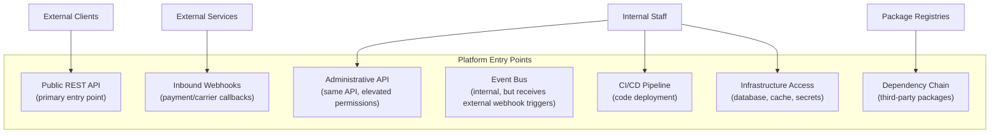
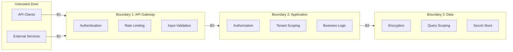

# Threat Model

## Metadata

| Field | Value |
|-------|-------|
| Title | Kairo Platform Threat Model |
| Document ID | KAI-SEC-002 |
| Status | Draft |
| Version | 0.1 |
| Target Release | V1 |
| Owner | Lead Threat Modeling Architect |
| Created | 2026-07-18 |
| Last Updated | 2026-07-18 |
| Reviewers | TODO |
| Related Documents | [Security Architecture](./Security-Architecture.md), [Platform Core](../../05-Platform-Core/Platform-Core.md), [Platform Hierarchy](../../05-Platform-Core/Platform-Hierarchy.md), [Organization Model](../../05-Platform-Core/Organization-Model.md), [Platform Dependencies](../Platform-Dependencies.md), [Extension Architecture](../Extension-Architecture.md), [System Architecture](../System-Architecture.md) |
| Dependencies | [Security Architecture](./Security-Architecture.md) |

---

## Purpose

This document defines the platform-level threat model for Kairo. It identifies the assets the platform protects, the actors who may threaten them, the surfaces through which attacks may occur, and the categories of controls required to manage risk.

Threat modeling is a continuous activity, not a one-time exercise. This document establishes the baseline threat landscape. It is revisited when the platform evolves, new products are added, or the threat landscape changes.

This document does not claim that risks are eliminated. It identifies risks, classifies them, assigns ownership, and specifies the categories of controls required to reduce them to acceptable levels.

---

## Protected Assets

| Asset | Sensitivity | Impact of Compromise |
|-------|-------------|---------------------|
| Tenant business data (orders, customers, inventory) | High | Financial loss, regulatory liability, loss of customer trust |
| Customer personal data (names, addresses, emails) | High | Regulatory liability (GDPR, privacy laws), reputational damage |
| Payment-related data (transaction references, amounts) | Critical | Financial fraud, PCI compliance violation |
| Authentication credentials (passwords, tokens, API keys) | Critical | Unauthorized access to any asset |
| Secret store contents (integration credentials, encryption keys) | Critical | Full system compromise, data exfiltration |
| Audit trail | High | Loss of accountability, compliance violation |
| Platform configuration | Medium | Service disruption, security policy weakening |
| Source code and CI/CD pipeline | High | Supply-chain compromise, backdoor insertion |
| Platform availability | High | Revenue loss for all tenants, reputational damage |
| Tenant isolation boundary | Critical | Cross-tenant data exposure, catastrophic trust failure |

---

## Threat Actors

| Actor | Motivation | Capability | Access |
|-------|-----------|-----------|--------|
| External attacker | Financial gain, data theft, disruption | Varies from opportunistic scanning to sophisticated targeted attacks | No legitimate access. Attacks from the internet. |
| Malicious tenant | Data theft, competitive advantage, abuse of platform resources | Authenticated access within their own tenant. Attempts to escape tenant boundary. | Legitimate tenant credentials. |
| Compromised tenant account | Attacker has obtained legitimate tenant credentials | Full access within the compromised tenant's boundary | Stolen or phished credentials. |
| Malicious insider | Financial gain, sabotage, data theft | Privileged access to platform infrastructure, code, or operations | Employee or contractor access. |
| Compromised dependency | Supply-chain attack through a third-party library or service | Code execution within the platform runtime | Injected through package manager or build pipeline. |
| Abusive legitimate user | Exploiting business logic for financial advantage | Authenticated access with normal permissions | Legitimate credentials used for unintended purposes. |

---

## Entry Points

| Entry Point | Trust Level | Authentication | Primary Threats |
|------------|-------------|---------------|----------------|
| Public REST API | Untrusted | Token or API key required | Injection, broken authorization, credential abuse, DDoS |
| Inbound Webhooks | Untrusted | Signature verification required | Spoofing, replay, payload injection |
| Administrative API | Low trust | Elevated authentication required | Privilege escalation, insider misuse, credential theft |
| Event Bus | Trusted (internal) | Service-level authentication | Message injection if bus is compromised |
| CI/CD Pipeline | Trusted (internal) | Pipeline credentials | Backdoor insertion, secret leakage |
| Dependency Chain | Partially trusted | Package signature where available | Malicious code in dependencies |
| Infrastructure Access | Trusted (internal) | Credential-based | Data exfiltration, configuration tampering |

---

## Trust Boundaries

Trust boundaries are defined in the [Security Architecture](./Security-Architecture.md). The threat model maps threats to these boundaries:

| Boundary | Threats If Breached |
|----------|-------------------|
| B1 (External → Gateway) | Unauthenticated access, injection attacks, DDoS |
| B2 (Gateway → Application) | Broken authorization, cross-tenant access, business logic abuse |
| B3 (Application → Data) | Data exfiltration, unscoped queries, secret compromise |

---

## Attack Surfaces

### API Surface

The public API is the largest attack surface. Every endpoint is a potential target for injection, authorization bypass, and abuse.

| Surface | Exposure | Risk Level |
|---------|----------|-----------|
| Authentication endpoints | Public | Critical — gateway to all other access |
| Catalog read endpoints | Public (API key) | Medium — data exposure if authorization fails |
| Cart and checkout endpoints | Authenticated | High — financial impact through price/promotion manipulation |
| Order management endpoints | Authenticated | High — order tampering, data exposure |
| Administrative endpoints | Authenticated (elevated) | Critical — platform-wide impact if compromised |
| Webhook registration endpoints | Authenticated | Medium — SSRF risk through arbitrary URL registration |

### Integration Surface

| Surface | Exposure | Risk Level |
|---------|----------|-----------|
| Outbound webhooks | External URLs registered by tenants | Medium — SSRF, data leakage through payloads |
| Inbound webhooks (callbacks) | Public endpoints for external service callbacks | High — spoofing, replay, injection |
| Provider interfaces (tax, shipping, payment) | Outbound to external services | Medium — credential exposure, response manipulation |

### Infrastructure Surface

| Surface | Exposure | Risk Level |
|---------|----------|-----------|
| Database | Internal network | Critical — direct data access if compromised |
| Cache (Redis) | Internal network | High — session data, cached credentials |
| Message broker | Internal network | High — event manipulation, message injection |
| Secret store | Internal network | Critical — all credentials if compromised |
| CI/CD pipeline | Internal/cloud | High — code execution, secret access |

---

## Threat Register

### Authentication and Session Threats

| ID | Threat | Category | Risk | V1 Control | Future Control |
|----|--------|----------|------|-----------|----------------|
| T-AUTH-01 | Credential stuffing | Authentication | High | Rate limiting on auth endpoints, account lockout | Anomaly detection, CAPTCHA, breached password detection |
| T-AUTH-02 | Session theft | Authentication | High | Secure token storage, short token lifetime, TLS only | Token binding, device fingerprinting |
| T-AUTH-03 | API key leakage | Authentication | Critical | Key scoping by permission and tenant, key rotation support | Automated key rotation, key usage anomaly detection |
| T-AUTH-04 | Token replay | Authentication | Medium | Short expiration, single-use refresh tokens | Token binding to client context |
| T-AUTH-05 | Brute force login | Authentication | Medium | Rate limiting, progressive delay, account lockout | Adaptive authentication, risk-based step-up |

### Authorization Threats

| ID | Threat | Category | Risk | V1 Control | Future Control |
|----|--------|----------|------|-----------|----------------|
| T-AUTHZ-01 | Broken object authorization (IDOR) | Authorization | Critical | Authorization check on every object access, tenant-scoped queries | Automated IDOR testing in CI/CD |
| T-AUTHZ-02 | Broken function authorization | Authorization | High | Permission check in request pipeline, deny by default | Permission coverage audit tooling |
| T-AUTHZ-03 | Privilege escalation | Authorization | Critical | Role-based access, no client-side role assignment, server-validated permissions | Least-privilege analysis tooling |
| T-AUTHZ-04 | Horizontal privilege escalation | Authorization | Critical | All queries scoped to authenticated tenant, platform-enforced isolation | Automated cross-tenant access testing |

### Multi-Tenant Threats

| ID | Threat | Category | Risk | V1 Control | Future Control |
|----|--------|----------|------|-----------|----------------|
| T-MT-01 | Cross-tenant data access | Multi-tenancy | Critical | Platform-enforced tenant scoping on all queries, tenant ID in all data access | Automated isolation verification, tenant-boundary fuzz testing |
| T-MT-02 | Cross-tenant cache poisoning | Multi-tenancy | High | Tenant-scoped cache keys, cache isolation verification | Dedicated cache partitions per tenant |
| T-MT-03 | Cross-tenant event leakage | Multi-tenancy | High | Tenant-scoped event routing, subscription authorization | Event bus access auditing |
| T-MT-04 | Tenant impersonation | Multi-tenancy | Critical | Tenant context derived from authenticated token, not from client input | Multi-factor tenant switching for multi-org users |
| T-MT-05 | Noisy neighbor resource exhaustion | Multi-tenancy | Medium | Per-tenant rate limiting | Per-tenant resource quotas, fair scheduling |

### Business Logic Threats

| ID | Threat | Category | Risk | V1 Control | Future Control |
|----|--------|----------|------|-----------|----------------|
| T-BIZ-01 | Price manipulation | Business logic | Critical | Server-side price resolution, no client-provided prices accepted | Price change audit trail, anomaly alerting |
| T-BIZ-02 | Coupon and promotion abuse | Business logic | High | Usage limits, eligibility validation, server-side evaluation | Abuse pattern detection, velocity checks |
| T-BIZ-03 | Checkout replay | Business logic | High | Idempotency keys on checkout, order deduplication | Checkout session binding, replay detection |
| T-BIZ-04 | Duplicate payment or refund | Business logic | Critical | Idempotency on payment operations, transaction state machine | Reconciliation automation, anomaly alerting |
| T-BIZ-05 | Inventory reservation abuse | Business logic | Medium | Reservation expiration, maximum reservation limits | Reservation velocity monitoring, adaptive limits |
| T-BIZ-06 | Cart manipulation (quantity, negative values) | Business logic | Medium | Server-side validation, business rule enforcement | Anomaly detection on cart behavior |

### Injection and Application Threats

| ID | Threat | Category | Risk | V1 Control | Future Control |
|----|--------|----------|------|-----------|----------------|
| T-INJ-01 | SQL injection | Injection | Critical | Parameterized queries (EF Core), input validation | Automated SAST scanning in CI/CD |
| T-INJ-02 | Command injection | Injection | Critical | No shell execution from user input, input validation | Runtime application self-protection (RASP) |
| T-INJ-03 | XSS (stored/reflected) | Injection | High | Output encoding, Content-Security-Policy headers, input validation | Automated DAST scanning |
| T-INJ-04 | CSRF | Request forgery | Medium | Token-based authentication (no cookies for API), SameSite attributes where applicable | N/A (API-first design mitigates CSRF inherently) |
| T-INJ-05 | SSRF | Request forgery | High | URL validation on webhook registration, deny internal network ranges | Outbound proxy for webhook delivery, allowlist enforcement |
| T-INJ-06 | Malicious file upload | Injection | Medium | File type validation, size limits, no server-side execution of uploads | Malware scanning, sandboxed processing |

### Integration and Webhook Threats

| ID | Threat | Category | Risk | V1 Control | Future Control |
|----|--------|----------|------|-----------|----------------|
| T-INT-01 | Webhook spoofing | Integration | High | Signature verification on inbound webhooks (HMAC) | Mutual TLS for high-value integrations |
| T-INT-02 | Webhook replay | Integration | Medium | Timestamp validation, idempotency on webhook handlers | Nonce tracking, replay window enforcement |
| T-INT-03 | Data exfiltration via webhook payloads | Integration | Medium | Payload content review, sensitive field exclusion | Payload encryption for sensitive events |
| T-INT-04 | Compromised external provider | Integration | High | Provider credential rotation, minimal credential scope | Provider health monitoring, circuit breaker on anomalies |

### Administrative Threats

| ID | Threat | Category | Risk | V1 Control | Future Control |
|----|--------|----------|------|-----------|----------------|
| T-ADM-01 | Administrative credential compromise | Administrative | Critical | Strong authentication for admin users, audit of all admin actions | MFA enforcement for admin roles, session anomaly detection |
| T-ADM-02 | Configuration tampering | Administrative | High | Configuration change audit, authorization for config changes | Configuration change approval workflow |
| T-ADM-03 | Mass data export by admin | Administrative | High | Audit logging of bulk operations, rate limiting on exports | Data loss prevention (DLP) rules, export approval for large datasets |

### Supply Chain Threats

| ID | Threat | Category | Risk | V1 Control | Future Control |
|----|--------|----------|------|-----------|----------------|
| T-SC-01 | Compromised third-party dependency | Supply chain | High | Dependency vulnerability scanning, lockfile enforcement | Automated dependency update with security review, SBOM generation |
| T-SC-02 | CI/CD pipeline compromise | Supply chain | Critical | Pipeline access controls, secret isolation, signed artifacts | Pipeline integrity verification, deployment attestation |
| T-SC-03 | Malicious code in pull request | Supply chain | High | Code review requirement, branch protection | Automated code analysis, contributor verification |

### Availability Threats

| ID | Threat | Category | Risk | V1 Control | Future Control |
|----|--------|----------|------|-----------|----------------|
| T-AVAIL-01 | DDoS (volumetric) | Availability | High | Rate limiting at gateway, infrastructure-level DDoS mitigation | CDN-based absorption, geographic traffic filtering |
| T-AVAIL-02 | Application-layer DoS | Availability | High | Per-tenant rate limiting, request timeout enforcement | Adaptive rate limiting, request cost scoring |
| T-AVAIL-03 | Resource exhaustion (memory, CPU, disk) | Availability | Medium | Resource limits per container, health-check-based restart | Auto-scaling, resource quota per tenant |
| T-AVAIL-04 | Message queue flooding | Availability | Medium | Queue depth monitoring, dead-letter handling | Per-tenant queue partitioning, backpressure mechanisms |

### Insider Threats

| ID | Threat | Category | Risk | V1 Control | Future Control |
|----|--------|----------|------|-----------|----------------|
| T-INS-01 | Unauthorized data access by staff | Insider | High | Role-based infrastructure access, audit of direct data access | Just-in-time access provisioning, access anomaly detection |
| T-INS-02 | Secret exfiltration by staff | Insider | Critical | Secret access auditing, secret rotation, minimal secret scope | Secret access approval workflow, canary secrets |
| T-INS-03 | Code tampering by insider | Insider | High | Code review, branch protection, signed commits | Two-person integrity for production deployments |

---

## Abuse Cases

Abuse cases describe how legitimate platform features may be misused:

| Abuse Case | Feature Abused | Impact | Mitigation Approach |
|-----------|---------------|--------|-------------------|
| Create thousands of carts to exhaust inventory reservations | Cart and inventory reservation | Denial of service for legitimate buyers | Reservation expiration, per-user cart limits |
| Apply expired or invalid coupon through API manipulation | Promotion engine | Revenue loss | Server-side coupon validation, no client-trusted discount values |
| Replay a successful checkout request | Checkout endpoint | Duplicate orders, potential duplicate charges | Idempotency keys, order deduplication |
| Register a webhook pointing to internal infrastructure | Webhook registration | SSRF, internal service probing | URL validation, deny internal ranges, outbound proxy |
| Enumerate other tenants' resources by guessing IDs | Any resource endpoint | Cross-tenant data discovery | Platform-enforced tenant scoping (ID alone does not grant access) |
| Exhaust API rate limits for a competing tenant | Rate limiting (shared infrastructure) | Denial of service for target tenant | Per-tenant rate limiting (not global) |
| Create accounts in bulk for credential stuffing | Registration endpoint | Account takeover attempts | Registration rate limiting, CAPTCHA on registration |

---

## Threat Categories → Required Control Categories

| Threat Category | Required Control Categories |
|----------------|---------------------------|
| Authentication | Credential management, rate limiting, session management, token lifecycle |
| Authorization | Permission framework, object-level checks, tenant scoping, deny-by-default |
| Multi-tenancy | Platform-enforced isolation, scoped queries, scoped caching, scoped events |
| Business logic | Server-side validation, idempotency, state machines, abuse detection |
| Injection | Input validation, parameterized queries, output encoding, content security policy |
| Integration | Signature verification, URL validation, credential management, payload controls |
| Administrative | Strong authentication, audit logging, least privilege, change controls |
| Supply chain | Dependency scanning, pipeline security, code review, artifact signing |
| Availability | Rate limiting, resource limits, DDoS mitigation, health monitoring |
| Insider | Access auditing, least privilege, separation of duties, secret management |

---

## Risk Assessment Method

Risks are assessed using a qualitative model:

| Risk Level | Likelihood × Impact | Response |
|-----------|-------------------|----------|
| Critical | High likelihood or catastrophic impact | Must be addressed before production. No exceptions. |
| High | Moderate-to-high likelihood with significant impact | Must be addressed in V1. Residual risk documented. |
| Medium | Moderate likelihood with moderate impact | Addressed in V1 where feasible. Accepted with monitoring otherwise. |
| Low | Low likelihood with limited impact | Tracked. Addressed when resources permit. |

Risk assessment is not a one-time calculation. Risks are reassessed when:

- The threat landscape changes (new attack techniques, industry incidents).
- The platform changes (new features, new entry points, new integrations).
- Controls are modified (strengthened or weakened).

---

## Risk Ownership

| Risk Category | Owner |
|--------------|-------|
| Platform infrastructure risks | Platform team |
| Authentication and authorization risks | Platform team (Identity) |
| Tenant isolation risks | Platform team (Tenancy) |
| Business logic risks | Product teams (per module) |
| Integration risks | Platform team (Integrations) + product teams |
| Supply chain risks | Engineering leadership |
| Availability risks | Platform team + operations |
| Insider risks | Engineering leadership + operations |

---

## Security Responsibilities

| Role | Threat Model Responsibilities |
|------|------------------------------|
| Lead Threat Modeling Architect | Maintains this document. Conducts threat model reviews. Prioritizes risk response. |
| Security Architect | Ensures controls align with security architecture. Reviews control effectiveness. |
| Platform Team | Implements platform-level controls (authentication, isolation, rate limiting). |
| Product Teams | Implements business-logic controls (validation, idempotency, abuse prevention). |
| Operations | Monitors for active threats. Responds to security incidents. Manages infrastructure security. |
| AI Coding Agents | Follow threat model guidance. Never bypass security controls. Report potential new threats. |

---

## Version Gate

| Version | Threat Model Gate |
|---------|------------------|
| V1 | All Critical and High V1 controls are implemented. Threat register is reviewed before production launch. Tenant isolation is verified through automated testing. Business logic threats have server-side controls. |
| V2 | Automated security testing covers all threat categories in CI/CD. Penetration test findings are mapped to the threat register and remediated. Abuse detection is operational for business logic threats. |
| V3 | Threat model is extended for multi-product scenarios. PCI-specific threats are formally assessed for Payments. Insider threat controls include just-in-time access. Supply chain integrity is verified through artifact signing. |

---

## Decision Summary

| Decision | Rationale |
|----------|-----------|
| Business logic abuse is a first-class risk | Commerce platforms face financial threats through business rule exploitation, not just technical attacks. Treating these as secondary risks leaves revenue-impacting vulnerabilities unaddressed. |
| Cross-tenant compromise is classified as Critical | Tenant isolation is the platform's most fundamental security promise. Any failure in isolation is a catastrophic trust event. |
| Risk is managed, not eliminated | Claiming elimination creates false confidence. Honest risk assessment drives appropriate investment in controls. |
| Threat model covers architecture, not procedures | Procedural security (incident response, pen test execution) is documented separately. This document identifies what to defend against, not how to run security operations. |
| V1 controls are separated from future controls | Not all controls are achievable in V1. Clearly distinguishing V1 from future prevents scope creep while ensuring nothing is forgotten. |

---

## Architecture Impact

| Concern | Impact |
|---------|--------|
| API design | Every endpoint must consider authentication, authorization, input validation, and rate limiting threats. |
| Module design | Business logic threats require server-side validation, idempotency, and state machine enforcement within modules. |
| Data layer | Tenant scoping on all queries, encryption of sensitive fields, and parameterized queries are non-negotiable. |
| Event system | Event routing must be tenant-scoped. Event payloads must exclude secrets. Webhook delivery must verify signatures. |
| Infrastructure | Network segmentation, secret management, and CI/CD security are infrastructure-level responses to identified threats. |

---

## Implementation Impact

| Area | Impact |
|------|--------|
| Modules | Must implement server-side validation for all business rules. Must use idempotency keys for state-changing operations. Must not accept client-provided prices, discounts, or permission claims. |
| APIs | Must validate all input. Must enforce authorization. Must implement rate limiting. Must return error responses that do not leak internal information. |
| Events | Must include tenant context. Must not include secrets. Must verify inbound webhook signatures. |
| Database | Must use parameterized queries exclusively. Must scope all queries to the authenticated tenant. Must encrypt sensitive fields. |
| CI/CD | Must scan dependencies. Must protect secrets. Must require code review. Must enforce branch protection. |

---

## Out of Scope

This document does not define:

- Specific penetration testing procedures or commands.
- Specific firewall rules or cloud security group configurations.
- Compliance mapping to specific regulatory frameworks (SOC 2, PCI DSS, GDPR).
- Incident response procedures.
- Source code or implementation patterns for security controls.
- Database schemas for security-related data.

---

## Future Considerations

- **Per-module threat models** — As modules are designed, each module should receive a focused threat model that extends this platform-level model.
- **Automated threat model validation** — Tooling that verifies implemented controls against the threat register.
- **Threat intelligence integration** — Incorporating external threat feeds to update risk assessments.
- **Red team exercises** — Periodic adversarial testing against the threat model's assumptions.
- **Bug bounty program** — External researcher engagement to identify threats not captured in the model.

---

## Future Refactoring Triggers

This document should be revisited when:

- A new product is added (new attack surfaces, new business logic threats).
- A module is extracted to an independent service (new inter-service trust boundary).
- A new external integration is added (new entry point, new credential management).
- A security incident occurs (validate threat model coverage, add missing threats).
- The Payments product enters development (PCI-specific threat assessment).
- Geographic distribution is introduced (data residency threats, cross-region security).
- A compliance certification is pursued (threat-to-control mapping required).

---

## Change History

| Version | Date | Author | Description |
|---------|------|--------|-------------|
| 0.1 | 2026-07-18 | Lead Threat Modeling Architect | Initial draft |
