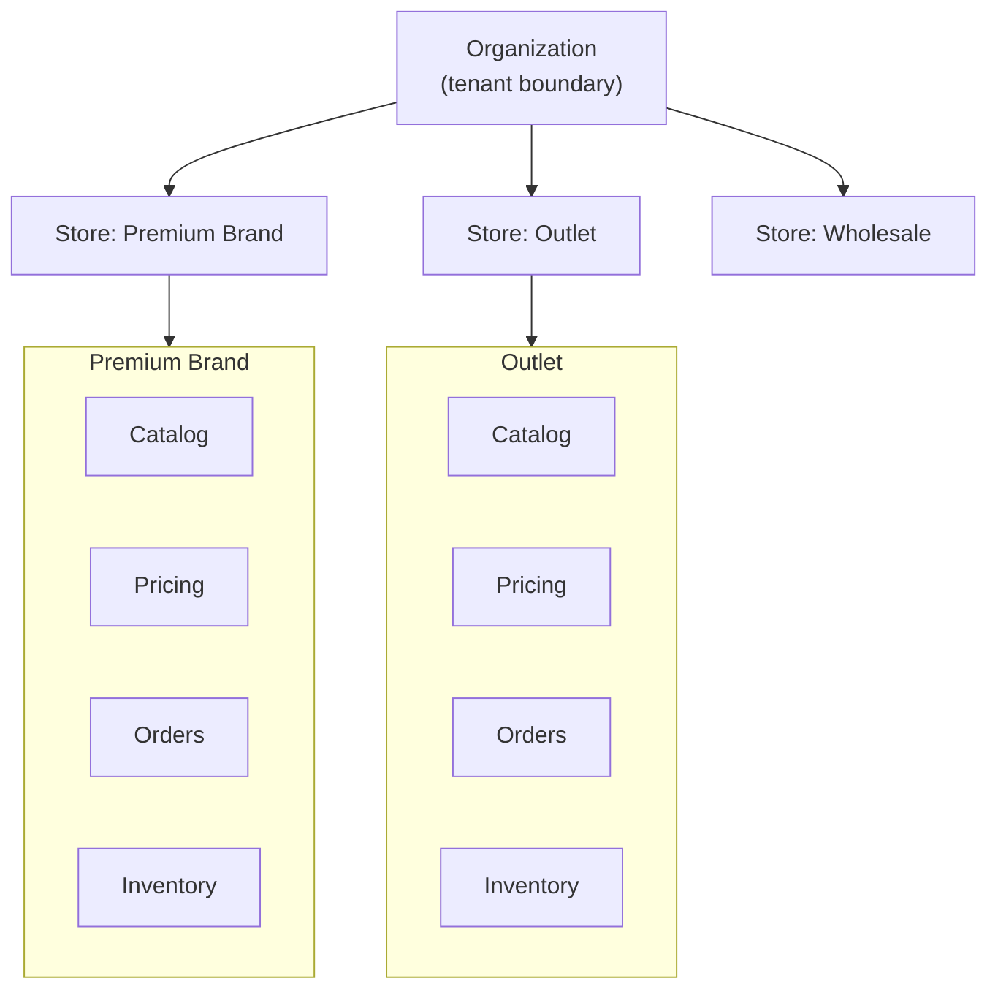
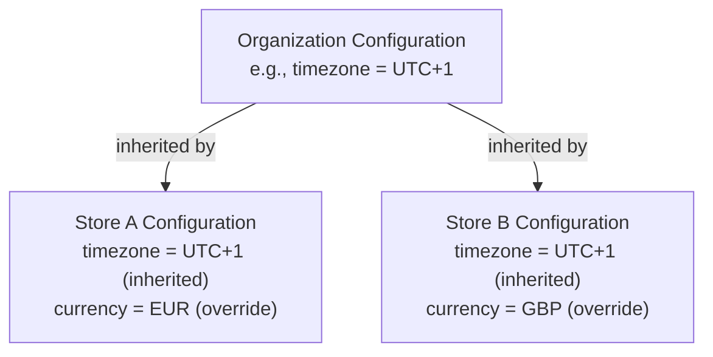
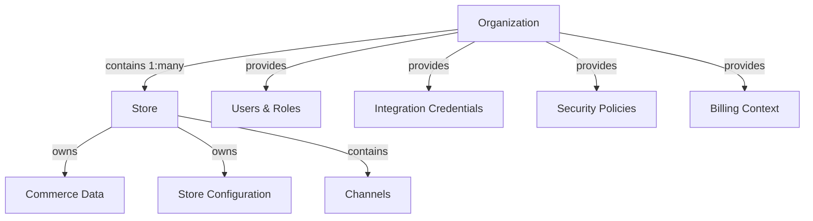

# Store Model

## Metadata

| Field | Value |
|-------|-------|
| Title | Kairo Store Model |
| Document ID | KAI-CORE-004 |
| Status | Draft |
| Version | 0.1 |
| Target Release | N/A |
| Owner | Chief Platform Architect |
| Created | 2026-07-17 |
| Last Updated | 2026-07-17 |
| Reviewers | TODO |
| Related Documents | [Platform Hierarchy](./Platform-Hierarchy.md), [Organization Model](./Organization-Model.md), [Platform Core](./Platform-Core.md), [Glossary](../02-Products/Glossary.md) |
| Dependencies | [Organization Model](./Organization-Model.md) |

---

## Purpose

A store is a commercial operation within an organization. It represents a distinct business that sells goods or services. While the organization is the tenant boundary, the store is the operational boundary — the context within which commerce activities occur.

Stores enable a single organization to operate multiple commercial businesses from one platform account. A multi-brand retailer, a company with separate B2B and B2C operations, or an agency managing distinct client storefronts within one organization all use multiple stores to separate their commercial operations.

---

## What Is a Store

A store is the answer to the question: "Which business is selling?"

- A fashion brand operating online retail and a wholesale division has two stores.
- A retailer with a flagship brand and an outlet brand has two stores.
- A simple DTC business with one online shop has one store.

Every commerce operation — product creation, order placement, inventory tracking — happens within a store context.

---

## Ownership

### What the Store Owns

| Asset | Description |
|-------|-------------|
| Catalog | Products, variants, categories, and attributes within this commercial operation |
| Pricing | Price lists, pricing rules, and currency configuration for this store |
| Inventory | Stock levels and reservations for items sold through this store |
| Orders | All orders placed within this store |
| Customers | Commerce customer profiles associated with this store |
| Channels | Sales surfaces (web, mobile, wholesale portal) through which this store sells |
| Fulfillment configuration | Shipping methods, fulfillment rules, and warehouse assignments |
| Tax configuration | Tax zones, rates, and rules applicable to this store's jurisdiction |
| Promotions | Discount rules, coupons, and campaigns active within this store |
| Store configuration | Store-level settings that override organization defaults |

### What the Store Does NOT Own

| Asset | Owner | Reason |
|-------|-------|--------|
| Users and roles | Organization | Staff access is managed at the organization level. Users are assigned to stores through permissions. |
| API keys | Organization | API access is scoped to the organization. Store context is specified per request or derived from configuration. |
| Integration credentials | Organization | External service connections serve the organization. Stores may use them but do not own them. |
| Audit trail | Organization | Audit records span all stores within the organization. The organization owns the complete trail. |
| Billing | Organization | Platform billing is at the organization level, not per store. |

---

## Business Responsibility

The store is responsible for:

### Commerce Operations

All buying and selling activity occurs within a store. The store provides the operational context that determines which products are available, at what price, with what inventory, and under what rules.

### Revenue Separation

Each store tracks its own orders and revenue independently. A multi-store organization can understand the performance of each commercial operation separately.

### Operational Independence

Stores operate independently. A configuration change in one store does not affect another store within the same organization. A promotion in the Premium Brand store does not apply to the Outlet store unless explicitly configured.

### Customer Experience Segmentation

Different stores may serve different customer segments with different catalogs, pricing strategies, and promotional approaches — all within one organization's data boundary.

---

## Configuration

### Store-Level Configuration

| Configuration Area | Examples |
|-------------------|----------|
| Commerce settings | Default currency, catalog display rules, checkout behavior |
| Tax | Tax zones, tax rates, tax-inclusive/exclusive pricing |
| Shipping | Available shipping methods, rate calculation rules, fulfillment locations |
| Notifications | Order confirmation templates, shipping notification settings |
| Localization | Store locale, date format, number format |
| Fulfillment | Default warehouse, fulfillment priority rules |

### Configuration Inheritance

Stores inherit from their organization. Stores may override where permitted.

### Configuration Rules

- Stores inherit all organization-level configuration by default.
- Stores may override configuration within their scope (commerce settings, tax, shipping).
- Stores cannot override security policies set at the organization level.
- Stores cannot access or modify another store's configuration.
- Default values for new stores come from the organization's configuration.

---

## Isolation

### Between Stores (Within an Organization)

Stores within the same organization have **operational isolation** — they operate independently but share the organization's tenant boundary.

| Aspect | Isolation Level |
|--------|----------------|
| Data | Operationally separate. Each store's products, orders, and inventory are distinct. |
| Configuration | Independent. Store A's settings do not affect Store B. |
| Channels | Independent. Each store has its own channels. |
| Customers | Configurable. Customers may be shared across stores within an organization or scoped per store. |
| Users | Shared at the organization level. Access to specific stores is controlled by permissions. |
| Integrations | Shared at the organization level. Stores may use the same payment provider connection. |

### Cross-Store Visibility

Within an organization, cross-store visibility is controlled by permissions:

- An organization administrator sees all stores.
- A store manager sees only their assigned store(s).
- A channel operator sees only their assigned channel within a store.

Cross-store data aggregation (total orders across all stores) is available to users with organization-level access.

### Between Stores (Across Organizations)

Stores in different organizations have **absolute isolation**. They cannot see, reference, or interact with each other in any way. This is enforced by the organization-level tenant boundary.

---

## Relationship with Organizations

### Organization Provides to Stores

- User identity and authentication
- Role and permission framework
- Integration credentials for external services
- Security policy enforcement
- Billing and subscription context
- Organization-level configuration defaults

### Stores Provide to Organizations

- Commerce activity (orders, revenue, customer interactions)
- Operational data for organization-wide reporting
- Audit entries scoped to store operations

### Rules

- Every store belongs to exactly one organization.
- An organization must have at least one store to perform commerce operations.
- Deleting a store does not delete the organization.
- Deleting (decommissioning) an organization removes all its stores.
- A store cannot be moved between organizations.

---

## Future Scalability

### Multi-Store Growth

The store model supports growth patterns without structural changes:

| Growth Pattern | How Stores Support It |
|---------------|----------------------|
| New brand | Create a new store with its own catalog, pricing, and identity |
| New market/region | Create a new store with region-specific tax, currency, and fulfillment |
| New business model | Create a new store (e.g., wholesale) with different pricing and customer rules |
| Acquisition | Onboard the acquired business as a new store within the existing organization |

### Capacity Considerations

- The platform supports many stores per organization without degradation.
- Each store's data volume is independent. A high-volume store does not affect a low-volume store's performance.
- Store-level caching and indexing ensure that multi-store organizations do not create cross-store performance coupling.

### Future Store Capabilities

- **Store templates** — Pre-configured store setups for common business models (B2C retail, B2B wholesale, marketplace seller).
- **Store cloning** — Create a new store from an existing store's configuration (without data).
- **Store analytics** — Per-store performance dashboards and comparative reporting.
- **Store-level webhooks** — Event subscriptions scoped to a specific store.

---

## Out of Scope

This document does not define:

- Database schema for the store entity — documented in module specifications.
- API endpoints for store management — documented in API specifications.
- Channel model (documented separately as a sub-entity of store).
- Warehouse assignment logic — documented in fulfillment specifications.
- Store onboarding workflow — documented in operational guides.
- Store-level billing (currently billing is per organization, not per store).

---

## Architecture Impact

| Concern | Impact |
|---------|--------|
| Data model | Commerce entities include a store identifier in addition to the organization identifier. Queries are scoped to both organization and store. |
| API design | Store context is specified per request (header, path parameter, or derived from API key configuration). |
| Multi-tenancy | The platform resolves both organization and store context in the request pipeline. |
| Caching | Cache keys include store context. Catalog and pricing caches are store-scoped. |
| Events | Commerce events include store context. Subscribers can filter by store. |
| Permissions | The authorization model supports store-scoped roles. A user may have different permissions per store. |
| Search | Search indexes are store-scoped for commerce data (products, orders). Organization-wide search aggregates across stores for authorized users. |
| Configuration | The configuration system resolves settings through platform → organization → store hierarchy. |

---

## Decision Summary

| Decision | Rationale |
|----------|-----------|
| Store is below organization | An organization may operate multiple businesses. Stores provide separation without requiring multiple tenants. |
| Stores are operationally independent | Changes in one store must not affect another. Operational isolation prevents unintended cross-store impact. |
| Customers may be shared across stores | A business may want a unified customer view across all its stores. Sharing is configurable, not forced. |
| Users are not store-scoped | Users belong to the organization. Their access to specific stores is controlled by permissions. This avoids duplicate user management. |
| Store cannot move between organizations | A store's data is within the organization's tenant boundary. Moving it would violate isolation guarantees and create data integrity risks. |
| At least one store is required for commerce | Commerce operations need a store context. An organization without a store can exist (for configuration) but cannot sell. |

---

## Version Gate

| Version | Store Model Expectation |
|---------|------------------------|
| V1 | Store creation and management within an organization. Commerce operations are scoped to a store. Configuration inheritance (organization → store) is functional. Single-store use cases work seamlessly. |
| V2 | Multi-store operations are proven. Store-scoped permissions are operational. Cross-store reporting is available for organization administrators. Store-level configuration covers all commerce concerns. |
| V3 | Store templates and cloning are evaluated. Store-level webhooks are available. Advanced multi-store patterns (shared catalog with per-store pricing) are supported. |

---

## Change History

| Version | Date | Author | Description |
|---------|------|--------|-------------|
| 0.1 | 2026-07-17 | Chief Platform Architect | Initial draft |
