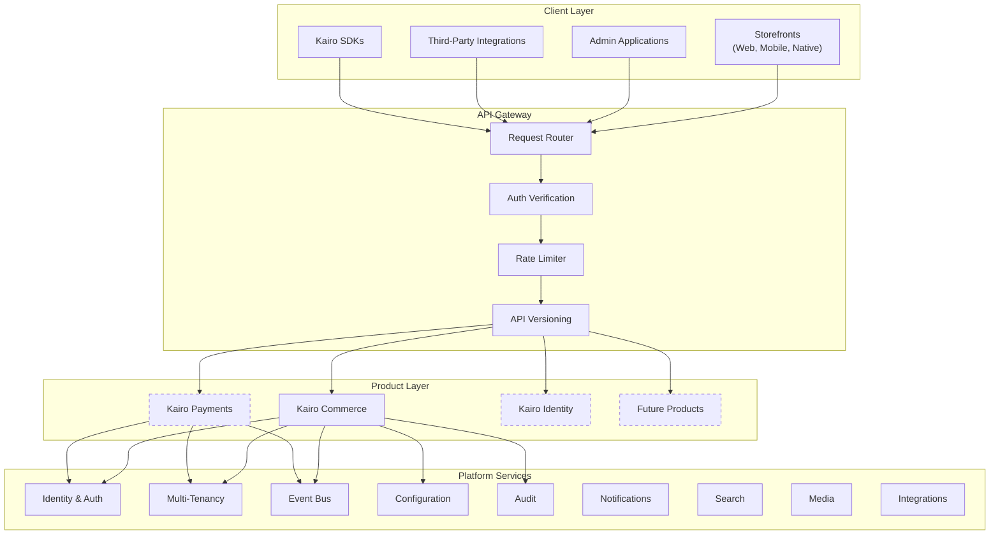
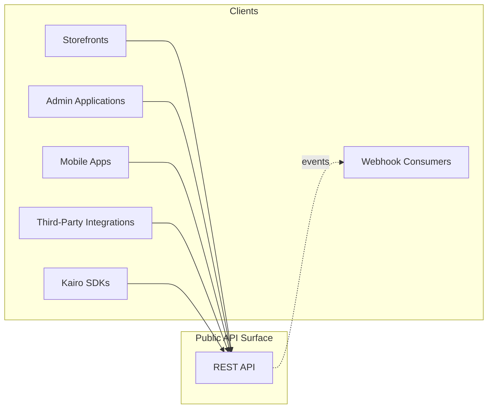
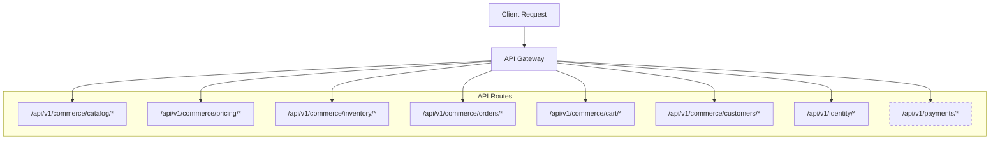
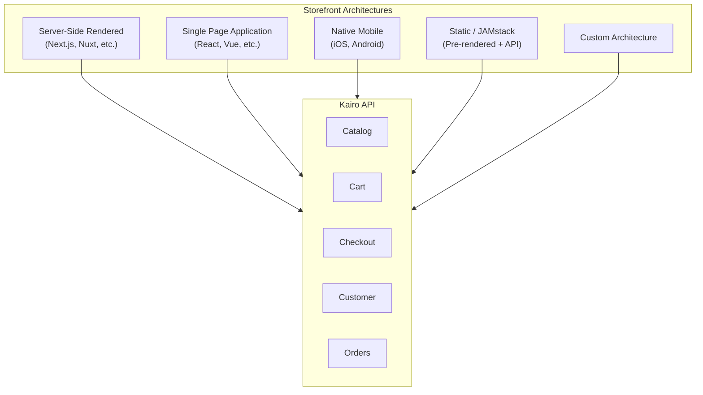
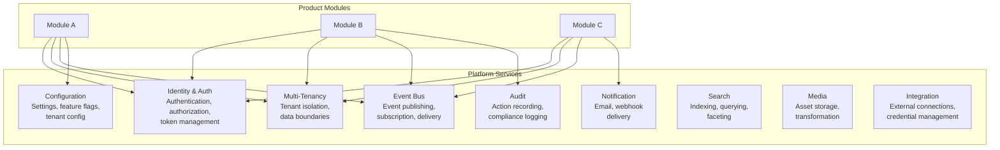
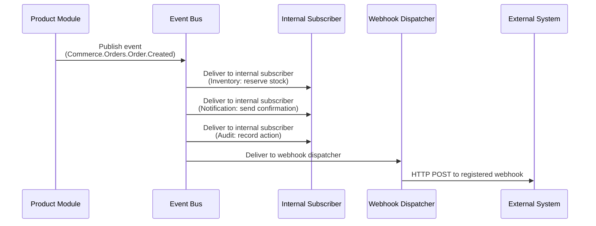
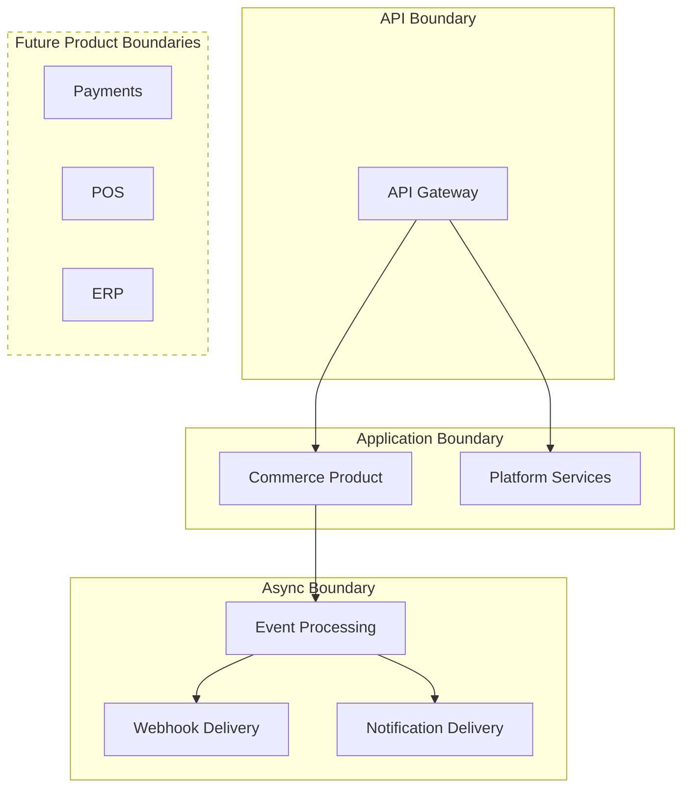

# System Architecture

## Metadata

| Field | Value |
|-------|-------|
| Title | Kairo System Architecture |
| Document ID | KAI-ARCH-002 |
| Status | Draft |
| Version | 0.1 |
| Target Release | N/A |
| Owner | Chief Software Architect |
| Created | 2026-07-15 |
| Last Updated | 2026-07-15 |
| Reviewers | TODO |
| Related Documents | [Architecture Overview](./Architecture-Overview.md), [Product Ecosystem](../02-Products/Product-Ecosystem.md), [Bounded Contexts](../03-Business-Capabilities/Bounded-Contexts.md), [Context Relationships](../03-Business-Capabilities/Context-Relationships.md) |
| Dependencies | [Architecture Overview](./Architecture-Overview.md) |

---

## Purpose

This document defines the high-level system architecture of the Kairo platform. It describes how clients interact with the platform, how the platform is organized internally, how services communicate, and how the system is structured for deployment.

This is a structural document. It establishes the system's shape and boundaries. Detailed module designs, API contracts, and data models are documented separately.

---

## High-Level Platform Architecture

The Kairo platform is a layered system that receives requests from external clients, routes them through a gateway, dispatches them to product modules, and supports those modules with shared platform services.

---

## Clients

The Kairo platform serves multiple client types. All clients interact with the platform exclusively through its public APIs. There is no direct access to internal services, data stores, or platform infrastructure from any client.

### Client Types

| Client Type | Description | Authentication |
|------------|-------------|----------------|
| Storefronts | Developer-built web and mobile commerce experiences. Consume catalog, cart, checkout, and order APIs. | API key or customer token |
| Admin Applications | Back-office interfaces for managing products, orders, inventory, and settings. Built by developers or provided as reference implementations. | User authentication with role-based access |
| Mobile Apps | Native or hybrid mobile applications consuming the same APIs as web storefronts. | API key or customer token |
| Third-Party Integrations | External systems (ERPs, CRMs, marketing tools) that push or pull data through the API. | API key with scoped permissions |
| Kairo SDKs | Client libraries that wrap API calls for specific programming languages. SDKs are thin wrappers — they do not contain business logic. | Configured with API credentials |
| Webhook Consumers | External endpoints that receive event notifications from the platform. | Webhook signature verification |

### Client Principles

- All clients are treated equally. No client type receives privileged access.
- The API is the only interface. There is no backdoor, admin-only endpoint, or internal-only route.
- SDKs are convenience layers. Anything an SDK can do, a raw API call can do.
- The platform has no opinion about how clients are built. Any language, framework, or architecture can consume the API.

---

## APIs

The API is the primary interface between clients and the platform. Every capability is exposed through a versioned, documented REST API.

### API Structure

### API Characteristics

| Characteristic | Detail |
|---------------|--------|
| Protocol | HTTPS only |
| Format | JSON request and response bodies |
| Versioning | URL-based versioning (`/api/v1/`, `/api/v2/`) |
| Authentication | Bearer tokens, API keys |
| Tenant Scoping | Tenant context determined from authentication credentials or explicit header |
| Rate Limiting | Per-client, per-endpoint rate limiting enforced at the gateway |
| Pagination | Cursor-based pagination for all collection endpoints |
| Filtering | Consistent query parameter filtering across all endpoints |
| Error Format | Standardized error response schema across all products |

### API Gateway Responsibilities

The API gateway is the single entry point for all external requests. It handles concerns that apply uniformly to every request before dispatching to product modules:

- **Authentication verification** — Validates tokens and API keys. Rejects unauthenticated requests before they reach product logic.
- **Tenant resolution** — Identifies the organization context for the request.
- **Rate limiting** — Enforces per-client and per-endpoint rate limits.
- **API versioning** — Routes requests to the correct version of the API.
- **Request validation** — Rejects malformed requests at the boundary.
- **Request correlation** — Assigns a unique request ID for tracing across the system.

The gateway does not contain business logic. It is infrastructure.

---

## Admin Portal

Kairo does not ship an admin portal as part of the platform. The platform is API-first and headless — admin interfaces are built by developers using the same APIs available to all clients.

### Reference Implementation

A reference admin application may be provided to demonstrate API usage and accelerate developer onboarding. The reference implementation:

- Consumes only public APIs. It has no privileged access.
- Is not required. Developers may build their own admin tools.
- Is not the product. The API is the product.
- Follows the same authentication and authorization model as any other client.

### Admin API Surface

Admin operations (product creation, order management, inventory adjustments, user management) are exposed through the same API as all other operations. Authorization determines what a client can do, not which API it uses.

| Concern | Approach |
|---------|----------|
| Product management | Standard Catalog API with write permissions |
| Order management | Standard Orders API with admin-scoped permissions |
| Inventory adjustments | Standard Inventory API with adjustment permissions |
| User management | Standard Identity API with admin-scoped permissions |
| Configuration | Standard Configuration API with admin-scoped permissions |

---

## Storefront Integrations

Storefronts are the customer-facing experiences built by developers on top of Kairo's APIs. The platform supports any storefront architecture.

### Integration Patterns

### Storefront Principles

- The platform imposes no frontend framework, rendering strategy, or hosting requirement.
- All storefront-relevant APIs are designed for low-latency consumption from client-side and server-side contexts.
- Cart and checkout APIs handle all calculation server-side. Storefronts do not need to implement pricing, tax, or discount logic.
- Customer authentication for storefronts uses the platform's identity system. Storefronts do not manage credentials.
- Webhooks enable storefronts to react to server-side events (order status changes, inventory alerts) without polling.

---

## Shared Platform Services

Platform services provide cross-cutting capabilities consumed by all products. They are the infrastructure foundation that products build upon.

### Service Interaction Rules

- Product modules consume platform services through defined interfaces. They do not access platform internals.
- Platform services are stateless from the module's perspective. A module makes a request and receives a response. It does not manage platform service lifecycle.
- Platform services are always available. If a platform service is degraded, modules degrade gracefully rather than failing completely.
- Platform services do not contain business logic. They provide infrastructure capabilities that modules use to implement business logic.

---

## Event Flow

Events are the primary mechanism for decoupled communication between modules and between products. The platform provides an event bus that handles publishing, routing, and delivery.

### Event Characteristics

| Characteristic | Detail |
|---------------|--------|
| Format | Standardized event envelope with product, module, entity, and action |
| Delivery | At-least-once delivery. Consumers must handle duplicate events. |
| Ordering | Ordered within a single entity. No global ordering guarantee across entities. |
| Persistence | Events are persisted for replay and audit purposes |
| Subscription | Internal modules subscribe through the platform. External systems subscribe through webhooks. |
| Scope | Events are scoped to a tenant. A subscriber only receives events for tenants it has access to. |

### Event Flow Principles

- Producers publish events without knowledge of consumers. Adding a consumer does not modify the producer.
- Events describe what happened, not what should happen. They are facts, not commands.
- Event consumers are responsible for their own error handling and retry logic.
- Cross-product communication happens exclusively through events. Products never call each other's APIs directly.

---

## Deployment Boundaries

The platform is structured with clear deployment boundaries that define what can be deployed independently. These are conceptual boundaries — specific infrastructure decisions are documented separately.

### Boundary Definitions

| Boundary | Contents | Independence |
|----------|----------|-------------|
| API Boundary | API Gateway, routing, rate limiting | Can be scaled independently of application logic |
| Application Boundary | Product modules and platform services | Single deployable unit in V1. Products may separate in later versions. |
| Async Boundary | Event processing, webhook delivery, notification delivery | Operates independently of synchronous request handling. Can be scaled based on event volume. |
| Future Product Boundaries | Each future product may have its own deployment boundary | Determined by product requirements when products enter active development |

### Deployment Principles

- Synchronous request handling and asynchronous event processing are separate deployment concerns.
- The API gateway can scale independently of the application.
- Within the application boundary, modules are logically separated but deployed together in V1.
- Deployment boundaries expand over time as the platform grows. V1 has fewer boundaries than V3.
- Each deployment boundary has its own health monitoring, scaling policies, and failure isolation.

---

## Architecture Impact

| Quality Attribute | How This Architecture Supports It |
|------------------|----------------------------------|
| Developer Experience | Single API gateway provides a consistent entry point. Uniform API patterns across all products. SDKs wrap a single, predictable API surface. |
| Scalability | Deployment boundaries allow independent scaling of gateway, application, and async processing. |
| Reliability | Async boundary isolates event processing failures from API request handling. Platform services provide fault isolation. |
| Security | Gateway enforces authentication at the boundary. Tenant isolation is structural. No client bypasses the gateway. |
| Evolvability | Deployment boundaries can be split further as products mature. Modules can be extracted without client-facing changes. |
| Observability | Request correlation from gateway through modules to event processing. Centralized logging and tracing infrastructure. |

---

## Version Gate

| Version | System Architecture Milestone |
|---------|-------------------------------|
| V1 | Single application boundary with gateway and async boundaries. Commerce and platform services deploy together. |
| V2 | Platform services are architecturally distinct. Async processing handles increased event volume. Search and media services operate independently. |
| V3 | Product boundaries emerge. Payments and POS may deploy independently. Cross-product event routing is proven. |
| Future | Full product-level deployment independence. Geographic distribution. Multi-region gateway. |

---

## Out of Scope

This document does not cover:

- Database design or data storage architecture
- Specific cloud provider services or infrastructure
- CI/CD pipeline design
- Network topology and firewall rules
- Container orchestration or runtime environment
- Module-level internal architecture
- API contract specifications

---

## Future Considerations

- **Multi-region deployment** — Serving requests from geographically distributed endpoints for latency and compliance.
- **Edge caching** — Caching catalog and pricing data at the gateway or CDN layer for read-heavy workloads.
- **GraphQL gateway** — Adding a GraphQL layer alongside REST for clients that benefit from query flexibility.
- **gRPC for internal communication** — Adopting gRPC between deployment boundaries when performance requirements justify it.
- **Service mesh** — Adding service mesh infrastructure when the number of independently deployed services warrants it.

These considerations are noted for future evaluation. None are committed or planned for immediate implementation.

---

## Change History

| Version | Date | Author | Description |
|---------|------|--------|-------------|
| 0.1 | 2026-07-15 | Chief Software Architect | Initial draft |
