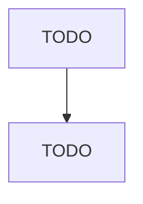

# [Architecture Document Title]

## Metadata

| Field | Value |
|-------|-------|
| Title | TODO |
| Document ID | TODO |
| Status | Draft |
| Version | 0.1 |
| Target Release | TODO |
| Owner | TODO |
| Created | TODO |
| Last Updated | TODO |
| Reviewers | TODO |
| Related Documents | TODO |
| Dependencies | TODO |

---

## Overview

TODO: Provide a high-level description of the architecture being documented.

## Goals

TODO: List the architectural goals this design aims to achieve.

## Constraints

TODO: List technical, organizational, or business constraints that influence this architecture.

## Assumptions

TODO: List assumptions made during the design process.

## Architecture Diagram

TODO: Include a Mermaid diagram or reference an external diagram.

## Components

TODO: Describe each major component, its purpose, and its boundaries.

## Data Flow

TODO: Describe how data moves through the system.

## Dependencies

TODO: List external and internal dependencies.

## Technology Choices

TODO: Document the technologies selected and the rationale for each choice.

## Security

TODO: Describe the security architecture, authentication, authorization, and data protection.

## Performance

TODO: Document performance targets, bottlenecks, and optimization strategies.

## Scalability

TODO: Describe how the system scales horizontally and vertically.

## Tradeoffs

TODO: Document architectural tradeoffs and their justification.

## Risks

TODO: Identify risks associated with this architecture and mitigation strategies.

## Future Evolution

TODO: Describe how this architecture is expected to evolve over time.

## Change History

| Version | Date | Author | Description |
|---------|------|--------|-------------|
| 0.1 | TODO | TODO | Initial draft |
